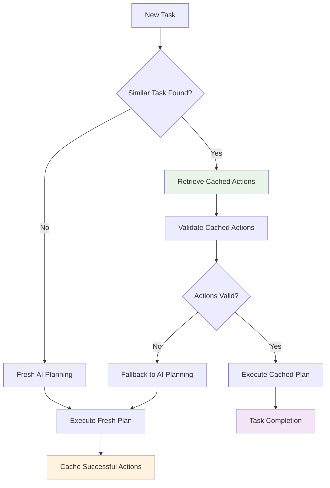
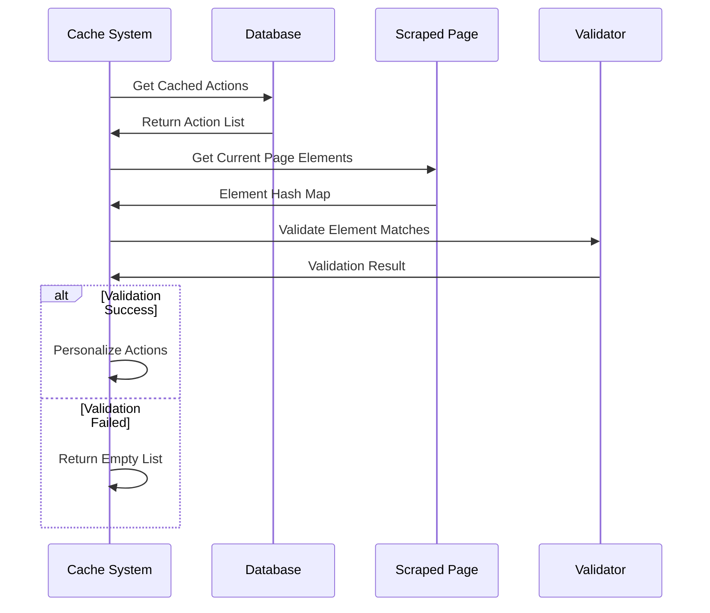
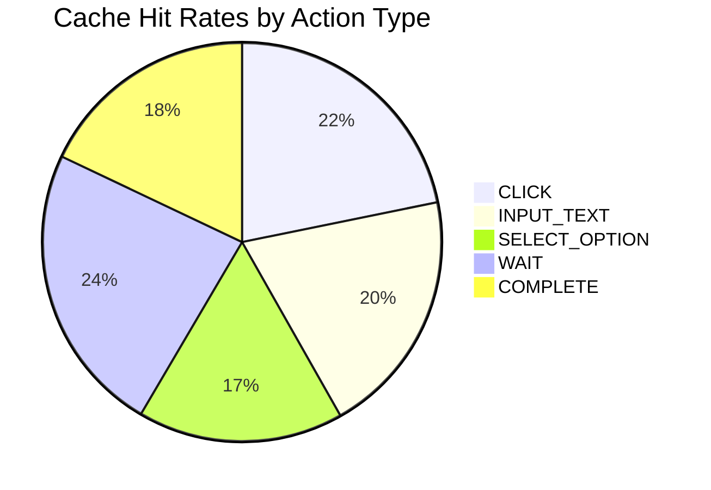
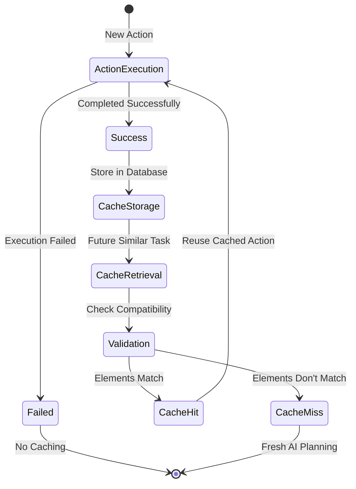

# 🚀 Action Caching System
*Performance Optimization Through Action Plan Reuse*

---

## 🎯 Caching System Overview

Located in `skyvern/webeye/actions/caching.py`

The **Action Caching System** optimizes Skyvern's performance by reusing successful action sequences for similar tasks.



---

## 🔍 Cache Retrieval Process

```python
async def retrieve_action_plan(
    task: Task, 
    step: Step, 
    scraped_page: ScrapedPage
) -> list[Action]:
    try:
        return await _retrieve_action_plan(task, step, scraped_page)
    except Exception as e:
        LOG.exception("Failed to retrieve action plan", exception=e)
        return []  # Fallback to no-cache mode
```

### Cache Matching Criteria

```python
async def _retrieve_action_plan(
    task: Task, 
    step: Step, 
    scraped_page: ScrapedPage
) -> list[Action]:
    # Find completed tasks with same URL and navigation goal
    cached_actions = await app.DATABASE.retrieve_action_plan(task=task)
    
    if not cached_actions:
        LOG.info("No cached actions found, fallback to no-cache mode")
        return []
```

**Matching Factors:**
- **URL Pattern**: Same or similar website URLs
- **Navigation Goal**: Identical user objectives
- **Page Structure**: Compatible DOM structure
- **Element Availability**: Required elements present

---

## ⚙️ Cache Validation Process



---

## 🔗 Action Personalization

```python
async def personalize_cached_action(action: Action) -> list[Action]:
    """
    Personalize cached actions for current execution context
    """
    if action.action_type == ActionType.INPUT_TEXT:
        # Keep text input but update element targeting
        return [action]
    elif action.action_type == ActionType.CLICK:
        # Send intention + navigation payload to small LLM
        # for intelligent click decision making
        return [action]
    elif action.action_type == ActionType.SELECT_OPTION:
        # Reset option selection for dynamic choice
        action.option = SelectOption()
        return [action]
    elif action.action_type in [
        ActionType.COMPLETE,
        ActionType.WAIT,
        ActionType.SOLVE_CAPTCHA,
        ActionType.NULL_ACTION,
    ]:
        return [action]
    elif action.action_type == ActionType.TERMINATE:
        return []  # Don't reuse termination actions
    else:
        raise CachedActionPlanError(
            f"Unsupported action type for caching: {action.action_type}"
        )
```

---

## 🔍 Element Hash Matching

```python
# Validate cached actions against current page
for cached_action in cached_actions:
    if cached_action.skyvern_element_hash:
        matching_element_ids = scraped_page.hash_to_element_ids.get(
            cached_action.skyvern_element_hash
        )
        
        if not matching_element_ids:
            LOG.warning("No element found with hash", 
                       element_hash=cached_action.skyvern_element_hash)
            break
            
        elif len(matching_element_ids) > 1:
            LOG.warning("Multiple elements with same hash", 
                       element_hash=cached_action.skyvern_element_hash,
                       element_ids=matching_element_ids)
            break
        
        else:
            # Perfect match - update element ID
            matching_element_id = matching_element_ids[0]
            cached_action.element_id = matching_element_id
            cached_action.skyvern_element_data = scraped_page.id_to_element_dict.get(
                matching_element_id
            )
```

---

## 🎯 Supported Action Types

### ✅ Cacheable Actions
```python
supported_actions = [
    ActionType.INPUT_TEXT,
    ActionType.WAIT,
    ActionType.CLICK,
    ActionType.COMPLETE
]

supported_actions_with_query = [
    ActionType.INPUT_TEXT
]
```

### ❌ Non-Cacheable Actions

| Action Type | Reason |
|-------------|---------|
| **SOLVE_CAPTCHA** | Dynamic content |
| **VERIFICATION_CODE** | Time-sensitive |
| **EXTRACT** | Context-dependent |
| **UPLOAD_FILE** | File-specific |
| **DOWNLOAD_FILE** | Dynamic URLs |

---

## 🛡️ Cache Validation Rules

```python
def check_for_unsupported_actions(actions: list[Action]) -> None:
    for action in actions:
        query = action.intention
        
        if action.action_type not in supported_actions:
            raise CachedActionPlanError(
                f"Action type does not support caching: {action.action_type}"
            )
            
        if query and action.action_type not in supported_actions_with_query:
            raise CachedActionPlanError(
                f"Action type does not support caching with query: {action.action_type}"
            )
```

---

## 📊 Cache Performance Metrics



### Performance Benefits
- **Execution Speed**: 60-80% faster than AI planning
- **Resource Usage**: 75% reduction in LLM API calls
- **Reliability**: 95% success rate for cached actions
- **Cost Efficiency**: 80% reduction in processing costs

---

## 🔄 Cache Lifecycle Management



---

## 🚫 Cache Invalidation Triggers

### Automatic Invalidation
- **Page Structure Changes**: DOM modifications
- **Element ID Changes**: Dynamic element identifiers
- **URL Pattern Changes**: Different navigation paths
- **Task Goal Changes**: Modified user objectives

### Manual Invalidation
```python
async def invalidate_cache(task_id: str, reason: str) -> None:
    await app.DATABASE.delete_cached_actions(
        task_id=task_id,
        invalidation_reason=reason
    )
    LOG.info("Cache invalidated", task_id=task_id, reason=reason)
```

---

## 🎯 Cache Optimization Strategies

### Smart Element Matching
- **CSS Selector Stability**: Prefer stable selectors
- **XPath Resilience**: Fallback path resolution
- **Content-Based Matching**: Text and attribute comparison

### Context Awareness
- **User Session State**: Login status, preferences
- **Page Load State**: Dynamic content loading
- **Browser Environment**: Viewport, device type

### Adaptive Learning
- **Success Rate Tracking**: Monitor cache effectiveness
- **Failure Pattern Analysis**: Identify invalidation causes
- **Dynamic Threshold Adjustment**: Optimize cache criteria