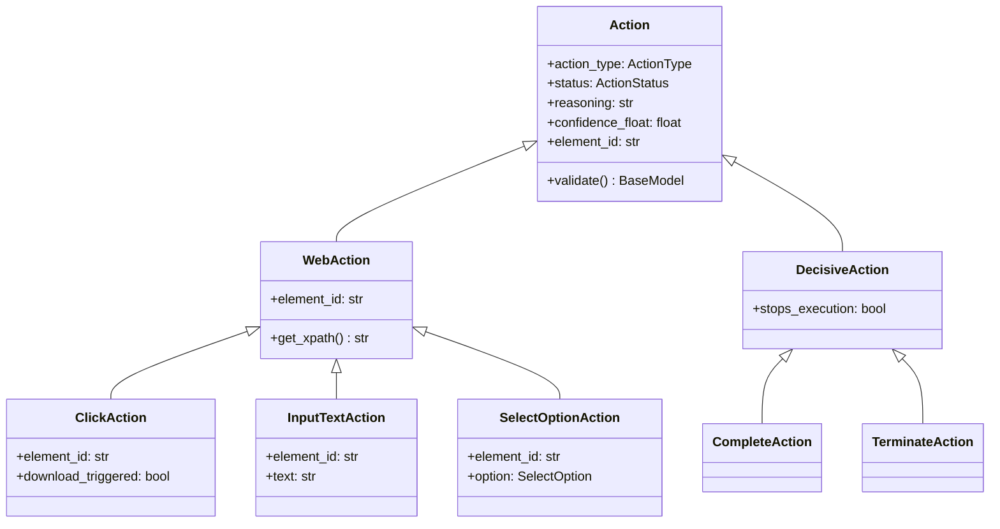
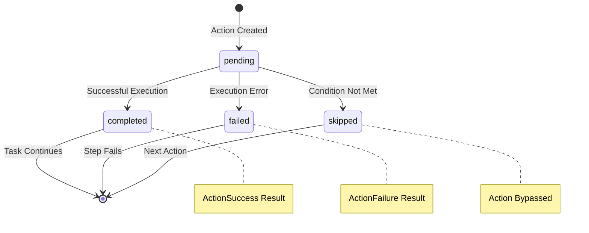

# 🏗️ Action Classes Implementation
*Deep Dive into Action Class Architecture*

---

## 📋 Action Class Hierarchy



---

## 🔧 Base Action Class

Located in `skyvern/webeye/actions/actions.py`

```python
class Action(BaseModel):
    action_type: ActionType
    status: ActionStatus = ActionStatus.pending
    action_id: str | None = None
    
    # Core metadata
    reasoning: str | None = None
    confidence_float: float | None = None
    intention: str | None = None
    
    # Element targeting
    element_id: str | None = None
    skyvern_element_hash: str | None = None
    skyvern_element_data: dict[str, Any] | None = None
    
    # Execution tracking
    step_id: str | None = None
    step_order: int | None = None
    action_order: int | None = None
    
    # Response data
    response: dict[str, Any] | list | str | None = None
```

---

## 📊 Action Status Lifecycle



---

## 🌐 WebAction Specialization

```python
class WebAction(Action):
    element_id: Annotated[str, Field(coerce_numbers_to_str=True)]
    
    def get_xpath(self) -> str | None:
        if not self.skyvern_element_data:
            return None
        if "xpath" in self.skyvern_element_data:
            return self.skyvern_element_data["xpath"]
        return None
```

**Key Features:**
- Requires element targeting
- XPath extraction capability
- DOM element association

---

## 🎯 Specific Action Implementations

### ClickAction
```python
class ClickAction(WebAction):
    action_type: Literal[ActionType.CLICK] = ActionType.CLICK
    download_triggered: bool | None = None
    file_url: str | None = None
```

### InputTextAction
```python
class InputTextAction(WebAction):
    action_type: Literal[ActionType.INPUT_TEXT] = ActionType.INPUT_TEXT
    text: str
```

### SelectOptionAction
```python
class SelectOptionAction(WebAction):
    action_type: Literal[ActionType.SELECT_OPTION] = ActionType.SELECT_OPTION
    option: SelectOption
```

---

## 🔗 SelectOption Model

```python
class SelectOption(BaseModel):
    label: str | None = None
    value: str | None = None
    index: int | None = None
```

**Selection Strategies:**
- **By Label**: User-visible text
- **By Value**: HTML value attribute
- **By Index**: Position in dropdown

---

## ⚖️ Decision Actions

### CompleteAction
```python
class CompleteAction(DecisiveAction):
    action_type: Literal[ActionType.COMPLETE] = ActionType.COMPLETE
    verification_result: CompleteVerifyResult | None = None
```

### TerminateAction
```python
class TerminateAction(DecisiveAction):
    action_type: Literal[ActionType.TERMINATE] = ActionType.TERMINATE
    errors: list[UserDefinedError] | None = None
```

---

## 🔍 Action Validation System

```python
@classmethod
def validate(cls: Type[T], value: Any) -> T:
    if isinstance(value, dict):
        action_type = value["action_type"]
        
        if action_type is ActionType.CLICK:
            return ClickAction.model_validate(value)
        elif action_type is ActionType.INPUT_TEXT:
            return InputTextAction.model_validate(value)
        # ... other validations
    else:
        raise ValueError("Invalid action data")
```

**Validation Features:**
- Type-safe deserialization
- Automatic action class routing
- Data integrity checks

---

## 📋 UserDefinedError Model

```python
class UserDefinedError(BaseModel):
    error_code: str
    reasoning: str
    confidence_float: float = Field(..., ge=0, le=1)
```

Used for structured error reporting in failed actions.

---

## 🎭 Complete Verification Result

```python
class CompleteVerifyResult(BaseModel):
    user_goal_achieved: bool
    thoughts: str
    page_info: str | None = None
```

Provides detailed completion analysis for COMPLETE actions.