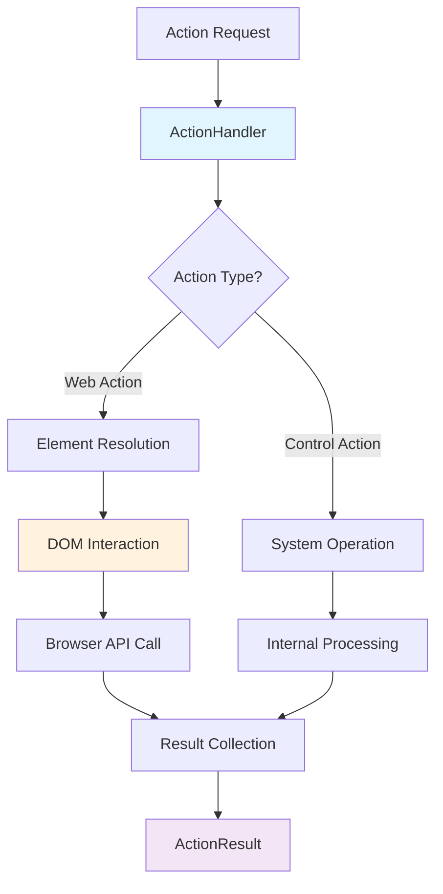

# ⚙️ Action Execution Engine
*The Heart of Browser Automation*

---

## 🏗️ Action Handler Architecture

Located in `skyvern/webeye/actions/handler.py`



---

## 🔧 ActionHandler Core Class

```python
class ActionHandler:
    def __init__(
        self,
        scraped_page: ScrapedPage,
        browser_state: BrowserState,
        action: Action
    ):
        self.scraped_page = scraped_page
        self.browser_state = browser_state
        self.action = action
        self.skyvern_frame = SkyvernFrame(
            frame=browser_state.page.main_frame
        )
```

**Key Components:**
- **ScrapedPage**: DOM element information
- **BrowserState**: Browser context and page
- **SkyvernFrame**: Custom frame wrapper

---

## 🎯 Action Execution Flow

```mermaid
sequencediagram
    participant AI as AI Decision
    participant AH as Action Handler
    participant DOM as DOM Utils
    participant PW as Playwright
    participant BR as Browser
    
    AI->>AH: Execute Action
    AH->>DOM: Resolve Element
    DOM->>AH: Element Locator
    AH->>PW: Browser Command
    PW->>BR: Native Action
    BR->>PW: Result
    PW->>AH: Success/Failure
    AH->>AI: ActionResult
```

---

## 🌐 Web Action Execution

### Click Action Handler
```python
async def handle_click_action(
    action: ClickAction,
    skyvern_frame: SkyvernFrame,
    scraped_page: ScrapedPage
) -> list[ActionResult]:
    # 1. Resolve element from DOM
    element = await resolve_element(action.element_id)
    
    # 2. Pre-click validations
    await check_element_visibility(element)
    await check_element_clickability(element)
    
    # 3. Execute click
    await element.click()
    
    # 4. Handle post-click effects
    await handle_downloads(action)
    await handle_navigation(action)
    
    return [ActionSuccess()]
```

---

## ⌨️ Input Text Execution

```python
async def handle_input_text_action(
    action: InputTextAction,
    skyvern_frame: SkyvernFrame,
    scraped_page: ScrapedPage
) -> list[ActionResult]:
    element = await resolve_element(action.element_id)
    
    # Clear existing content
    await element.clear()
    
    # Input text sequentially for better reliability
    await input_sequentially(element, action.text)
    
    return [ActionSuccess(data={"text_entered": action.text})]
```

### Sequential Input Strategy
```python
async def input_sequentially(
    locator: Locator, 
    text: str, 
    timeout: float = BROWSER_ACTION_TIMEOUT_MS
) -> None:
    length = len(text)
    if length > TEXT_PRESS_MAX_LENGTH:
        # Split long text into chunks
        await locator.fill(text, timeout=timeout)
    else:
        # Type character by character for short text
        for char in text:
            await locator.type(char, delay=TEXT_INPUT_DELAY)
```

---

## 📋 Select Option Execution

```python
async def handle_select_option_action(
    action: SelectOptionAction,
    skyvern_frame: SkyvernFrame,
    scraped_page: ScrapedPage
) -> list[ActionResult]:
    element = await resolve_element(action.element_id)
    option = action.option
    
    # Multiple selection strategies
    if option.value is not None:
        await element.select_option(value=option.value)
    elif option.label is not None:
        await element.select_option(label=option.label)
    elif option.index is not None:
        await element.select_option(index=option.index)
    else:
        raise ValueError("No valid option provided")
    
    return [ActionSuccess(data={"selected_option": option})]
```

---

## 🎮 Control Action Execution

### Wait Action
```python
async def handle_wait_action(
    action: WaitAction,
    skyvern_frame: SkyvernFrame
) -> list[ActionResult]:
    wait_time = action.wait_time or DEFAULT_WAIT_TIME
    await asyncio.sleep(wait_time)
    return [ActionSuccess(data={"waited_seconds": wait_time})]
```

### Scroll Action
```python
async def handle_scroll_action(
    action: ScrollAction,
    skyvern_frame: SkyvernFrame
) -> list[ActionResult]:
    direction = action.direction or "down"
    pixels = action.pixels or DEFAULT_SCROLL_PIXELS
    
    await skyvern_frame.scroll(direction, pixels)
    return [ActionSuccess(data={"scrolled": f"{direction} {pixels}px"})]
```

---

## 🧠 Decision Action Execution

### Complete Action
```python
async def handle_complete_action(
    action: CompleteAction,
    skyvern_frame: SkyvernFrame,
    scraped_page: ScrapedPage
) -> list[ActionResult]:
    # Verify completion against user goal
    verification = await verify_completion(
        action, scraped_page
    )
    
    return [ActionSuccess(data={
        "completion_verified": verification.user_goal_achieved,
        "thoughts": verification.thoughts
    })]
```

---

## 🔐 Specialized Action Handlers

### CAPTCHA Solving
```python
async def handle_solve_captcha_action(
    action: SolveCaptchaAction,
    skyvern_frame: SkyvernFrame
) -> list[ActionResult]:
    # Integration with CAPTCHA solving service
    solution = await solve_captcha_service(action.captcha_data)
    
    if solution:
        await input_captcha_solution(solution)
        return [ActionSuccess(data={"captcha_solved": True})]
    else:
        return [ActionFailure(
            Exception("CAPTCHA solving failed")
        )]
```

### Verification Code Handling
```python
async def handle_verification_code_action(
    action: VerificationCodeAction,
    organization_id: str
) -> list[ActionResult]:
    # Poll for verification codes from database
    code = await poll_verification_code(
        organization_id=organization_id,
        totp_identifier=action.totp_identifier
    )
    
    if code:
        await input_verification_code(code)
        return [ActionSuccess(data={"code_entered": True})]
    else:
        return [ActionFailure(
            NoTOTPVerificationCodeFound()
        )]
```

---

## 🛡️ Error Handling & Recovery

```python
async def execute_action_with_retry(
    action: Action,
    max_retries: int = 3
) -> list[ActionResult]:
    for attempt in range(max_retries):
        try:
            return await execute_action(action)
        except Exception as e:
            if attempt == max_retries - 1:
                return [ActionFailure(e)]
            await asyncio.sleep(RETRY_DELAY)
    
    return [ActionFailure(Exception("Max retries exceeded"))]
```

**Recovery Strategies:**
- Automatic retries for transient failures
- Element re-resolution for stale references
- Page refresh for navigation issues
- Graceful degradation for unsupported actions