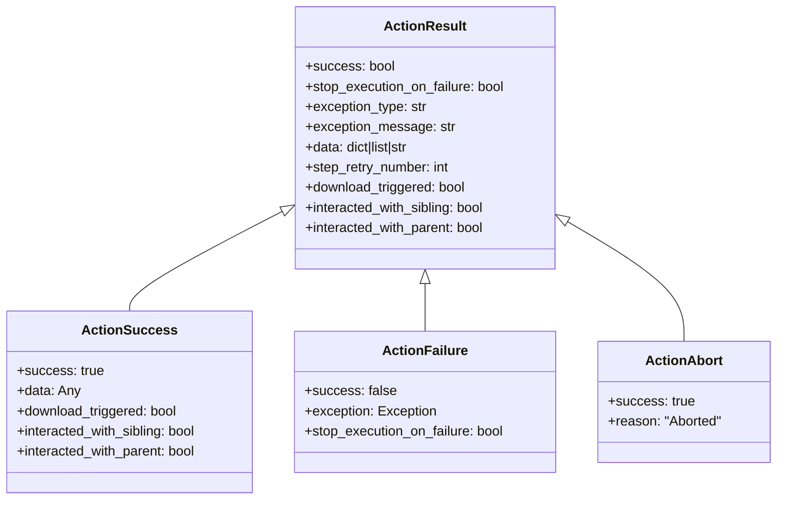
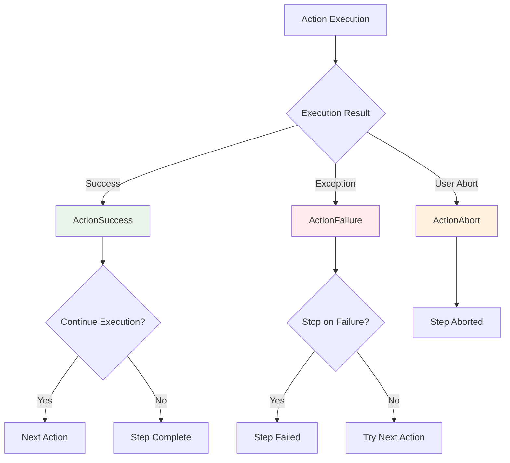
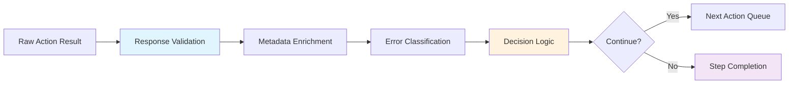

# 📊 Action Results & Responses
*Understanding Success, Failure, and Response Patterns*

---

## 🏗️ ActionResult Class Hierarchy

Located in `skyvern/webeye/actions/responses.py`



---

## ✅ ActionSuccess Response

```python
class ActionSuccess(ActionResult):
    def __init__(
        self,
        data: dict[str, Any] | list | str | None = None,
        download_triggered: bool | None = None,
        interacted_with_sibling: bool = False,
        interacted_with_parent: bool = False,
    ):
        super().__init__(
            success=True,
            data=data,
            download_triggered=download_triggered,
            interacted_with_sibling=interacted_with_sibling,
            interacted_with_parent=interacted_with_parent,
        )
```

### Success Response Examples

| Action Type | Success Data Example |
|-------------|---------------------|
| **CLICK** | `{"element_clicked": true, "download_triggered": false}` |
| **INPUT_TEXT** | `{"text_entered": "user@example.com", "field_type": "email"}` |
| **SELECT_OPTION** | `{"selected_option": {"label": "Medium", "value": "md"}}` |
| **COMPLETE** | `{"task_completed": true, "user_goal_achieved": true}` |

---

## ❌ ActionFailure Response

```python
class ActionFailure(ActionResult):
    def __init__(
        self,
        exception: Exception,
        stop_execution_on_failure: bool = True,
        download_triggered: bool | None = None,
        interacted_with_sibling: bool = False,
        interacted_with_parent: bool = False,
    ):
        super().__init__(
            success=False,
            exception_type=type(exception).__name__,
            stop_execution_on_failure=stop_execution_on_failure,
            exception_message=remove_whitespace(str(exception)),
            download_triggered=download_triggered,
            interacted_with_sibling=interacted_with_sibling,
            interacted_with_parent=interacted_with_parent,
        )
```

---

## 🔄 Response Flow Diagram



---

## 📋 Response Data Patterns

### Click Action Responses
```python
# Successful click
ActionSuccess(data={
    "element_clicked": True,
    "target_element": "button#submit",
    "download_triggered": False,
    "page_navigation": False
})

# Click triggering download
ActionSuccess(data={
    "element_clicked": True,
    "download_triggered": True,
    "download_url": "https://example.com/file.pdf"
})

# Click failure
ActionFailure(
    exception=ElementNotFoundError("Button not found"),
    stop_execution_on_failure=True
)
```

---

## 📄 Input Text Responses

```python
# Successful text input
ActionSuccess(data={
    "text_entered": "john.doe@example.com",
    "field_type": "email",
    "character_count": 19,
    "input_method": "sequential"
})

# Input validation failure
ActionFailure(
    exception=ValidationError("Invalid email format"),
    stop_execution_on_failure=False  # Continue with next action
)
```

---

## 📋 Select Option Responses

```python
# Successful option selection
ActionSuccess(data={
    "selected_option": {
        "label": "United States",
        "value": "US",
        "index": 1
    },
    "selection_method": "by_value",
    "options_available": 195
})

# Option not found
ActionFailure(
    exception=OptionNotFoundError("Option 'Canada' not available"),
    stop_execution_on_failure=True
)
```

---

## 🏁 Complete Action Responses

```python
# Task successfully completed
ActionSuccess(data={
    "task_completed": True,
    "user_goal_achieved": True,
    "completion_confidence": 0.95,
    "verification_result": {
        "thoughts": "Successfully submitted the form with all required fields",
        "page_info": "Confirmation page displayed"
    }
})

# Task completion uncertain
ActionSuccess(data={
    "task_completed": True,
    "user_goal_achieved": False,
    "completion_confidence": 0.65,
    "verification_result": {
        "thoughts": "Form submitted but confirmation unclear",
        "page_info": "Still on form page"
    }
})
```

---

## 🛡️ Error Response Categories

### Element Interaction Errors
```python
# Element not found
ActionFailure(
    exception=MissingElement("Element with ID 'submit-btn' not found"),
    exception_type="MissingElement"
)

# Element not clickable
ActionFailure(
    exception=InteractWithDisabledElement("Button is disabled"),
    exception_type="InteractWithDisabledElement"
)

# Element obscured
ActionFailure(
    exception=ElementObscuredError("Element hidden by modal"),
    exception_type="ElementObscuredError"
)
```

### Network & Timing Errors
```python
# Timeout error
ActionFailure(
    exception=TimeoutError("Action timed out after 30 seconds"),
    exception_type="TimeoutError",
    stop_execution_on_failure=False
)

# Network error
ActionFailure(
    exception=NetworkError("Failed to load page resource"),
    exception_type="NetworkError"
)
```

---

## 📊 Response Metadata

### Interaction Tracking
```python
ActionSuccess(
    data={"clicked": True},
    interacted_with_sibling=True,   # Clicked on related element
    interacted_with_parent=False,   # Didn't fall back to parent
    download_triggered=None         # No download detection
)
```

### Step Tracking
```python
ActionResult(
    success=True,
    step_order=3,           # Third step in task
    step_retry_number=1,    # First retry of this step
    action_order=2          # Second action in this step
)
```

---

## 🔄 Response Processing Pipeline



---

## 📈 Response Analytics

### Success Rate Patterns
```python
# Track success rates by action type
success_metrics = {
    "CLICK": {"success_rate": 0.94, "avg_retries": 1.2},
    "INPUT_TEXT": {"success_rate": 0.97, "avg_retries": 1.1},
    "SELECT_OPTION": {"success_rate": 0.89, "avg_retries": 1.8},
    "COMPLETE": {"success_rate": 0.85, "avg_retries": 2.1}
}
```

### Response Time Tracking
```python
ActionSuccess(data={
    "execution_time_ms": 1250,
    "element_resolution_time_ms": 200,
    "browser_action_time_ms": 1050
})
```