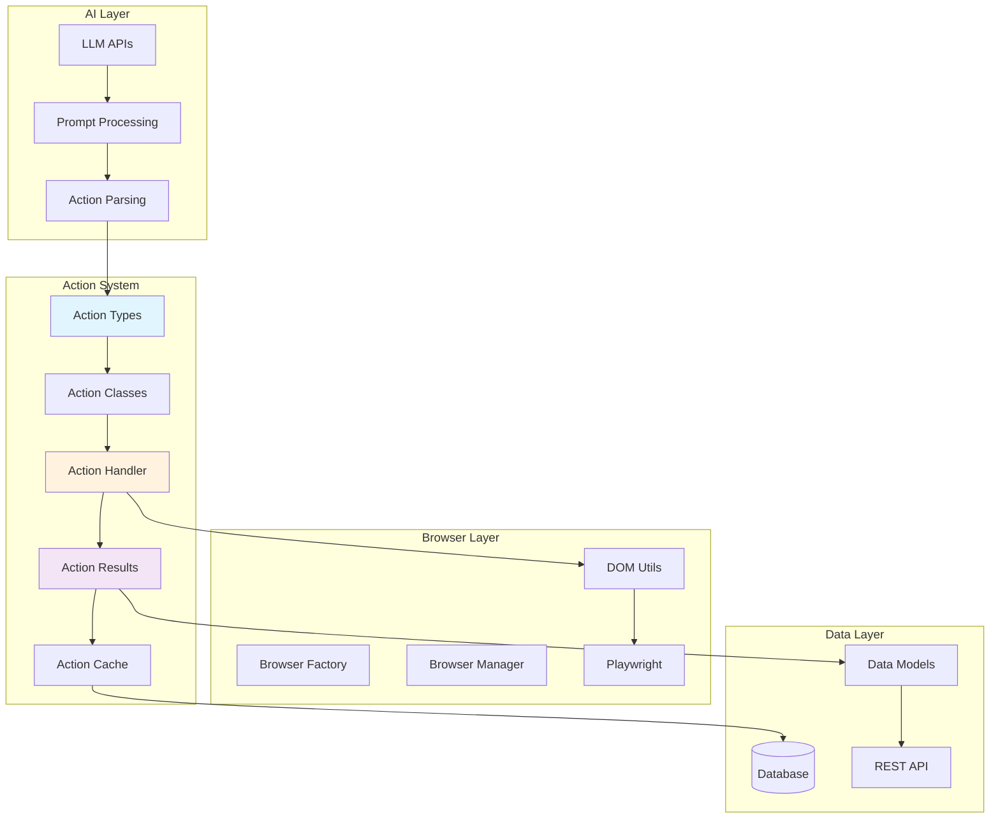
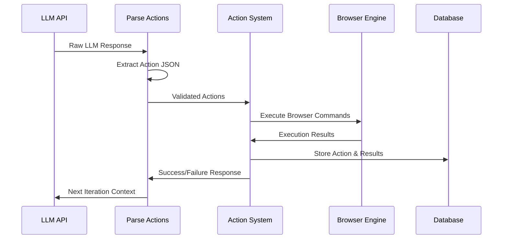
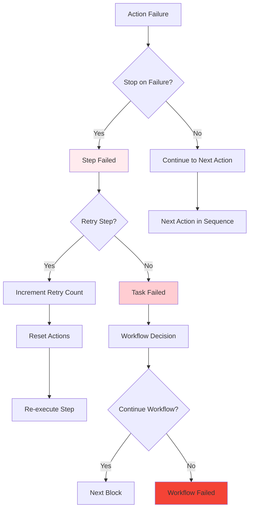

# 🔗 Action System Integration
*How Actions Connect with the Broader Skyvern Ecosystem*

---

## 🏗️ System Integration Overview



---

## 🧠 AI Integration Flow



---

## 📊 Action Models Integration

Located in `skyvern/webeye/actions/models.py`

### AgentStepOutput
```python
class AgentStepOutput(BaseModel):
    """Output recorded in database"""
    action_results: list[ActionResult] | None = None
    actions_and_results: list[tuple[Action, list[ActionResult]]] | None = None
    errors: list[UserDefinedError] = []
```

### DetailedAgentStepOutput
```python
class DetailedAgentStepOutput(BaseModel):
    """Detailed output for debugging and analysis"""
    actions_and_results: list[tuple[Action, list[ActionResult]]] = []
    llm_response: dict[str, Any] | None = None
    scraped_page: ScrapedPage | None = None
```

---

## 🔄 Action Execution Pipeline

### ForgeAgent Integration
```python
class ForgeAgent:
    async def agent_step(
        self,
        task: Task,
        step: Step,
        browser_state: BrowserState
    ) -> tuple[Step, DetailedAgentStepOutput]:
        
        # 1. Scrape current page
        scraped_page = await scrape_website(
            browser_state.page,
            task.url
        )
        
        # 2. Try to retrieve cached actions
        actions = await retrieve_action_plan(task, step, scraped_page)
        
        # 3. If no cache, get actions from AI
        if not actions:
            actions = await self._get_actions_from_llm(
                task, step, scraped_page
            )
        
        # 4. Execute actions sequentially
        detailed_output = DetailedAgentStepOutput()
        for action in actions:
            results = await self._execute_action(
                action, browser_state, scraped_page
            )
            detailed_output.actions_and_results.append(
                (action, results)
            )
            
            # Stop on failure if required
            if not results[0].success and results[0].stop_execution_on_failure:
                break
        
        return step, detailed_output
```

---

## 📡 API Integration Points

### Task Creation with Actions
```python
# POST /api/v1/tasks
{
    "url": "https://example.com",
    "navigation_goal": "Fill out contact form",
    "navigation_payload": {
        "name": "John Doe",
        "email": "john@example.com"
    },
    "extract_json": {
        "confirmation_message": "string"
    }
}
```

### Action Monitoring
```python
# GET /api/v1/tasks/{task_id}/steps/{step_id}/actions
{
    "actions": [
        {
            "action_id": "action_123",
            "action_type": "click",
            "status": "completed",
            "element_id": "submit-button",
            "reasoning": "Clicking submit button to complete form",
            "confidence_float": 0.95,
            "result": {
                "success": true,
                "data": {"element_clicked": true}
            }
        }
    ]
}
```

---

## 🗄️ Database Integration

### Action Storage Schema
```sql
CREATE TABLE actions (
    action_id UUID PRIMARY KEY,
    task_id UUID REFERENCES tasks(task_id),
    step_id UUID REFERENCES steps(step_id),
    action_type VARCHAR(50) NOT NULL,
    status VARCHAR(20) NOT NULL,
    element_id VARCHAR(255),
    skyvern_element_hash VARCHAR(255),
    action_json JSONB,
    reasoning TEXT,
    confidence_float FLOAT,
    created_at TIMESTAMP DEFAULT NOW(),
    modified_at TIMESTAMP DEFAULT NOW()
);
```

### Action Caching Schema
```sql
CREATE TABLE cached_action_plans (
    cache_id UUID PRIMARY KEY,
    source_task_id UUID REFERENCES tasks(task_id),
    url_pattern VARCHAR(500),
    navigation_goal_hash VARCHAR(255),
    actions JSONB NOT NULL,
    success_rate FLOAT DEFAULT 1.0,
    usage_count INTEGER DEFAULT 0,
    created_at TIMESTAMP DEFAULT NOW()
);
```

---

## 🌐 Browser Engine Integration

### Element Resolution
```python
async def resolve_element(
    action: WebAction,
    scraped_page: ScrapedPage,
    browser_state: BrowserState
) -> ElementHandle:
    
    # 1. Get element from scraped page data
    element_data = scraped_page.id_to_element_dict.get(action.element_id)
    if not element_data:
        raise MissingElement(f"Element {action.element_id} not found")
    
    # 2. Resolve locator using DOM utils
    locator, frame = await resolve_locator(
        scraped_page=scraped_page,
        page=browser_state.page,
        frame=element_data.get("frame", "main.frame"),
        css=element_data.get("css_selector")
    )
    
    # 3. Return Playwright element handle
    return await locator.element_handle()
```

---

## 📈 Workflow Integration

### Action Block Execution
```python
class ActionBlock(BaseTaskBlock):
    async def execute(
        self,
        context: WorkflowRunContext
    ) -> BlockResult:
        
        # Create task from workflow context
        task = await self._create_task_from_block(context)
        
        # Execute task through action system
        agent_step_output = await context.agent.execute_task(task)
        
        # Process results for workflow
        if agent_step_output.errors:
            return BlockResult(
                status=BlockStatus.failed,
                errors=agent_step_output.errors
            )
        
        return BlockResult(
            status=BlockStatus.completed,
            output_data=self._extract_workflow_data(agent_step_output)
        )
```

---

## 🔍 Monitoring & Observability

### Action Metrics
```python
class ActionMetrics:
    def __init__(self):
        self.action_counter = Counter()
        self.success_rate = defaultdict(float)
        self.execution_time = defaultdict(list)
    
    def record_action(
        self,
        action_type: ActionType,
        success: bool,
        duration_ms: int
    ):
        self.action_counter[action_type] += 1
        self.execution_time[action_type].append(duration_ms)
        
        # Update success rate
        key = f"{action_type}_success"
        current_rate = self.success_rate[key]
        total_count = self.action_counter[action_type]
        
        if success:
            self.success_rate[key] = (
                (current_rate * (total_count - 1) + 1) / total_count
            )
        else:
            self.success_rate[key] = (
                (current_rate * (total_count - 1)) / total_count
            )
```

---

## 🛡️ Error Propagation



---

## 🔧 Configuration Integration

### Action-Specific Settings
```python
# skyvern/config.py
class Settings:
    # Action execution timeouts
    BROWSER_ACTION_TIMEOUT_MS: int = 30000
    ACTION_RETRY_COUNT: int = 3
    
    # Text input settings
    TEXT_INPUT_DELAY: int = 50
    TEXT_PRESS_MAX_LENGTH: int = 100
    
    # Caching settings
    ENABLE_ACTION_CACHING: bool = True
    CACHE_EXPIRY_HOURS: int = 24
    
    # Action validation
    SKIP_INVISIBLE_ELEMENTS: bool = True
    VERIFY_ELEMENT_STABILITY: bool = True
```

### Runtime Configuration
```python
async def configure_action_handler(
    task: Task,
    browser_state: BrowserState
) -> ActionHandler:
    
    config = ActionHandlerConfig(
        timeout_ms=task.action_timeout or settings.BROWSER_ACTION_TIMEOUT_MS,
        retry_count=task.max_retries or settings.ACTION_RETRY_COUNT,
        enable_caching=task.enable_caching and settings.ENABLE_ACTION_CACHING,
        validation_level=task.validation_level or "strict"
    )
    
    return ActionHandler(
        browser_state=browser_state,
        config=config
    )
```