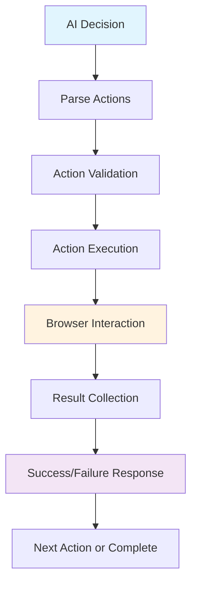
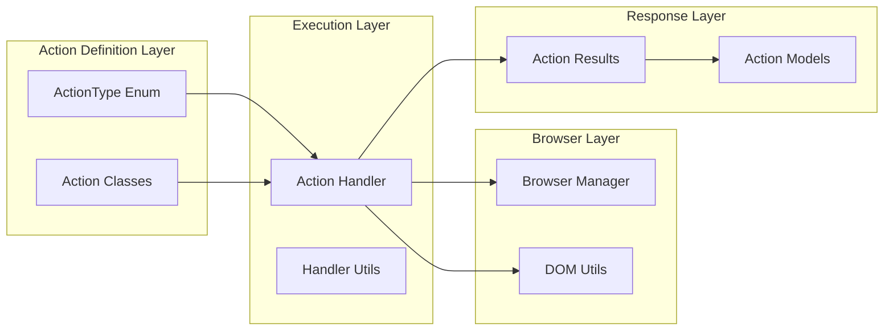

# 🎯 Skyvern Action System Overview
*Phase 7: Understanding the Core Action Infrastructure*

---

## 📋 What is the Action System?

The **Action System** is the **heart of Skyvern's browser automation**. It defines, executes, and manages all browser interactions that Skyvern can perform.

### Key Components
- **Action Types** - Standardized definitions of what actions can be performed
- **Action Classes** - Implementation of each action type with validation logic
- **Action Handler** - Execution engine that translates actions to browser interactions
- **Action Results** - Response modeling for success/failure handling
- **Action Caching** - Performance optimization through action plan reuse

---

## 🔄 Action System Flow

---

## 🏗️ Architecture Overview

---

## 📊 Action System Statistics

| Component | File Count | Key Features |
|-----------|------------|--------------|
| **Action Types** | 1 | 17 Different Action Types |
| **Action Classes** | 1 | Type-safe Action Implementations |
| **Execution Engine** | 2 | Handler + Utilities |
| **Result Models** | 2 | Success/Failure + Data Models |
| **Caching System** | 1 | Performance Optimization |

---

## 🎯 Learning Objectives

By the end of this deep dive, you will understand:

✅ **Action Type Hierarchy** - All 17 available action types and their categorization

✅ **Action Execution Flow** - How actions transform from AI decisions to browser interactions

✅ **Result Handling** - Success/failure patterns and error management

✅ **Caching Strategy** - How Skyvern optimizes repeated action sequences

✅ **Browser Integration** - Connection between actions and Playwright browser API