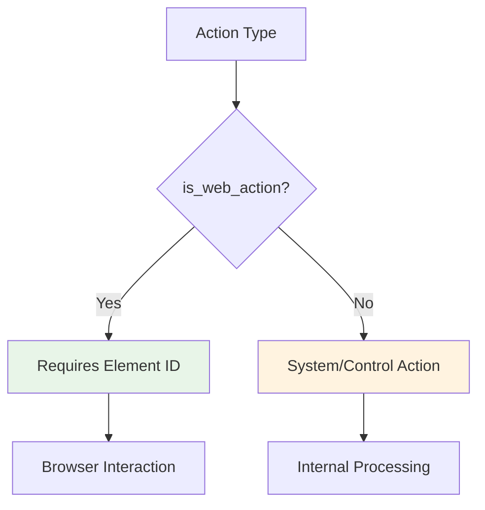
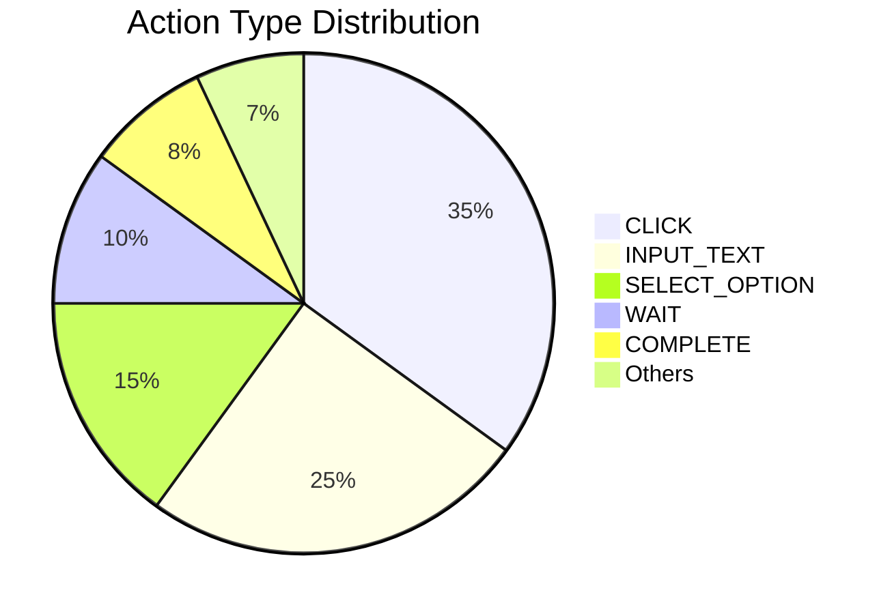

# 🔧 Action Types & Definitions
*Understanding Skyvern's Action Vocabulary*

---

## 📝 ActionType Enum Overview

Located in `skyvern/webeye/actions/action_types.py`

```python
class ActionType(StrEnum):
    # Web Interaction Actions
    CLICK = "click"
    INPUT_TEXT = "input_text"
    UPLOAD_FILE = "upload_file"
    DOWNLOAD_FILE = "download_file"
    SELECT_OPTION = "select_option"
    CHECKBOX = "checkbox"
    
    # Navigation & Control Actions
    SCROLL = "scroll"
    WAIT = "wait"
    RELOAD_PAGE = "reload_page"
    
    # Decision Actions
    COMPLETE = "complete"
    TERMINATE = "terminate"
    NULL_ACTION = "null_action"
    
    # Specialized Actions
    SOLVE_CAPTCHA = "solve_captcha"
    VERIFICATION_CODE = "verification_code"
    EXTRACT = "extract"
    
    # Low-level Input Actions
    KEYPRESS = "keypress"
    TYPE = "type"
    MOVE = "move"
    DRAG = "drag"
    LEFT_MOUSE = "left_mouse"
```

---

## 🎯 Action Categories

### 🌐 Web Interaction Actions
Primary actions for web page interaction:

| Action Type | Purpose | Use Case |
|-------------|---------|----------|
| **CLICK** | Click on elements | Buttons, links, tabs |
| **INPUT_TEXT** | Enter text in fields | Forms, search boxes |
| **UPLOAD_FILE** | Upload files | File inputs |
| **DOWNLOAD_FILE** | Download files | Document downloads |
| **SELECT_OPTION** | Select dropdown options | Dropdowns, lists |
| **CHECKBOX** | Toggle checkboxes | Forms, settings |

---

## 📊 Web Actions Identification

```python
def is_web_action(self) -> bool:
    return self in [
        ActionType.CLICK,
        ActionType.INPUT_TEXT,
        ActionType.UPLOAD_FILE,
        ActionType.DOWNLOAD_FILE,
        ActionType.SELECT_OPTION,
        ActionType.CHECKBOX,
    ]
```



---

## 🎮 Navigation & Control Actions

| Action Type | Purpose | When Used |
|-------------|---------|-----------|
| **SCROLL** | Scroll page content | Navigate long pages |
| **WAIT** | Pause execution | Wait for page loads |
| **RELOAD_PAGE** | Refresh current page | Handle errors/updates |

---

## 🧠 Decision Actions

| Action Type | Purpose | Impact |
|-------------|---------|---------|
| **COMPLETE** | Task completed successfully | ✅ End execution with success |
| **TERMINATE** | Task failed/aborted | ❌ End execution with failure |
| **NULL_ACTION** | No action needed | ⏸️ Skip this step |

---

## 🔐 Specialized Actions

| Action Type | Purpose | Use Case |
|-------------|---------|----------|
| **SOLVE_CAPTCHA** | Handle CAPTCHA challenges | Security verification |
| **VERIFICATION_CODE** | Handle 2FA codes | Authentication |
| **EXTRACT** | Extract data from page | Data scraping |

---

## ⌨️ Low-Level Input Actions

| Action Type | Purpose | Advanced Use |
|-------------|---------|--------------|
| **KEYPRESS** | Send keyboard keys | Shortcuts, special keys |
| **TYPE** | Direct text typing | Raw text input |
| **MOVE** | Mouse movement | Hover effects |
| **DRAG** | Drag and drop | UI interactions |
| **LEFT_MOUSE** | Mouse click | Precise clicking |

---

## 🔍 Action Type Usage Patterns



Most commonly used actions in typical automation scenarios.