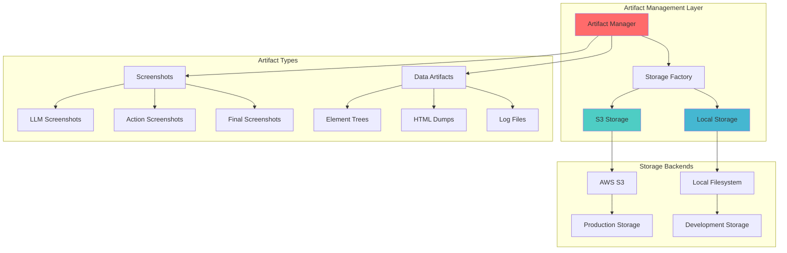

# 📦 Artifact Management System
## `skyvern/forge/sdk/artifact/` Deep Analysis

---

## 🎯 Core Purpose

The Artifact Management System handles **persistent storage and retrieval** of:

- **Screenshots** - Visual captures of web pages with element overlays
- **Element Data** - Structured data about page elements and trees
- **Logs** - Execution logs and debugging information  
- **Files** - User uploads and downloaded content

---

## 🏗️ Storage Architecture



---

## 📊 Artifact Type Classification

### Core Artifact Types
```python
class ArtifactType(StrEnum):
    # Screenshots
    SCREENSHOT_LLM = "screenshot_llm"        # For AI model input
    SCREENSHOT_ACTION = "screenshot_action"   # Before/after actions
    SCREENSHOT_FINAL = "screenshot_final"     # Final page state
    
    # Data Artifacts  
    VISIBLE_ELEMENTS_TREE = "visible_elements_tree"
    VISIBLE_ELEMENTS_ID_CSS_MAP = "visible_elements_id_css_map"
    HTML_SCRAPE = "html_scrape"
    
    # Logs & Debug
    SKYVERN_LOG = "skyvern_log"
    BROWSER_CONSOLE_LOG = "browser_console_log"
    LLM_REQUEST = "llm_request"
    LLM_RESPONSE = "llm_response"
    
    # Files
    RECORDING = "recording"                   # Browser recordings
    TRACE = "trace"                          # Playwright traces
    HAR = "har"                              # Network logs
```

---

## 🗂️ File Extension Mapping

```python
FILE_EXTENSION_MAP = {
    ArtifactType.SCREENSHOT_LLM: "png",
    ArtifactType.SCREENSHOT_ACTION: "png", 
    ArtifactType.SCREENSHOT_FINAL: "png",
    ArtifactType.VISIBLE_ELEMENTS_TREE: "json",
    ArtifactType.HTML_SCRAPE: "html",
    ArtifactType.SKYVERN_LOG: "log",
    ArtifactType.LLM_REQUEST: "json",
    ArtifactType.LLM_RESPONSE: "json",
    ArtifactType.RECORDING: "webm",
    ArtifactType.TRACE: "zip",
    ArtifactType.HAR: "har"
}