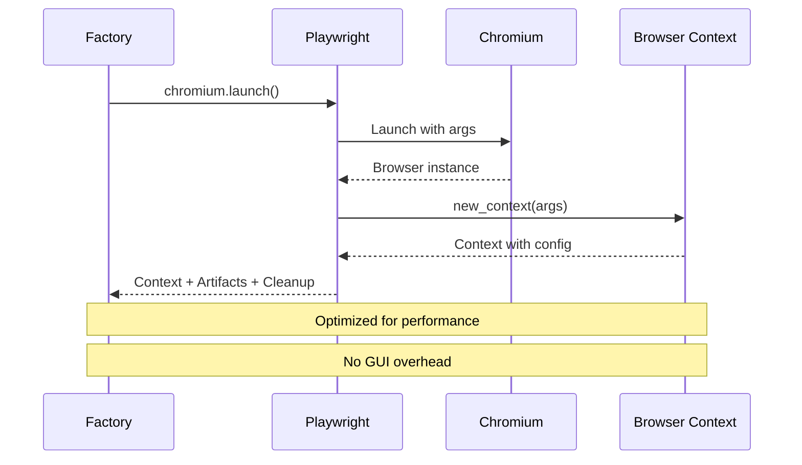
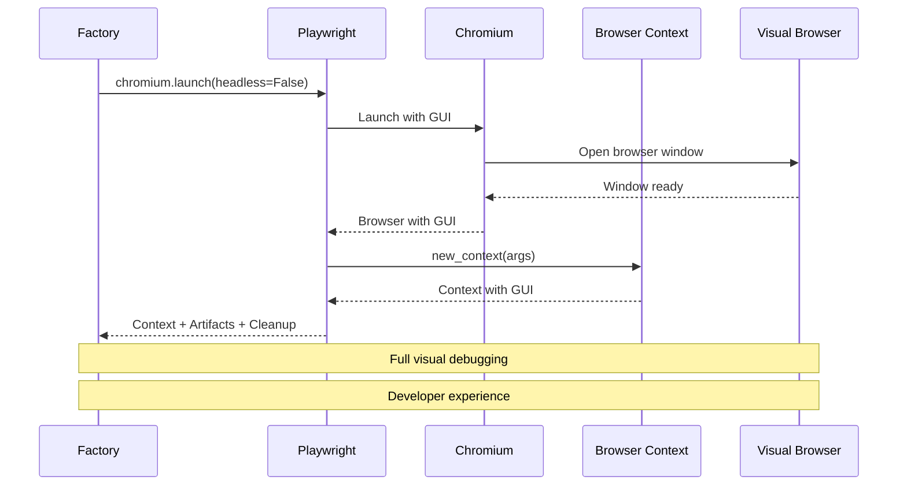
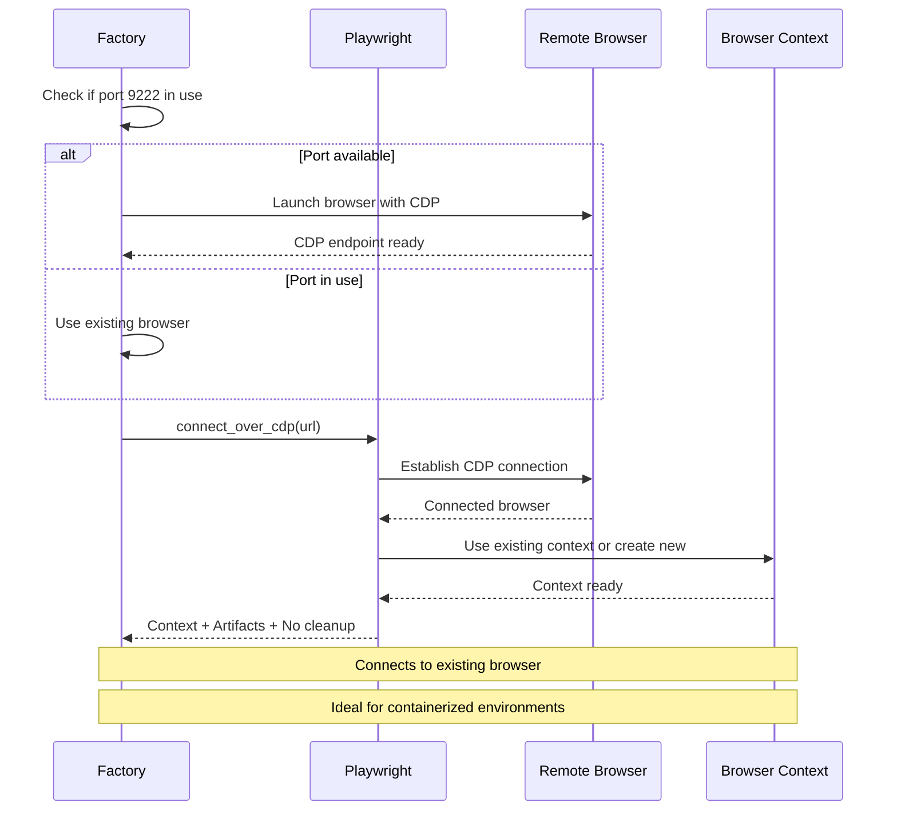
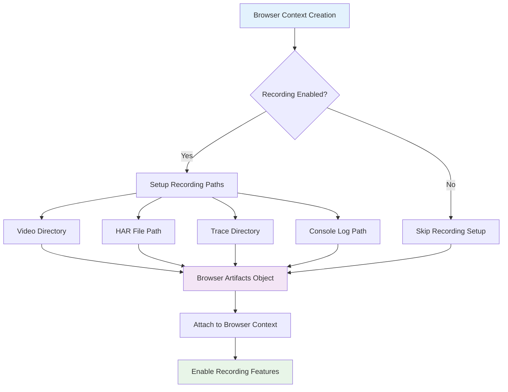
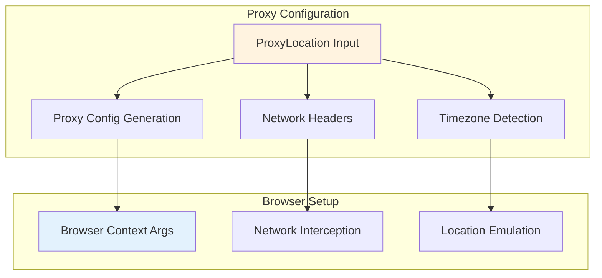
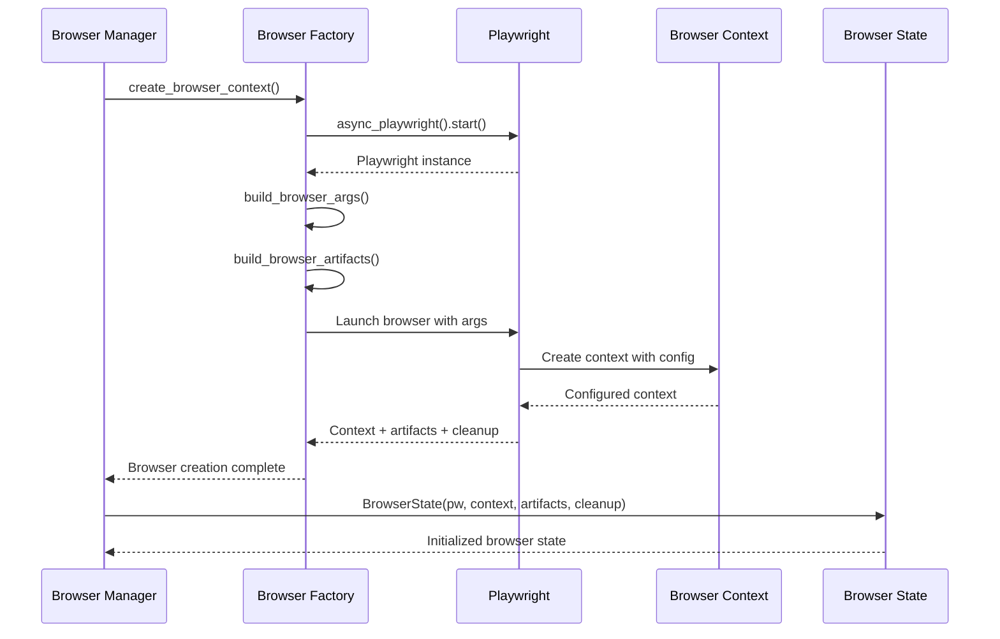
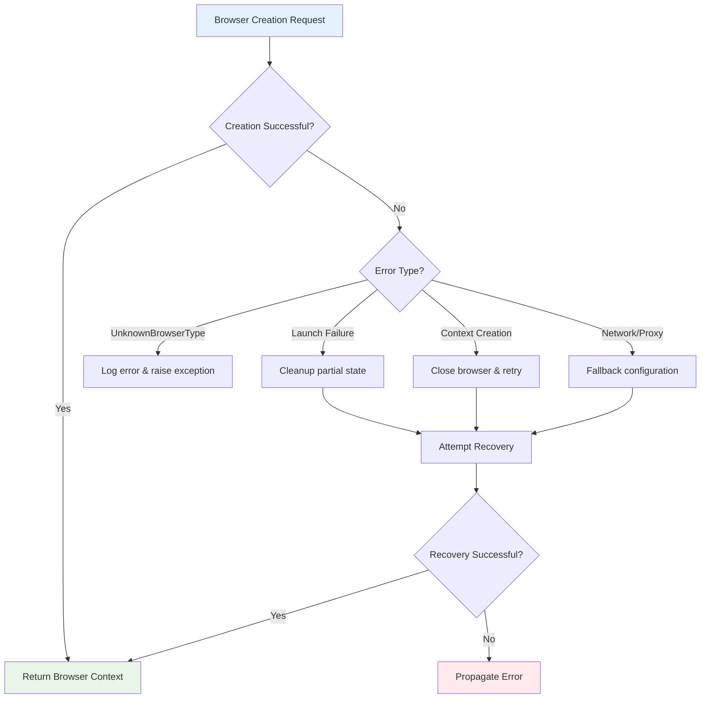

# 🏭 Browser Factory & Context Creation
## Deep Dive into Browser Instantiation and Configuration

---

## 🏗️ Browser Factory Architecture

```mermaid
graph TB
    subgraph "Browser Context Factory"
        A[BrowserContextFactory]
        B[_creators: Dict[str, BrowserContextCreator]]
        C[Factory Registration System]
    end
    
    subgraph "Browser Types"
        D[chromium-headless]
        E[chromium-headful]
        F[cdp-connect]
    end
    
    subgraph "Creation Process"
        G[Playwright Instance]
        H[Browser Context]
        I[Browser Artifacts]
        J[Cleanup Function]
    end
    
    A --> B
    B --> D
    B --> E
    B --> F
    
    D --> G
    E --> G
    F --> G
    
    G --> H
    H --> I
    I --> J
    
    style A fill:#e3f2fd
    style H fill:#f3e5f5
    style I fill:#fff3e0
```

---

## 🎯 Factory Pattern Implementation

### **Type Registration System**
```python
class BrowserContextFactory:
    _creators: dict[str, BrowserContextCreator] = {}
    
    @classmethod
    def register_type(cls, browser_type: str, creator: BrowserContextCreator) -> None:
        cls._creators[browser_type] = creator
    
    @classmethod
    async def create_browser_context(cls, playwright: Playwright, **kwargs: Any):
        browser_type = settings.BROWSER_TYPE
        creator = cls._creators.get(browser_type)
        if not creator:
            raise UnknownBrowserType(browser_type)
        return await creator(playwright, **kwargs)
```

### **Built-in Browser Types**
```python
# Registration of default browser types
BrowserContextFactory.register_type("chromium-headless", _create_headless_chromium)
BrowserContextFactory.register_type("chromium-headful", _create_headful_chromium)
BrowserContextFactory.register_type("cdp-connect", _create_cdp_connection_browser)
```

---

## 🎭 Browser Creation Strategies

### **1. Headless Chromium (Production)**



**Configuration:**
```python
async def _create_headless_chromium(playwright: Playwright, **kwargs):
    browser_args = BrowserContextFactory.build_browser_args(**kwargs)
    browser_artifacts = BrowserContextFactory.build_browser_artifacts(**browser_args)
    
    browser = await playwright.chromium.launch(
        headless=True,
        args=BROWSER_ARGS,  # Security and performance flags
    )
    
    browser_context = await browser.new_context(**browser_args)
    return browser_context, browser_artifacts, browser.close
```

### **2. Headful Chromium (Development)**



**Key Differences:**
- 🖥️ **Visual Interface**: Full browser GUI for debugging
- 🐛 **Developer Tools**: DevTools integration
- 📹 **Visual Recording**: Screen recording capabilities
- ⚡ **Performance Trade-off**: Higher resource usage

### **3. CDP Connection (Remote Control)**



---

## ⚙️ Browser Arguments & Configuration

### **Build Browser Arguments**
```python
@staticmethod
def build_browser_args(
    proxy_location: ProxyLocation | None = None,
    task_id: str | None = None,
    workflow_run_id: str | None = None,
    organization_id: str | None = None,
    extra_http_headers: dict[str, str] | None = None,
) -> dict[str, Any]:
    args = {
        "viewport": {"width": 1920, "height": 1080},
        "extra_http_headers": extra_http_headers or {},
    }
    
    # Video recording setup
    if settings.BROWSER_RECORDING_ENABLED:
        video_dir = get_video_dir(task_id, workflow_run_id, organization_id)
        args["record_video_dir"] = video_dir
        args["record_video_size"] = {"width": 1920, "height": 1080}
    
    # HAR recording
    if settings.BROWSER_HAR_RECORDING_ENABLED:
        har_path = get_har_path(task_id, workflow_run_id, organization_id)
        args["record_har_path"] = har_path
    
    # Proxy configuration
    if proxy_location:
        proxy_config = get_proxy_config(proxy_location)
        if proxy_config:
            args["proxy"] = proxy_config
        
        # Timezone from proxy location
        if tz_info := get_tzinfo_from_proxy(proxy_location):
            args["timezone_id"] = tz_info.key
    
    return args
```

### **Browser Launch Arguments**
```python
BROWSER_ARGS = [
    "--no-sandbox",
    "--disable-dev-shm-usage",
    "--disable-background-timer-throttling",
    "--disable-backgrounding-occluded-windows", 
    "--disable-renderer-backgrounding",
    "--disable-web-security",
    "--disable-features=TranslateUI",
    "--disable-component-extensions-with-background-pages",
    "--disable-default-apps",
    "--disable-extensions",
    "--no-default-browser-check",
    "--no-first-run",
    "--disable-blink-features=AutomationControlled",
    "--use-fake-ui-for-media-stream",
    "--use-fake-device-for-media-stream",
]
```

---

## 📦 Browser Artifacts Management

### **Artifact Types & Structure**
```python
@dataclass
class BrowserArtifacts:
    video_artifacts: list[VideoArtifact] = field(default_factory=list)
    har_path: str | None = None
    traces_dir: str | None = None
    browser_session_dir: str | None = None
    browser_console_log_path: str | None = None

@dataclass  
class VideoArtifact:
    video_path: str
    video_data: bytes | None = None
```

### **Artifact Collection Flow**



---

## 🌍 Proxy & Network Configuration

### **Proxy Location Handling**


### **Network Monitoring Setup**
```python
def set_download_file_listener(browser_context: BrowserContext, **kwargs):
    """Setup download handling for file operations"""
    
def set_browser_console_log(browser_context: BrowserContext, browser_artifacts: BrowserArtifacts):
    """Setup console log collection"""
    
    async def log_console_message(msg):
        if browser_artifacts.browser_console_log_path:
            # Append to console log file
            pass
    
    browser_context.on("console", log_console_message)
```

---

## 🔧 Browser State Initialization

### **BrowserState Class Structure**
```python
class BrowserState:
    def __init__(
        self,
        pw: Playwright,
        browser_context: BrowserContext | None = None,
        page: Page | None = None,
        browser_artifacts: BrowserArtifacts = BrowserArtifacts(),
        browser_cleanup: BrowserCleanupFunc = None,
    ):
        self.__page = page
        self.pw = pw
        self.browser_context = browser_context
        self.browser_artifacts = browser_artifacts
        self.browser_cleanup = browser_cleanup
```

### **State Initialization Flow**



---

## 📊 Configuration Matrix

| Browser Type | Use Case | Performance | Resources | Debugging |
|-------------|----------|-------------|-----------|-----------|
| **Headless** | Production automation | ⭐⭐⭐⭐⭐ | ⭐⭐⭐⭐⭐ | ⭐⭐ |
| **Headful** | Development & debug | ⭐⭐⭐ | ⭐⭐ | ⭐⭐⭐⭐⭐ |
| **CDP** | Remote/container | ⭐⭐⭐⭐ | ⭐⭐⭐⭐ | ⭐⭐⭐ |

---

## 🛡️ Error Handling & Recovery

### **Creation Error Scenarios**



### **Cleanup & Resource Management**
```python
async def create_browser_context(cls, playwright: Playwright, **kwargs):
    browser_context: BrowserContext | None = None
    try:
        creator = cls._creators.get(browser_type)
        if not creator:
            raise UnknownBrowserType(browser_type)
        
        browser_context, browser_artifacts, cleanup_func = await creator(playwright, **kwargs)
        
        # Setup monitoring and listeners
        set_browser_console_log(browser_context, browser_artifacts)
        set_download_file_listener(browser_context, **kwargs)
        
        return browser_context, browser_artifacts, cleanup_func
        
    except Exception as e:
        if browser_context is not None:
            # Emergency cleanup if context was created
            try:
                await browser_context.close()
            except Exception:
                LOG.warning("Failed to close browser context during error cleanup")
        raise
```

---

## 🎥 Artifact Management Features

### **Video Recording Configuration**
```python
def get_video_dir(task_id: str, workflow_run_id: str, organization_id: str) -> str:
    if workflow_run_id:
        return f"{settings.BROWSER_RECORDING_DIR}/{organization_id}/{workflow_run_id}"
    return f"{settings.BROWSER_RECORDING_DIR}/{organization_id}/{task_id}"

def get_video_artifacts(browser_state: BrowserState) -> list[VideoArtifact]:
    artifacts = []
    for page in browser_state.browser_context.pages:
        if page.video:
            video_path = await page.video.path()
            artifacts.append(VideoArtifact(video_path=video_path))
    return artifacts
```

### **HAR File Generation**
```python
def get_har_path(task_id: str, workflow_run_id: str, organization_id: str) -> str:
    identifier = workflow_run_id or task_id
    return f"{settings.BROWSER_HAR_DIR}/{organization_id}/{identifier}.har"
```

### **Performance Tracing**
```python
async def enable_tracing(browser_context: BrowserContext, traces_dir: str):
    await browser_context.tracing.start(
        screenshots=True,
        snapshots=True,
        sources=True
    )
    
async def stop_tracing(browser_context: BrowserContext, output_path: str):
    await browser_context.tracing.stop(path=output_path)
```

---

## 🌐 Advanced Configuration Options

### **Device Emulation**
```python
MOBILE_VIEWPORT = {"width": 375, "height": 667}
DESKTOP_VIEWPORT = {"width": 1920, "height": 1080}
TABLET_VIEWPORT = {"width": 768, "height": 1024}

# User agent strings for different devices
MOBILE_USER_AGENT = "Mozilla/5.0 (iPhone; CPU iPhone OS 14_0 like Mac OS X)..."
DESKTOP_USER_AGENT = "Mozilla/5.0 (Windows NT 10.0; Win64; x64)..."
```

### **Security & Privacy Settings**
```python
SECURITY_ARGS = [
    "--disable-web-security",           # Allow cross-origin requests
    "--disable-features=VizDisplayCompositor",  # Reduce GPU usage
    "--disable-blink-features=AutomationControlled",  # Hide automation
    "--no-sandbox",                     # Required for containers
    "--disable-dev-shm-usage",         # Avoid shared memory issues
]
```

### **Performance Optimization**
```python
PERFORMANCE_ARGS = [
    "--disable-background-timer-throttling",
    "--disable-backgrounding-occluded-windows",
    "--disable-renderer-backgrounding",
    "--disable-component-extensions-with-background-pages",
    "--disable-default-apps",
    "--disable-extensions",
]
```

---

## 🔍 Monitoring & Diagnostics

### **Browser Health Checks**
```python
async def check_browser_health(browser_context: BrowserContext) -> bool:
    try:
        # Test page creation
        test_page = await browser_context.new_page()
        await test_page.goto("data:text/html,<html><body>Test</body></html>")
        await test_page.close()
        return True
    except Exception:
        return False
```

### **Resource Usage Monitoring**
```python
async def get_browser_metrics(browser_context: BrowserContext) -> dict:
    metrics = {}
    for page in browser_context.pages:
        try:
            # Get performance metrics
            performance_metrics = await page.evaluate("""
                () => ({
                    memory: performance.memory?.usedJSHeapSize || 0,
                    timing: performance.timing.loadEventEnd - performance.timing.navigationStart
                })
            """)
            metrics[page.url] = performance_metrics
        except Exception:
            continue
    return metrics
```

---

## 🎯 Factory Pattern Benefits

### **Extensibility**
- ✅ **Easy Addition** of new browser types
- ✅ **Runtime Registration** of custom creators
- ✅ **Configuration Flexibility** per browser type
- ✅ **Testing Support** with mock browsers

### **Consistency**
- ✅ **Uniform Interface** across all browser types
- ✅ **Standardized Configuration** patterns
- ✅ **Common Artifact Management**
- ✅ **Centralized Error Handling**

### **Maintainability**
- ✅ **Separation of Concerns** between browser types
- ✅ **Clear Abstraction** boundaries
- ✅ **Easy Testing** of individual creators
- ✅ **Configuration Management**

---

## 📈 Performance Considerations

### **Startup Time Optimization**
| Browser Type | Cold Start | Warm Start | Context Creation |
|-------------|------------|------------|------------------|
| **Headless** | ~2-3s | ~1s | ~200ms |
| **Headful** | ~4-5s | ~2s | ~300ms |
| **CDP** | ~100ms | ~50ms | ~100ms |

### **Memory Usage Patterns**
- 📊 **Base Memory**: ~100-150MB per browser instance
- 📈 **Per Page**: +20-50MB depending on content
- 🎥 **Recording Overhead**: +30-50MB for video/HAR
- 🧹 **Cleanup Efficiency**: 95%+ memory recovery

---

## 🔧 Configuration Best Practices

### **Production Settings**
```python
PRODUCTION_CONFIG = {
    "browser_type": "chromium-headless",
    "recording_enabled": False,
    "har_recording": True,
    "console_logging": True,
    "tracing_enabled": False,
    "proxy_rotation": True
}
```

### **Development Settings**
```python
DEVELOPMENT_CONFIG = {
    "browser_type": "chromium-headful", 
    "recording_enabled": True,
    "har_recording": True,
    "console_logging": True,
    "tracing_enabled": True,
    "devtools_enabled": True
}
```

### **Testing Settings**
```python
TESTING_CONFIG = {
    "browser_type": "chromium-headless",
    "recording_enabled": False,
    "har_recording": False,
    "console_logging": False,
    "fast_startup": True,
    "reduced_security": True
}
```

---

## 🎯 Key Takeaways

1. **Factory Pattern**: Provides flexible, extensible browser creation
2. **Multiple Strategies**: Headless, headful, and CDP connection options
3. **Rich Configuration**: Extensive customization for different use cases
4. **Artifact Management**: Comprehensive recording and monitoring capabilities
5. **Error Resilience**: Robust error handling and resource cleanup
6. **Performance Optimization**: Efficient resource usage and startup times

**Next: Browser State & Persistence Management** 📊