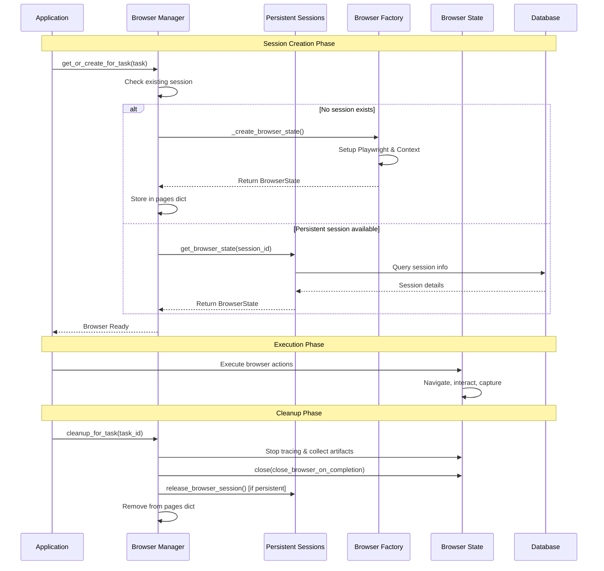
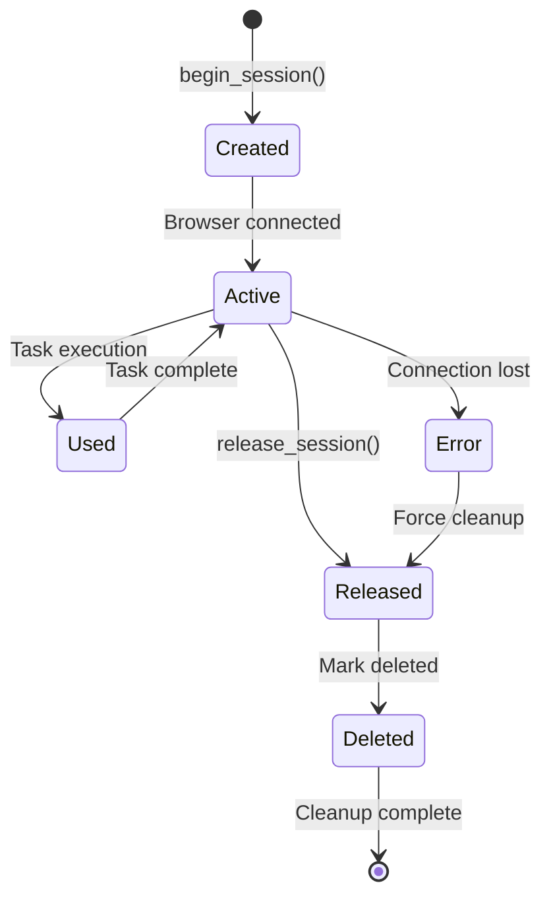
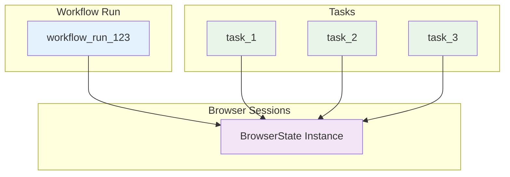
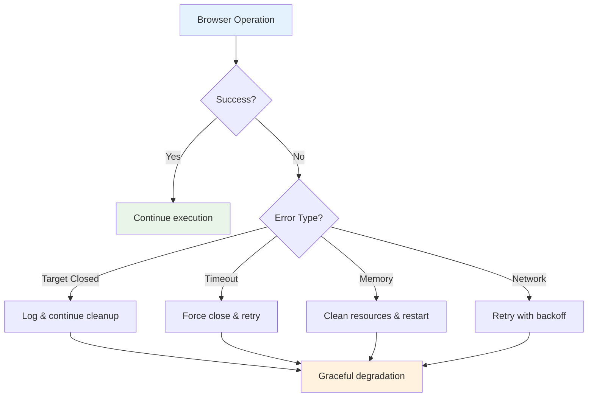

# 🔄 Browser Lifecycle & Session Management
## Deep Dive into Browser Manager & Persistent Sessions

---

## 📋 Session Management Architecture

```mermaid
graph TB
    subgraph "Browser Manager"
        A[BrowserManager Singleton]
        B[pages: Dict[str, BrowserState]]
        C[Session Lifecycle Methods]
    end
    
    subgraph "Persistent Sessions Manager"
        D[PersistentSessionsManager]
        E[_browser_sessions: Dict]
        F[Database Integration]
    end
    
    subgraph "Session Storage"
        G[In-Memory Cache]
        H[Database Records]
        I[Browser Artifacts]
    end
    
    A --> B
    A --> C
    D --> E
    D --> F
    
    C --> D
    E --> G
    F --> H
    B --> I
    
    style A fill:#e3f2fd
    style D fill:#fff3e0
    style G fill:#f3e5f5
```

---

## 🎛️ Browser Manager Deep Dive

### **Singleton Pattern Implementation**
```python
class BrowserManager:
    instance = None
    pages: dict[str, BrowserState] = dict()

    def __new__(cls) -> BrowserManager:
        if cls.instance is None:
            cls.instance = super().__new__(cls)
        return cls.instance
```

### **Key Responsibilities**
- 🎯 **Central Control Point** for all browser operations
- 📦 **Browser Pool Management** with task/workflow mapping
- 🔄 **Lifecycle Coordination** from creation to cleanup
- 🧹 **Resource Cleanup** and artifact collection

---

## 🔄 Browser Session Lifecycle



---

## 💾 Persistent Sessions Manager

### **Session Data Structure**
```python
@dataclass
class BrowserSession:
    browser_state: BrowserState
    cdp_port: int
    cdp_host: str = "localhost"

class PersistentSessionsManager:
    _browser_sessions: dict[str, BrowserSession] = dict()
    database: AgentDB
```

### **Key Methods & Flows**

#### **Session Acquisition**
```mermaid
flowchart TD
    A[begin_session()] --> B{Session exists in memory?}
    B -->|Yes| C[Return existing session]
    B -->|No| D{Session in database?}
    D -->|Yes| E[Create new browser instance]
    D -->|No| F[Error: Session not found]
    E --> G[Store in _browser_sessions]
    G --> H[Mark as active in DB]
    H --> I[Return session]
    
    style A fill:#e8f5e8
    style I fill:#e8f5e8
    style F fill:#ffebee
```

#### **Session Release**
```mermaid
flowchart TD
    A[release_browser_session()] --> B{Session in memory?}
    B -->|Yes| C[Close browser state]
    B -->|No| D[Log: Not found in memory]
    C --> E[Remove from _browser_sessions]
    E --> F[Mark as deleted in DB]
    D --> F
    F --> G[Session Released]
    
    style A fill:#fff3e0
    style G fill:#e8f5e8
```

---

## 🗂️ Session Storage Strategy

### **Multi-Level Storage**

| Level | Storage Type | Purpose | Lifecycle |
|-------|-------------|---------|-----------|
| **L1** | Memory (`_browser_sessions`) | Active sessions | Process lifetime |
| **L2** | Database | Session metadata | Persistent |
| **L3** | File System | Browser artifacts | Configurable |

### **Session States**



---

## 🎯 Task-to-Browser Mapping

### **Session Resolution Logic**
```python
def get_for_task(self, task_id: str, workflow_run_id: str | None = None) -> BrowserState | None:
    # Priority 1: Direct task mapping
    if task_id in self.pages:
        return self.pages[task_id]
    
    # Priority 2: Workflow-level mapping
    if workflow_run_id and workflow_run_id in self.pages:
        # Share browser between tasks in same workflow
        self.pages[task_id] = self.pages[workflow_run_id]
        return self.pages[task_id]
    
    return None
```

### **Browser Sharing Patterns**



---

## 🧹 Cleanup & Resource Management

### **Cleanup Hierarchy**

```mermaid
flowchart TD
    A[Cleanup Request] --> B{Cleanup Type?}
    B -->|Task| C[cleanup_for_task()]
    B -->|Workflow| D[cleanup_for_workflow_run()]
    
    C --> E[Stop browser tracing]
    C --> F[Close browser state]
    C --> G[Release persistent session]
    C --> H[Remove from pages dict]
    
    D --> I[Stop workflow tracing]
    D --> J[Close workflow browser]
    D --> K[Clean individual tasks]
    D --> L[Persist artifacts]
    
    E --> M[Complete]
    F --> M
    G --> M
    H --> M
    I --> M
    J --> M
    K --> M
    L --> M
    
    style A fill:#fff3e0
    style M fill:#e8f5e8
```

### **Artifact Collection During Cleanup**

| Artifact Type | Collection Point | Storage Location |
|---------------|------------------|------------------|
| **Video Files** | Browser close | Temporary → Storage |
| **HAR Files** | Context close | Browser artifacts |
| **Trace Files** | Tracing stop | Zip archives |
| **Console Logs** | Session end | Log files |
| **Screenshots** | Action completion | Artifact manager |

---

## ⚠️ Error Handling & Recovery

### **Common Error Scenarios**



### **Recovery Strategies**
- 🔄 **Automatic Retry** for transient failures
- 🧹 **Graceful Cleanup** even when browsers are unresponsive
- 📝 **Comprehensive Logging** for debugging
- 🛡️ **Resource Protection** through timeout handling

---

## 📊 Performance Characteristics

### **Memory Management**
- **Session Pooling**: Reduces browser startup overhead
- **Automatic Cleanup**: Prevents memory leaks
- **Resource Limits**: Configurable session timeouts
- **Artifact Management**: Efficient storage and cleanup

### **Timing Considerations**
```python
# Configuration constants
NAVIGATION_MAX_RETRY_TIME = 3
BROWSER_LOADING_TIMEOUT_MS = 30000
BUILDING_ELEMENT_TREE_TIMEOUT_MS = 10000
```

---

## 🔧 Configuration & Customization

### **Session Configuration Options**
- ⏱️ **Timeout Settings**: Custom session durations
- 🌍 **Proxy Support**: Location-aware proxying
- 📱 **Device Emulation**: Mobile/desktop configurations
- 🎥 **Recording Options**: Video/trace collection settings

### **Environment Considerations**
- 🖥️ **Development**: Headful browsers for debugging
- ☁️ **Production**: Headless optimization
- 🐳 **Containerized**: CDP connections for isolation

---

## 🎯 Key Takeaways

1. **Centralized Management**: Single point of control for all browser operations
2. **Session Persistence**: Efficient reuse of browser instances across tasks
3. **Robust Cleanup**: Comprehensive resource management and artifact collection
4. **Error Resilience**: Graceful handling of browser failures and edge cases
5. **Performance Optimization**: Memory-efficient pooling and lifecycle management

**Next: Browser Factory & Context Creation** 🏭