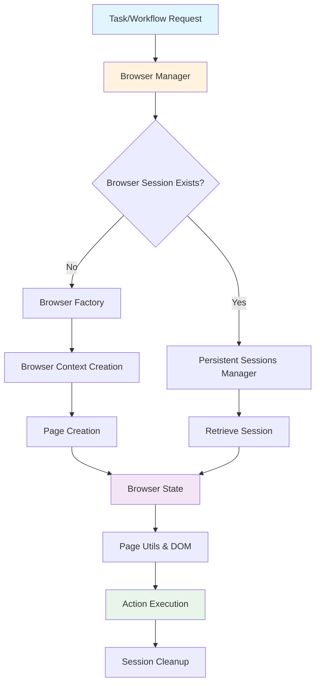
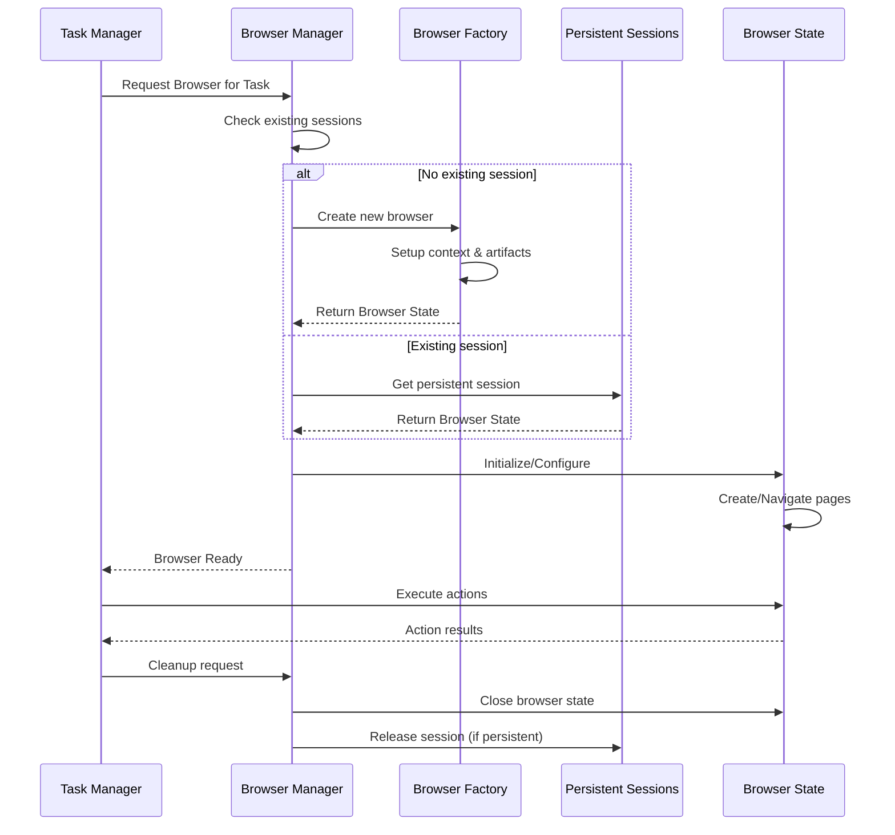

# 🌐 Skyvern Browser Management System
## Phase 5: Deep Dive into Browser Architecture

---

## 📋 Presentation Agenda

1. **Browser Management Overview** ⭐ *This File*
2. **Browser Lifecycle & Session Management** 
3. **Browser Factory & Context Creation**
4. **Browser State & Persistence**
5. **Page & Frame Management**
6. **DOM Utilities & Element Interaction**
7. **Browser Configuration & Settings**
8. **Architecture Summary & Integration**

---

## 🎯 Learning Objectives

By the end of this presentation, you will understand:

- ✅ **Browser Lifecycle Management** - How browsers are created, managed, and destroyed
- ✅ **Session Persistence** - How browser sessions are maintained across tasks
- ✅ **Page & Frame Handling** - Multi-frame navigation and interaction patterns
- ✅ **Browser Configuration** - Setup options and proxy configurations
- ✅ **Integration Points** - How browser management integrates with the core system

---

## 🏗️ High-Level Architecture Overview



---

## 🔧 Core Components Overview

### **1. Browser Manager** 🎛️
- **Central controller** for all browser operations
- **Session lifecycle** management
- **Pool management** for browser instances
- **Cleanup coordination** for resources

### **2. Browser Factory** 🏭
- **Browser instance creation** with various configurations
- **Context setup** (headless, headful, CDP)
- **Artifact management** (videos, traces, HAR files)
- **Proxy configuration** handling

### **3. Persistent Sessions Manager** 💾
- **Session persistence** across tasks and workflows
- **Browser state recovery** and reuse
- **Resource allocation** and release
- **Cross-organization** session management

### **4. Browser State** 📊
- **Runtime state container** for browser instances
- **Page management** and navigation
- **Artifact collection** (screenshots, videos, logs)
- **Cleanup coordination**

---

## 🔄 Browser Lifecycle Flow



---

## 🎭 Browser Creation Strategies

| Strategy | Use Case | Configuration |
|----------|----------|---------------|
| **Chromium Headless** | Production automation | No GUI, fastest execution |
| **Chromium Headful** | Development & debugging | Full GUI, visual feedback |
| **CDP Connection** | Remote browser control | Connect to existing browser |

---

## 📦 Key Data Structures

### **BrowserState**
```python
class BrowserState:
    pw: Playwright                    # Playwright instance
    browser_context: BrowserContext   # Browser context
    page: Page                       # Current active page
    browser_artifacts: BrowserArtifacts  # Collected artifacts
    browser_cleanup: BrowserCleanupFunc  # Cleanup function
```

### **BrowserArtifacts**
```python
class BrowserArtifacts:
    video_artifacts: list[VideoArtifact]  # Recorded videos
    har_path: str                        # Network traffic logs
    traces_dir: str                      # Performance traces
    browser_session_dir: str             # Session data
    browser_console_log_path: str        # Console logs
```

---

## 🌟 Key Features & Capabilities

### **🔄 Session Persistence**
- Browser sessions can survive across multiple tasks
- State recovery and restoration
- Resource optimization through reuse

### **🎥 Comprehensive Monitoring**
- Video recording of browser sessions
- HAR file generation for network analysis
- Performance tracing and profiling
- Console log collection

### **🌍 Multi-Frame Support**
- Complex iframe navigation
- Cross-frame element interaction
- Frame-aware DOM manipulation

### **⚙️ Flexible Configuration**
- Proxy support with location awareness
- Custom HTTP headers
- Timezone configuration
- Browser-specific settings

---

## 🔍 Performance & Monitoring

### **Artifact Collection**
- 📹 **Video Recording**: Full session replay capability
- 🌐 **HAR Files**: Complete network traffic analysis
- 📊 **Performance Traces**: Browser performance metrics
- 📝 **Console Logs**: JavaScript errors and debug info

### **Resource Management**
- Memory-efficient browser pooling
- Automatic cleanup procedures
- Timeout handling for stuck sessions
- Graceful shutdown procedures

---

## 🎯 Next Steps

This overview sets the foundation. In the following presentations, we'll dive deep into:

1. **Session Management** - Detailed lifecycle flows
2. **Browser Factory** - Creation patterns and strategies
3. **State Management** - Persistence and recovery
4. **Page Utilities** - DOM interaction and frame handling
5. **Configuration** - Setup options and customization

**Ready to explore the detailed components? Let's move to Session Management!** 🚀