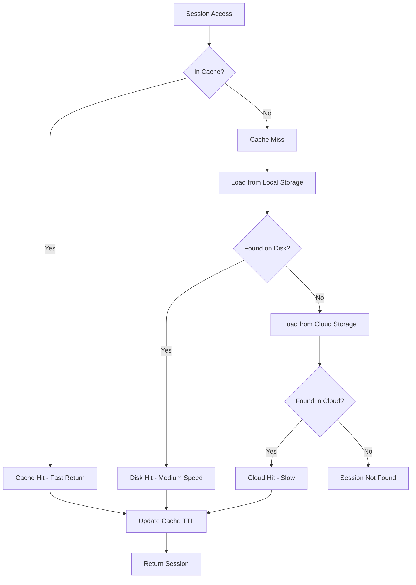
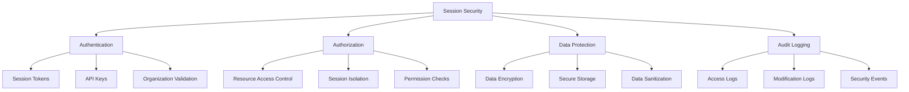
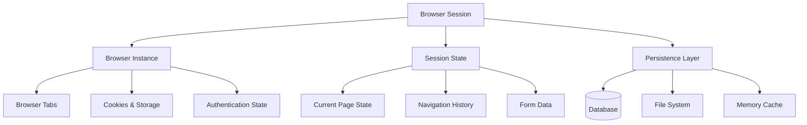
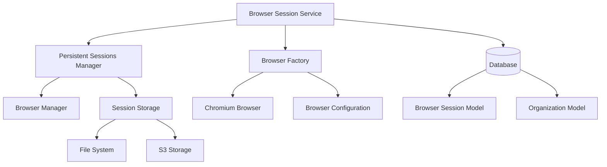
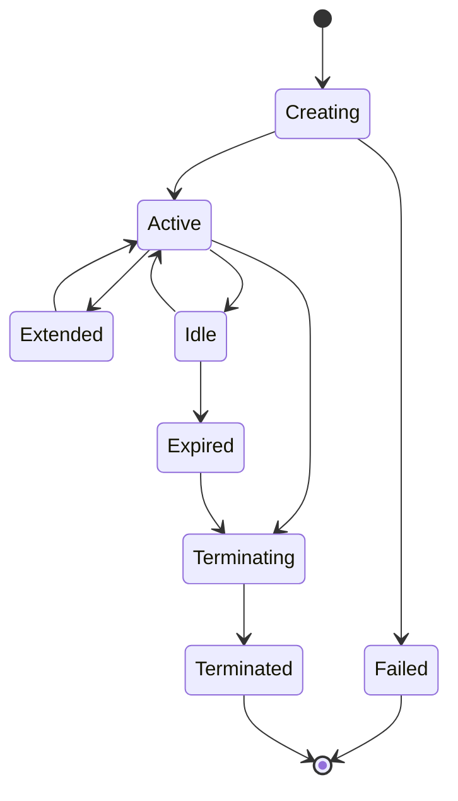
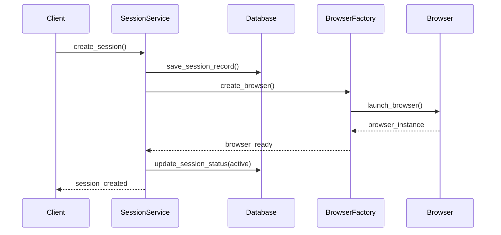
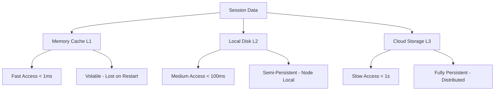
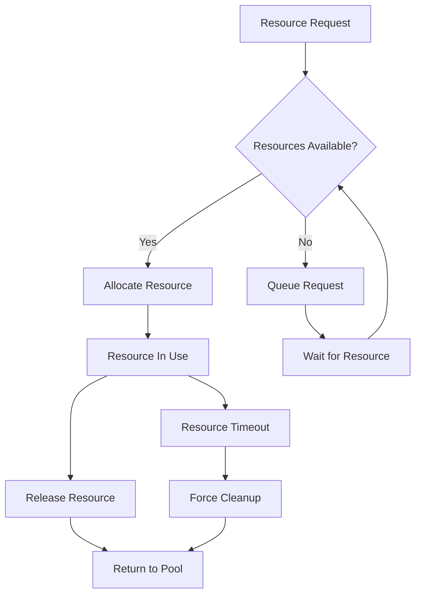
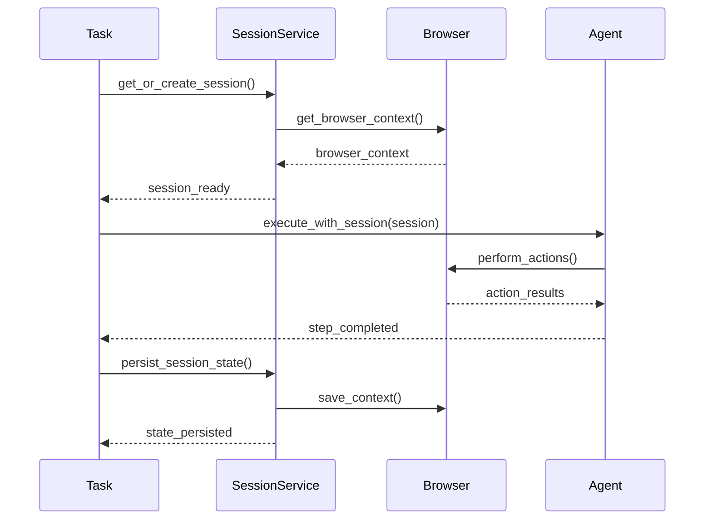

# 🌐 Browser Session Service Architecture
## Session Management and Persistence

---

## 🚀 Performance Optimization

### **Caching Strategies**



### **Optimization Techniques**

#### **1. Lazy Loading**
```python
class LazySessionLoader:
    def __init__(self, session_id: str):
        self.session_id = session_id
        self._browser_state = None
        self._execution_context = None
    
    async def get_browser_state(self) -> dict:
        if self._browser_state is None:
            self._browser_state = await load_browser_state(self.session_id)
        return self._browser_state
    
    async def get_execution_context(self) -> dict:
        if self._execution_context is None:
            self._execution_context = await load_execution_context(self.session_id)
        return self._execution_context
```

#### **2. Connection Pooling**
```python
class BrowserConnectionPool:
    def __init__(self, pool_size: int = 10):
        self.pool_size = pool_size
        self.available_browsers = asyncio.Queue(maxsize=pool_size)
        self.active_browsers = {}
        self._initialize_pool()
    
    async def acquire_browser(self, session_id: str) -> Browser:
        """Get browser from pool or create new one"""
        try:
            browser = await asyncio.wait_for(
                self.available_browsers.get(),
                timeout=30.0
            )
            self.active_browsers[session_id] = browser
            return browser
        except asyncio.TimeoutError:
            # Pool exhausted, create new browser
            browser = await create_new_browser()
            self.active_browsers[session_id] = browser
            return browser
    
    async def release_browser(self, session_id: str) -> None:
        """Return browser to pool"""
        if session_id in self.active_browsers:
            browser = self.active_browsers.pop(session_id)
            await self.cleanup_browser_for_reuse(browser)
            
            try:
                self.available_browsers.put_nowait(browser)
            except asyncio.QueueFull:
                # Pool is full, close browser
                await browser.close()
```

#### **3. Compression and Serialization**
```python
class SessionDataCompressor:
    def __init__(self):
        self.compression_threshold = 1024  # 1KB
        self.serializer = JSONSerializer()
        self.compressor = GzipCompressor()
    
    async def serialize_session_data(self, data: dict) -> bytes:
        # Serialize to JSON
        json_data = await self.serializer.serialize(data)
        
        # Compress if data is large enough
        if len(json_data) > self.compression_threshold:
            compressed_data = await self.compressor.compress(json_data)
            return b'compressed:' + compressed_data
        else:
            return b'raw:' + json_data.encode()
    
    async def deserialize_session_data(self, data: bytes) -> dict:
        if data.startswith(b'compressed:'):
            # Decompress and deserialize
            compressed_data = data[11:]  # Remove 'compressed:' prefix
            json_data = await self.compressor.decompress(compressed_data)
            return await self.serializer.deserialize(json_data.decode())
        elif data.startswith(b'raw:'):
            # Direct deserialization
            json_data = data[4:]  # Remove 'raw:' prefix
            return await self.serializer.deserialize(json_data.decode())
        else:
            raise InvalidSessionDataFormat("Unknown data format")
```

### **Performance Monitoring**

```python
class SessionPerformanceMonitor:
    def __init__(self):
        self.metrics = {
            'session_creation_time': [],
            'session_load_time': [],
            'session_save_time': [],
            'memory_usage': [],
            'cache_hit_rate': 0,
            'active_sessions': 0
        }
    
    async def track_session_creation(self, session_id: str, duration: float):
        self.metrics['session_creation_time'].append(duration)
        
        LOG.info(
            "Session creation metrics",
            session_id=session_id,
            creation_time_ms=duration * 1000,
            avg_creation_time_ms=np.mean(self.metrics['session_creation_time']) * 1000
        )
    
    async def track_cache_performance(self, hit: bool):
        total_requests = len(self.metrics['session_load_time'])
        if hit:
            self.cache_hits += 1
        
        self.metrics['cache_hit_rate'] = (
            self.cache_hits / total_requests if total_requests > 0 else 0
        )
    
    async def generate_performance_report(self) -> dict:
        return {
            'avg_session_creation_time': np.mean(self.metrics['session_creation_time']),
            'p95_session_creation_time': np.percentile(self.metrics['session_creation_time'], 95),
            'avg_session_load_time': np.mean(self.metrics['session_load_time']),
            'cache_hit_rate': self.metrics['cache_hit_rate'],
            'active_sessions': self.metrics['active_sessions'],
            'memory_usage_mb': self.get_current_memory_usage() / 1024 / 1024
        }
```

---

## 🔐 Security Considerations

### **Session Security Model**



### **Security Implementation**

```python
class SessionSecurityManager:
    def __init__(self):
        self.encryption_key = settings.SESSION_ENCRYPTION_KEY
        self.audit_logger = AuditLogger()
    
    async def validate_session_access(
        self,
        session_id: str,
        organization_id: str,
        api_key: str
    ) -> bool:
        # Validate API key
        if not await self.validate_api_key(api_key, organization_id):
            await self.audit_logger.log_security_event(
                event_type="invalid_api_key",
                session_id=session_id,
                organization_id=organization_id
            )
            return False
        
        # Validate session ownership
        session = await self.get_session_metadata(session_id)
        if not session or session.organization_id != organization_id:
            await self.audit_logger.log_security_event(
                event_type="unauthorized_session_access",
                session_id=session_id,
                organization_id=organization_id
            )
            return False
        
        # Log successful access
        await self.audit_logger.log_access(
            session_id=session_id,
            organization_id=organization_id,
            action="session_access"
        )
        
        return True
    
    async def encrypt_session_data(self, data: dict) -> str:
        """Encrypt sensitive session data"""
        # Remove sensitive data that shouldn't be stored
        sanitized_data = await self.sanitize_session_data(data)
        
        # Encrypt the sanitized data
        json_data = json.dumps(sanitized_data)
        encrypted_data = await self.encrypt(json_data, self.encryption_key)
        
        return base64.b64encode(encrypted_data).decode()
    
    async def sanitize_session_data(self, data: dict) -> dict:
        """Remove sensitive information from session data"""
        sensitive_patterns = [
            r'password',
            r'credit_card',
            r'ssn',
            r'social_security',
            r'api_key',
            r'secret'
        ]
        
        sanitized = data.copy()
        
        # Remove sensitive cookies
        if 'cookies' in sanitized:
            sanitized['cookies'] = [
                cookie for cookie in sanitized['cookies']
                if not any(re.search(pattern, cookie.get('name', ''), re.IGNORECASE)
                          for pattern in sensitive_patterns)
            ]
        
        # Remove sensitive form data
        if 'form_data' in sanitized:
            sanitized['form_data'] = {
                field: value for field, value in sanitized['form_data'].items()
                if not any(re.search(pattern, field, re.IGNORECASE)
                          for pattern in sensitive_patterns)
            }
        
        return sanitized
```

---

## 📊 Monitoring and Alerting

### **Health Check Implementation**

```python
class SessionServiceHealthCheck:
    def __init__(self):
        self.health_checks = [
            self.check_database_connectivity,
            self.check_browser_pool_health,
            self.check_storage_availability,
            self.check_memory_usage,
            self.check_active_sessions
        ]
    
    async def perform_health_check(self) -> HealthCheckResult:
        results = {}
        overall_status = "healthy"
        
        for check in self.health_checks:
            try:
                result = await check()
                results[check.__name__] = result
                if result.status != "healthy":
                    overall_status = "degraded"
            except Exception as e:
                results[check.__name__] = HealthCheckResult(
                    status="unhealthy",
                    message=str(e)
                )
                overall_status = "unhealthy"
        
        return HealthCheckResult(
            status=overall_status,
            checks=results,
            timestamp=datetime.utcnow()
        )
    
    async def check_browser_pool_health(self) -> HealthCheckResult:
        pool_status = await self.browser_pool.get_status()
        
        if pool_status.available_browsers < 2:
            return HealthCheckResult(
                status="degraded",
                message=f"Low browser availability: {pool_status.available_browsers}"
            )
        
        if pool_status.total_browsers > pool_status.max_browsers * 0.9:
            return HealthCheckResult(
                status="degraded",
                message="Browser pool near capacity"
            )
        
        return HealthCheckResult(
            status="healthy",
            message=f"Browser pool healthy: {pool_status.available_browsers}/{pool_status.max_browsers}"
        )
```

### **Alerting System**

```python
class SessionAlerting:
    def __init__(self):
        self.alert_rules = [
            AlertRule(
                name="high_session_failure_rate",
                condition=lambda metrics: metrics.failure_rate > 0.1,
                severity="high",
                cooldown_minutes=15
            ),
            AlertRule(
                name="session_pool_exhausted",
                condition=lambda metrics: metrics.available_sessions == 0,
                severity="critical",
                cooldown_minutes=5
            ),
            AlertRule(
                name="high_memory_usage",
                condition=lambda metrics: metrics.memory_usage > 0.9,
                severity="medium",
                cooldown_minutes=10
            )
        ]
    
    async def evaluate_alerts(self, metrics: SessionMetrics) -> List[Alert]:
        triggered_alerts = []
        
        for rule in self.alert_rules:
            if rule.should_evaluate() and rule.condition(metrics):
                alert = Alert(
                    rule_name=rule.name,
                    severity=rule.severity,
                    message=f"Session service alert: {rule.name}",
                    metrics=metrics,
                    timestamp=datetime.utcnow()
                )
                
                triggered_alerts.append(alert)
                rule.mark_triggered()
        
        return triggered_alerts
```

---

## 🎯 Learning Objectives Summary

### ✅ **Browser Session Architecture**
- Session lifecycle management
- State persistence strategies
- Resource pooling patterns

### ✅ **Performance Optimization**
- Caching mechanisms
- Connection pooling
- Memory management

### ✅ **Security Implementation**
- Access control patterns
- Data encryption and sanitization
- Audit logging strategies

### ✅ **Integration Patterns**
- Task and workflow integration
- Multi-task session sharing
- Service coordination

---

## 📚 Best Practices

### **Session Management**
1. **Timeout Management** - Appropriate session timeouts
2. **Resource Cleanup** - Automatic cleanup of expired sessions
3. **State Persistence** - Reliable state saving and restoration
4. **Error Recovery** - Graceful handling of session failures

### **Performance Optimization**
1. **Lazy Loading** - Load session data on demand
2. **Compression** - Compress large session data
3. **Connection Pooling** - Reuse browser instances
4. **Caching** - Multi-level caching strategy

### **Security**
1. **Data Sanitization** - Remove sensitive information
2. **Access Control** - Validate session ownership
3. **Encryption** - Encrypt stored session data
4. **Audit Logging** - Track all session operations

---

## 🔄 Integration Points

### **Upstream Services**
- **API Layer** - Session creation and management endpoints
- **Authentication Service** - Organization validation
- **Task Services** - Session acquisition for task execution

### **Downstream Services**
- **Browser Manager** - Browser instance management
- **Database** - Session metadata persistence
- **Storage Services** - Session data persistence

### **Cross-cutting Concerns**
- **Monitoring** - Health checks and metrics
- **Logging** - Structured logging for debugging
- **Configuration** - Dynamic configuration management

---

## 📈 Future Enhancements

### **Scalability Improvements**
- **Distributed Sessions** - Cross-node session sharing
- **Horizontal Scaling** - Load balancing across instances
- **Auto-scaling** - Dynamic resource allocation

### **Advanced Features**
- **Session Templates** - Pre-configured session types
- **Session Migration** - Move sessions between nodes
- **Advanced Analytics** - Session usage patterns and optimization 📋 Presentation Agenda

1. **Browser Session Overview**
2. **Service Architecture**
3. **Session Lifecycle Management**
4. **Persistence Strategies**
5. **Resource Management**
6. **Integration Patterns**
7. **Performance Optimization**

---

## 🌐 Browser Session Overview

### **What is a Browser Session?**



### **Session Benefits**

#### **1. State Continuity**
- **Preserve Authentication** - Login states across tasks
- **Maintain Context** - Current page and navigation state
- **Form Persistence** - Partially filled forms
- **Cookie Management** - Session cookies and preferences

#### **2. Performance Optimization**
- **Reduced Setup Time** - Skip authentication flows
- **Cached Resources** - Browser cache utilization
- **Connection Reuse** - HTTP connection pooling
- **Parallel Execution** - Multiple tasks in same session

#### **3. User Experience**
- **Seamless Workflows** - Tasks continue from previous state
- **Reduced Friction** - No repeated logins
- **Consistent Behavior** - Same browser configuration

---

## 🏗️ Service Architecture

### **Browser Session Service Structure**

```python
class BrowserSessionService:
    def __init__(self):
        self.session_manager = PersistentSessionsManager()
        self.browser_factory = BrowserFactory()
        self.database = DatabaseClient()
    
    async def create_session(
        self,
        organization_id: str,
        timeout_minutes: int = 60
    ) -> BrowserSession
    
    async def get_session(
        self,
        session_id: str,
        organization_id: str
    ) -> BrowserSession | None
    
    async def extend_session(
        self,
        session_id: str,
        additional_minutes: int
    ) -> BrowserSession
    
    async def terminate_session(
        self,
        session_id: str,
        organization_id: str
    ) -> None
    
    async def cleanup_expired_sessions(self) -> int
```

### **Service Dependencies**



---

## 🔄 Session Lifecycle Management

### **Session States**



### **Session Creation Flow**



### **Session Persistence Logic**

```python
async def persist_session_state(
    session_id: str,
    browser_context: BrowserContext
) -> None:
    # Save browser state
    session_data = {
        'cookies': await browser_context.cookies(),
        'local_storage': await browser_context.evaluate(
            "Object.fromEntries(Object.entries(localStorage))"
        ),
        'session_storage': await browser_context.evaluate(
            "Object.fromEntries(Object.entries(sessionStorage))"
        ),
        'current_url': browser_context.pages[0].url if browser_context.pages else None,
        'user_agent': await browser_context.evaluate("navigator.userAgent"),
        'viewport': await browser_context.pages[0].viewport_size if browser_context.pages else None
    }
    
    # Persist to storage
    await save_session_data(session_id, session_data)
    
    # Update database record
    await update_session_metadata(session_id, {
        'last_activity': datetime.utcnow(),
        'page_count': len(browser_context.pages),
        'data_size': calculate_data_size(session_data)
    })
```

---

## 💾 Persistence Strategies

### **Multi-Layer Persistence**



### **Data Persistence Types**

#### **1. Browser State**
```python
class BrowserStatePersistence:
    async def save_browser_state(self, session_id: str, context: BrowserContext):
        state_data = {
            # Authentication state
            'cookies': await context.cookies(),
            'auth_tokens': await extract_auth_tokens(context),
            
            # Navigation state
            'current_pages': [page.url for page in context.pages],
            'navigation_history': await get_navigation_history(context),
            
            # Storage state
            'local_storage': await get_local_storage(context),
            'session_storage': await get_session_storage(context),
            'indexed_db': await get_indexed_db(context),
            
            # UI state
            'form_data': await extract_form_data(context),
            'scroll_positions': await get_scroll_positions(context),
            'viewport_settings': await get_viewport_settings(context)
        }
        
        await self.storage.save(f"session:{session_id}:browser_state", state_data)
```

#### **2. Execution Context**
```python
class ExecutionContextPersistence:
    async def save_execution_context(self, session_id: str, context: dict):
        execution_data = {
            # Task context
            'current_task_id': context.get('task_id'),
            'workflow_run_id': context.get('workflow_run_id'),
            'step_history': context.get('step_history', []),
            
            # AI context
            'conversation_history': context.get('conversation_history', []),
            'action_history': context.get('action_history', []),
            'extracted_data': context.get('extracted_data', {}),
            
            # Configuration
            'user_preferences': context.get('user_preferences', {}),
            'proxy_settings': context.get('proxy_settings'),
            'timeout_settings': context.get('timeout_settings')
        }
        
        await self.storage.save(f"session:{session_id}:execution_context", execution_data)
```

### **Storage Implementation**

```python
class SessionStorageManager:
    def __init__(self):
        self.memory_cache = LRUCache(maxsize=1000)
        self.local_storage = LocalFileStorage()
        self.cloud_storage = S3Storage() if settings.USE_CLOUD_STORAGE else None
    
    async def save_session_data(self, session_id: str, data: dict) -> None:
        # Save to memory cache (L1)
        self.memory_cache[session_id] = data
        
        # Save to local disk (L2)
        await self.local_storage.save(session_id, data)
        
        # Save to cloud storage (L3) if configured
        if self.cloud_storage and data.get('persist_to_cloud', True):
            await self.cloud_storage.save(session_id, data)
    
    async def load_session_data(self, session_id: str) -> dict | None:
        # Try memory cache first (fastest)
        if session_id in self.memory_cache:
            return self.memory_cache[session_id]
        
        # Try local disk (medium speed)
        data = await self.local_storage.load(session_id)
        if data:
            self.memory_cache[session_id] = data  # Cache for next time
            return data
        
        # Try cloud storage (slowest)
        if self.cloud_storage:
            data = await self.cloud_storage.load(session_id)
            if data:
                self.memory_cache[session_id] = data  # Cache for next time
                await self.local_storage.save(session_id, data)  # Cache locally
                return data
        
        return None
```

---

## 🎛️ Resource Management

### **Resource Lifecycle**



### **Session Pool Management**

```python
class SessionPoolManager:
    def __init__(self):
        self.active_sessions = {}
        self.session_pool = asyncio.Queue(maxsize=settings.MAX_CONCURRENT_SESSIONS)
        self.resource_limits = {
            'max_sessions_per_org': 10,
            'max_total_sessions': 100,
            'session_timeout_minutes': 60,
            'cleanup_interval_minutes': 15
        }
    
    async def acquire_session_slot(self, organization_id: str) -> bool:
        # Check organization limits
        org_sessions = sum(
            1 for session in self.active_sessions.values()
            if session.organization_id == organization_id
        )
        
        if org_sessions >= self.resource_limits['max_sessions_per_org']:
            raise SessionLimitExceeded(f'Organization {organization_id} has reached session limit')
        
        # Check global limits
        if len(self.active_sessions) >= self.resource_limits['max_total_sessions']:
            raise GlobalSessionLimitExceeded('Global session limit reached')
        
        # Acquire slot from pool
        try:
            await asyncio.wait_for(
                self.session_pool.get(),
                timeout=30.0  # 30 second timeout
            )
            return True
        except asyncio.TimeoutError:
            raise SessionAcquisitionTimeout('Could not acquire session slot within timeout')
    
    async def release_session_slot(self, session_id: str) -> None:
        if session_id in self.active_sessions:
            session = self.active_sessions.pop(session_id)
            await self.cleanup_session_resources(session)
            self.session_pool.put_nowait(None)  # Return slot to pool
```

### **Memory Management**

```python
class SessionMemoryManager:
    def __init__(self):
        self.memory_threshold = 0.8  # 80% memory usage threshold
        self.cleanup_strategies = [
            self.cleanup_expired_sessions,
            self.cleanup_idle_sessions,
            self.cleanup_large_sessions
        ]
    
    async def monitor_memory_usage(self) -> None:
        """Continuous memory monitoring"""
        while True:
            memory_usage = await self.get_memory_usage()
            
            if memory_usage > self.memory_threshold:
                await self.trigger_cleanup()
            
            await asyncio.sleep(60)  # Check every minute
    
    async def trigger_cleanup(self) -> None:
        """Execute cleanup strategies in order"""
        for strategy in self.cleanup_strategies:
            memory_usage = await self.get_memory_usage()
            if memory_usage <= self.memory_threshold:
                break
            
            await strategy()
            await asyncio.sleep(5)  # Allow GC to run
    
    async def cleanup_expired_sessions(self) -> int:
        """Remove expired sessions"""
        expired_sessions = await self.find_expired_sessions()
        cleanup_count = 0
        
        for session_id in expired_sessions:
            await self.terminate_session(session_id)
            cleanup_count += 1
        
        return cleanup_count
```

---

## 🔗 Integration Patterns

### **Task Integration**



### **Workflow Integration**

```python
async def integrate_with_workflow(
    workflow_run_id: str,
    browser_session_id: str | None,
    organization: Organization
) -> BrowserSession:
    if browser_session_id:
        # Use existing session
        session = await browser_session_service.get_session(
            session_id=browser_session_id,
            organization_id=organization.organization_id
        )
        
        if not session or session.is_expired():
            raise SessionNotAvailable(browser_session_id)
        
        # Extend session for workflow duration
        estimated_duration = await estimate_workflow_duration(workflow_run_id)
        await browser_session_service.extend_session(
            session_id=browser_session_id,
            additional_minutes=estimated_duration
        )
        
        return session
    else:
        # Create new session for workflow
        session = await browser_session_service.create_session(
            organization_id=organization.organization_id,
            timeout_minutes=120  # 2 hours default for workflows
        )
        
        return session
```

### **Multi-Task Session Sharing**

```python
class SessionSharingManager:
    def __init__(self):
        self.session_locks = {}
        self.session_queues = {}
    
    async def acquire_session_for_task(
        self,
        session_id: str,
        task_id: str
    ) -> AsyncContextManager:
        """Acquire exclusive access to session for task execution"""
        if session_id not in self.session_locks:
            self.session_locks[session_id] = asyncio.Lock()
            self.session_queues[session_id] = asyncio.Queue()
        
        return SessionLock(
            session_id=session_id,
            task_id=task_id,
            lock=self.session_locks[session_id],
            queue=self.session_queues[session_id]
        )

class SessionLock:
    def __init__(self, session_id: str, task_id: str, lock: asyncio.Lock, queue: asyncio.Queue):
        self.session_id = session_id
        self.task_id = task_id
        self.lock = lock
        self.queue = queue
    
    async def __aenter__(self):
        await self.lock.acquire()
        LOG.info(f"Task {self.task_id} acquired session {self.session_id}")
        return self
    
    async def __aexit__(self, exc_type, exc_val, exc_tb):
        self.lock.release()
        LOG.info(f"Task {self.task_id} released session {self.session_id}")
```

---

##