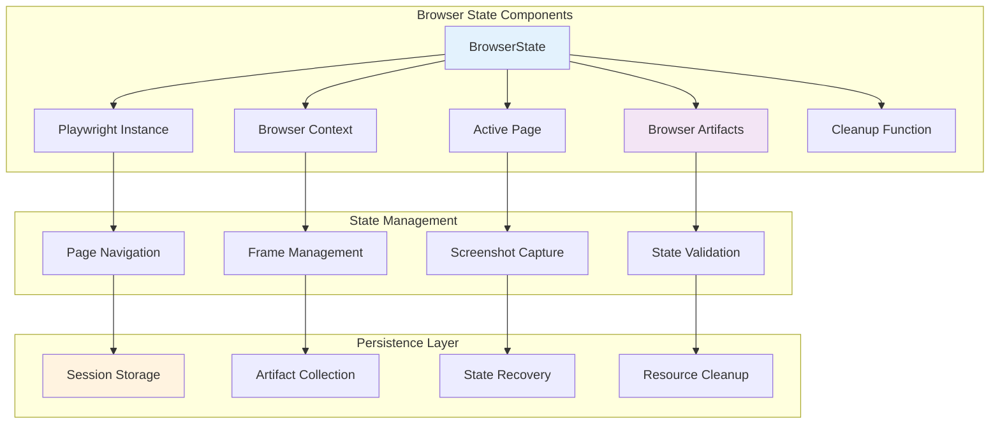
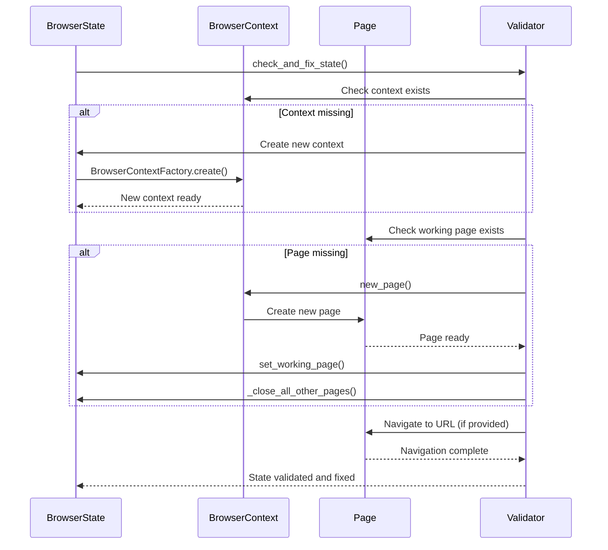
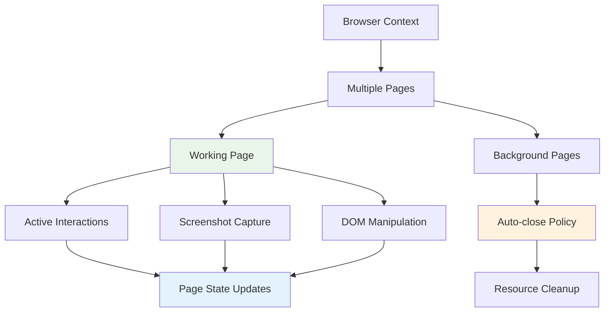
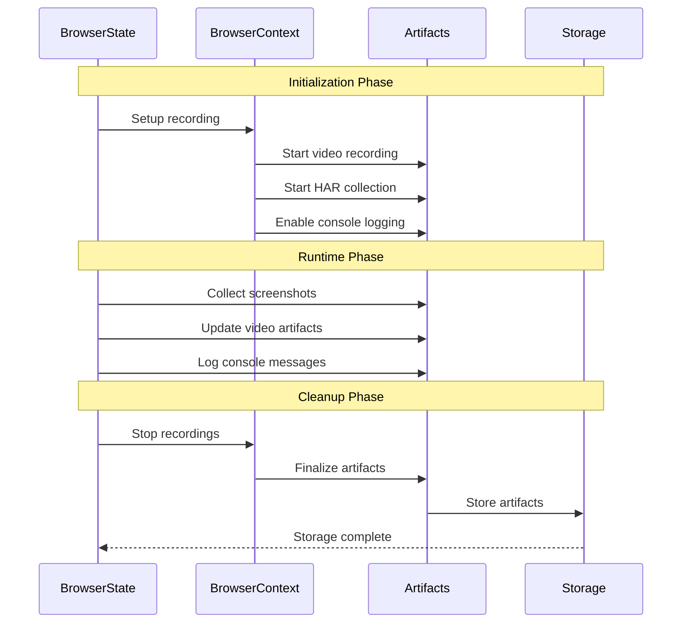
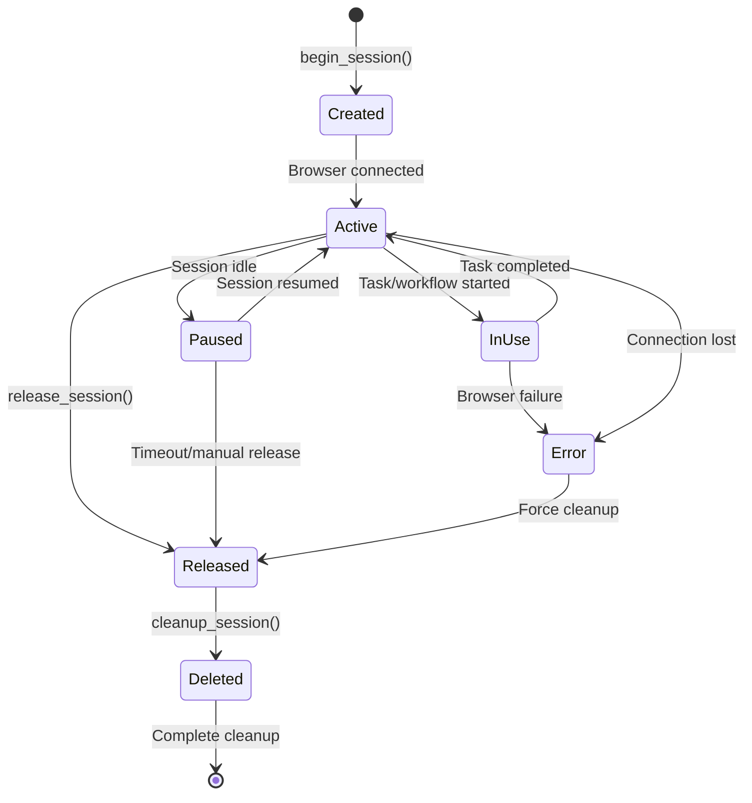
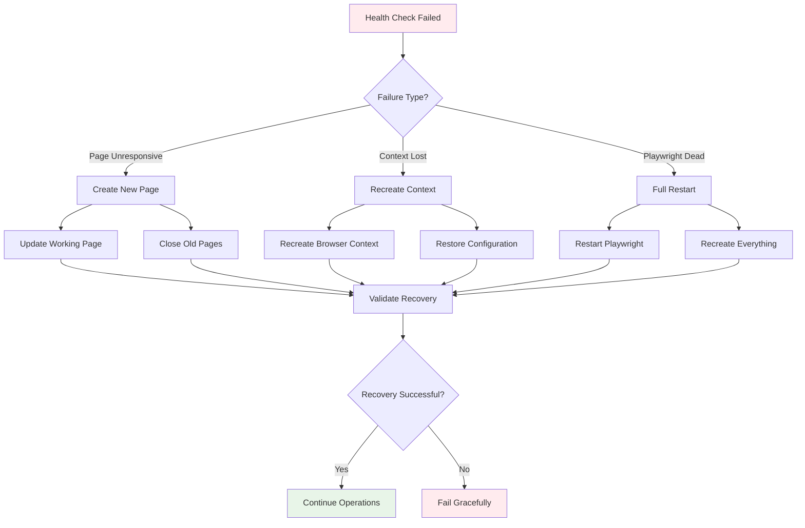
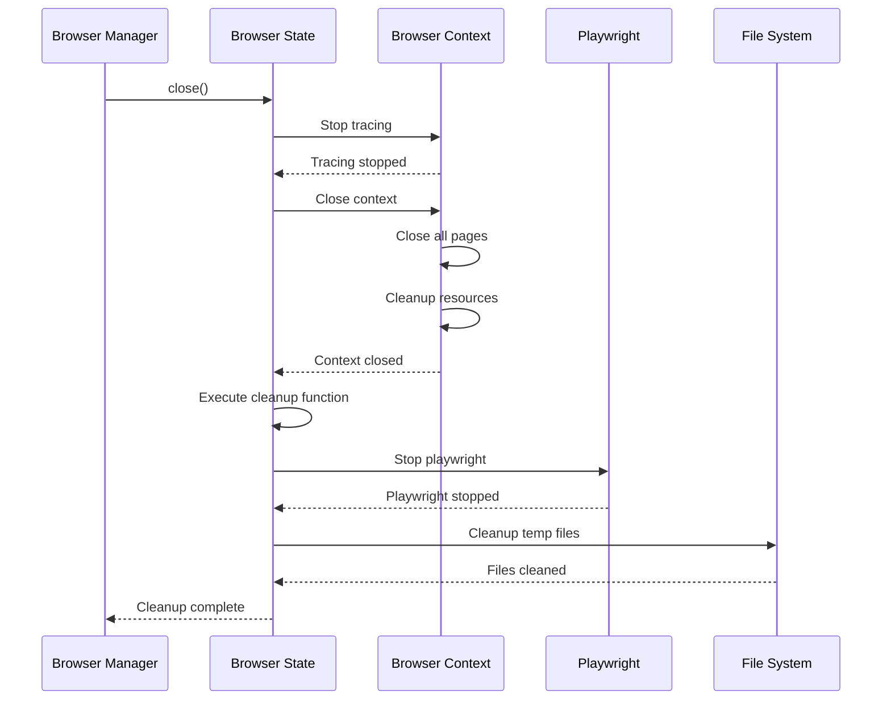

# 📊 Browser State & Persistence Management
## Deep Dive into BrowserState and Session Persistence

---

## 🏗️ Browser State Architecture



---

## 🎯 BrowserState Core Implementation

### **Class Structure & Initialization**
```python
class BrowserState:
    def __init__(
        self,
        pw: Playwright,                          # Playwright instance
        browser_context: BrowserContext | None,  # Browser context
        page: Page | None,                       # Current active page
        browser_artifacts: BrowserArtifacts,     # Artifact collection
        browser_cleanup: BrowserCleanupFunc,     # Cleanup function
    ):
        self.__page = page                       # Private page reference
        self.pw = pw
        self.browser_context = browser_context
        self.browser_artifacts = browser_artifacts
        self.browser_cleanup = browser_cleanup
```

### **State Validation & Recovery**


---

## 🔄 Page Management & Navigation

### **Working Page Management**
```python
async def get_working_page(self) -> Page | None:
    """Get the current active page, validating it's still usable"""
    if self.__page is None:
        return None
    
    try:
        # Test if page is still responsive
        await self.__page.evaluate("() => true")
        return self.__page
    except Exception:
        LOG.warning("Working page is no longer responsive")
        self.__page = None
        return None

async def set_working_page(self, page: Page, index: int) -> None:
    """Set a new working page and update artifacts"""
    self.__page = page
    
    # Update video artifacts if recording enabled
    if page.video:
        video_path = await page.video.path()
        video_artifact = VideoArtifact(video_path=video_path)
        self.browser_artifacts.video_artifacts.append(video_artifact)
```

### **Multi-Page Management**


### **Page Navigation & Retry Logic**
```python
async def navigate_to_url(self, page: Page, url: str, retry_times: int = 3) -> None:
    """Navigate to URL with retry logic and performance monitoring"""
    for retry_time in range(retry_times):
        LOG.info(f"Navigating to {url}", url=url, retry_time=retry_time)
        
        try:
            start_time = time.time()
            await page.goto(url, timeout=settings.BROWSER_LOADING_TIMEOUT_MS)
            end_time = time.time()
            
            LOG.info("Page loading completed", 
                    loading_time=end_time - start_time, url=url)
            
            # Wait for page to stabilize
            await asyncio.sleep(1)
            return
            
        except Exception as e:
            if retry_time == retry_times - 1:
                LOG.error("Failed to navigate after all retries", url=url, error=str(e))
                raise
            
            LOG.warning(f"Navigation failed, retrying", 
                       url=url, retry=retry_time, error=str(e))
            await asyncio.sleep(2)  # Wait before retry
```

---

## 📸 Screenshot & Artifact Management

### **Screenshot Capture System**

```mermaid
graph TB
    subgraph "Screenshot Types"
        A[Lite Screenshots]
        B[Full Page Screenshots]
        C[Scrolling Screenshots]
        D[Post-Action Screenshots]
    end
    
    subgraph "Capture Process"
        E[SkyvernFrame.take_screenshot()]
        F[Element Highlighting]
        G[File Storage]
        H[Artifact Registration]
    end
    
    A --> E
    B --> E
    C --> E
    D --> E
    
    E --> F
    F --> G
    G --> H
    
    style E fill:#e3f2fd
    style H fill:#e8f5e8
```

### **Screenshot Implementation**
```python
async def take_lite_screenshot(
    self,
    file_path: str | None = None,
    use_playwright_fullpage: bool = False,
) -> bytes:
    """Capture lightweight screenshot for debugging"""
    page = await self.__assert_page()
    return await SkyvernFrame.take_scrolling_screenshot(
        page=page,
        file_path=file_path,
        mode=ScreenshotMode.LITE,
        use_playwright_fullpage=use_playwright_fullpage,
    )

async def take_post_action_screenshot(
    self,
    scrolling_number: int,
    file_path: str | None = None,
    use_playwright_fullpage: bool = False,
) -> bytes:
    """Capture screenshot after action execution"""
    page = await self.__assert_page()
    return await SkyvernFrame.take_scrolling_screenshot(
        page=page,
        file_path=file_path,
        mode=ScreenshotMode.LITE,
        scrolling_number=scrolling_number,
        use_playwright_fullpage=use_playwright_fullpage,
    )
```

---

## 🗃️ Browser Artifacts Deep Dive

### **Artifact Types & Management**
```python
@dataclass
class BrowserArtifacts:
    video_artifacts: list[VideoArtifact] = field(default_factory=list)
    har_path: str | None = None                    # Network traffic
    traces_dir: str | None = None                  # Performance traces
    browser_session_dir: str | None = None         # Session data
    browser_console_log_path: str | None = None    # Console logs

    async def read_browser_console_log(self) -> bytes:
        """Read collected console logs"""
        if not self.browser_console_log_path or not os.path.exists(self.browser_console_log_path):
            return b""
        
        with open(self.browser_console_log_path, "rb") as f:
            return f.read()
```

### **Artifact Collection Lifecycle**



---

## 💾 Session Persistence Mechanisms

### **Session Data Structure**
```python
class BrowserSessionResponse(BaseModel):
    browser_session_id: str          # Unique session ID (pbs_*)
    organization_id: str             # Owner organization
    runnable_type: str | None        # Task/workflow type
    runnable_id: str | None          # Associated runnable ID
    timeout: int | None              # Session timeout (minutes)
    started_at: datetime | None      # Session start time
    completed_at: datetime | None    # Session completion time
    created_at: datetime            # Creation timestamp
    modified_at: datetime           # Last modification
    deleted_at: datetime | None     # Deletion timestamp
```

### **Session State Transitions**



---

## 🔧 State Validation & Health Checks

### **Browser Health Monitoring**
```python
async def check_browser_health(self) -> bool:
    """Comprehensive browser health check"""
    try:
        # Check playwright instance
        if not self.pw:
            return False
        
        # Check browser context
        if not self.browser_context:
            return False
        
        # Check working page
        page = await self.get_working_page()
        if not page:
            return False
        
        # Test page responsiveness
        await page.evaluate("() => true")
        
        return True
        
    except Exception as e:
        LOG.warning("Browser health check failed", error=str(e))
        return False
```

### **State Recovery Strategies**



---

## 🧹 Resource Cleanup & Disposal

### **Cleanup Hierarchy**
```python
async def close(self, close_browser_on_completion: bool = True) -> None:
    """Comprehensive cleanup of browser state"""
    try:
        # Stop any active recordings
        if self.browser_context and self.browser_artifacts.traces_dir:
            await self.browser_context.tracing.stop()
        
        # Close browser context
        if self.browser_context and close_browser_on_completion:
            await self.browser_context.close()
        
        # Execute custom cleanup function
        if self.browser_cleanup:
            await self.browser_cleanup()
        
        # Stop playwright
        if self.pw:
            await self.pw.stop()
            
    except Exception as e:
        LOG.warning("Error during browser cleanup", error=str(e))
```

### **Resource Cleanup Flow**



---

## 📊 Performance Metrics & Monitoring

### **Browser State Metrics**
```python
async def get_browser_metrics(self) -> dict:
    """Collect comprehensive browser performance metrics"""
    metrics = {
        "browser_health": await self.check_browser_health(),
        "pages_count": len(self.browser_context.pages) if self.browser_context else 0,
        "artifacts_count": len(self.browser_artifacts.video_artifacts),
        "memory_usage": await self._get_memory_usage(),
        "uptime": self._calculate_uptime(),
    }
    
    # Page-specific metrics
    page = await self.get_working_page()
    if page:
        metrics.update({
            "current_url": page.url,
            "page_title": await page.title(),
            "page_performance": await self._get_page_performance(page),
        })
    
    return metrics

async def _get_page_performance(self, page: Page) -> dict:
    """Get detailed page performance metrics"""
    try:
        return await page.evaluate("""
            () => {
                const navigation = performance.getEntriesByType('navigation')[0];
                return {
                    load_time: navigation.loadEventEnd - navigation.fetchStart,
                    dom_ready: navigation.domContentLoadedEventEnd - navigation.fetchStart,
                    memory_used: performance.memory?.usedJSHeapSize || 0,
                    memory_total: performance.memory?.totalJSHeapSize || 0,
                };
            }
        """)
    except Exception:
        return {}
```

### **Performance Benchmarks**

| Metric | Target | Warning | Critical |
|--------|--------|---------|----------|
| **Page Load Time** | <3s | >5s | >10s |
| **Memory Usage** | <500MB | >1GB | >2GB |
| **Page Count** | 1-3 | >5 | >10 |
| **Artifact Size** | <100MB | >500MB | >1GB |

---

## 🔐 Security & Isolation

### **Session Isolation**
```python
class SessionIsolation:
    """Ensures proper isolation between browser sessions"""
    
    @staticmethod
    async def clear_session_data(browser_context: BrowserContext):
        """Clear sensitive session data"""
        # Clear cookies
        await browser_context.clear_cookies()
        
        # Clear local storage
        for page in browser_context.pages:
            try:
                await page.evaluate("() => localStorage.clear()")
                await page.evaluate("() => sessionStorage.clear()")
            except Exception:
                continue
    
    @staticmethod
    async def validate_session_security(browser_context: BrowserContext) -> bool:
        """Validate session security settings"""
        # Check for secure context requirements
        # Validate CSP headers
        # Ensure proper isolation
        return True
```

---

## 🎯 Key Takeaways

1. **Robust State Management**: Comprehensive validation and recovery mechanisms
2. **Rich Artifact Collection**: Screenshots, videos, traces, and logs
3. **Session Persistence**: Efficient reuse and recovery of browser sessions
4. **Performance Monitoring**: Detailed metrics and health checks
5. **Resource Management**: Proper cleanup and resource disposal
6. **Security & Isolation**: Secure session handling and data protection

**Next: Page & Frame Management Utilities** 🖼️