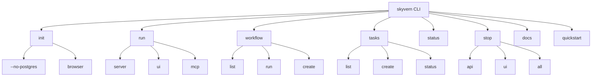

# 🏗️ CLI Architecture Overview

## System Design Philosophy

Skyvern's CLI is built on **Typer** framework, providing a rich, interactive command-line experience with comprehensive automation capabilities.

---

## 🔧 Core Architecture Components

### CLI Application Structure
```
skyvern/cli/
├── commands.py          # Main CLI application & routing
├── init_command.py      # Setup & initialization
├── run_commands.py      # Service management  
├── status.py           # System status checking
├── stop_commands.py    # Service termination
├── docs.py             # Documentation access
├── quickstart.py       # One-command setup
├── workflow.py         # Workflow management
├── tasks.py            # Task management
├── console.py          # Rich console instance
├── database.py         # Database utilities
├── browser.py          # Browser configuration
├── llm_setup.py        # LLM provider setup
├── mcp.py              # MCP server setup
└── utils.py            # CLI utilities
```

---

## 🎯 Command Hierarchy



---

## 🚀 CLI Design Patterns

### 1. **Hierarchical Command Structure**
```python
# Main CLI app with sub-applications
cli_app = typer.Typer(
    help="Skyvern CLI for browser automation",
    no_args_is_help=True,
    rich_markup_mode="rich",
)

# Add sub-applications
cli_app.add_typer(run_app, name="run")
cli_app.add_typer(workflow_app, name="workflow")
cli_app.add_typer(tasks_app, name="tasks")
```

### 2. **Rich Console Integration**
```python
from rich.console import Console
from rich.panel import Panel
from rich.progress import Progress

console = Console()
console.print(Panel("[bold green]Status[/bold green]"))
```

### 3. **Interactive Configuration**
```python
from rich.prompt import Confirm, Prompt

run_local = Confirm.ask(
    "Run locally or in cloud?",
    choices=["local", "cloud"]
)
```

---

## 🎨 User Experience Features

### Rich UI Elements
- **Panels** for status information
- **Progress bars** for long operations
- **Color coding** for success/error states
- **Interactive prompts** for configuration

### Smart Defaults
- **Auto-detection** of system configuration
- **Intelligent fallbacks** for missing dependencies
- **Context-aware** command suggestions

### Error Handling
- **Graceful degradation** when tools unavailable
- **Clear error messages** with resolution hints
- **Retry mechanisms** for network operations

---

## 🔌 Extension Points

### Adding New Commands
```python
# Create new typer app
my_app = typer.Typer(help="My custom commands")

@my_app.command()
def my_command():
    """Custom command implementation."""
    pass

# Add to main CLI
cli_app.add_typer(my_app, name="mycmd")
```

### Custom Utilities
```python
# Add to utils.py or separate module
def my_utility_function():
    """Reusable utility for CLI operations."""
    pass
```

---

## 📊 Architecture Benefits

### Developer Experience
- **Single entry point** for all operations
- **Consistent interface** across commands
- **Rich feedback** during operations
- **Easy extensibility** for new features

### Operational Efficiency
- **Automated setup** reduces manual steps
- **Status monitoring** provides visibility
- **Service management** simplifies deployment
- **Documentation access** improves usability

---

## 🔍 Key Architecture Insights

1. **Modular Design**: Each command group is isolated in separate modules
2. **Rich User Interface**: Leverages Rich library for enhanced UX
3. **Interactive Workflows**: Guides users through complex setup processes
4. **Service Integration**: Seamlessly manages multiple Skyvern services
5. **Cross-Platform Support**: Works across different operating systems

---

*This architecture enables Skyvern to provide a world-class developer experience through its CLI interface.*