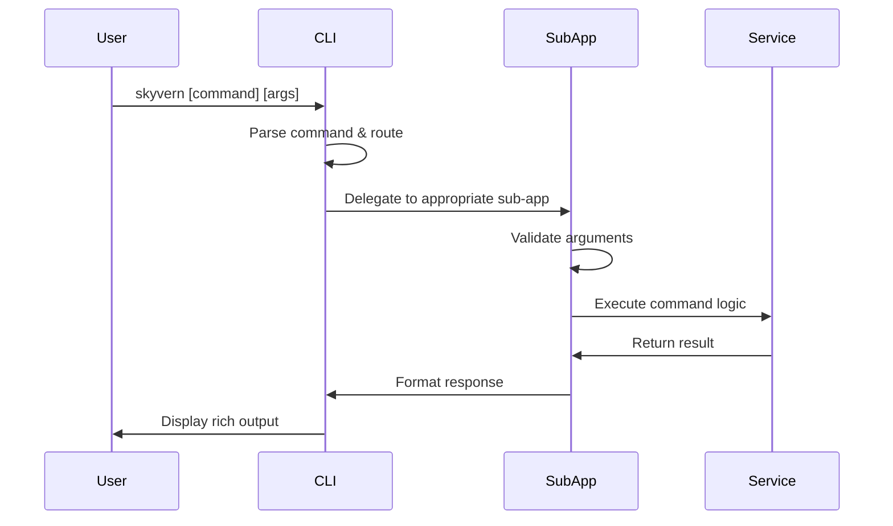

# 🎮 Main CLI Interface Analysis
## `skyvern/cli/commands.py` Deep Dive

---

## 📋 File Purpose & Responsibility

**Primary Role**: Central command router and main CLI application definition
**Key Functions**:
- Define main CLI application structure
- Register all sub-command applications
- Handle global CLI configuration
- Provide unified entry point

---

## 🏗️ Core Structure Analysis

### Main CLI Application Setup
```python
cli_app = typer.Typer(
    help=_build_help_text("""
    Skyvern CLI for browser automation
    """),
    no_args_is_help=True,        # Show help when no args
    rich_markup_mode="rich",     # Enable rich formatting
)
```

### Sub-Application Registration
```python
# Service Management
cli_app.add_typer(run_app, name="run", 
    help="Run Skyvern services like API server, UI, and MCP")

# Workflow Management  
cli_app.add_typer(workflow_app, name="workflow", 
    help="Workflow management commands")

# Task Management
cli_app.add_typer(tasks_app, name="tasks", 
    help="Task management commands")

# Documentation Access
cli_app.add_typer(docs_app, name="docs", 
    help="Open Skyvern documentation")

# System Status
cli_app.add_typer(status_app, name="status", 
    help="Check if Skyvern services are running")

# Service Control
cli_app.add_typer(stop_app, name="stop", 
    help="Stop Skyvern services")

# Initialization
cli_app.add_typer(init_app, name="init", 
    help="Interactively configure Skyvern and its dependencies")

# Quick Setup
cli_app.add_typer(quickstart_app, name="quickstart", 
    help="One-command setup and start for Skyvern")
```

---

## 🔄 Command Flow Sequence



---

## 🎯 Command Categories

### 1. **Setup & Configuration**
```python
# Initialization commands
init_app = typer.Typer(
    invoke_without_command=True,
    help="Interactively configure Skyvern and its dependencies."
)

@init_app.callback()
def init_callback(
    ctx: typer.Context,
    no_postgres: bool = typer.Option(False, "--no-postgres")
) -> None:
    if ctx.invoked_subcommand is None:
        init(no_postgres=no_postgres)
```

### 2. **Service Management**
- `run server` - Start API server
- `run ui` - Start frontend UI
- `run mcp` - Start MCP server
- `status` - Check service status
- `stop` - Stop services

### 3. **Workflow Operations**
- `workflow list` - List workflows
- `workflow run` - Execute workflow
- `workflow create` - Create new workflow

### 4. **Task Management**
- `tasks list` - List tasks
- `tasks create` - Create new task
- `tasks status` - Check task status

---

## 🔧 Technical Implementation Details

### Typer Configuration
```python
# Rich markup support for colorized output
rich_markup_mode="rich"

# Auto-show help when no arguments provided
no_args_is_help=True

# Help text builder for consistent formatting
_build_help_text("""Multi-line help text""")
```

### Error Handling Pattern
```python
try:
    # Command execution
    result = execute_command()
    console.print("[green]Success![/green]")
except SkyvernException as e:
    console.print(f"[red]Error: {e}[/red]")
    raise typer.Exit(1)
```

### Context Management
```python
@command.callback()
def callback(ctx: typer.Context):
    """Handle command context and global options."""
    if ctx.invoked_subcommand is None:
        # Default behavior when no subcommand
        default_action()
```

---

## 📊 Command Usage Patterns

### Interactive vs Non-Interactive
```python
# Interactive mode with prompts
if interactive_mode:
    value = Prompt.ask("Enter value")
    confirm = Confirm.ask("Continue?")

# Non-interactive with CLI args
@app.command()
def command(
    value: str = typer.Option(..., help="Required value"),
    confirm: bool = typer.Option(False, help="Auto-confirm")
):
    pass
```

### Option Patterns
```python
# Boolean flags
no_postgres: bool = typer.Option(False, "--no-postgres")

# Required options
api_key: str = typer.Option(..., help="API key required")

# Optional with defaults  
port: int = typer.Option(8000, help="Port number")

# Choice options
env: str = typer.Option("local", help="Environment", 
    click.Choice(["local", "cloud"]))
```

---

## 🎨 Rich UI Integration

### Progress Indicators
```python
with Progress(
    SpinnerColumn(),
    TextColumn("[progress.description]{task.description}"),
) as progress:
    task = progress.add_task("Processing...", total=100)
    # Long running operation
```

### Status Displays
```python
console.print(Panel(
    "[bold green]Service Status[/bold green]",
    border_style="green"
))

# Conditional styling
status_color = "green" if running else "red"
console.print(f"[{status_color}]Service: {status}[/{status_color}]")
```

---

## 🔍 Key Insights

### Design Philosophy
1. **User-Centric**: Rich, interactive experience
2. **Modular**: Clear separation of concerns
3. **Extensible**: Easy to add new commands
4. **Consistent**: Unified patterns across commands

### Architecture Benefits
1. **Single Entry Point**: All functionality accessible via `skyvern` command
2. **Hierarchical Organization**: Related commands grouped logically
3. **Rich Feedback**: Visual progress and status indicators
4. **Error Resilience**: Graceful handling of failures

### Developer Experience
1. **Self-Documenting**: Built-in help system
2. **Type Safety**: Full typing support with Typer
3. **Testing Friendly**: Clear interfaces for unit testing
4. **Platform Agnostic**: Works across operating systems

---

## 🚀 Extension Strategies

### Adding New Command Groups
```python
# 1. Create new typer app
new_app = typer.Typer(help="New functionality")

# 2. Define commands
@new_app.command()
def new_command():
    pass

# 3. Register with main CLI
cli_app.add_typer(new_app, name="new")
```

### Custom Help Formatting
```python
def _build_help_text(text: str) -> str:
    """Custom help text formatting."""
    return textwrap.dedent(text).strip()
```

---

*The main CLI interface serves as the foundation for Skyvern's developer experience, providing a unified, rich, and extensible command-line interface.*