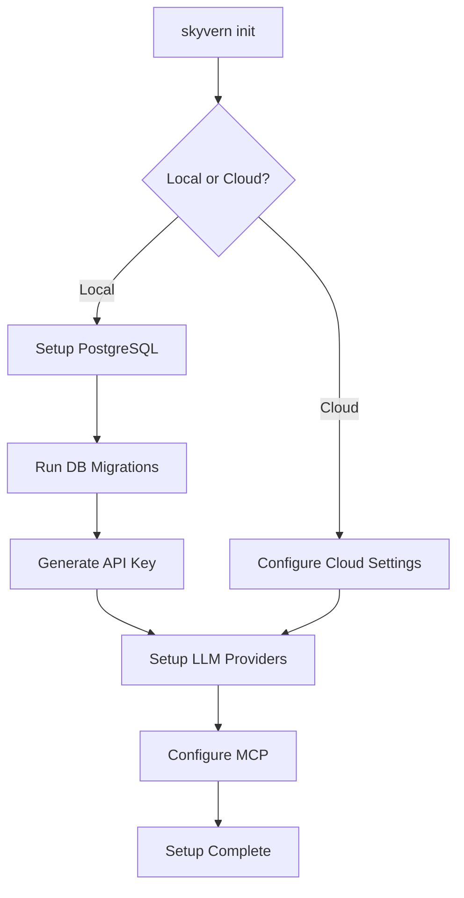
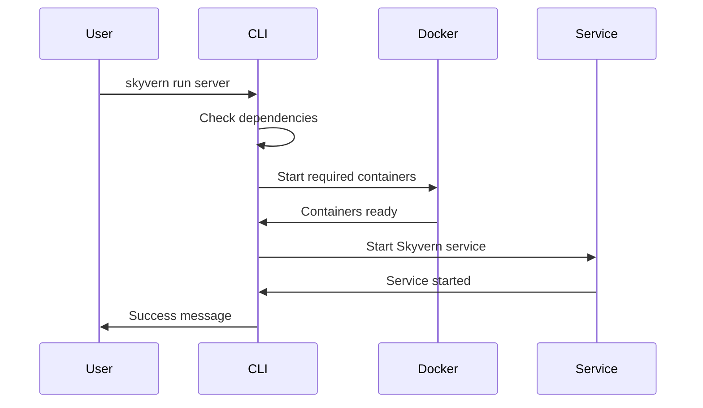
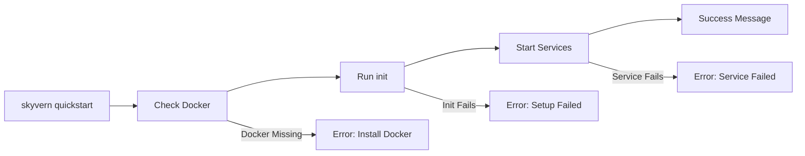
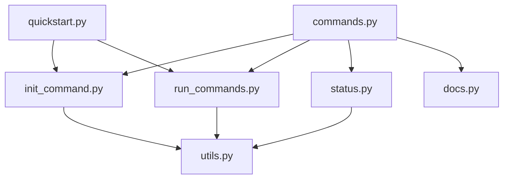

# 🔧 CLI Modules Deep Dive
## Individual Module Analysis

---

## 📁 Module Overview

### CLI Module Structure
```
skyvern/cli/
├── init_command.py      # Setup & Initialization
├── run_commands.py      # Service Management
├── status.py           # Status Checking
├── docs.py             # Documentation Access
├── quickstart.py       # One-command Setup
├── stop_commands.py    # Service Termination
├── workflow.py         # Workflow Management
├── tasks.py            # Task Management
└── utils.py            # CLI Utilities
```

---

## 🚀 1. init_command.py - Setup & Initialization

### Purpose
**Interactive system setup and configuration workflow**

### Key Functions
```python
def init(no_postgres: bool = False) -> None:
    """Interactive initialization command for Skyvern."""
    
def setup_postgresql(no_postgres: bool) -> None:
    """Set up PostgreSQL database."""
    
def setup_llm_providers() -> None:
    """Configure LLM provider settings."""
    
def setup_mcp() -> None:
    """Set up MCP server configuration."""
```

### Initialization Flow


### Interactive Configuration
```python
run_local = Confirm.ask(
    "Would you like to run Skyvern [bold blue]locally[/bold blue] or in the [bold purple]cloud[/bold purple]?",
    default=False,
    choices=["local", "cloud"],
)

if run_local:
    setup_postgresql(no_postgres)
    migrate_db()
    api_key = setup_local_organization()
    setup_llm_providers()
    setup_mcp()
```

---

## ⚡ 2. run_commands.py - Service Management

### Purpose
**Start and manage Skyvern services**

### Service Commands
```python
@run_app.command(name="server")
def run_server() -> None:
    """Run the Skyvern API server."""

@run_app.command(name="ui") 
def run_ui() -> None:
    """Run the Skyvern UI server."""

@run_app.command(name="mcp")
def run_mcp() -> None:
    """Run the MCP server."""
```

### Service Startup Flow


### Async Service Management
```python
async def start_services() -> None:
    """Start all Skyvern services asynchronously."""
    tasks = [
        start_api_server(),
        start_ui_server(),
        start_database()
    ]
    await asyncio.gather(*tasks)
```

---

## 📊 3. status.py - Status Checking

### Purpose
**Monitor health and status of Skyvern components**

### Status Check Implementation
```python
def _check_port(port: int) -> bool:
    """Return True if a local port is accepting connections."""
    try:
        with socket.create_connection(("localhost", port), timeout=0.5):
            return True
    except OSError:
        return False

def _status_table() -> Table:
    """Create rich table showing component status."""
    components = [
        ("API server", _check_port(api_port), "skyvern run server"),
        ("UI server", _check_port(ui_port), "skyvern run ui"),
        ("PostgreSQL", _check_port(db_port), "skyvern init"),
    ]
    # Build rich table...
```

### Status Display
```python
table = Table(title="Skyvern Component Status")
table.add_column("Component", style="bold")
table.add_column("Running")
table.add_column("Start Command")

for name, running, cmd in components:
    status = "[green]Yes[/green]" if running else "[red]No[/red]"
    table.add_row(name, status, cmd)
```

---

## 📚 4. docs.py - Documentation Access

### Purpose
**Provide easy access to Skyvern documentation**

### Implementation
```python
DOCS_URL = "https://docs.skyvern.com"

@docs_app.callback()
def docs_callback(ctx: typer.Context) -> None:
    """Open the Skyvern documentation in a browser."""
    if ctx.invoked_subcommand is None:
        console.print(Panel(
            f"[bold blue]Opening Skyvern docs at [link={DOCS_URL}]{DOCS_URL}[/link][/bold blue]",
            border_style="cyan",
        ))
        webbrowser.open(DOCS_URL)
```

---

## 🎯 5. quickstart.py - One-Command Setup

### Purpose
**Simplified one-command setup and start**

### Quickstart Flow


### Implementation Pattern
```python
@quickstart_app.command()
def quickstart() -> None:
    """Set up and run Skyvern with one command."""
    
    # Check prerequisites
    if not check_docker():
        console.print("[red]Docker is required[/red]")
        return
    
    # Run initialization
    console.print("[bold green]Setting up Skyvern...[/bold green]")
    init(no_postgres=False)
    
    # Start services
    console.print("[bold green]Starting services...[/bold green]")
    start_services()
    
    console.print("[bold green]✅ Skyvern is ready![/bold green]")
```

---

## 🛑 6. stop_commands.py - Service Termination

### Purpose
**Gracefully stop Skyvern services**

### Stop Commands
```python
@stop_app.command(name="api")
def stop_api() -> None:
    """Stop the API server."""

@stop_app.command(name="ui")
def stop_ui() -> None:
    """Stop the UI server."""

@stop_app.command(name="all")
def stop_all() -> None:
    """Stop all Skyvern services."""
```

### Process Management
```python
def get_pids_on_port(port: int) -> List[int]:
    """Return a list of PIDs listening on the given port."""
    pids = []
    for conn in psutil.net_connections(kind="inet"):
        if (conn.laddr and conn.laddr.port == port and 
            conn.pid and conn.status == psutil.CONN_LISTEN):
            pids.append(conn.pid)
    return list(set(pids))

def kill_pids(pids: List[int], service_name: str) -> bool:
    """Kill the given list of PIDs in a cross-platform way."""
    for pid in pids:
        try:
            process = psutil.Process(pid)
            process.terminate()
            process.wait(timeout=5)
        except (psutil.NoSuchProcess, psutil.TimeoutExpired):
            try:
                process.kill()
            except psutil.NoSuchProcess:
                pass
```

---

## 📋 7. workflow.py & tasks.py - Management Commands

### Workflow Management
```python
@workflow_app.command(name="list")
def list_workflows() -> None:
    """List all workflows."""

@workflow_app.command(name="run")
def run_workflow(workflow_id: str) -> None:
    """Run a specific workflow."""

@workflow_app.command(name="create")
def create_workflow() -> None:
    """Create a new workflow."""
```

### Task Management
```python
@tasks_app.command(name="list")
def list_tasks() -> None:
    """List all tasks."""

@tasks_app.command(name="create")
def create_task() -> None:
    """Create a new task."""
```

---

## 🔧 8. utils.py - CLI Utilities

### Common Utilities
```python
def start_services() -> None:
    """Start all required services."""

def check_dependencies() -> bool:
    """Check if all dependencies are available."""

def validate_config() -> bool:
    """Validate current configuration."""

def cleanup_temp_files() -> None:
    """Clean up temporary files."""
```

---

## 🎨 Rich UI Patterns Across Modules

### Consistent Styling
```python
# Success messages
console.print("[green]✅ Operation successful[/green]")

# Error messages  
console.print("[red]❌ Operation failed[/red]")

# Info messages
console.print("[blue]ℹ️ Information[/blue]")

# Panels for major sections
console.print(Panel(
    "[bold green]Setup Complete[/bold green]",
    border_style="green"
))
```

### Progress Indicators
```python
with Progress(
    SpinnerColumn(),
    TextColumn("[progress.description]{task.description}"),
) as progress:
    task = progress.add_task("Initializing...", total=100)
```

---

## 🔍 Module Integration Patterns

### Cross-Module Dependencies


### Shared Resources
- **console.py**: Centralized Rich console instance
- **utils.py**: Common utility functions
- **database.py**: Database management utilities
- **browser.py**: Browser configuration helpers

---

## 🚀 Extension Points

### Adding New Commands
```python
# 1. Create command in appropriate module
@module_app.command()
def new_command():
    """New command description."""
    pass

# 2. Use consistent patterns
def new_command():
    try:
        result = perform_operation()
        console.print("[green]Success![/green]")
    except Exception as e:
        console.print(f"[red]Error: {e}[/red]")
        raise typer.Exit(1)
```

### Custom Utilities
```python
# Add to utils.py or create new utility module
def custom_utility():
    """Custom utility function."""
    pass
```

---

*These CLI modules work together to provide a comprehensive, user-friendly interface for managing Skyvern's development and deployment lifecycle.*