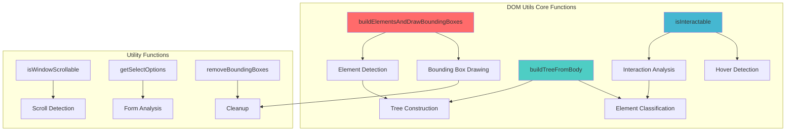
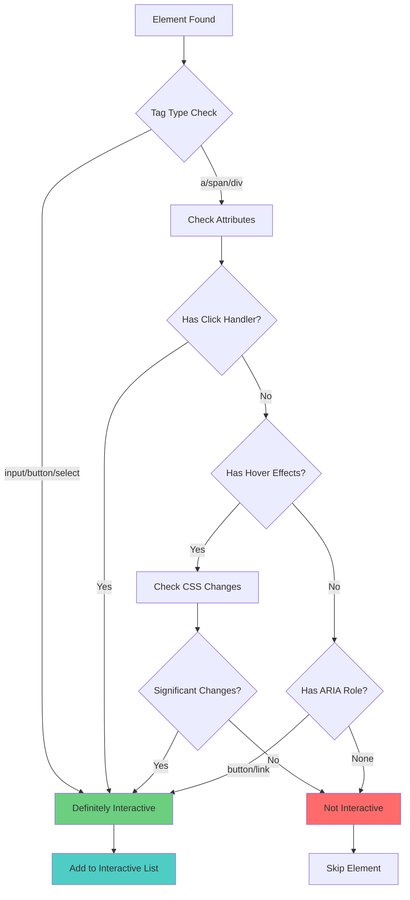
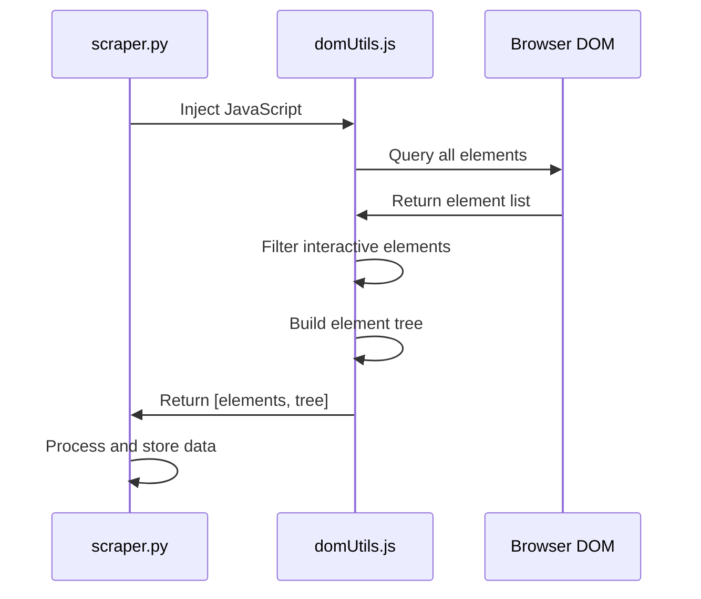

# 🌐 DOM Utilities Engine
## `skyvern/webeye/scraper/domUtils.js` Technical Analysis

---

## 🎯 Core Purpose

The DOM Utilities engine provides **browser-side JavaScript functionality** for:

- **DOM Traversal** - Intelligent element discovery and analysis
- **Element Classification** - Determining interactive vs static elements
- **Bounding Box Calculation** - Visual positioning for AI models
- **Tree Structure Building** - Hierarchical element organization

---

## 🏗️ JavaScript Architecture



---

## 🔍 Element Detection Algorithm

### Interactive Element Classification


---

## ⚡ Core JavaScript Functions

### 1. Element Tree Builder
```javascript
async function buildTreeFromBody() {
    const [elements, treeList] = await buildElementsAndDrawBoundingBoxes("", 0);
    
    // Remove duplicates and build clean tree
    const idToElement = new Map();
    const cleanedTreeList = [];
    
    for (let element of elements) {
        if (!idToElement.has(element.id)) {
            idToElement.set(element.id, element);
        }
    }
    
    return [Array.from(idToElement.values()), cleanedTreeList];
}
```

**Key Features:**
- **Deduplication** - Removes duplicate elements
- **Tree Structure** - Maintains parent-child relationships  
- **Incremental Updates** - Supports dynamic page changes
- **Performance Optimization** - Efficient DOM traversal

---

### 2. Interactive Element Detection
```javascript
function isInteractable(element, hoverMap) {
    // Check basic interactive tags
    const interactiveTags = ['input', 'button', 'select', 'textarea', 'a'];
    if (interactiveTags.includes(element.tagName.toLowerCase())) {
        return true;
    }
    
    // Check for click handlers
    if (hasClickHandler(element)) {
        return true;
    }
    
    // Check for hover effects
    if (hasHoverEffects(element, hoverMap)) {
        return true;
    }
    
    // Check ARIA roles
    const role = element.getAttribute('role');
    if (['button', 'link', 'menuitem'].includes(role)) {
        return true;
    }
    
    return false;
}
```

---

### 3. Bounding Box Management
```javascript
async function buildElementsAndDrawBoundingBoxes(frame, frameIndex) {
    const elements = [];
    const hoverMap = getHoverStylesMap();
    
    // Traverse all elements
    document.querySelectorAll('*').forEach(element => {
        if (isInteractable(element, hoverMap)) {
            const rect = element.getBoundingClientRect();
            
            // Only include visible elements
            if (rect.width > 0 && rect.height > 0) {
                // Draw bounding box
                drawBoundingBox(element, rect);
                
                // Add to elements list
                elements.push(buildElementObject(frame, element, true));
            }
        }
    });
    
    return elements;
}
```

---

## 🎨 Visual Bounding Boxes

### Bounding Box Implementation
```javascript
function drawBoundingBox(element, rect) {
    const box = document.createElement('div');
    box.style.cssText = `
        position: fixed;
        left: ${rect.left}px;
        top: ${rect.top}px;
        width: ${rect.width}px;
        height: ${rect.height}px;
        border: 2px solid red;
        background: rgba(255, 0, 0, 0.1);
        pointer-events: none;
        z-index: 10000;
        box-sizing: border-box;
    `;
    box.className = 'skyvern-bounding-box';
    document.body.appendChild(box);
}

function removeBoundingBoxes() {
    document.querySelectorAll('.skyvern-bounding-box')
        .forEach(box => box.remove());
}
```

---

## 🧩 Element Data Structure

### Element Object Builder
```javascript
async function buildElementObject(frame, element, interactable, purgeable = false) {
    const rect = element.getBoundingClientRect();
    
    return {
        id: generateUniqueId(element),
        tagName: element.tagName.toLowerCase(),
        text: getElementText(element),
        attributes: getElementAttributes(element),
        rect: {
            x: rect.left,
            y: rect.top,
            width: rect.width,
            height: rect.height
        },
        interactable: interactable,
        frame: frame,
        children: [],
        purgeable: purgeable
    };
}
```

### Attribute Extraction
```javascript
function getElementAttributes(element) {
    const attributes = {};
    const reservedAttrs = [
        'id', 'class', 'type', 'name', 'value', 'placeholder',
        'href', 'src', 'alt', 'title', 'role', 'aria-label'
    ];
    
    for (const attr of element.attributes) {
        if (reservedAttrs.includes(attr.name)) {
            attributes[attr.name] = attr.value;
        }
    }
    
    return attributes;
}
```

---

## 🔄 Scroll & Page Management

### Scroll Detection
```javascript
function isWindowScrollable() {
    return document.documentElement.scrollHeight > window.innerHeight ||
           document.body.scrollHeight > window.innerHeight;
}

async function scrollToNextPage(drawBoxes, frame, frameIndex, needOverlap) {
    const currentScrollY = window.scrollY;
    const viewportHeight = window.innerHeight;
    const scrollAmount = needOverlap ? viewportHeight * 0.8 : viewportHeight;
    
    window.scrollBy(0, scrollAmount);
    await new Promise(resolve => setTimeout(resolve, 1000));
    
    if (drawBoxes) {
        removeBoundingBoxes();
        await buildElementsAndDrawBoundingBoxes(frame, frameIndex);
    }
    
    return window.scrollY;
}
```

---

## 🎯 Hover Effects Detection

### CSS Hover Analysis
```javascript
function getHoverStylesMap() {
    const hoverMap = new Map();
    
    // Analyze all CSS rules for hover effects
    for (const stylesheet of document.styleSheets) {
        try {
            for (const rule of stylesheet.cssRules) {
                if (rule.selectorText && rule.selectorText.includes(':hover')) {
                    const selector = rule.selectorText.replace(':hover', '');
                    const elements = document.querySelectorAll(selector);
                    
                    elements.forEach(element => {
                        hoverMap.set(element, rule.style);
                    });
                }
            }
        } catch (e) {
            // Handle cross-origin stylesheets
            console.warn('Cannot access stylesheet:', e);
        }
    }
    
    return hoverMap;
}

function hasHoverEffects(element, hoverMap) {
    if (hoverMap.has(element)) {
        const hoverStyle = hoverMap.get(element);
        
        // Check for significant visual changes
        const significantProperties = [
            'background-color', 'color', 'border',
            'transform', 'box-shadow', 'opacity'
        ];
        
        return significantProperties.some(prop => 
            hoverStyle.getPropertyValue(prop)
        );
    }
    
    return false;
}
```

---

## 🔧 Form Element Handling

### Select Options Extraction
```javascript
function getSelectOptions(selectElement) {
    const options = [];
    let selectedValue = '';
    
    selectElement.querySelectorAll('option').forEach((option, index) => {
        options.push({
            optionIndex: index,
            text: option.textContent.trim(),
            value: option.value,
            selected: option.selected
        });
        
        if (option.selected) {
            selectedValue = option.value;
        }
    });
    
    return [options, selectedValue];
}
```

---

## 🌳 Tree Structure Management

### Hierarchical Tree Building
```javascript
async function removeDupAndConcatChildren(treeHeadElement) {
    const idToElement = new Map();
    
    function processElement(element) {
        if (!idToElement.has(element.id)) {
            idToElement.set(element.id, element);
            
            // Process children recursively
            if (element.children) {
                element.children.forEach(child => processElement(child));
            }
        }
    }
    
    processElement(treeHeadElement);
    return Array.from(idToElement.values());
}
```

---

## 🔍 Element Relationship Detection

### Parent-Child Relationships
```javascript
function isParent(parentElement, childElement) {
    return parentElement.contains(childElement);
}

function isSibling(element1, element2) {
    return element1.parentElement === element2.parentElement;
}
```

---

## ⚡ Performance Optimizations

### Efficient DOM Traversal


### Memory Management
- **Element deduplication** to prevent memory bloat
- **Efficient CSS rule parsing** with error handling
- **Cleanup functions** for bounding boxes and event listeners

---

## 📊 Integration with Python Layer

### Data Flow to Python


---

## 🛠️ Debugging & Development

### Console Logging
```javascript
function _jsConsoleLog(data) {
    console.log('[SKYVERN]', JSON.stringify(data, null, 2));
}

// Usage examples:
const [elements, tree] = await buildTreeFromBody();
_jsConsoleLog(elements);  // All elements
_jsConsoleLog(tree);      // Tree structure
```

---

## 📋 Key Functions Reference

| Function | Purpose | Returns |
|----------|---------|---------|
| `buildTreeFromBody()` | Main tree builder | `[elements, tree]` |
| `isInteractable()` | Element classification | `boolean` |
| `buildElementsAndDrawBoundingBoxes()` | Visual detection | `elements[]` |
| `getSelectOptions()` | Form analysis | `[options, selected]` |
| `scrollToNextPage()` | Page navigation | `scroll_position` |

---

## 🔗 Next: Artifact Management

Continue to **[Artifact Management](04-artifact-management.md)** to understand how Skyvern stores and manages screenshots, element data, and other artifacts.