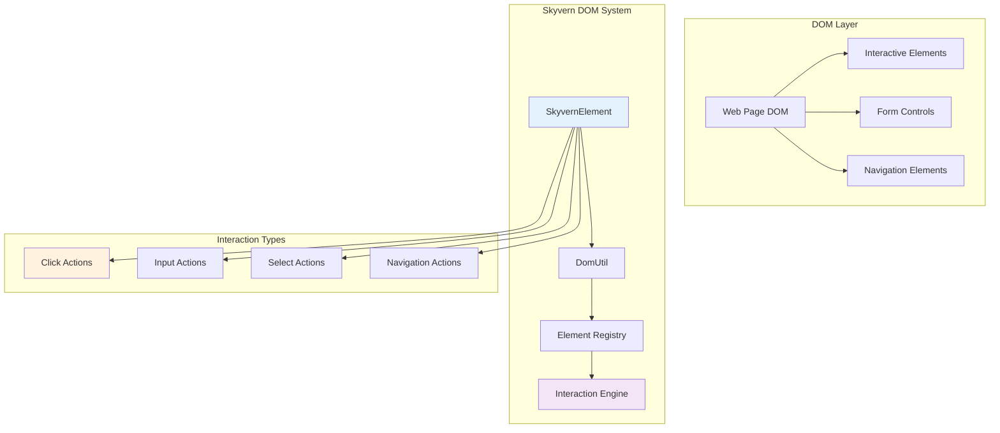
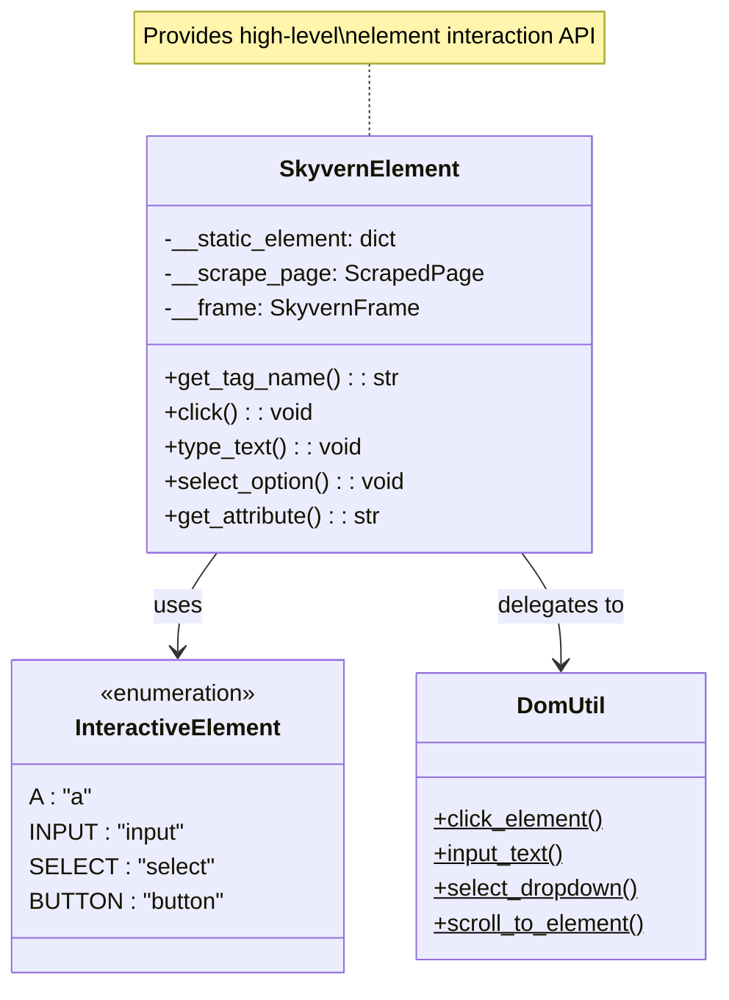
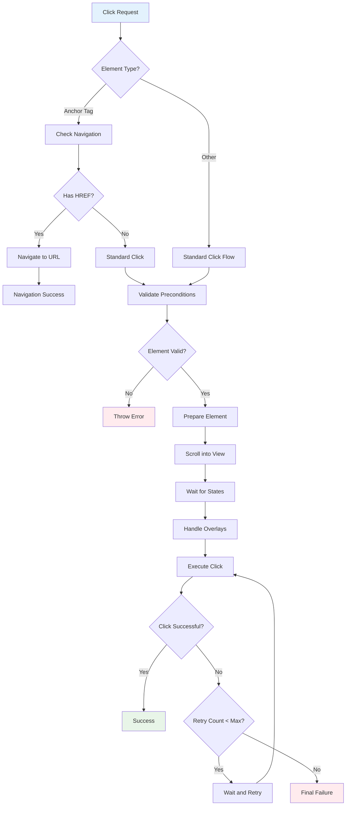
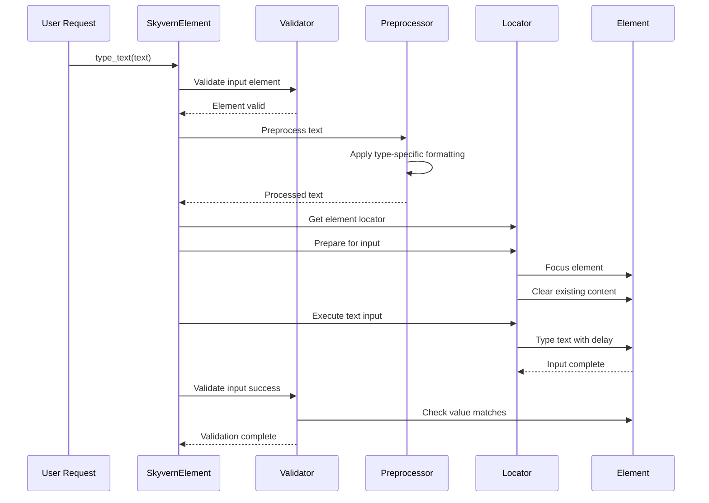
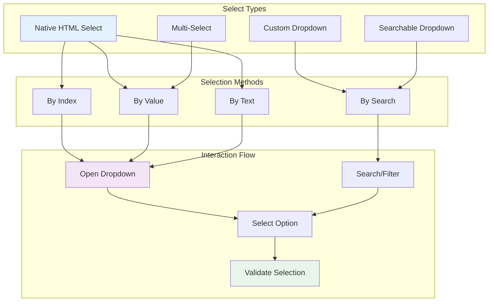
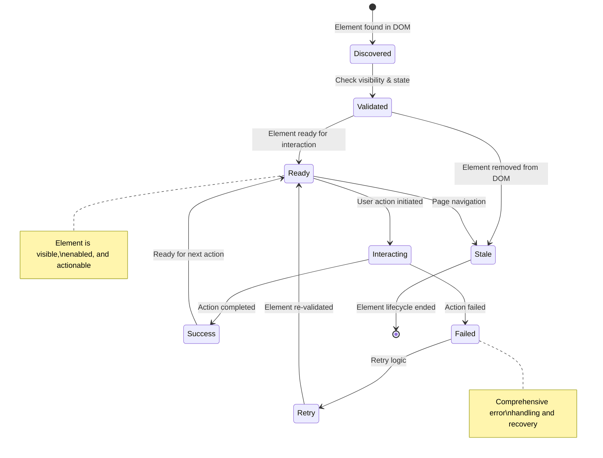

# 🔧 DOM Utilities & Element Interaction
## Deep Dive into SkyvernElement and DOM Manipulation

---

## 🏗️ DOM Interaction Architecture



---

## 🎯 SkyvernElement Core Implementation

### **Element Abstraction Layer**
```python
class SkyvernElement:
    """Python interface for interacting with JavaScript elements"""
    
    def __init__(
        self,
        static_element: dict,
        scrape_page: ScrapedPage,
        frame: SkyvernFrame
    ):
        self.__static_element = static_element
        self.__scrape_page = scrape_page
        self.__frame = frame
        self._locator: Locator | None = None
        self._attributes = static_element.get("attributes", {})
    
    def get_tag_name(self) -> str:
        """Get element tag name"""
        return self.__static_element.get("tagName", "").lower()
    
    def get_element_id(self) -> str:
        """Get unique element identifier"""
        return self.__static_element.get("id", "")
    
    def get_locator(self) -> Locator:
        """Get Playwright locator for element"""
        if self._locator is None:
            css_selector = self.__scrape_page.id_to_css_dict.get(self.get_element_id())
            if not css_selector:
                raise MissingElementInCSSMap(element_id=self.get_element_id())
            
            self._locator, _ = await resolve_locator(
                self.__scrape_page,
                self.__frame.get_frame(),
                self.__static_element.get("frame", "main.frame"),
                css_selector
            )
        
        return self._locator
```

### **Element Type Classification**



---

## 🖱️ Click Interaction System

### **Advanced Click Implementation**
```python
async def click(
    self,
    timeout: float = settings.BROWSER_ACTION_TIMEOUT_MS,
    modifiers: list[str] | None = None,
    coordinate: tuple[float, float] | None = None
) -> None:
    """Advanced click with retry logic and coordination"""
    
    # Pre-click validation
    await self._validate_click_preconditions()
    
    # Handle special anchor tag navigation
    if self.get_tag_name() == InteractiveElement.A:
        navigation_result = await self.navigate_to_a_href(self.__frame.get_frame())
        if navigation_result:
            return  # Navigation completed instead of click
    
    # Get element locator
    locator = self.get_locator()
    
    # Ensure element is ready for interaction
    await self._prepare_element_for_click(locator, timeout)
    
    # Perform click with retry mechanism
    await self._execute_click_with_retry(locator, timeout, modifiers, coordinate)

async def _validate_click_preconditions(self) -> None:
    """Validate element is clickable"""
    # Check if element is disabled
    if await self.is_disabled():
        raise InteractWithDisabledElement(element_id=self.get_element_id())
    
    # Verify element exists in DOM
    if not await self.is_element_in_dom():
        raise MissingElement(element_id=self.get_element_id())

async def _prepare_element_for_click(self, locator: Locator, timeout: float) -> None:
    """Prepare element for click interaction"""
    # Scroll element into view
    await locator.scroll_into_view_if_needed()
    
    # Wait for element states
    await locator.wait_for(state="visible", timeout=timeout)
    await locator.wait_for(state="attached", timeout=timeout)
    
    # Handle potential overlays
    await self._handle_overlapping_elements()

async def _execute_click_with_retry(
    self,
    locator: Locator,
    timeout: float,
    modifiers: list[str] | None,
    coordinate: tuple[float, float] | None
) -> None:
    """Execute click with intelligent retry logic"""
    max_retries = 3
    retry_delay = 1.0
    
    for attempt in range(max_retries):
        try:
            click_options = {"timeout": timeout}
            
            if modifiers:
                click_options["modifiers"] = modifiers
            
            if coordinate:
                click_options["position"] = {"x": coordinate[0], "y": coordinate[1]}
            
            await locator.click(**click_options)
            
            # Validate click success
            await self._validate_click_success()
            return
            
        except TimeoutError as e:
            if attempt == max_retries - 1:
                LOG.error(f"Click failed after {max_retries} attempts")
                raise e
            
            LOG.warning(f"Click attempt {attempt + 1} failed, retrying...")
            await asyncio.sleep(retry_delay)
            retry_delay *= 1.5  # Exponential backoff
```

### **Click Flow Diagram**



---

## ⌨️ Text Input System

### **Intelligent Text Input**
```python
async def type_text(
    self,
    text: str,
    delay: float = TEXT_INPUT_DELAY,
    clear_first: bool = True,
    input_method: str = "type"
) -> None:
    """Advanced text input with validation and preprocessing"""
    
    # Validate input element
    if not self._is_text_input_element():
        raise InvalidElementForTextInput(element_id=self.get_element_id())
    
    # Preprocess text based on input type
    processed_text = await self._preprocess_input_text(text)
    
    # Get element locator
    locator = self.get_locator()
    
    # Prepare element for input
    await self._prepare_element_for_input(locator)
    
    # Clear existing content if needed
    if clear_first:
        await self._clear_input_field(locator)
    
    # Execute text input
    await self._execute_text_input(locator, processed_text, delay, input_method)
    
    # Validate input success
    await self._validate_input_success(processed_text)

def _is_text_input_element(self) -> bool:
    """Check if element accepts text input"""
    tag_name = self.get_tag_name()
    
    if tag_name == "textarea":
        return True
    
    if tag_name == "input":
        input_type = self.get_attribute("type", "text").lower()
        return input_type in ["text", "email", "password", "search", "url", "tel", "number"]
    
    # Check for contenteditable
    if self.get_attribute("contenteditable") == "true":
        return True
    
    return False

async def _preprocess_input_text(self, text: str) -> str:
    """Preprocess text based on input type and constraints"""
    input_type = self.get_attribute("type", "text").lower()
    
    if input_type == "email":
        # Validate email format
        if "@" not in text:
            LOG.warning(f"Invalid email format: {text}")
        return text.lower().strip()
    
    elif input_type == "number":
        # Extract numeric value
        import re
        numeric_text = re.sub(r'[^\d.-]', '', text)
        return numeric_text
    
    elif input_type == "tel":
        # Format phone number
        import re
        phone_digits = re.sub(r'[^\d]', '', text)
        return phone_digits
    
    elif input_type == "password":
        # Handle special password requirements
        return text  # Keep original for passwords
    
    else:
        # Standard text processing
        return text.strip()

async def _execute_text_input(
    self,
    locator: Locator,
    text: str,
    delay: float,
    input_method: str
) -> None:
    """Execute text input with specified method"""
    
    if input_method == "fill":
        # Fast fill method (Playwright native)
        await locator.fill(text)
    
    elif input_method == "type":
        # Character-by-character typing with delay
        await locator.type(text, delay=delay)
    
    elif input_method == "paste":
        # Simulate paste operation
        await locator.focus()
        await self.__frame.get_frame().evaluate(
            f"(element) => {{ element.value = '{text}'; element.dispatchEvent(new Event('input')); }}",
            await locator.element_handle()
        )
    
    else:
        raise ValueError(f"Unknown input method: {input_method}")
```

### **Text Input Flow**



---

## 📋 Select Dropdown System

### **Advanced Select Handling**
```python
async def select_option(
    self,
    option_value: str | None = None,
    option_text: str | None = None,
    option_index: int | None = None,
    search_text: str | None = None
) -> None:
    """Advanced select option handling with multiple selection methods"""
    
    if self.get_tag_name() != InteractiveElement.SELECT:
        # Handle custom dropdowns
        return await self._handle_custom_dropdown(option_value, option_text, search_text)
    
    # Handle native select elements
    await self._handle_native_select(option_value, option_text, option_index)

async def _handle_native_select(
    self,
    option_value: str | None,
    option_text: str | None,
    option_index: int | None
) -> None:
    """Handle native HTML select elements"""
    locator = self.get_locator()
    
    # Refresh select options to get current state
    options, current_value = await self.refresh_select_options()
    
    if option_index is not None:
        # Select by index
        if 0 <= option_index < len(options):
            await locator.select_option(index=option_index)
        else:
            raise ValueError(f"Option index {option_index} out of range")
    
    elif option_value is not None:
        # Select by value
        await locator.select_option(value=option_value)
    
    elif option_text is not None:
        # Select by visible text
        await locator.select_option(label=option_text)
    
    else:
        raise ValueError("Must specify option_value, option_text, or option_index")

async def _handle_custom_dropdown(
    self,
    option_value: str | None,
    option_text: str | None,
    search_text: str | None
) -> None:
    """Handle custom dropdown implementations"""
    
    # Click to open dropdown
    await self.click()
    
    # Wait for dropdown options to appear
    await asyncio.sleep(0.5)
    
    if search_text:
        # Handle searchable dropdowns
        await self._handle_searchable_dropdown(search_text)
    
    # Find and click the target option
    option_selector = self._build_option_selector(option_value, option_text)
    
    try:
        option_locator = self.__frame.get_frame().locator(option_selector)
        await option_locator.click(timeout=5000)
    except TimeoutError:
        LOG.error(f"Could not find dropdown option: {option_selector}")
        raise MissingElement(f"Dropdown option: {option_selector}")

async def refresh_select_options(self) -> tuple[list, str]:
    """Refresh and return current select options"""
    if self.get_tag_name() != InteractiveElement.SELECT:
        return [], ""
    
    frame = await SkyvernFrame.create_instance(self.__frame.get_frame())
    element_handle = await self.get_locator().element_handle()
    
    options, selected_value = await frame.get_select_options(element_handle)
    
    # Update cached options
    self.__static_element["options"] = options
    if "attributes" in self.__static_element:
        self.__static_element["attributes"]["selected"] = selected_value
        self._attributes = self.__static_element["attributes"]
    
    return options, selected_value
```

### **Select Interaction Types**



---

## 🔍 Element Discovery & Validation

### **Element State Validation**
```python
async def is_element_in_dom(self) -> bool:
    """Check if element still exists in DOM"""
    try:
        locator = self.get_locator()
        await locator.wait_for(state="attached", timeout=1000)
        return True
    except TimeoutError:
        return False

async def is_visible(self) -> bool:
    """Check if element is visible to user"""
    try:
        locator = self.get_locator()
        return await locator.is_visible()
    except Exception:
        return False

async def is_enabled(self) -> bool:
    """Check if element is enabled for interaction"""
    try:
        locator = self.get_locator()
        return await locator.is_enabled()
    except Exception:
        return False

async def is_disabled(self) -> bool:
    """Check if element is disabled"""
    return not await self.is_enabled()

async def get_bounding_box(self) -> dict | None:
    """Get element bounding box coordinates"""
    try:
        locator = self.get_locator()
        return await locator.bounding_box()
    except Exception:
        return None
```

### **Element Relationship Analysis**
```python
async def calculate_min_x_distance_to(
    self,
    target_locator: Locator,
    timeout: float = settings.BROWSER_ACTION_TIMEOUT_MS
) -> float:
    """Calculate minimum horizontal distance to another element"""
    
    self_rect = await self.get_locator().bounding_box(timeout=timeout)
    target_rect = await target_locator.bounding_box(timeout=timeout)
    
    if self_rect is None or target_rect is None:
        return float("inf")
    
    # Calculate horizontal overlap/distance
    x_1 = self_rect["x"] + self_rect["width"] - target_rect["x"]
    x_2 = self_rect["x"] - (target_rect["x"] + target_rect["width"])
    
    # If x1 * x2 <= 0, elements are overlapping horizontally
    if x_1 * x_2 <= 0:
        return 0
    
    return min(abs(x_1), abs(x_2))

async def is_next_to_element(
    self,
    target_locator: Locator,
    max_x_distance: float = 0,
    max_y_distance: float = 0,
    timeout: float = settings.BROWSER_ACTION_TIMEOUT_MS,
) -> bool:
    """Check if element is positioned next to another element"""
    
    if max_x_distance > 0:
        x_distance = await self.calculate_min_x_distance_to(target_locator, timeout)
        if x_distance > max_x_distance:
            return False
    
    if max_y_distance > 0:
        y_distance = await self.calculate_min_y_distance_to(target_locator, timeout)
        if y_distance > max_y_distance:
            return False
    
    return True
```

---

## 🎯 DomUtil - Core DOM Operations

### **High-Level DOM Utilities**
```python
class DomUtil:
    """High-level DOM interaction utilities"""
    
    @staticmethod
    async def click_element(
        element: SkyvernElement,
        timeout: float = settings.BROWSER_ACTION_TIMEOUT_MS
    ) -> None:
        """Click element with comprehensive error handling"""
        try:
            await element.click(timeout=timeout)
        except Exception as e:
            # Enhanced error context
            element_info = {
                "id": element.get_element_id(),
                "tag": element.get_tag_name(),
                "visible": await element.is_visible(),
                "enabled": await element.is_enabled(),
            }
            LOG.error(f"Click failed for element {element_info}: {e}")
            raise
    
    @staticmethod
    async def input_text_to_element(
        element: SkyvernElement,
        text: str,
        clear_first: bool = True
    ) -> None:
        """Input text with validation and error handling"""
        if not element._is_text_input_element():
            raise InvalidElementForTextInput(element_id=element.get_element_id())
        
        try:
            await element.type_text(text, clear_first=clear_first)
        except Exception as e:
            LOG.error(f"Text input failed for element {element.get_element_id()}: {e}")
            raise
    
    @staticmethod
    async def select_dropdown_option(
        element: SkyvernElement,
        option_text: str | None = None,
        option_value: str | None = None
    ) -> None:
        """Select dropdown option with fallback strategies"""
        try:
            await element.select_option(
                option_text=option_text,
                option_value=option_value
            )
        except Exception as e:
            # Try alternative selection methods
            await DomUtil._try_alternative_selection(element, option_text, option_value)
    
    @staticmethod
    async def scroll_element_into_view(
        element: SkyvernElement,
        behavior: str = "smooth"
    ) -> None:
        """Scroll element into view with customizable behavior"""
        locator = element.get_locator()
        
        try:
            await locator.scroll_into_view_if_needed()
        except Exception:
            # Fallback to JavaScript scroll
            await element._SkyvernElement__frame.get_frame().evaluate(
                f"""(element) => {{
                    element.scrollIntoView({{
                        behavior: '{behavior}',
                        block: 'center',
                        inline: 'center'
                    }});
                }}""",
                await locator.element_handle()
            )
```

### **Element State Transitions**



---

## 🚀 Performance Optimizations

### **Element Caching Strategy**
```python
class ElementCache:
    """Cache element locators and state for performance"""
    
    def __init__(self, max_size: int = 1000):
        self._locator_cache: dict[str, Locator] = {}
        self._state_cache: dict[str, dict] = {}
        self._max_size = max_size
        self._access_times: dict[str, float] = {}
    
    def get_locator(self, element_id: str) -> Locator | None:
        """Get cached locator if available"""
        if element_id in self._locator_cache:
            self._access_times[element_id] = time.time()
            return self._locator_cache[element_id]
        return None
    
    def cache_locator(self, element_id: str, locator: Locator) -> None:
        """Cache element locator with LRU eviction"""
        if len(self._locator_cache) >= self._max_size:
            self._evict_oldest_entry()
        
        self._locator_cache[element_id] = locator
        self._access_times[element_id] = time.time()
    
    def _evict_oldest_entry(self) -> None:
        """Evict least recently used entry"""
        if not self._access_times:
            return
        
        oldest_id = min(self._access_times.keys(), 
                       key=lambda k: self._access_times[k])
        
        self._locator_cache.pop(oldest_id, None)
        self._state_cache.pop(oldest_id, None)
        self._access_times.pop(oldest_id, None)
```

### **Batch Element Operations**
```python
async def batch_element_validation(elements: list[SkyvernElement]) -> dict[str, bool]:
    """Validate multiple elements in parallel"""
    
    async def validate_single_element(element: SkyvernElement) -> tuple[str, bool]:
        try:
            element_id = element.get_element_id()
            is_valid = await element.is_element_in_dom() and await element.is_visible()
            return element_id, is_valid
        except Exception:
            return element.get_element_id(), False
    
    # Run validations in parallel
    tasks = [validate_single_element(element) for element in elements]
    results = await asyncio.gather(*tasks, return_exceptions=True)
    
    # Process results
    validation_results = {}
    for result in results:
        if isinstance(result, tuple):
            element_id, is_valid = result
            validation_results[element_id] = is_valid
        else:
            # Handle exceptions
            LOG.warning(f"Element validation failed: {result}")
    
    return validation_results
```

---

## 🛡️ Error Handling & Recovery

### **Comprehensive Error Recovery**
```python
class ElementInteractionError(Exception):
    """Base exception for element interaction failures"""
    
    def __init__(self, element_id: str, operation: str, details: str = ""):
        self.element_id = element_id
        self.operation = operation
        self.details = details
        super().__init__(f"Element {element_id} failed {operation}: {details}")

async def safe_element_interaction(
    element: SkyvernElement,
    operation: callable,
    max_retries: int = 3,
    retry_delay: float = 1.0
) -> any:
    """Execute element interaction with retry logic and error recovery"""
    
    last_exception = None
    
    for attempt in range(max_retries):
        try:
            # Validate element state before operation
            if not await element.is_element_in_dom():
                raise ElementInteractionError(
                    element.get_element_id(),
                    operation.__name__,
                    "Element not in DOM"
                )
            
            if not await element.is_visible():
                # Try to scroll element into view
                await element.get_locator().scroll_into_view_if_needed()
                await asyncio.sleep(0.5)
            
            # Execute the operation
            result = await operation()
            return result
            
        except Exception as e:
            last_exception = e
            LOG.warning(
                f"Element interaction attempt {attempt + 1} failed: {e}",
                element_id=element.get_element_id(),
                operation=operation.__name__
            )
            
            if attempt < max_retries - 1:
                await asyncio.sleep(retry_delay)
                retry_delay *= 1.5  # Exponential backoff
    
    # All retries failed
    raise ElementInteractionError(
        element.get_element_id(),
        operation.__name__,
        f"Failed after {max_retries} attempts: {last_exception}"
    )
```

---

## 📊 Performance Metrics

### **DOM Operation Benchmarks**

| Operation | Target Time | Warning Threshold | Critical Threshold |
|-----------|-------------|-------------------|-------------------|
| **Element Location** | <100ms | >500ms | >1000ms |
| **Click Action** | <200ms | >1000ms | >2000ms |
| **Text Input** | <300ms | >1500ms | >3000ms |
| **Select Option** | <400ms | >2000ms | >4000ms |
| **Validation Check** | <50ms | >200ms | >500ms |

### **Memory Usage Optimization**
```python
DOM_PERFORMANCE_CONFIG = {
    "element_cache_size": 1000,           # Max cached elements
    "locator_timeout": 15000,             # Locator timeout (ms)
    "batch_validation_size": 50,          # Max elements per batch
    "retry_max_attempts": 3,              # Max retry attempts
    "retry_base_delay": 1000,             # Base retry delay (ms)
    "scroll_behavior": "smooth",          # Scroll animation
    "interaction_delay": 100,             # Delay between interactions
}
```

---

## 🎯 Key Takeaways

1. **Comprehensive Element Interface**: SkyvernElement provides unified DOM interaction API
2. **Intelligent Input Handling**: Type-aware text processing and validation
3. **Advanced Select Support**: Both native and custom dropdown handling
4. **Robust Error Recovery**: Multi-level retry logic with exponential backoff
5. **Performance Optimization**: Element caching and batch operations
6. **State Management**: Comprehensive element validation and state tracking

**Next: Browser Configuration & Settings** ⚙️