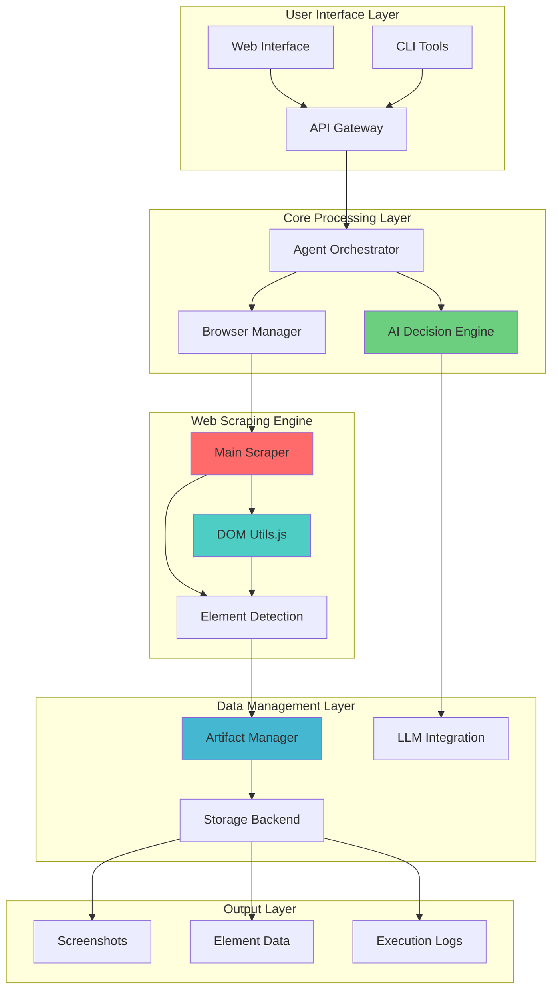
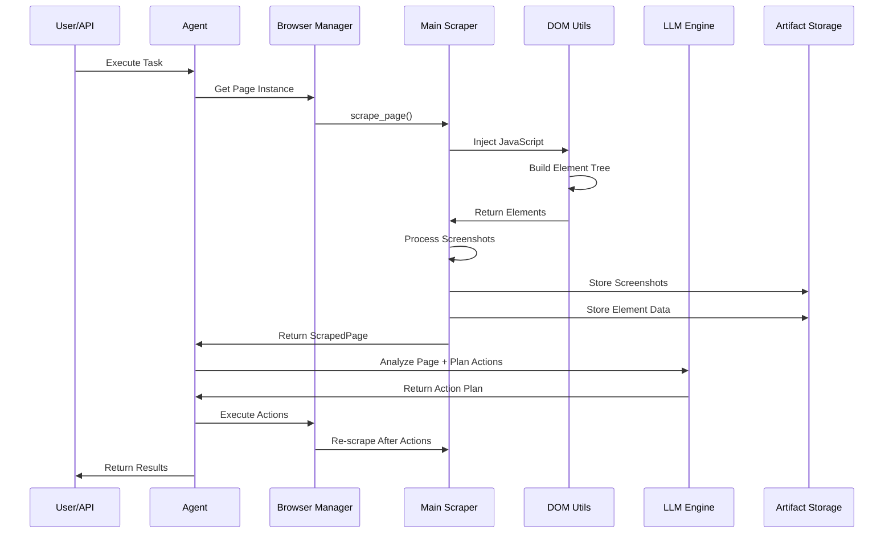
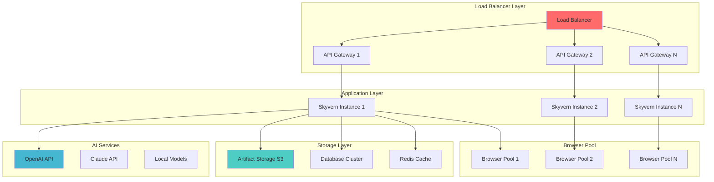

# 🔗 Integration Guide
## Putting It All Together: Complete System Integration

---

## 🎯 Integration Overview

This guide demonstrates how all components of the Skyvern Web Scraping Engine work together to create a **unified, intelligent automation system**.



---

## 🚀 Complete Workflow Integration

### End-to-End Process Flow


---

## 🔧 Component Integration Patterns

### 1. Scraper + Browser Integration

#### Browser Session Coordination
```python
class IntegratedScrapingSession:
    def __init__(self, browser_manager: BrowserManager):
        self.browser_manager = browser_manager
        self.current_page = None
        self.scraping_history = []
    
    async def initialize_session(self, url: str) -> ScrapedPage:
        """Initialize browser session and perform initial scrape"""
        # Get browser instance
        self.current_page = await self.browser_manager.get_page()
        
        # Navigate to target URL
        await self.current_page.goto(url, wait_until="networkidle")
        
        # Perform initial scrape
        initial_scrape = await scrape_page(
            page=self.current_page,
            url=url,
            take_screenshots=True,
            draw_boxes=True
        )
        
        # Store in history
        self.scraping_history.append({
            "timestamp": datetime.utcnow(),
            "action": "initial_load",
            "scrape_data": initial_scrape
        })
        
        return initial_scrape
    
    async def execute_action_with_rescrape(
        self, 
        action: WebAction
    ) -> tuple[ActionResult, ScrapedPage]:
        """Execute action and automatically re-scrape page"""
        # Execute the action
        action_result = await self.execute_action(action)
        
        # Wait for page to settle
        await asyncio.sleep(2)
        
        # Re-scrape to capture changes
        updated_scrape = await scrape_page(
            page=self.current_page,
            url=self.current_page.url,
            take_screenshots=True,
            draw_boxes=True
        )
        
        # Store in history
        self.scraping_history.append({
            "timestamp": datetime.utcnow(),
            "action": f"action_{action.action_type}",
            "action_result": action_result,
            "scrape_data": updated_scrape
        })
        
        return action_result, updated_scrape
```

---

### 2. AI + Scraper Integration

#### Intelligent Scraping Decisions
```python
class AIEnhancedScraper:
    def __init__(self, llm_client: LLMClient):
        self.llm_client = llm_client
        self.scraping_context = {}
    
    async def intelligent_scrape(
        self, 
        page: Page, 
        task_objective: str
    ) -> ScrapedPage:
        """Perform AI-guided scraping based on task objective"""
        
        # Initial quick scrape to understand page structure
        quick_scrape = await scrape_page(
            page=page,
            url=page.url,
            take_screenshots=False,  # Skip screenshots for speed
            draw_boxes=False
        )
        
        # Analyze page structure with AI
        page_analysis = await self.analyze_page_with_ai(quick_scrape, task_objective)
        
        # Determine optimal scraping strategy
        scraping_strategy = await self.determine_scraping_strategy(page_analysis)
        
        # Perform targeted scraping based on AI recommendations
        targeted_scrape = await scrape_page(
            page=page,
            url=page.url,
            take_screenshots=scraping_strategy["enable_screenshots"],
            draw_boxes=scraping_strategy["draw_bounding_boxes"],
            max_screenshot_number=scraping_strategy["max_screenshots"],
            scroll=scraping_strategy["enable_scrolling"]
        )
        
        return targeted_scrape
    
    async def analyze_page_with_ai(
        self, 
        scrape_data: ScrapedPage, 
        objective: str
    ) -> dict:
        """Use AI to analyze page structure and recommend scraping approach"""
        
        prompt = f"""
        Analyze this web page structure for the task: "{objective}"
        
        Page URL: {scrape_data.url}
        Element count: {len(scrape_data.elements)}
        Interactive elements: {len([e for e in scrape_data.elements if e.get('interactable')])}
        
        Element types present:
        {self.summarize_element_types(scrape_data.elements)}
        
        Provide analysis in JSON format:
        {{
            "page_complexity": "low|medium|high",
            "relevant_elements": ["element_id1", "element_id2"],
            "recommended_approach": "minimal|standard|comprehensive",
            "focus_areas": ["forms", "navigation", "content"],
            "potential_challenges": ["dynamic_content", "lazy_loading", "infinite_scroll"]
        }}
        """
        
        analysis = await self.llm_client.complete(prompt)
        return json.loads(analysis)
    
    def summarize_element_types(self, elements: list[dict]) -> str:
        """Create summary of element types for AI analysis"""
        type_counts = defaultdict(int)
        for element in elements:
            tag_name = element.get("tagName", "unknown")
            type_counts[tag_name] += 1
        
        return "\n".join([f"{tag}: {count}" for tag, count in type_counts.items()])
```

---

### 3. Storage + Processing Integration

#### Unified Data Pipeline
```python
class IntegratedDataPipeline:
    def __init__(self, artifact_manager: ArtifactManager, storage: BaseStorage):
        self.artifact_manager = artifact_manager
        self.storage = storage
        self.processing_pipeline = []
    
    async def process_scraping_results(
        self, 
        step: Step, 
        scrape_data: ScrapedPage
    ) -> dict[str, Artifact]:
        """Process and store all scraping artifacts"""
        artifacts = {}
        
        # Store screenshots
        for i, screenshot in enumerate(scrape_data.screenshots):
            screenshot_artifact = await self.artifact_manager.create_artifact(
                step=step,
                artifact_type=ArtifactType.SCREENSHOT_LLM,
                data=screenshot
            )
            artifacts[f"screenshot_{i}"] = screenshot_artifact
        
        # Store element tree data
        element_tree_data = json.dumps(scrape_data.element_tree, indent=2).encode()
        tree_artifact = await self.artifact_manager.create_artifact(
            step=step,
            artifact_type=ArtifactType.VISIBLE_ELEMENTS_TREE,
            data=element_tree_data
        )
        artifacts["element_tree"] = tree_artifact
        
        # Store CSS selector mappings
        css_map_data = json.dumps(scrape_data.id_to_css_dict, indent=2).encode()
        css_artifact = await self.artifact_manager.create_artifact(
            step=step,
            artifact_type=ArtifactType.VISIBLE_ELEMENTS_ID_CSS_MAP,
            data=css_map_data
        )
        artifacts["css_map"] = css_artifact
        
        # Store raw HTML
        html_artifact = await self.artifact_manager.create_artifact(
            step=step,
            artifact_type=ArtifactType.HTML_SCRAPE,
            data=scrape_data.html.encode()
        )
        artifacts["html"] = html_artifact
        
        # Process through enhancement pipeline
        enhanced_data = await self.run_enhancement_pipeline(scrape_data, artifacts)
        
        return enhanced_data
    
    async def run_enhancement_pipeline(
        self, 
        scrape_data: ScrapedPage, 
        artifacts: dict
    ) -> dict:
        """Run data through enhancement and analysis pipeline"""
        pipeline_results = {
            "original_artifacts": artifacts,
            "enhancements": {}
        }
        
        # Element classification enhancement
        classified_elements = await self.classify_elements_semantically(scrape_data.elements)
        pipeline_results["enhancements"]["classified_elements"] = classified_elements
        
        # Visual analysis enhancement  
        if scrape_data.screenshots:
            visual_analysis = await self.analyze_screenshots(scrape_data.screenshots)
            pipeline_results["enhancements"]["visual_analysis"] = visual_analysis
        
        # Accessibility analysis
        accessibility_report = await self.analyze_accessibility(scrape_data)
        pipeline_results["enhancements"]["accessibility"] = accessibility_report
        
        return pipeline_results
```

---

## 🧩 Advanced Integration Patterns

### 1. Event-Driven Coordination

#### Real-time System Coordination
```python
class SystemOrchestrator:
    def __init__(self):
        self.event_bus = EventBus()
        self.component_registry = {}
        self.active_sessions = {}
    
    def register_component(self, name: str, component: Any):
        """Register system component for coordination"""
        self.component_registry[name] = component
        
        # Set up event listeners for the component
        if hasattr(component, 'on_page_scraped'):
            self.event_bus.subscribe('page_scraped', component.on_page_scraped)
        
        if hasattr(component, 'on_action_executed'):
            self.event_bus.subscribe('action_executed', component.on_action_executed)
    
    async def coordinate_scraping_workflow(
        self, 
        task_id: str, 
        workflow_config: dict
    ) -> dict:
        """Coordinate complete scraping workflow across all components"""
        
        session_id = f"session_{task_id}_{int(time.time())}"
        self.active_sessions[session_id] = {
            "task_id": task_id,
            "start_time": datetime.utcnow(),
            "status": "initializing",
            "components_involved": []
        }
        
        try:
            # Initialize browser session
            await self.event_bus.emit('session_start', {
                "session_id": session_id,
                "task_id": task_id,
                "config": workflow_config
            })
            
            # Execute coordinated workflow
            results = await self.execute_coordinated_workflow(session_id, workflow_config)
            
            # Finalize session
            await self.event_bus.emit('session_complete', {
                "session_id": session_id,
                "results": results
            })
            
            return results
            
        except Exception as e:
            await self.event_bus.emit('session_error', {
                "session_id": session_id,
                "error": str(e)
            })
            raise
        
        finally:
            # Cleanup session
            if session_id in self.active_sessions:
                del self.active_sessions[session_id]
    
    async def execute_coordinated_workflow(
        self, 
        session_id: str, 
        config: dict
    ) -> dict:
        """Execute workflow with coordinated component interaction"""
        
        workflow_results = {}
        
        # Phase 1: Page Analysis
        browser_manager = self.component_registry["browser_manager"]
        scraper = self.component_registry["main_scraper"]
        
        page = await browser_manager.get_page()
        await page.goto(config["target_url"])
        
        initial_scrape = await scraper.scrape_page(page, config["target_url"])
        
        await self.event_bus.emit('page_scraped', {
            "session_id": session_id,
            "scrape_data": initial_scrape,
            "phase": "initial"
        })
        
        workflow_results["initial_scrape"] = initial_scrape
        
        # Phase 2: AI Analysis and Planning
        ai_engine = self.component_registry["ai_engine"]
        action_plan = await ai_engine.analyze_and_plan(initial_scrape, config["objective"])
        
        await self.event_bus.emit('plan_generated', {
            "session_id": session_id,
            "action_plan": action_plan
        })
        
        workflow_results["action_plan"] = action_plan
        
        # Phase 3: Action Execution with Re-scraping
        action_handler = self.component_registry["action_handler"]
        
        for i, action in enumerate(action_plan["actions"]):
            # Execute action
            action_result = await action_handler.execute_action(page, action)
            
            # Re-scrape after action
            post_action_scrape = await scraper.scrape_page(page, page.url)
            
            await self.event_bus.emit('action_executed', {
                "session_id": session_id,
                "action_index": i,
                "action": action,
                "result": action_result,
                "post_scrape": post_action_scrape
            })
            
            workflow_results[f"action_{i}"] = {
                "action": action,
                "result": action_result,
                "scrape": post_action_scrape
            }
        
        return workflow_results
```

---

### 2. Performance Optimization Integration

#### Holistic Performance Management
```python
class PerformanceCoordinator:
    def __init__(self):
        self.performance_monitors = {}
        self.optimization_strategies = {}
        self.current_metrics = {}
    
    def register_monitor(self, component_name: str, monitor: PerformanceMonitor):
        """Register performance monitor for a component"""
        self.performance_monitors[component_name] = monitor
    
    async def optimize_system_performance(self) -> dict:
        """Coordinate performance optimizations across all components"""
        
        # Collect metrics from all components
        all_metrics = {}
        for component_name, monitor in self.performance_monitors.items():
            component_metrics = await monitor.get_current_metrics()
            all_metrics[component_name] = component_metrics
        
        # Analyze cross-component performance patterns
        performance_analysis = self.analyze_cross_component_performance(all_metrics)
        
        # Apply coordinated optimizations
        optimizations_applied = {}
        
        if performance_analysis["memory_pressure"]:
            optimizations_applied["memory"] = await self.apply_memory_optimizations()
        
        if performance_analysis["processing_bottleneck"]:
            optimizations_applied["processing"] = await self.apply_processing_optimizations()
        
        if performance_analysis["storage_latency"]:
            optimizations_applied["storage"] = await self.apply_storage_optimizations()
        
        return {
            "metrics": all_metrics,
            "analysis": performance_analysis,
            "optimizations": optimizations_applied
        }
    
    def analyze_cross_component_performance(self, all_metrics: dict) -> dict:
        """Analyze performance patterns across components"""
        analysis = {
            "memory_pressure": False,
            "processing_bottleneck": False,
            "storage_latency": False,
            "coordination_overhead": False
        }
        
        # Memory analysis
        total_memory = sum(
            metrics.get("memory_usage", 0) 
            for metrics in all_metrics.values()
        )
        if total_memory > 1024:  # 1GB threshold
            analysis["memory_pressure"] = True
        
        # Processing analysis
        avg_processing_time = statistics.mean([
            metrics.get("avg_processing_time", 0)
            for metrics in all_metrics.values()
            if metrics.get("avg_processing_time", 0) > 0
        ])
        if avg_processing_time > 10:  # 10 second threshold
            analysis["processing_bottleneck"] = True
        
        # Storage analysis
        storage_metrics = all_metrics.get("artifact_manager", {})
        if storage_metrics.get("avg_upload_time", 0) > 5:  # 5 second threshold
            analysis["storage_latency"] = True
        
        return analysis
    
    async def apply_memory_optimizations(self) -> list[str]:
        """Apply memory optimization strategies"""
        optimizations = []
        
        # Trigger garbage collection in all components
        for component_name, monitor in self.performance_monitors.items():
            if hasattr(monitor, 'force_garbage_collection'):
                await monitor.force_garbage_collection()
                optimizations.append(f"gc_{component_name}")
        
        # Reduce element tree depth in scraper
        scraper_monitor = self.performance_monitors.get("main_scraper")
        if scraper_monitor:
            await scraper_monitor.enable_aggressive_trimming()
            optimizations.append("aggressive_element_trimming")
        
        # Reduce screenshot quality/count
        if "browser_manager" in self.performance_monitors:
            await self.performance_monitors["browser_manager"].reduce_screenshot_quality()
            optimizations.append("reduced_screenshot_quality")
        
        return optimizations
```

---

### 3. Error Handling Integration

#### System-Wide Error Recovery
```python
class IntegratedErrorHandler:
    def __init__(self):
        self.error_handlers = {}
        self.recovery_strategies = {}
        self.error_history = []
    
    def register_error_handler(
        self, 
        component_name: str, 
        error_handler: Callable
    ):
        """Register component-specific error handler"""
        self.error_handlers[component_name] = error_handler
    
    async def handle_system_error(
        self, 
        error: Exception, 
        context: dict
    ) -> dict:
        """Handle errors with system-wide coordination"""
        
        error_info = {
            "timestamp": datetime.utcnow(),
            "error_type": type(error).__name__,
            "error_message": str(error),
            "context": context,
            "recovery_attempted": False,
            "recovery_successful": False
        }
        
        # Log error
        LOG.error(f"System error occurred: {error_info}")
        self.error_history.append(error_info)
        
        # Determine recovery strategy based on error type and context
        recovery_strategy = await self.determine_recovery_strategy(error, context)
        
        if recovery_strategy:
            try:
                recovery_result = await self.execute_recovery_strategy(
                    recovery_strategy, 
                    error, 
                    context
                )
                error_info["recovery_attempted"] = True
                error_info["recovery_successful"] = recovery_result["success"]
                error_info["recovery_details"] = recovery_result
                
            except Exception as recovery_error:
                LOG.error(f"Recovery failed: {recovery_error}")
                error_info["recovery_error"] = str(recovery_error)
        
        return error_info
    
    async def determine_recovery_strategy(
        self, 
        error: Exception, 
        context: dict
    ) -> dict | None:
        """Determine appropriate recovery strategy"""
        
        error_type = type(error).__name__
        component = context.get("component")
        
        # Browser-related errors
        if error_type in ["TimeoutError", "TargetClosedError"] and component == "browser":
            return {
                "type": "browser_recovery",
                "actions": ["restart_browser", "retry_operation"]
            }
        
        # Scraping-related errors
        if error_type in ["MissingElement", "ElementNotFound"] and component == "scraper":
            return {
                "type": "scraping_recovery", 
                "actions": ["refresh_page", "re_scrape", "fallback_selectors"]
            }
        
        # Storage-related errors
        if error_type in ["ConnectionError", "TimeoutError"] and component == "storage":
            return {
                "type": "storage_recovery",
                "actions": ["retry_with_backoff", "switch_storage_backend"]
            }
        
        # AI/LLM errors
        if error_type in ["LLMProviderError", "RateLimitError"] and component == "ai":
            return {
                "type": "ai_recovery",
                "actions": ["retry_with_delay", "fallback_provider", "reduce_prompt_size"]
            }
        
        return None
    
    async def execute_recovery_strategy(
        self, 
        strategy: dict, 
        original_error: Exception, 
        context: dict
    ) -> dict:
        """Execute coordinated recovery across components"""
        
        recovery_results = {
            "success": False,
            "actions_taken": [],
            "final_state": "unknown"
        }
        
        for action in strategy["actions"]:
            try:
                action_result = await self.execute_recovery_action(action, context)
                recovery_results["actions_taken"].append({
                    "action": action,
                    "result": action_result,
                    "success": True
                })
                
                # If any action succeeds, consider recovery successful
                if action_result.get("success"):
                    recovery_results["success"] = True
                    recovery_results["final_state"] = "recovered"
                    break
                    
            except Exception as action_error:
                recovery_results["actions_taken"].append({
                    "action": action,
                    "error": str(action_error),
                    "success": False
                })
        
        if not recovery_results["success"]:
            recovery_results["final_state"] = "recovery_failed"
        
        return recovery_results
```

---

## 🎮 Complete Usage Examples

### 1. Basic Integration Example

#### Simple Web Scraping Task
```python
async def simple_scraping_example():
    """Complete example of integrated web scraping"""
    
    # Initialize components
    browser_manager = BrowserManager()
    artifact_manager = ArtifactManager()
    ai_client = OpenAIClient()
    
    # Create integrated system
    orchestrator = SystemOrchestrator()
    orchestrator.register_component("browser_manager", browser_manager)
    orchestrator.register_component("artifact_manager", artifact_manager)
    orchestrator.register_component("ai_client", ai_client)
    
    try:
        # Define task
        task_config = {
            "target_url": "https://example.com/contact",
            "objective": "Fill out the contact form with provided information",
            "data": {
                "name": "John Doe",
                "email": "john@example.com", 
                "message": "Hello, I'm interested in your services."
            }
        }
        
        # Execute coordinated workflow
        results = await orchestrator.coordinate_scraping_workflow(
            task_id="contact_form_task",
            workflow_config=task_config
        )
        
        print(f"Task completed successfully!")
        print(f"Actions executed: {len(results.get('action_plan', {}).get('actions', []))}")
        print(f"Final page URL: {results.get('final_page_url')}")
        
        return results
        
    except Exception as e:
        print(f"Task failed: {e}")
        raise
    
    finally:
        # Cleanup
        await browser_manager.close_all()

# Run the example
if __name__ == "__main__":
    asyncio.run(simple_scraping_example())
```

---

### 2. Advanced Multi-Step Integration

#### Complex E-commerce Automation
```python
async def ecommerce_automation_example():
    """Advanced example with multi-step workflow"""
    
    # Setup integrated system with all components
    system = IntegratedAutomationSystem()
    await system.initialize()
    
    # Define complex workflow
    workflow_config = {
        "name": "product_research_and_purchase",
        "steps": [
            {
                "type": "navigation",
                "url": "https://shop.example.com",
                "objective": "Navigate to product search"
            },
            {
                "type": "search",
                "query": "wireless headphones",
                "filters": {"price_max": 200, "rating_min": 4}
            },
            {
                "type": "analysis",
                "objective": "Compare top 3 products by features and reviews"
            },
            {
                "type": "selection",
                "criteria": "best value for money"
            },
            {
                "type": "purchase",
                "payment_method": "stored_card",
                "shipping_address": "default"
            }
        ]
    }
    
    try:
        # Execute multi-step workflow
        workflow_results = await system.execute_workflow(workflow_config)
        
        # Process results
        for step_name, step_result in workflow_results.items():
            print(f"Step '{step_name}': {step_result['status']}")
            
            if step_result.get('artifacts'):
                print(f"  Artifacts created: {len(step_result['artifacts'])}")
            
            if step_result.get('ai_decisions'):
                print(f"  AI decisions: {step_result['ai_decisions']}")
        
        return workflow_results
        
    except Exception as e:
        print(f"Workflow failed at step: {e}")
        
        # Get detailed error information
        error_details = await system.get_error_details()
        print(f"Error details: {error_details}")
        
        raise
    
    finally:
        await system.cleanup()

class IntegratedAutomationSystem:
    def __init__(self):
        self.components = {}
        self.workflow_engine = None
        self.error_handler = IntegratedErrorHandler()
    
    async def initialize(self):
        """Initialize all system components"""
        # Initialize core components
        self.components["browser"] = BrowserManager()
        self.components["scraper"] = MainScraper()
        self.components["ai"] = AIEngine()
        self.components["storage"] = ArtifactManager()
        self.components["performance"] = PerformanceCoordinator()
        
        # Initialize workflow engine
        self.workflow_engine = WorkflowEngine(self.components)
        
        # Setup error handling
        for component_name, component in self.components.items():
            if hasattr(component, 'set_error_handler'):
                component.set_error_handler(self.error_handler)
    
    async def execute_workflow(self, config: dict) -> dict:
        """Execute complete workflow with all integrations"""
        return await self.workflow_engine.execute(config)
```

---

## 📊 Monitoring & Observability

### Integrated Monitoring Dashboard
```python
class SystemMonitoringDashboard:
    def __init__(self, orchestrator: SystemOrchestrator):
        self.orchestrator = orchestrator
        self.metrics_collector = MetricsCollector()
        self.alert_manager = AlertManager()
    
    async def get_system_health(self) -> dict:
        """Get comprehensive system health status"""
        health_status = {
            "timestamp": datetime.utcnow().isoformat(),
            "overall_status": "healthy",
            "components": {},
            "performance": {},
            "alerts": []
        }
        
        # Check each component health
        for component_name, component in self.orchestrator.component_registry.items():
            try:
                if hasattr(component, 'health_check'):
                    component_health = await component.health_check()
                    health_status["components"][component_name] = component_health
                else:
                    health_status["components"][component_name] = {"status": "unknown"}
            except Exception as e:
                health_status["components"][component_name] = {
                    "status": "error",
                    "error": str(e)
                }
                health_status["overall_status"] = "degraded"
        
        # Collect performance metrics
        performance_metrics = await self.metrics_collector.get_aggregated_metrics()
        health_status["performance"] = performance_metrics
        
        # Check for alerts
        active_alerts = await self.alert_manager.get_active_alerts()
        health_status["alerts"] = active_alerts
        
        if active_alerts:
            health_status["overall_status"] = "warning"
        
        return health_status
    
    async def generate_performance_report(self, time_window_hours: int = 24) -> dict:
        """Generate comprehensive performance report"""
        return {
            "scraping_performance": await self.get_scraping_metrics(time_window_hours),
            "ai_performance": await self.get_ai_metrics(time_window_hours),
            "storage_performance": await self.get_storage_metrics(time_window_hours),
            "browser_performance": await self.get_browser_metrics(time_window_hours),
            "system_resources": await self.get_resource_utilization(),
            "error_analysis": await self.get_error_analysis(time_window_hours)
        }
```

---

## 🚀 Deployment Patterns

### Production Deployment Architecture


---

## 🔗 Best Practices Summary

### Integration Checklist
✅ **Component Isolation** - Each component has clear boundaries and interfaces  
✅ **Event-Driven Communication** - Loose coupling through event system  
✅ **Error Handling** - Comprehensive error recovery across all components  
✅ **Performance Monitoring** - Real-time metrics and optimization  
✅ **Graceful Degradation** - System continues operating under constraints  
✅ **Scalable Architecture** - Horizontal scaling capabilities  
✅ **Security Integration** - Authentication and authorization throughout  
✅ **Monitoring & Observability** - Complete system visibility  

### Key Integration Principles
1. **Modular Design** - Components can be replaced or upgraded independently
2. **Async-First** - All operations designed for asynchronous execution  
3. **Resource-Aware** - Dynamic adaptation based on available resources
4. **Fault-Tolerant** - Multiple fallback strategies for reliability
5. **Performance-Optimized** - Continuous optimization based on metrics

---

## 🎯 Conclusion

The Skyvern Web Scraping Engine demonstrates sophisticated **system integration patterns** that create a **robust, scalable, and intelligent automation platform**. The integration of browser automation, AI decision-making, and reliable data storage creates a system capable of handling complex web automation tasks with minimal human intervention.

**Key achievements:**
- **Seamless component coordination** through event-driven architecture
- **Intelligent adaptation** based on real-time performance metrics  
- **Comprehensive error handling** with automatic recovery strategies
- **Scalable design** supporting high-volume automation workflows

This architecture serves as a excellent foundation for building **production-grade web automation systems** that can adapt to changing requirements and scale with growing demands.