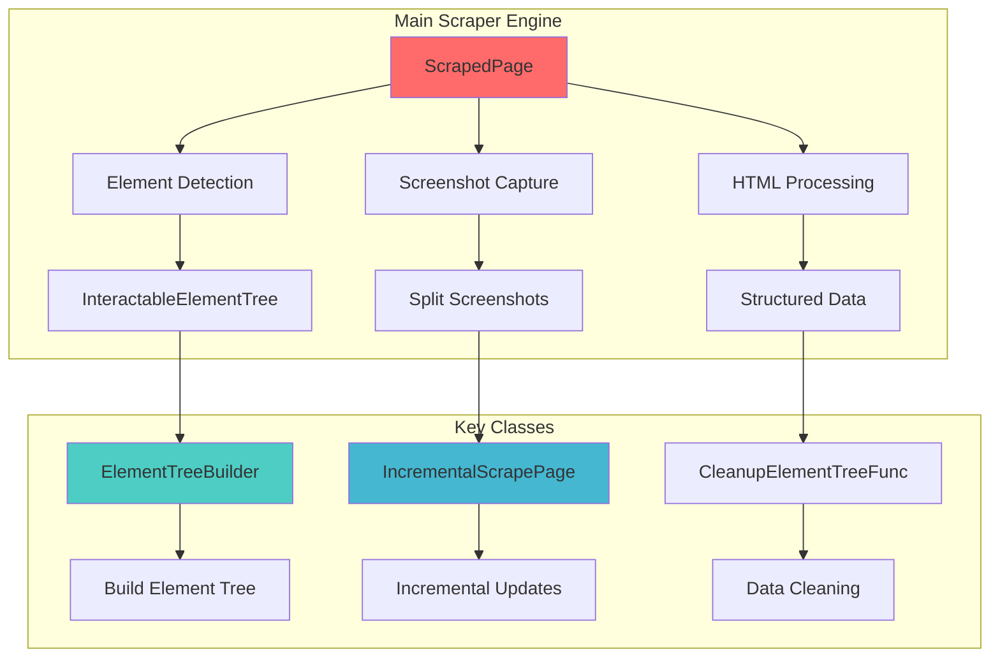
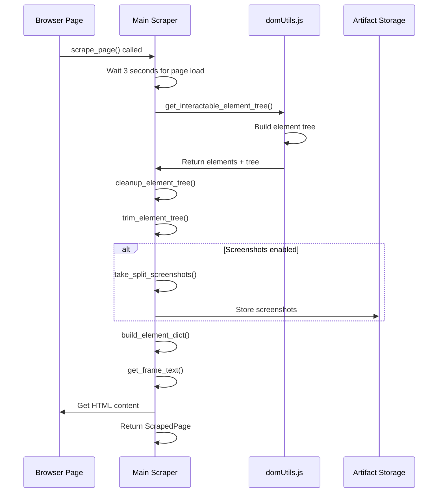
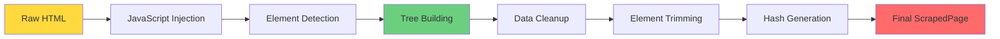
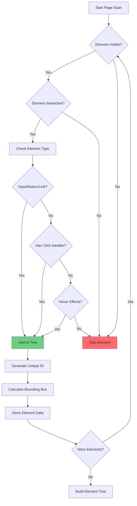

# 🔧 Main Scraper Engine
## `skyvern/webeye/scraper/scraper.py` Deep Analysis

---

## 🎯 Core Purpose

The main scraper engine is the **heart of Skyvern's web data extraction**, responsible for:

- **Element Detection** - Finding interactive elements on web pages
- **Screenshot Coordination** - Capturing visual representations  
- **Data Processing** - Converting raw HTML to structured data
- **Browser Integration** - Coordinating with Playwright browser instances

---

## 🏗️ Architecture Overview



---

## 📊 Key Data Structures

### ScrapedPage Model
```python
class ScrapedPage:
    elements: list[dict]                    # Raw element data
    id_to_css_dict: dict[str, str]         # Element ID to CSS selector
    id_to_element_dict: dict[str, dict]    # Element ID to element data
    id_to_frame_dict: dict[str, str]       # Element ID to frame mapping
    element_tree: list[dict]               # Hierarchical element tree
    screenshots: list[bytes]               # Page screenshots
    url: str                               # Source URL
    html: str                              # Raw HTML content
    extracted_text: str                    # Extracted text content
```

---

## 🔄 Scraping Process Flow



---

## ⚡ Core Functions Deep Dive

### 1. Element Detection
```python
async def get_interactable_element_tree(
    page: Page, 
    scrape_exclude: ScrapeExcludeFunc | None = None
) -> tuple[list[dict], list[dict]]:
    """
    Identifies all interactive elements on the page
    Returns: (flat_elements, hierarchical_tree)
    """
```

**Key Features:**
- Injects JavaScript for DOM traversal
- Builds hierarchical element trees
- Filters for interactive elements only
- Handles iframes and shadow DOM

---

### 2. Screenshot Management
```python
async def take_split_screenshots(
    page: Page,
    url: str,
    draw_boxes: bool = True,
    max_number: int = 5
) -> list[bytes]:
    """
    Captures multiple screenshots with element bounding boxes
    """
```

**Features:**
- **Split screenshots** for long pages
- **Bounding box overlays** for element visualization
- **Configurable limits** to control token usage
- **Scroll coordination** to capture full content

---

### 3. Data Processing Pipeline



---

## 🧩 Element Tree Structure

### Raw Element Format
```javascript
{
    "id": "unique_element_id",
    "tagName": "button", 
    "text": "Click Me",
    "attributes": {
        "class": "btn btn-primary",
        "type": "button"
    },
    "rect": {
        "x": 100, "y": 200,
        "width": 80, "height": 30
    },
    "interactable": true,
    "children": [...]
}
```

### Processed Element Mapping
```python
id_to_css_dict = {
    "element_123": "button.btn.btn-primary[type='button']"
}

id_to_element_dict = {
    "element_123": {
        "tagName": "button",
        "text": "Click Me",
        "attributes": {...}
    }
}
```

---

## 🔍 Element Detection Algorithm



---

## 🎨 Screenshot Coordination

### Split Screenshot Algorithm
```python
async def take_split_screenshots(page, url, draw_boxes=True, max_number=5):
    screenshots = []
    
    # Initial screenshot at top
    await page.evaluate("window.scrollTo(0, 0)")
    await page.wait_for_timeout(1000)
    
    # Draw bounding boxes for elements
    if draw_boxes:
        await build_elements_and_draw_bounding_boxes()
    
    # Capture first screenshot
    screenshot = await page.screenshot(full_page=False)
    screenshots.append(screenshot)
    
    # Scroll and capture additional screenshots
    for i in range(1, max_number):
        scroll_position = await scroll_to_next_page()
        if scroll_position_unchanged:
            break
        screenshot = await page.screenshot(full_page=False)
        screenshots.append(screenshot)
    
    return screenshots
```

---

## 📈 Performance Optimizations

### Token Management
- **Element tree trimming** to reduce LLM token usage
- **Selective screenshot capture** based on content complexity
- **Incremental updates** for dynamic pages

### Memory Management  
- **Streaming processing** for large pages
- **Garbage collection** of unused elements
- **Efficient data structures** for element lookup

### Browser Optimization
- **Parallel processing** where possible
- **Resource filtering** to ignore non-essential content
- **Timeout management** to prevent hanging

---

## 🛠️ Key Methods Reference

| Method | Purpose | Returns |
|--------|---------|---------|
| `scrape_page()` | Main entry point | `ScrapedPage` |
| `get_interactable_element_tree()` | Element detection | `(elements, tree)` |
| `build_element_dict()` | Create lookup maps | `dict mappings` |
| `trim_element_tree()` | Optimize for LLM | `trimmed_tree` |
| `json_to_html()` | Convert to HTML | `html_string` |

---

## 🔗 Integration Points

The main scraper integrates with:

- **🌐 Browser Factory** - Page instances and browser management
- **🤖 AI Agent** - Element data for decision making  
- **📦 Artifact Storage** - Persisting screenshots and data
- **⚡ Action Handler** - Element interaction coordination

---

## 📋 Next: DOM Utilities

Continue to **[DOM Utilities](03-dom-utilities.md)** to understand the JavaScript browser-side processing that powers the element detection engine.