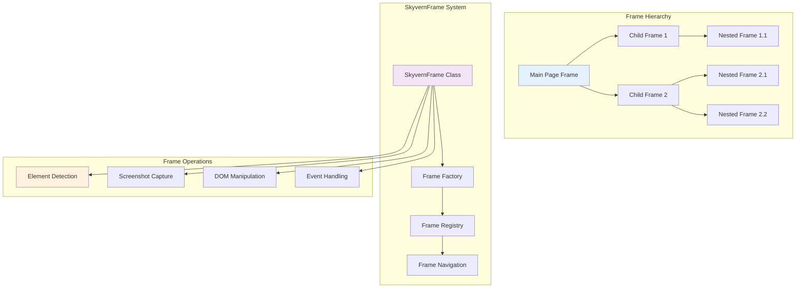
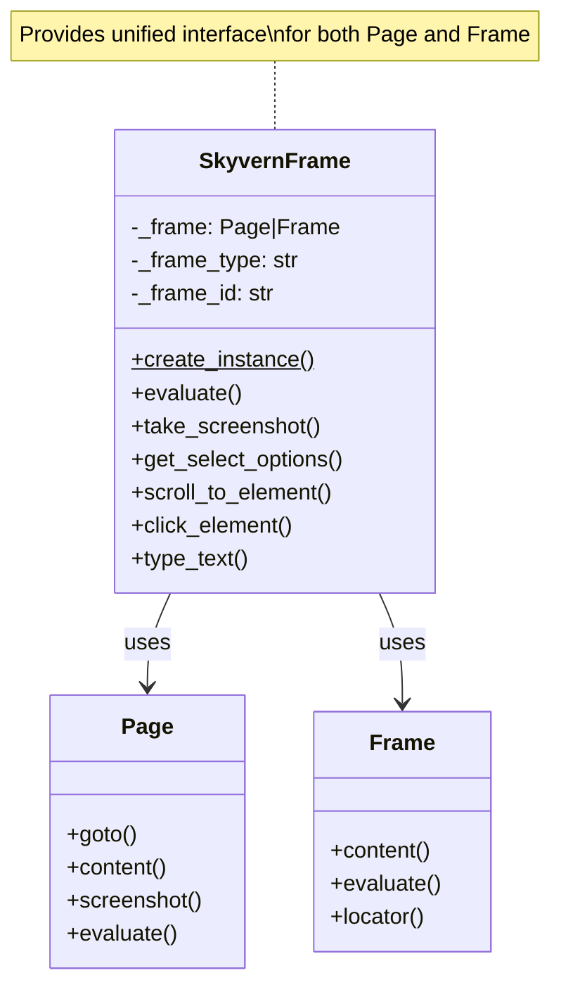
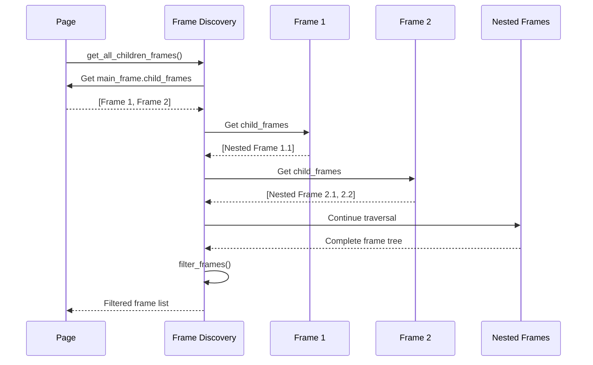
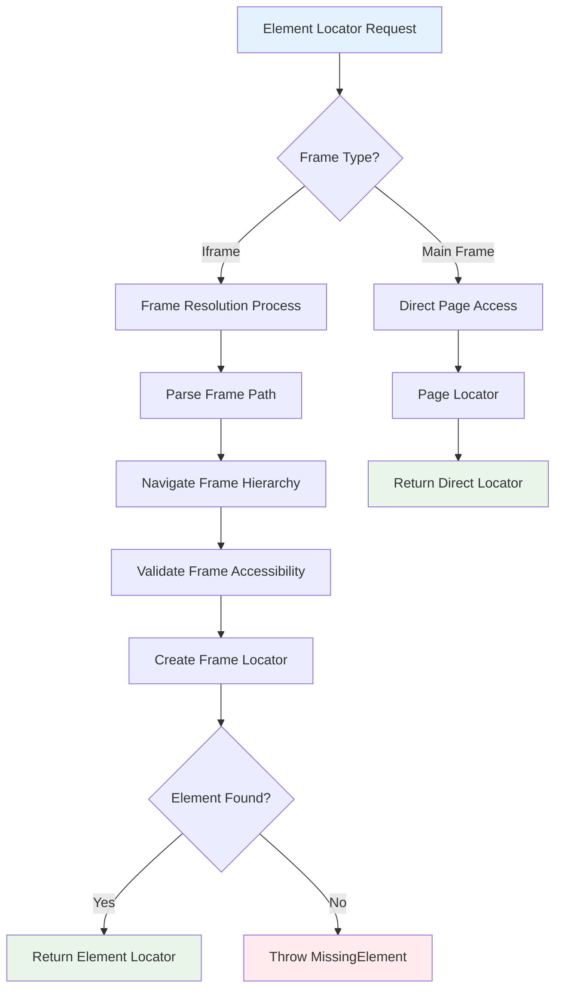
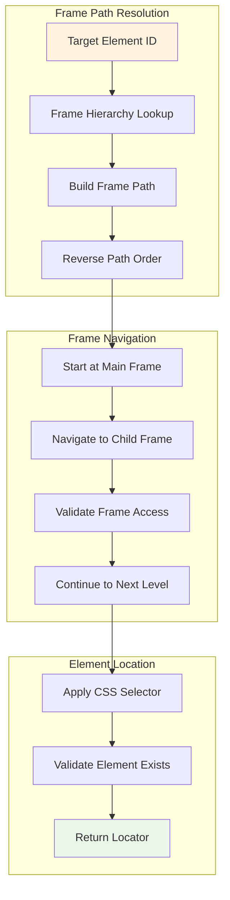
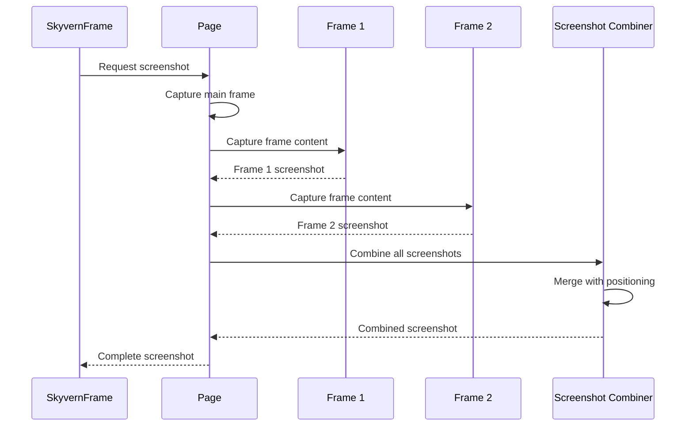
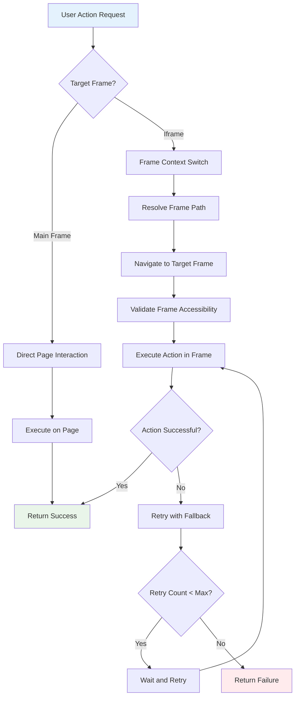
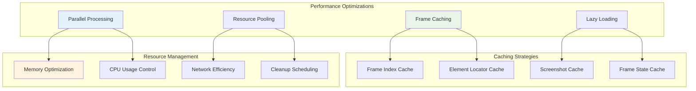

# 🖼️ Page & Frame Management
## Deep Dive into SkyvernFrame and Multi-Frame Navigation

---

## 🏗️ Frame Management Architecture



---

## 🎯 SkyvernFrame Core Implementation

### **Frame Factory Pattern**
```python
class SkyvernFrame:
    """Universal frame interface for both Page and Frame objects"""
    
    @staticmethod
    async def create_instance(frame: Page | Frame) -> SkyvernFrame:
        """Factory method to create appropriate frame instance"""
        if isinstance(frame, Page):
            return SkyvernFrame(frame, frame_type="page")
        elif isinstance(frame, Frame):
            return SkyvernFrame(frame, frame_type="frame")
        else:
            raise ValueError(f"Unsupported frame type: {type(frame)}")
    
    def __init__(self, frame: Page | Frame, frame_type: str):
        self._frame = frame
        self._frame_type = frame_type
        self._frame_id = self._generate_frame_id()
    
    def _generate_frame_id(self) -> str:
        """Generate unique frame identifier"""
        if self._frame_type == "page":
            return "main.frame"
        else:
            # Generate unique ID for iframe
            return f"frame_{hash(self._frame.url)}_{id(self._frame)}"
```

### **Universal Frame Interface**



---

## 🔄 Frame Discovery & Management

### **Frame Tree Discovery**
```python
async def get_all_children_frames(page: Page) -> list[Frame]:
    """Recursively discover all frames in the page hierarchy"""
    start_index = 0
    frames = page.main_frame.child_frames
    
    # Breadth-first traversal of frame tree
    while start_index < len(frames):
        frame = frames[start_index]
        start_index += 1
        frames.extend(frame.child_frames)
    
    return frames

async def filter_frames(frames: list[Frame], scrape_exclude: ScrapeExcludeFunc | None = None) -> list[Frame]:
    """Filter frames based on visibility and exclusion criteria"""
    filtered_frames = []
    
    for frame in frames:
        # Skip detached frames
        if frame.is_detached():
            continue
        
        # Apply custom exclusion logic
        if scrape_exclude is not None and await scrape_exclude(frame.page, frame):
            continue
        
        filtered_frames.append(frame)
    
    return filtered_frames
```

### **Frame Discovery Flow**



---

## 🎭 Frame Context Management

### **Frame Context Mapping**
```python
class FrameContextManager:
    """Manages frame contexts and cross-frame operations"""
    
    def __init__(self):
        self.frame_index_map: dict[Frame, int] = {}
        self.frame_id_map: dict[str, Frame] = {}
        self.context_stack: list[SkyvernFrame] = []
    
    async def register_frame(self, frame: Frame, unique_id: str) -> int:
        """Register a frame and assign it an index"""
        if frame not in self.frame_index_map:
            frame_index = len(self.frame_index_map) + 1
            self.frame_index_map[frame] = frame_index
            self.frame_id_map[unique_id] = frame
            return frame_index
        return self.frame_index_map[frame]
    
    async def switch_to_frame(self, frame_id: str) -> SkyvernFrame:
        """Switch context to a specific frame"""
        if frame_id not in self.frame_id_map:
            raise MissingElementInIframe(f"Frame {frame_id} not found")
        
        frame = self.frame_id_map[frame_id]
        skyvern_frame = await SkyvernFrame.create_instance(frame)
        self.context_stack.append(skyvern_frame)
        return skyvern_frame
```

### **Cross-Frame Element Resolution**



---

## 🔍 Element Location Across Frames

### **Locator Resolution Algorithm**
```python
async def resolve_locator(
    scrape_page: ScrapedPage, 
    page: Page, 
    frame: str, 
    css: str
) -> tuple[Locator, Page | Frame]:
    """Resolve element locator across frame boundaries"""
    
    iframe_path: list[str] = []
    
    # Build path to target frame
    while frame != "main.frame":
        iframe_path.append(frame)
        frame_element = scrape_page.id_to_element_dict.get(frame)
        
        if frame_element is None:
            raise MissingElement(element_id=frame)
        
        parent_frame = frame_element.get("frame")
        if not parent_frame:
            raise SkyvernException(f"Element without frame: {frame_element}")
        
        frame = parent_frame
    
    # Navigate down the frame hierarchy
    current_page: Page | FrameLocator = page
    current_frame: Page | Frame = page
    
    while len(iframe_path) > 0:
        child_frame = iframe_path.pop()
        
        # Find frame element with skyvern ID
        frame_handler = await current_frame.query_selector(
            f"[{SKYVERN_ID_ATTR}='{child_frame}']"
        )
        
        if frame_handler is None:
            raise NoneFrameError(frame_id=child_frame)
        
        # Get the content frame
        content_frame = await frame_handler.content_frame()
        if content_frame is None:
            raise NoneFrameError(frame_id=child_frame)
        
        current_frame = content_frame
        current_page = current_page.frame_locator(f"[{SKYVERN_ID_ATTR}='{child_frame}']")
    
    return current_page.locator(css), current_frame
```

### **Frame Navigation Strategy**



---

## 📸 Frame-Aware Screenshot System

### **Screenshot Modes & Implementation**
```python
class ScreenshotMode(StrEnum):
    LITE = "lite"
    FULL = "full"
    SCROLLING = "scrolling"

async def take_scrolling_screenshot(
    page: Page,
    file_path: str | None = None,
    mode: ScreenshotMode = ScreenshotMode.LITE,
    scrolling_number: int = 0,
    use_playwright_fullpage: bool = False,
) -> bytes:
    """Take screenshot with frame-aware scrolling"""
    
    if mode == ScreenshotMode.LITE:
        # Quick screenshot without scrolling
        return await page.screenshot(
            path=file_path,
            full_page=use_playwright_fullpage,
            type="png"
        )
    
    elif mode == ScreenshotMode.SCROLLING:
        # Scroll-aware screenshot for long pages
        return await _take_scrolling_screenshot_impl(
            page, file_path, scrolling_number, use_playwright_fullpage
        )
    
    else:
        # Full page capture
        return await page.screenshot(
            path=file_path,
            full_page=True,
            type="png"
        )

async def _take_scrolling_screenshot_impl(
    page: Page,
    file_path: str | None,
    scroll_count: int,
    use_playwright: bool
) -> bytes:
    """Implementation of scrolling screenshot with frame consideration"""
    
    # Get viewport dimensions
    viewport = page.viewport_size
    if not viewport:
        viewport = {"width": 1920, "height": 1080}
    
    # Calculate scroll positions
    scroll_height = await page.evaluate("() => document.body.scrollHeight")
    scroll_positions = []
    
    for i in range(scroll_count + 1):
        scroll_y = i * viewport["height"]
        if scroll_y < scroll_height:
            scroll_positions.append(scroll_y)
    
    # Capture screenshots at each position
    screenshots = []
    for scroll_y in scroll_positions:
        await page.evaluate(f"() => window.scrollTo(0, {scroll_y})")
        await asyncio.sleep(0.5)  # Wait for scroll to complete
        
        screenshot = await page.screenshot(
            full_page=use_playwright,
            type="png"
        )
        screenshots.append(screenshot)
    
    # Combine screenshots if multiple captured
    if len(screenshots) == 1:
        return screenshots[0]
    else:
        return await _combine_screenshots(screenshots, viewport)
```

### **Multi-Frame Screenshot Coordination**



---

## 🖱️ Frame-Aware User Interactions

### **Element Interaction Pipeline**
```python
class SkyvernElement:
    """Frame-aware element interaction interface"""
    
    async def click(self, timeout: float = settings.BROWSER_ACTION_TIMEOUT_MS) -> None:
        """Perform click with frame context awareness"""
        locator = self.get_locator()
        
        # Ensure element is in viewport
        await self.scroll_into_view()
        
        # Wait for element to be actionable
        await locator.wait_for(state="visible", timeout=timeout)
        await locator.wait_for(state="attached", timeout=timeout)
        
        # Perform click with retry logic
        max_retries = 3
        for attempt in range(max_retries):
            try:
                await locator.click(timeout=timeout)
                return
            except TimeoutError as e:
                if attempt == max_retries - 1:
                    raise e
                await asyncio.sleep(1)
    
    async def scroll_into_view(self) -> None:
        """Scroll element into view within its frame context"""
        locator = self.get_locator()
        
        try:
            # Use Playwright's built-in scroll into view
            await locator.scroll_into_view_if_needed()
        except Exception:
            # Fallback to JavaScript scroll
            await self._frame.evaluate(
                """(element) => {
                    element.scrollIntoView({
                        behavior: 'smooth',
                        block: 'center',
                        inline: 'center'
                    });
                }""",
                await locator.element_handle()
            )
```

### **Cross-Frame Event Handling**



---

## 🔄 Frame State Management

### **Frame Lifecycle Tracking**
```python
class FrameStateManager:
    """Track frame states and lifecycle events"""
    
    def __init__(self):
        self.frame_states: dict[str, FrameState] = {}
        self.frame_events: list[FrameEvent] = []
    
    async def track_frame_navigation(self, frame: Frame) -> None:
        """Track frame navigation events"""
        frame_id = self._get_frame_id(frame)
        
        # Setup event listeners
        frame.on("load", lambda: self._on_frame_load(frame_id))
        frame.on("domcontentloaded", lambda: self._on_frame_dom_ready(frame_id))
        frame.on("request", lambda req: self._on_frame_request(frame_id, req))
        frame.on("response", lambda resp: self._on_frame_response(frame_id, resp))
    
    def _on_frame_load(self, frame_id: str) -> None:
        """Handle frame load event"""
        self.frame_states[frame_id] = FrameState.LOADED
        self.frame_events.append(FrameEvent(
            frame_id=frame_id,
            event_type="load",
            timestamp=datetime.now()
        ))
    
    async def wait_for_frame_ready(self, frame_id: str, timeout: float = 30000) -> bool:
        """Wait for frame to be ready for interaction"""
        start_time = time.time()
        
        while time.time() - start_time < timeout / 1000:
            if self.frame_states.get(frame_id) == FrameState.LOADED:
                return True
            await asyncio.sleep(0.1)
        
        return False
```

### **Frame Performance Monitoring**
```python
async def get_frame_performance_metrics(frame: Frame) -> dict:
    """Collect performance metrics for a specific frame"""
    try:
        metrics = await frame.evaluate("""
            () => {
                const navigation = performance.getEntriesByType('navigation')[0];
                const resources = performance.getEntriesByType('resource');
                
                return {
                    navigation: navigation ? {
                        load_time: navigation.loadEventEnd - navigation.fetchStart,
                        dom_ready: navigation.domContentLoadedEventEnd - navigation.fetchStart,
                        first_paint: navigation.responseStart - navigation.fetchStart
                    } : null,
                    
                    resources: {
                        count: resources.length,
                        total_size: resources.reduce((sum, r) => sum + (r.transferSize || 0), 0),
                        avg_duration: resources.length > 0 ? 
                            resources.reduce((sum, r) => sum + r.duration, 0) / resources.length : 0
                    },
                    
                    memory: performance.memory ? {
                        used: performance.memory.usedJSHeapSize,
                        total: performance.memory.totalJSHeapSize,
                        limit: performance.memory.jsHeapSizeLimit
                    } : null
                };
            }
        """)
        return metrics
    except Exception as e:
        LOG.warning(f"Failed to get frame metrics: {e}")
        return {}
```

---

## 🎯 Advanced Frame Features

### **Frame Communication Bridge**
```python
class FrameCommunicationBridge:
    """Enable communication between frames and main page"""
    
    async def setup_bridge(self, page: Page) -> None:
        """Setup communication bridge between frames"""
        
        # Inject bridge script into main page
        await page.add_init_script("""
            window.skyvernBridge = {
                messages: [],
                
                sendToFrame: function(frameId, message) {
                    const frame = document.querySelector(`[skyvern-id="${frameId}"]`);
                    if (frame && frame.contentWindow) {
                        frame.contentWindow.postMessage({
                            type: 'skyvern-message',
                            data: message
                        }, '*');
                    }
                },
                
                onMessage: function(callback) {
                    window.addEventListener('message', (event) => {
                        if (event.data.type === 'skyvern-message') {
                            callback(event.data.data);
                        }
                    });
                }
            };
        """)
        
        # Setup message handling for frames
        for frame in await get_all_children_frames(page):
            await self._setup_frame_bridge(frame)
    
    async def _setup_frame_bridge(self, frame: Frame) -> None:
        """Setup bridge for individual frame"""
        await frame.evaluate("""
            () => {
                window.skyvernFrameBridge = {
                    sendToParent: function(message) {
                        window.parent.postMessage({
                            type: 'skyvern-message',
                            data: message
                        }, '*');
                    }
                };
            }
        """)
```

### **Dynamic Frame Loading Handler**
```python
async def handle_dynamic_frame_loading(page: Page) -> None:
    """Handle dynamically loaded frames"""
    
    async def on_frame_attached(frame: Frame) -> None:
        """Handle new frame attachment"""
        LOG.info(f"New frame attached: {frame.url}")
        
        # Wait for frame to load
        try:
            await frame.wait_for_load_state("load", timeout=10000)
            
            # Register frame in context manager
            context = ensure_context()
            frame_index = len(context.frame_index_map) + 1
            context.frame_index_map[frame] = frame_index
            
            # Setup frame monitoring
            await setup_frame_monitoring(frame)
            
        except Exception as e:
            LOG.warning(f"Failed to setup dynamic frame: {e}")
    
    # Listen for frame events
    page.on("frameattached", on_frame_attached)
    page.on("framedetached", lambda frame: LOG.info(f"Frame detached: {frame.url}"))
```

---

## 📊 Frame Management Performance

### **Performance Characteristics**

| Operation | Main Frame | Single Iframe | Multiple Iframes |
|-----------|------------|---------------|------------------|
| **Element Location** | ~50ms | ~100ms | ~200ms |
| **Screenshot Capture** | ~200ms | ~300ms | ~500ms |
| **User Interaction** | ~100ms | ~150ms | ~250ms |
| **Frame Discovery** | ~10ms | ~50ms | ~100ms |

### **Optimization Strategies**



---

## 🔧 Configuration & Best Practices

### **Frame Configuration Options**
```python
FRAME_CONFIG = {
    "frame_discovery_timeout": 10000,        # Frame discovery timeout (ms)
    "frame_load_timeout": 30000,             # Frame load timeout (ms)
    "frame_interaction_timeout": 15000,      # Interaction timeout (ms)
    "max_frame_depth": 5,                    # Maximum frame nesting depth
    "frame_cache_size": 100,                 # Cache size for frame data
    "screenshot_quality": 90,                # Screenshot quality (0-100)
    "scroll_behavior": "smooth",             # Scroll behavior
    "frame_isolation": True,                 # Enable frame isolation
}
```

### **Best Practices for Frame Management**

1. **🔍 Frame Discovery**: Always validate frame accessibility before interaction
2. **⏱️ Timeout Handling**: Use appropriate timeouts for frame operations
3. **🧹 Resource Cleanup**: Properly cleanup frame references and listeners
4. **📊 Performance Monitoring**: Track frame performance metrics
5. **🔒 Security**: Maintain frame isolation and validate cross-frame operations
6. **🔄 Error Recovery**: Implement robust error handling for frame failures

---

## 🎯 Key Takeaways

1. **Universal Interface**: SkyvernFrame provides consistent interface for Page and Frame objects
2. **Frame Discovery**: Comprehensive frame tree traversal and filtering
3. **Cross-Frame Navigation**: Robust locator resolution across frame boundaries
4. **Performance Optimization**: Efficient frame caching and parallel processing
5. **Advanced Features**: Frame communication, dynamic loading, and state management
6. **Error Resilience**: Comprehensive error handling and recovery mechanisms

**Next: DOM Utilities & Element Interaction** 🔧