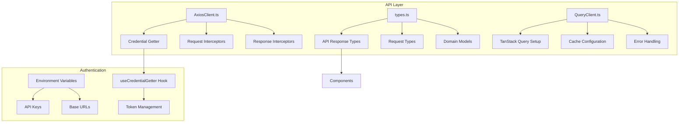
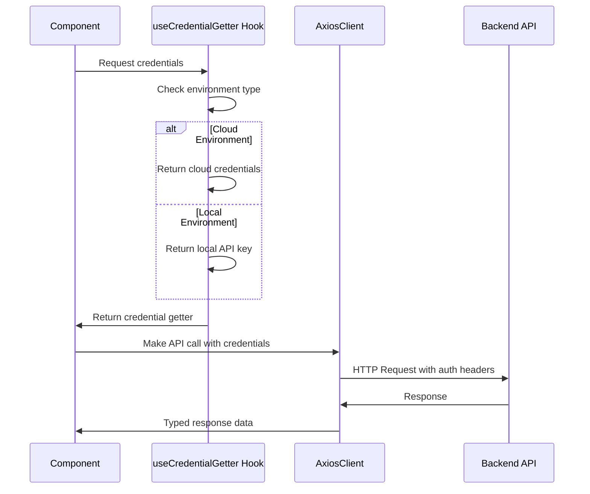
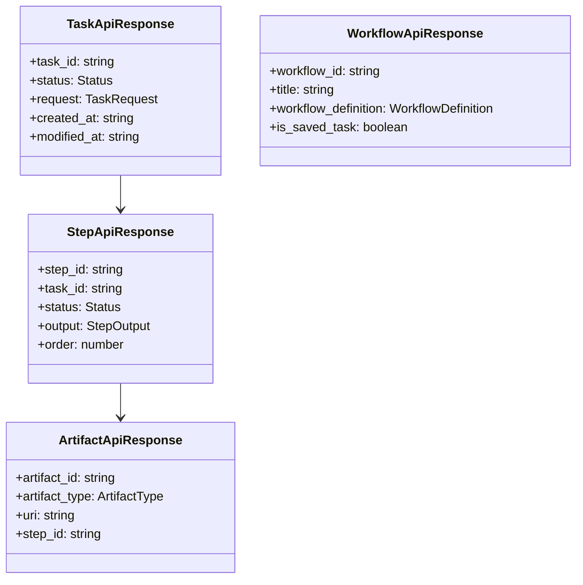
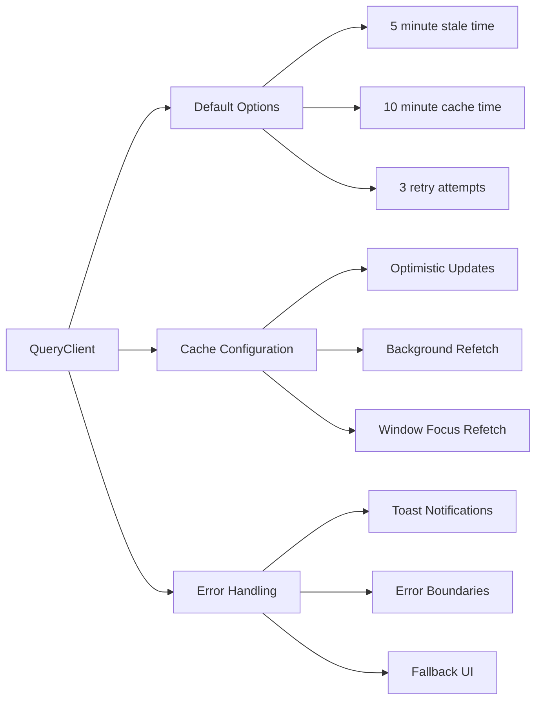
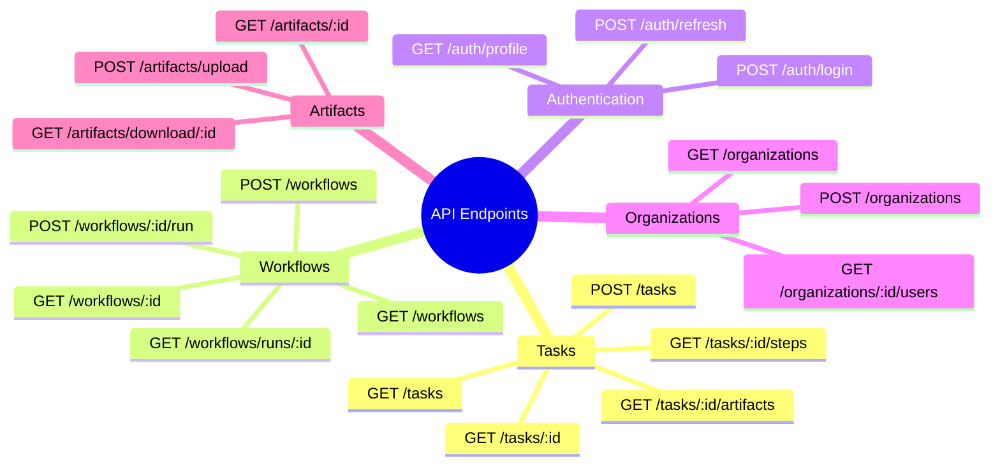
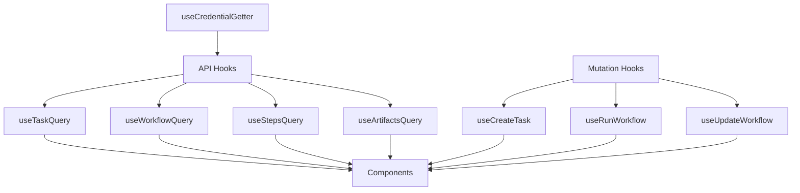
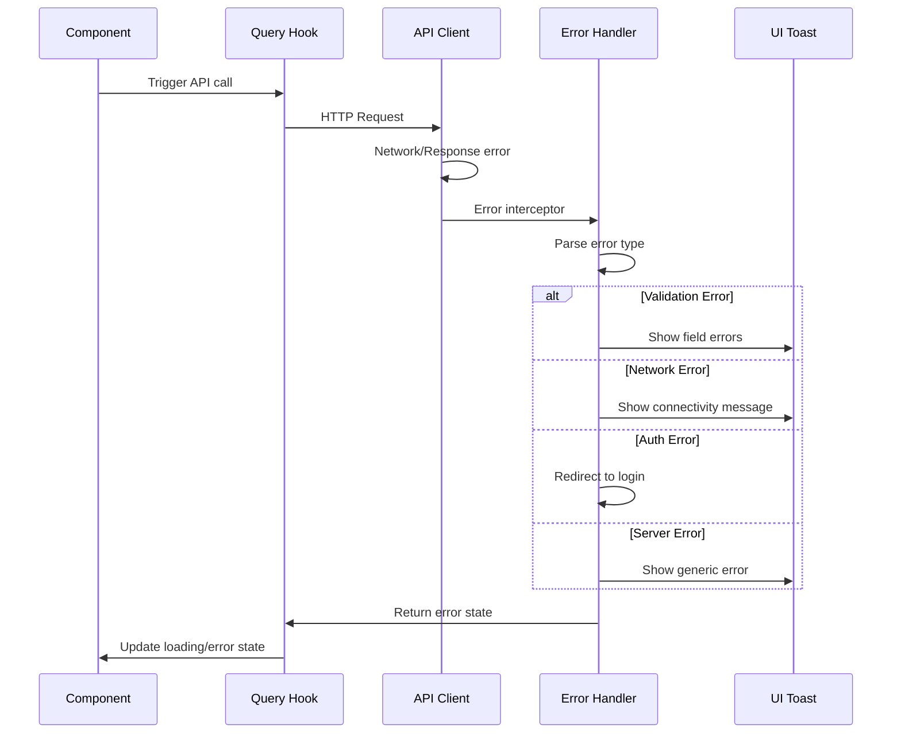
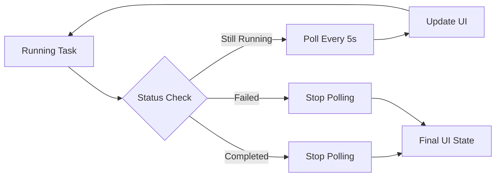

# 🔗 Phase 11.1: API Integration & Client Architecture

## 📋 **API Layer Overview**

The Skyvern frontend implements a sophisticated API client system for seamless backend communication.

---

## 🏗️ **API Client Architecture**

### **Core API Structure**



---

## 🔐 **Authentication System**

### **Credential Management Flow**



### **Environment Configuration**

```typescript
// Environment-based credential system
interface CredentialGetter {
  apiKey?: string;
  organization?: string;
  environment: 'local' | 'cloud';
}

// Usage in components
const credentialGetter = useCredentialGetter();
const client = await getClient(credentialGetter);
```

---

## 📝 **Type System Architecture**

### **Core API Types Structure**



### **Status Enumeration System**

```typescript
export enum Status {
  Created = "created",
  Running = "running", 
  Failed = "failed",
  Terminated = "terminated",
  Completed = "completed",
  TimedOut = "timed_out",
  Canceled = "canceled"
}

// Type guards for status checking
export function statusIsNotFinalized(status: Status): boolean {
  return ![Status.Completed, Status.Failed, Status.Terminated, 
           Status.TimedOut, Status.Canceled].includes(status);
}
```

---

## 🔄 **Query Client Configuration**

### **TanStack Query Setup**



### **Query Configuration Details**

```typescript
export const queryClient = new QueryClient({
  defaultOptions: {
    queries: {
      staleTime: 5 * 60 * 1000,      // 5 minutes
      gcTime: 10 * 60 * 1000,        // 10 minutes  
      retry: 3,
      refetchOnWindowFocus: true,
      refetchOnReconnect: true
    },
    mutations: {
      retry: 1,
      onError: (error) => {
        toast({
          title: "Operation Failed",
          description: error.message,
          variant: "destructive"
        });
      }
    }
  }
});
```

---

## 🌐 **API Endpoints Structure**

### **Endpoint Categories**



### **Request/Response Patterns**

```typescript
// Standardized API patterns
interface BaseApiResponse {
  created_at: string;
  modified_at: string;
}

interface PaginatedResponse<T> {
  items: T[];
  total: number;
  page: number;
  size: number;
}

interface ErrorResponse {
  error: string;
  message: string;
  details?: Record<string, any>;
}
```

---

## 🎯 **Custom Hooks Pattern**

### **API Hook Architecture**



### **Hook Implementation Example**

```typescript
// Custom query hook with error handling
export function useTaskQuery(taskId: string) {
  const credentialGetter = useCredentialGetter();
  
  return useQuery<TaskApiResponse>({
    queryKey: ["task", taskId],
    queryFn: async () => {
      const client = await getClient(credentialGetter);
      return client.get(`/tasks/${taskId}`)
        .then(response => response.data);
    },
    enabled: !!taskId,
    staleTime: 30 * 1000, // 30 seconds for real-time data
    refetchInterval: (data) => 
      statusIsNotFinalized(data?.status) ? 5000 : false
  });
}
```

---

## 🛡️ **Error Handling Strategy**

### **Error Handling Flow**



### **Error Types & Handling**

```typescript
// Comprehensive error handling
interface ApiError {
  status: number;
  message: string;
  details?: Record<string, string[]>;
}

// Error categorization
function handleApiError(error: AxiosError): void {
  if (error.response?.status === 401) {
    // Authentication error - redirect to login
    window.location.href = '/login';
  } else if (error.response?.status === 422) {
    // Validation error - show field errors
    showValidationErrors(error.response.data.details);
  } else if (error.response?.status >= 500) {
    // Server error - show generic message
    toast({
      title: "Server Error",
      description: "Please try again later",
      variant: "destructive"
    });
  }
}
```

---

## 📊 **Real-time Data Handling**

### **Polling Strategy for Live Updates**



### **WebSocket Integration**

```typescript
// Real-time updates for automation streams
interface StreamMessage {
  task_id: string;
  status: string;
  screenshot?: string;
  action_taken?: string;
}

// WebSocket connection for live browser streaming
const wssBaseUrl = import.meta.env.VITE_WSS_BASE_URL;
const ws = new WebSocket(`${wssBaseUrl}/stream/${taskId}`);
```

---

## 🎯 **Key Implementation Insights**

### **Best Practices Applied**

1. **Type Safety** - Full TypeScript coverage for API contracts
2. **Error Boundaries** - Graceful error handling at all levels  
3. **Caching Strategy** - Optimized data fetching and updates
4. **Real-time Updates** - Polling and WebSocket integration
5. **Environment Flexibility** - Supports local and cloud deployments
6. **Performance** - Efficient query invalidation and background updates

### **Architecture Benefits**

- **Maintainable** - Clear separation of concerns
- **Testable** - Isolated API logic with dependency injection
- **Scalable** - Easy to add new endpoints and features
- **Reliable** - Comprehensive error handling and retry logic

---

*This API integration layer provides the foundation for all frontend-backend communication in the Skyvern application.*