# 🧩 Phase 11.2: Component Architecture & UI System

## 🎨 **Component System Overview**

Skyvern's frontend employs a sophisticated component architecture built on Shadcn/UI and Radix primitives.

---

## 🏗️ **Component Hierarchy**

### **Three-Layer Architecture**

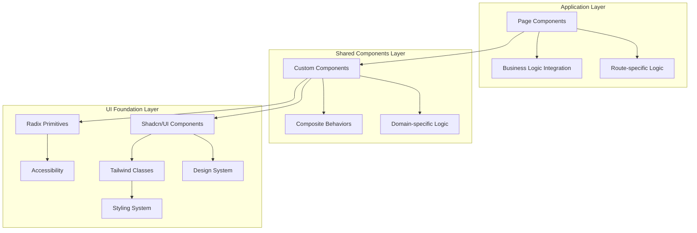

---

## 🔧 **Core UI Components**

### **Form & Input Components**

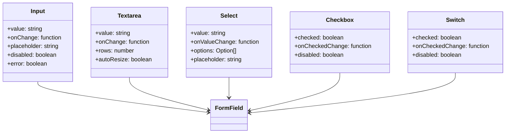

### **Display & Feedback Components**

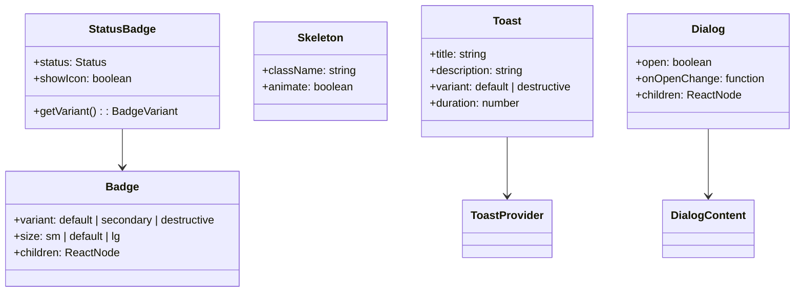

---

## 🎯 **Custom Component Patterns**

### **Auto-Resizing Textarea**

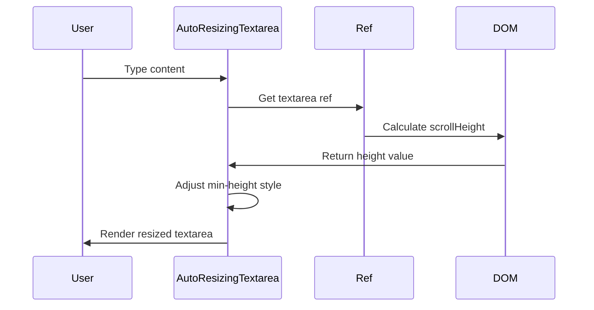

```typescript
// Implementation pattern
export function AutoResizingTextarea({ value, onChange, ...props }) {
  const textareaRef = useRef<HTMLTextAreaElement>(null);
  
  useLayoutEffect(() => {
    const textarea = textareaRef.current;
    if (textarea) {
      textarea.style.height = 'auto';
      textarea.style.height = `${textarea.scrollHeight}px`;
    }
  }, [value]);
  
  return (
    <Textarea
      ref={textareaRef}
      value={value}
      onChange={onChange}
      className="resize-none overflow-hidden"
      {...props}
    />
  );
}
```

### **Zoomable Image Component**

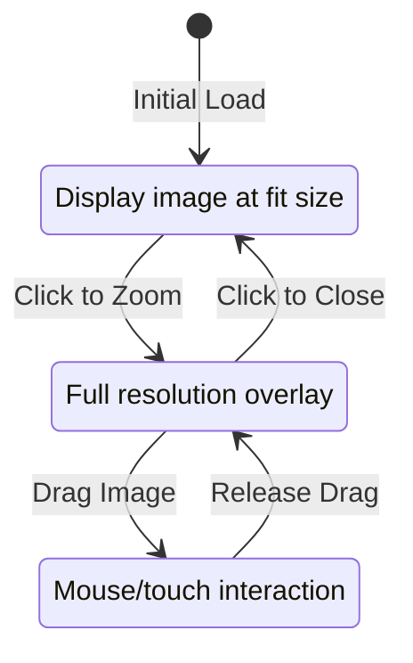

---

## 📊 **Data Display Components**

### **Table System Architecture**

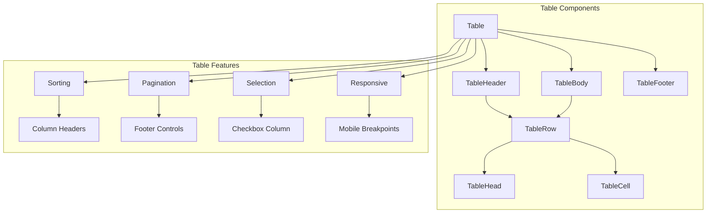

### **Card System Pattern**

```typescript
// Flexible card composition
interface CardProps {
  children: ReactNode;
  className?: string;
  variant?: 'default' | 'elevated' | 'outlined';
}

// Usage pattern in lists
function TaskCard({ task }: { task: TaskApiResponse }) {
  return (
    <Card className="hover:shadow-lg transition-shadow">
      <CardHeader>
        <CardTitle>{task.request.navigation_goal}</CardTitle>
        <CardDescription>
          <StatusBadge status={task.status} />
        </CardDescription>
      </CardHeader>
      <CardContent>
        <p>URL: {task.request.url}</p>
        <p>Created: {timeFormatWithShortDate(task.created_at)}</p>
      </CardContent>
    </Card>
  );
}
```

---

## 🎨 **Design System Implementation**

### **Theme Configuration**

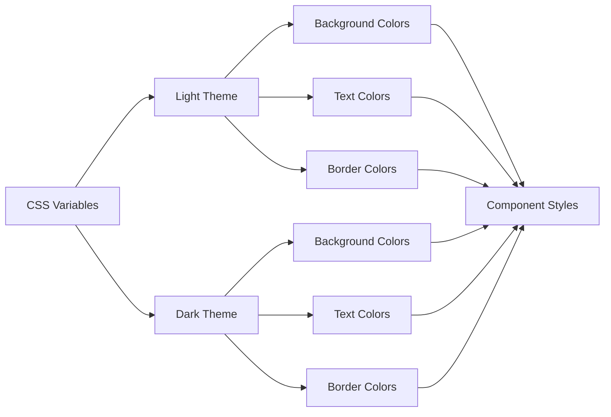

### **Color System Structure**

```css
:root {
  /* Base colors */
  --background: 0 0% 100%;
  --foreground: 222.2 84% 4.9%;
  
  /* Component colors */
  --card: 0 0% 100%;
  --card-foreground: 222.2 84% 4.9%;
  
  --popover: 0 0% 100%;
  --popover-foreground: 222.2 84% 4.9%;
  
  /* State colors */
  --primary: 222.2 47.4% 11.2%;
  --primary-foreground: 210 40% 98%;
  
  --secondary: 210 40% 96%;
  --secondary-foreground: 222.2 84% 4.9%;
  
  --destructive: 0 84.2% 60.2%;
  --destructive-foreground: 210 40% 98%;
}

.dark {
  --background: 222.2 84% 4.9%;
  --foreground: 210 40% 98%;
  /* ... dark theme overrides */
}
```

---

## 🔄 **State Management in Components**

### **Local State Patterns**

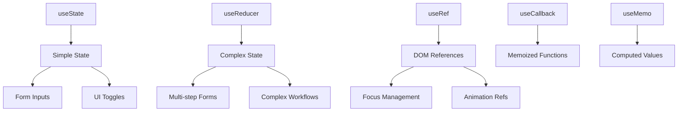

### **Global State Integration**

```typescript
// Store integration pattern
function WorkflowEditor() {
  // Global stores
  const { collapsed, setCollapsed } = useSidebarStore();
  const { environment } = useSettingsStore();
  const { clientId } = useClientIdStore();
  
  // Server state
  const { data: workflow, isLoading } = useWorkflowQuery(workflowId);
  
  // Local state
  const [selectedNode, setSelectedNode] = useState<string | null>(null);
  
  return (
    <div className={cn("flex", collapsed && "sidebar-collapsed")}>
      {/* Component implementation */}
    </div>
  );
}
```

---

## 🎪 **Specialized Components**

### **Browser Stream Component**

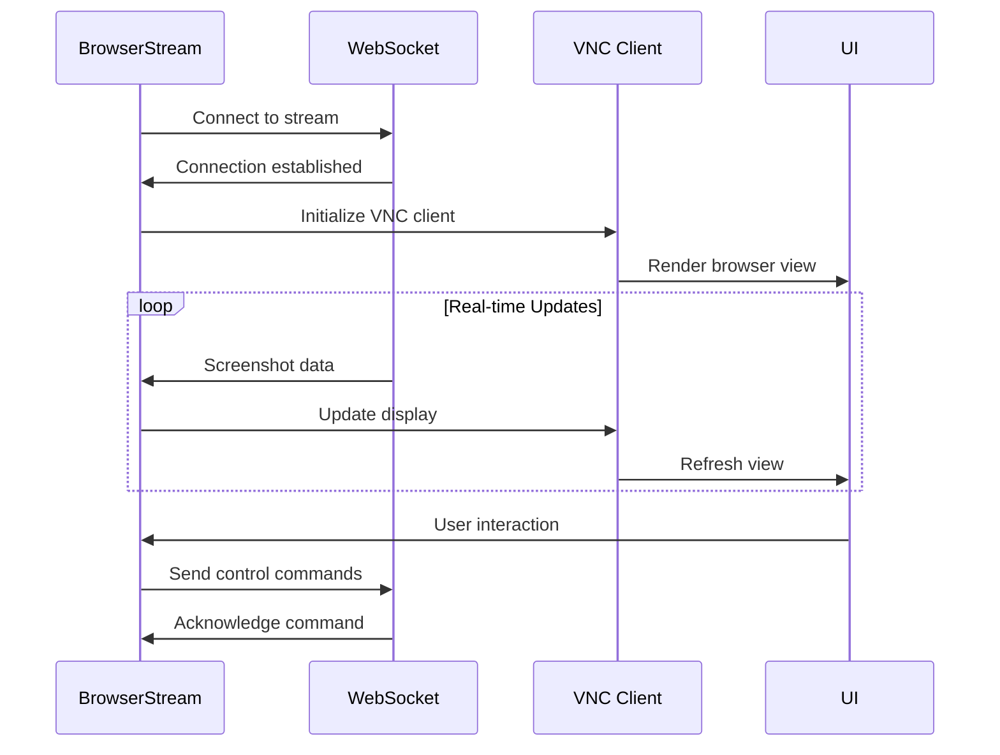

### **Code Editor Integration**

```typescript
// Monaco Editor wrapper
interface CodeEditorProps {
  value: string;
  onChange?: (value: string) => void;
  language: 'json' | 'python' | 'javascript';
  readOnly?: boolean;
  height?: string;
}

function CodeEditor({ value, onChange, language, readOnly, height = "200px" }: CodeEditorProps) {
  return (
    <div className="border rounded-md overflow-hidden">
      <MonacoEditor
        height={height}
        language={language}
        value={value}
        onChange={onChange}
        options={{
          readOnly,
          minimap: { enabled: false },
          lineNumbers: 'on',
          wordWrap: 'on',
          theme: 'vs-dark'
        }}
      />
    </div>
  );
}
```

---

## 📱 **Responsive Design Strategy**

### **Breakpoint System**

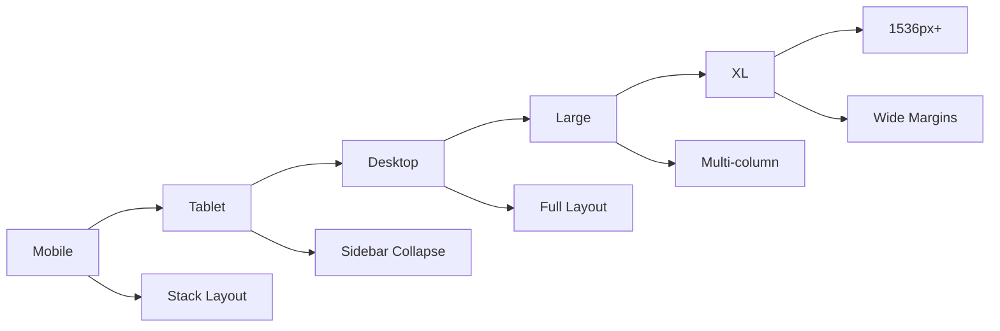

### **Responsive Patterns**

```typescript
// Responsive component pattern
function TaskDetail() {
  return (
    <div className="flex flex-col lg:flex-row gap-6">
      {/* Main content - full width on mobile, 2/3 on desktop */}
      <div className="w-full lg:w-2/3 space-y-4">
        <TaskOverview />
        <TaskSteps />
      </div>
      
      {/* Sidebar - bottom on mobile, 1/3 on desktop */}  
      <div className="w-full lg:w-1/3">
        <TaskSidebar />
      </div>
    </div>
  );
}
```

---

## ♿ **Accessibility Implementation**

### **ARIA Integration**

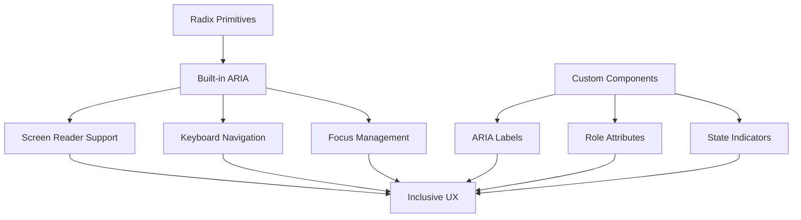

### **Keyboard Navigation**

```typescript
// Accessible modal pattern
function AccessibleDialog({ children, ...props }) {
  return (
    <Dialog {...props}>
      <DialogContent className="focus:outline-none">
        <DialogHeader>
          <DialogTitle>Dialog Title</DialogTitle>
          <DialogDescription>
            Dialog description for screen readers
          </DialogDescription>
        </DialogHeader>
        
        <div className="focus-within:ring-2 focus-within:ring-primary">
          {children}
        </div>
        
        <DialogFooter>
          <Button variant="outline" onClick={onCancel}>
            Cancel
          </Button>
          <Button onClick={onConfirm}>
            Confirm
          </Button>
        </DialogFooter>
      </DialogContent>
    </Dialog>
  );
}
```

---

## 🎯 **Performance Optimization**

### **Component Optimization Strategies**

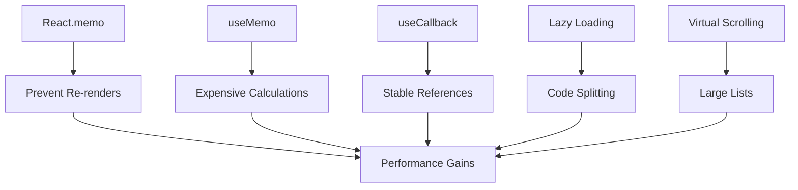

### **Lazy Loading Implementation**

```typescript
// Route-based code splitting
const TaskDetail = lazy(() => import('./routes/tasks/detail/TaskDetail'));
const WorkflowEditor = lazy(() => import('./routes/workflows/editor/WorkflowEditor'));

function App() {
  return (
    <Suspense fallback={<PageSkeleton />}>
      <Routes>
        <Route path="/tasks/:taskId" element={<TaskDetail />} />
        <Route path="/workflows/:workflowId/edit" element={<WorkflowEditor />} />
      </Routes>
    </Suspense>
  );
}

// Component-level lazy loading
const HeavyChart = lazy(() => import('./components/HeavyChart'));

function Dashboard() {
  const [showChart, setShowChart] = useState(false);
  
  return (
    <div>
      <Button onClick={() => setShowChart(true)}>
        Load Chart
      </Button>
      
      {showChart && (
        <Suspense fallback={<Skeleton className="h-64" />}>
          <HeavyChart />
        </Suspense>
      )}
    </div>
  );
}
```

---

## 🔧 **Component Testing Patterns**

### **Testing Strategy**

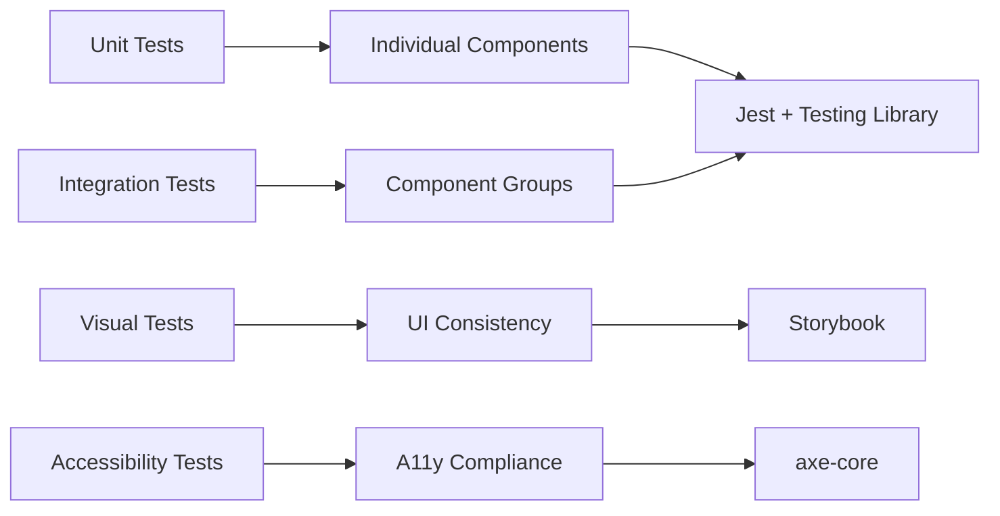

### **Component Test Example**

```typescript
// Component testing pattern
import { render, screen, fireEvent } from '@testing-library/react';
import { StatusBadge } from './StatusBadge';
import { Status } from '@/api/types';

describe('StatusBadge', () => {
  it('renders correct variant for completed status', () => {
    render(<StatusBadge status={Status.Completed} />);
    
    const badge = screen.getByRole('status');
    expect(badge).toHaveClass('bg-green-100');
    expect(badge).toHaveTextContent('completed');
  });
  
  it('shows loading state for running status', () => {
    render(<StatusBadge status={Status.Running} />);
    
    const badge = screen.getByRole('status');
    expect(badge).toHaveClass('bg-blue-100');
    expect(badge).toHaveAttribute('aria-label', 'Task is running');
  });
});
```

---

## 🎨 **Advanced Component Patterns**

### **Compound Component Pattern**

```typescript
// Flexible API design
interface CardApi {
  Card: React.FC<CardProps>;
  Header: React.FC<CardHeaderProps>;
  Title: React.FC<CardTitleProps>;
  Description: React.FC<CardDescriptionProps>;
  Content: React.FC<CardContentProps>;
  Footer: React.FC<CardFooterProps>;
}

// Usage provides flexibility
function TaskCard() {
  return (
    <Card.Card>
      <Card.Header>
        <Card.Title>Task Name</Card.Title>
        <Card.Description>
          <StatusBadge status={task.status} />
        </Card.Description>
      </Card.Header>
      <Card.Content>
        <TaskDetails />
      </Card.Content>
      <Card.Footer>
        <TaskActions />
      </Card.Footer>
    </Card.Card>
  );
}
```

### **Render Props Pattern**

```typescript
// Flexible data fetching component
interface DataFetcherProps<T> {
  queryKey: string[];
  queryFn: () => Promise<T>;
  children: (props: {
    data: T | undefined;
    isLoading: boolean;
    error: Error | null;
  }) => ReactNode;
}

function DataFetcher<T>({ queryKey, queryFn, children }: DataFetcherProps<T>) {
  const { data, isLoading, error } = useQuery({ queryKey, queryFn });
  
  return <>{children({ data, isLoading, error })}</>;
}

// Usage
function TaskList() {
  return (
    <DataFetcher
      queryKey={['tasks']}
      queryFn={fetchTasks}
    >
      {({ data: tasks, isLoading, error }) => {
        if (isLoading) return <TaskListSkeleton />;
        if (error) return <ErrorMessage error={error} />;
        return <TaskGrid tasks={tasks} />;
      }}
    </DataFetcher>
  );
}
```

---

## 🎯 **Key Architecture Benefits**

### **Maintainability Features**

1. **Consistent Design System** - Unified look and feel
2. **Reusable Components** - DRY principle applied
3. **Type Safety** - Full TypeScript integration
4. **Accessibility Built-in** - WCAG compliance by default
5. **Performance Optimized** - Lazy loading and memoization
6. **Testing Ready** - Testable component structure

### **Developer Experience**

- **Hot Reloading** - Fast development cycle
- **Component Documentation** - Self-documenting props
- **Error Boundaries** - Graceful error handling
- **DevTools Integration** - React and Zustand devtools
- **Linting & Formatting** - Consistent code style

### **Scalability Considerations**

- **Modular Architecture** - Easy to extend and modify
- **Separation of Concerns** - Clear responsibility boundaries
- **State Management** - Predictable data flow
- **Code Splitting** - Efficient bundle management
- **Component Library** - Reusable across projects

---

*This component architecture provides a robust foundation for building scalable, maintainable, and accessible user interfaces in the Skyvern application.*