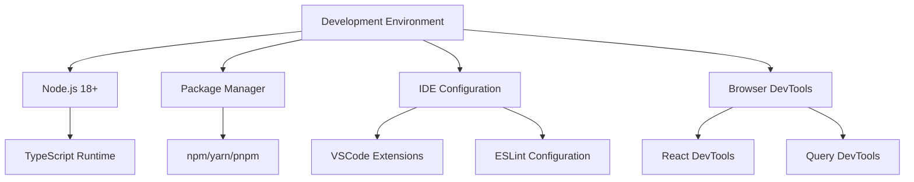
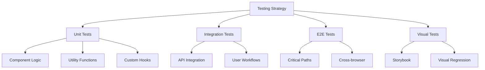
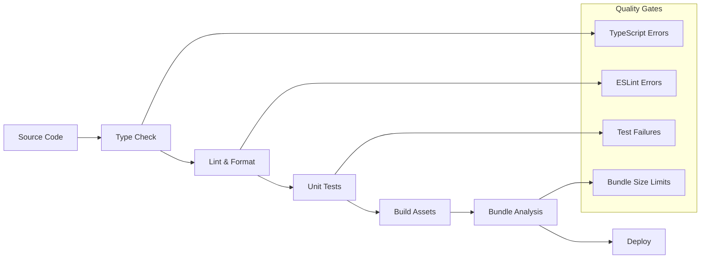
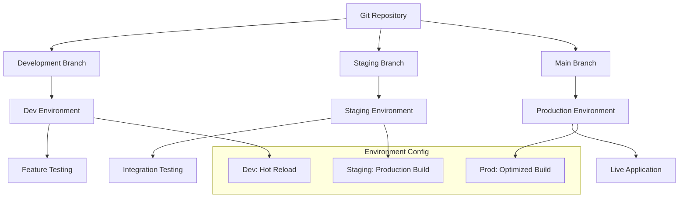
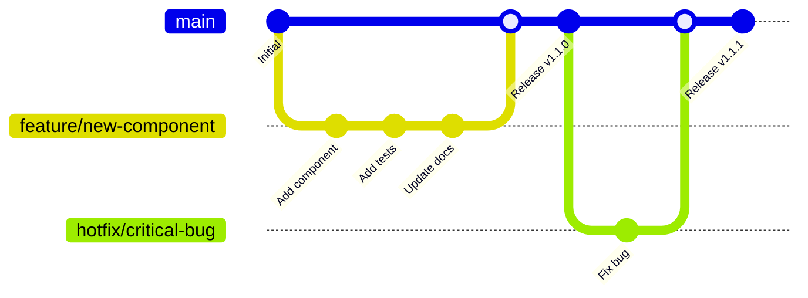
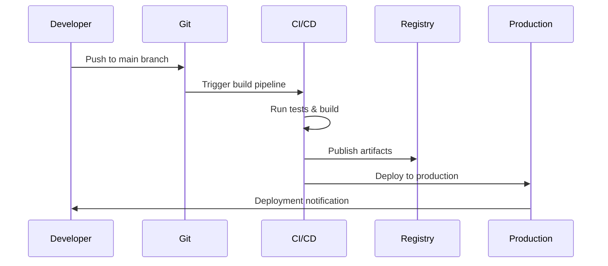

# 🚀 Phase 11.5: Development Workflow & Deployment

## 🔄 **Development Lifecycle Overview**

Comprehensive guide to developing, testing, and deploying the Skyvern frontend application.

---

## 🛠️ **Development Environment Setup**

### **Local Development Stack**



### **Package.json Scripts**

```json
{
  "name": "skyvern-frontend",
  "private": true,
  "version": "0.0.0",
  "type": "module",
  "scripts": {
    "dev": "vite",
    "build": "tsc && vite build",
    "preview": "vite preview",
    "lint": "eslint . --ext ts,tsx --report-unused-disable-directives --max-warnings 0",
    "lint:fix": "eslint . --ext ts,tsx --fix",
    "type-check": "tsc --noEmit",
    "format": "prettier --write \"src/**/*.{ts,tsx,js,jsx,json,css,md}\"",
    "format:check": "prettier --check \"src/**/*.{ts,tsx,js,jsx,json,css,md}\"",
    "test": "vitest",
    "test:ui": "vitest --ui",
    "test:coverage": "vitest run --coverage",
    "storybook": "storybook dev -p 6006",
    "build-storybook": "storybook build",
    "analyze": "npx vite-bundle-analyzer dist/stats.html"
  },
  "dependencies": {
    "react": "^18.2.0",
    "react-dom": "^18.2.0",
    "react-router-dom": "^6.15.0",
    "@tanstack/react-query": "^4.32.6",
    "zustand": "^4.4.1",
    "axios": "^1.5.0",
    "@radix-ui/react-dialog": "^1.0.4",
    "@radix-ui/react-select": "^1.2.2",
    "tailwindcss": "^3.3.3",
    "clsx": "^2.0.0",
    "tailwind-merge": "^1.14.0",
    "lucide-react": "^0.263.1",
    "monaco-editor": "^0.41.0",
    "@monaco-editor/react": "^4.5.2",
    "posthog-js": "^1.77.2"
  },
  "devDependencies": {
    "@types/react": "^18.2.15",
    "@types/react-dom": "^18.2.7",
    "@typescript-eslint/eslint-plugin": "^6.0.0",
    "@typescript-eslint/parser": "^6.0.0",
    "@vitejs/plugin-react-swc": "^3.3.2",
    "eslint": "^8.45.0",
    "eslint-plugin-react-hooks": "^4.6.0",
    "eslint-plugin-react-refresh": "^0.4.3",
    "prettier": "^3.0.0",
    "prettier-plugin-tailwindcss": "^0.5.3",
    "typescript": "^5.0.2",
    "vite": "^4.4.5",
    "vitest": "^0.34.1",
    "@testing-library/react": "^13.4.0",
    "@testing-library/jest-dom": "^6.1.0",
    "@storybook/react": "^7.4.0",
    "@storybook/react-vite": "^7.4.0"
  }
}
```

---

## 🔍 **Code Quality & Standards**

### **ESLint Configuration**

```mermaid
graph TB
    A[ESLint Rules] --> B[TypeScript Rules]
    A --> C[React Rules]
    A --> D[Import Rules]
    A --> E[Accessibility Rules]
    
    B --> F[@typescript-eslint/recommended]
    C --> G[react-hooks/recommended]
    C --> H[react-refresh/only-export-components]
    D --> I[import/order]
    E --> J[jsx-a11y/recommended]
```

### **ESLint Configuration File**

```javascript
// .eslintrc.js
module.exports = {
  root: true,
  env: { 
    browser: true, 
    es2020: true 
  },
  extends: [
    'eslint:recommended',
    '@typescript-eslint/recommended',
    'plugin:react-hooks/recommended',
    'plugin:jsx-a11y/recommended',
    'plugin:import/recommended',
    'plugin:import/typescript'
  ],
  ignorePatterns: [
    'dist',
    '.eslintrc.js',
    'vite.config.ts',
    'tailwind.config.js'
  ],
  parser: '@typescript-eslint/parser',
  parserOptions: {
    ecmaVersion: 'latest',
    sourceType: 'module',
    ecmaFeatures: {
      jsx: true
    }
  },
  plugins: [
    'react-refresh',
    '@typescript-eslint',
    'jsx-a11y',
    'import'
  ],
  rules: {
    // React specific rules
    'react-refresh/only-export-components': [
      'warn',
      { allowConstantExport: true }
    ],
    'react-hooks/exhaustive-deps': 'warn',
    
    // TypeScript rules
    '@typescript-eslint/no-unused-vars': [
      'error',
      { argsIgnorePattern: '^_' }
    ],
    '@typescript-eslint/explicit-function-return-type': 'off',
    '@typescript-eslint/explicit-module-boundary-types': 'off',
    '@typescript-eslint/no-explicit-any': 'warn',
    
    // Import organization
    'import/order': [
      'error',
      {
        groups: [
          'builtin',
          'external',
          'internal',
          'parent',
          'sibling',
          'index'
        ],
        'newlines-between': 'always',
        alphabetize: {
          order: 'asc',
          caseInsensitive: true
        }
      }
    ],
    
    // Accessibility
    'jsx-a11y/anchor-is-valid': 'off', // Next.js Link handling
    'jsx-a11y/click-events-have-key-events': 'warn',
    'jsx-a11y/no-noninteractive-element-interactions': 'warn',
    
    // General code quality
    'no-console': ['warn', { allow: ['warn', 'error'] }],
    'prefer-const': 'error',
    'no-var': 'error'
  },
  settings: {
    'import/resolver': {
      typescript: {
        alwaysTryTypes: true,
        project: './tsconfig.json'
      }
    },
    react: {
      version: 'detect'
    }
  }
};
```

### **Prettier Configuration**

```javascript
// .prettierrc.js
module.exports = {
  semi: true,
  trailingComma: 'es5',
  singleQuote: true,
  printWidth: 80,
  tabWidth: 2,
  useTabs: false,
  bracketSpacing: true,
  bracketSameLine: false,
  arrowParens: 'avoid',
  endOfLine: 'lf',
  plugins: ['prettier-plugin-tailwindcss']
};
```

---

## 🧪 **Testing Strategy**

### **Testing Pyramid**



### **Vitest Configuration**

```typescript
// vitest.config.ts
import { defineConfig } from 'vitest/config';
import react from '@vitejs/plugin-react-swc';
import path from 'path';

export default defineConfig({
  plugins: [react()],
  test: {
    globals: true,
    environment: 'jsdom',
    setupFiles: ['./src/test/setup.ts'],
    css: true,
    reporters: ['verbose'],
    coverage: {
      reporter: ['text', 'json', 'html'],
      exclude: [
        'node_modules/',
        'src/test/',
        '**/*.d.ts',
        '**/*.config.*',
        'dist/'
      ],
      thresholds: {
        global: {
          branches: 80,
          functions: 80,
          lines: 80,
          statements: 80
        }
      }
    }
  },
  resolve: {
    alias: {
      '@': path.resolve(__dirname, './src')
    }
  }
});
```

### **Test Setup and Utilities**

```typescript
// src/test/setup.ts
import '@testing-library/jest-dom';
import { cleanup } from '@testing-library/react';
import { afterEach, beforeAll, vi } from 'vitest';

// Cleanup after each test
afterEach(() => {
  cleanup();
});

// Mock environment variables
beforeAll(() => {
  Object.defineProperty(window, 'matchMedia', {
    writable: true,
    value: vi.fn().mockImplementation(query => ({
      matches: false,
      media: query,
      onchange: null,
      addListener: vi.fn(),
      removeListener: vi.fn(),
      addEventListener: vi.fn(),
      removeEventListener: vi.fn(),
      dispatchEvent: vi.fn(),
    })),
  });

  // Mock ResizeObserver
  global.ResizeObserver = vi.fn().mockImplementation(() => ({
    observe: vi.fn(),
    unobserve: vi.fn(),
    disconnect: vi.fn(),
  }));

  // Mock IntersectionObserver
  global.IntersectionObserver = vi.fn().mockImplementation(() => ({
    observe: vi.fn(),
    unobserve: vi.fn(),
    disconnect: vi.fn(),
  }));
});
```

### **Component Testing Examples**

```typescript
// src/components/__tests__/StatusBadge.test.tsx
import { render, screen } from '@testing-library/react';
import { describe, it, expect } from 'vitest';

import { StatusBadge } from '../StatusBadge';
import { Status } from '@/api/types';

describe('StatusBadge', () => {
  it('renders completed status with correct styling', () => {
    render(<StatusBadge status={Status.Completed} />);
    
    const badge = screen.getByRole('status');
    expect(badge).toBeInTheDocument();
    expect(badge).toHaveTextContent('completed');
    expect(badge).toHaveClass('bg-green-100', 'text-green-800');
  });

  it('renders running status with loading indicator', () => {
    render(<StatusBadge status={Status.Running} showIcon />);
    
    const badge = screen.getByRole('status');
    expect(badge).toHaveClass('bg-blue-100', 'text-blue-800');
    
    const loadingIcon = screen.getByTestId('loading-spinner');
    expect(loadingIcon).toBeInTheDocument();
  });

  it('applies custom className', () => {
    render(
      <StatusBadge 
        status={Status.Failed} 
        className="custom-class" 
      />
    );
    
    const badge = screen.getByRole('status');
    expect(badge).toHaveClass('custom-class');
  });
});

// src/hooks/__tests__/useCredentialGetter.test.tsx
import { renderHook } from '@testing-library/react';
import { describe, it, expect, vi } from 'vitest';

import { useCredentialGetter } from '../useCredentialGetter';

// Mock environment
vi.mock('@/util/env', () => ({
  environment: 'local',
  envCredential: {
    apiKey: 'test-api-key',
    organization: 'test-org'
  }
}));

describe('useCredentialGetter', () => {
  it('returns local credentials in local environment', () => {
    const { result } = renderHook(() => useCredentialGetter());
    
    expect(result.current).toEqual({
      apiKey: 'test-api-key',
      organization: 'test-org'
    });
  });

  it('returns function for cloud credentials', () => {
    vi.doMock('@/util/env', () => ({
      environment: 'cloud'
    }));

    const { result } = renderHook(() => useCredentialGetter());
    
    expect(typeof result.current).toBe('function');
  });
});
```

---

## 📦 **Build & Deployment Process**

### **Build Pipeline**



### **Production Build Configuration**

```typescript
// vite.config.production.ts
import { defineConfig } from 'vite';
import react from '@vitejs/plugin-react-swc';
import { visualizer } from 'rollup-plugin-visualizer';

export default defineConfig({
  plugins: [
    react(),
    // Bundle analyzer for production builds
    visualizer({
      filename: 'dist/stats.html',
      open: true,
      gzipSize: true,
      brotliSize: true
    })
  ],
  
  build: {
    target: 'es2020',
    minify: 'terser',
    sourcemap: true,
    
    rollupOptions: {
      output: {
        manualChunks: {
          // Vendor libraries
          vendor: [
            'react', 
            'react-dom', 
            'react-router-dom'
          ],
          
          // UI components
          ui: [
            '@radix-ui/react-dialog',
            '@radix-ui/react-select',
            '@radix-ui/react-tabs',
            'lucide-react'
          ],
          
          // Data fetching
          api: [
            '@tanstack/react-query',
            'axios'
          ],
          
          // State management
          state: [
            'zustand'
          ],
          
          // Code editor (large dependency)
          editor: [
            'monaco-editor',
            '@monaco-editor/react'
          ],
          
          // Analytics
          analytics: [
            'posthog-js'
          ]
        }
      }
    },
    
    // Build optimizations
    terserOptions: {
      compress: {
        drop_console: true,
        drop_debugger: true
      }
    },
    
    // Bundle size warnings
    chunkSizeWarningLimit: 1000
  },
  
  // Production environment variables
  define: {
    __DEV__: false,
    'process.env.NODE_ENV': '"production"'
  }
});
```

---

## 🚀 **Deployment Strategies**

### **Multi-Environment Deployment**



### **Docker Configuration**

```dockerfile
# Dockerfile for production deployment
FROM node:18-alpine AS builder

# Set working directory
WORKDIR /app

# Copy package files
COPY package*.json ./
COPY yarn.lock ./

# Install dependencies
RUN yarn install --frozen-lockfile

# Copy source code
COPY . .

# Build application
RUN yarn build

# Production stage
FROM nginx:alpine AS production

# Copy built assets
COPY --from=builder /app/dist /usr/share/nginx/html

# Copy nginx configuration
COPY nginx.conf /etc/nginx/nginx.conf

# Expose port
EXPOSE 80

# Health check
HEALTHCHECK --interval=30s --timeout=3s --start-period=5s --retries=3 \
  CMD curl -f http://localhost/ || exit 1

# Start nginx
CMD ["nginx", "-g", "daemon off;"]
```

### **Nginx Configuration**

```nginx
# nginx.conf
events {
    worker_connections 1024;
}

http {
    include       /etc/nginx/mime.types;
    default_type  application/octet-stream;
    
    # Gzip compression
    gzip on;
    gzip_vary on;
    gzip_min_length 1024;
    gzip_types
        text/plain
        text/css
        text/xml
        text/javascript
        application/javascript
        application/xml+rss
        application/json;
    
    server {
        listen 80;
        server_name _;
        root /usr/share/nginx/html;
        index index.html;
        
        # Security headers
        add_header X-Frame-Options DENY;
        add_header X-Content-Type-Options nosniff;
        add_header X-XSS-Protection "1; mode=block";
        add_header Referrer-Policy strict-origin-when-cross-origin;
        
        # Cache static assets
        location ~* \.(js|css|png|jpg|jpeg|gif|ico|svg|woff|woff2|ttf|eot)$ {
            expires 1y;
            add_header Cache-Control "public, immutable";
        }
        
        # Handle client-side routing
        location / {
            try_files $uri $uri/ /index.html;
        }
        
        # API proxy (if needed)
        location /api/ {
            proxy_pass http://backend:8000/;
            proxy_set_header Host $host;
            proxy_set_header X-Real-IP $remote_addr;
            proxy_set_header X-Forwarded-For $proxy_add_x_forwarded_for;
            proxy_set_header X-Forwarded-Proto $scheme;
        }
    }
}
```

---

## 🔧 **Development Workflow**

### **Git Workflow**



### **Pre-commit Hooks**

```json
// .husky/pre-commit
#!/usr/bin/env sh
. "$(dirname -- "$0")/_/husky.sh"

# Run type checking
echo "🔍 Running TypeScript checks..."
npm run type-check

# Run linting
echo "🔧 Running ESLint..."
npm run lint

# Run formatting check
echo "💅 Checking code formatting..."
npm run format:check

# Run tests
echo "🧪 Running tests..."
npm run test -- --run

echo "✅ All checks passed!"
```

### **Release Process**



---

## 📊 **Monitoring & Analytics**

### **Performance Monitoring**

```typescript
// Performance monitoring setup
import { getCLS, getFID, getFCP, getLCP, getTTFB } from 'web-vitals';

function sendToAnalytics(metric: any) {
  // Send to your analytics service
  posthog.capture('performance_metric', {
    name: metric.name,
    value: metric.value,
    delta: metric.delta,
    rating: metric.rating
  });
}

// Measure Core Web Vitals
getCLS(sendToAnalytics);
getFID(sendToAnalytics);
getFCP(sendToAnalytics);
getLCP(sendToAnalytics);
getTTFB(sendToAnalytics);

// Custom performance tracking
function trackComponentRender(componentName: string, duration: number) {
  posthog.capture('component_render', {
    component: componentName,
    duration,
    timestamp: Date.now()
  });
}
```

### **Error Tracking**

```typescript
// Error boundary with reporting
class ErrorBoundary extends Component {
  constructor(props: any) {
    super(props);
    this.state = { hasError: false };
  }

  static getDerivedStateFromError(error: Error) {
    return { hasError: true };
  }

  componentDidCatch(error: Error, errorInfo: ErrorInfo) {
    // Report error to monitoring service
    posthog.capture('frontend_error', {
      error: error.message,
      stack: error.stack,
      componentStack: errorInfo.componentStack,
      timestamp: Date.now(),
      userAgent: navigator.userAgent,
      url: window.location.href
    });
    
    console.error('Error caught by boundary:', error, errorInfo);
  }

  render() {
    if (this.state.hasError) {
      return (
        <div className="flex items-center justify-center min-h-[400px]">
          <div className="text-center">
            <h2 className="text-lg font-semibold mb-2">
              Something went wrong
            </h2>
            <p className="text-muted-foreground mb-4">
              We've been notified and are working on a fix.
            </p>
            <Button onClick={() => window.location.reload()}>
              Reload Page
            </Button>
          </div>
        </div>
      );
    }

    return this.props.children;
  }
}
```

---

## 🎯 **Key Workflow Benefits**

### **Developer Experience**

1. **Fast Feedback** - Hot reloading and instant type checking
2. **Quality Assurance** - Automated testing and linting
3. **Consistent Standards** - Enforced code formatting and conventions
4. **Easy Debugging** - Source maps and development tools
5. **Efficient Builds** - Optimized bundle splitting and caching

### **Production Readiness**

- **Performance Optimized** - Minified bundles and compression
- **Security Hardened** - Security headers and Content Security Policy
- **Monitoring Enabled** - Error tracking and performance metrics
- **Scalable Infrastructure** - Container-based deployment
- **Reliable Deployments** - Automated CI/CD pipeline

---

*This comprehensive development workflow ensures high-quality, maintainable, and performant frontend applications.*