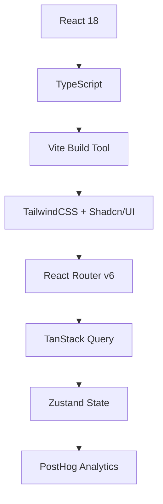
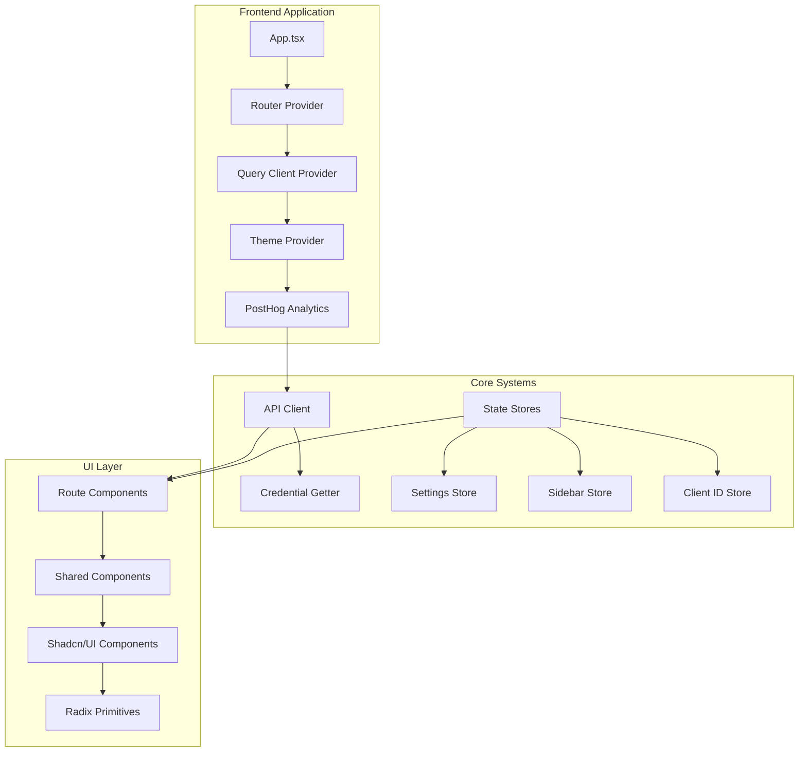

# 🖥️ Phase 11: Skyvern Frontend Application
## Complete Presentation Overview

### 📋 **Presentation Structure**

This comprehensive presentation is divided into multiple focused sections:

1. **[Main Overview](#main-overview)** - Frontend architecture and tech stack
2. **[API Integration](#api-integration)** - Client implementation and types  
3. **[Component Architecture](#component-architecture)** - UI building blocks
4. **[Routing & Navigation](#routing--navigation)** - Application pages and flows
5. **[Technical Deep Dive](#technical-deep-dive)** - Implementation details
6. **[Development Workflow](#development-workflow)** - Build and deployment

---

## 🎯 **Main Overview**

### **Frontend Technology Stack**



### **Key Learning Goals**
- ✅ **Frontend Architecture** - Modern React application structure
- ✅ **Component System** - Reusable UI building blocks  
- ✅ **API Integration** - Type-safe backend communication
- ✅ **User Interface** - Professional automation dashboard

### **Project Structure Overview**

```
skyvern-frontend/
├── src/
│   ├── api/                 # API client & types
│   ├── components/          # Reusable UI components
│   ├── routes/             # Page routing & navigation  
│   ├── store/              # State management
│   ├── util/               # Helper utilities
│   └── App.tsx             # Root application
├── public/                 # Static assets
└── package.json           # Dependencies & scripts
```

---

## 🔧 **Core Technologies Breakdown**

### **Build System & Development**
- **Vite** - Fast build tool and dev server (Port 8080)
- **TypeScript** - Type safety throughout application
- **PostCSS** - CSS processing with Tailwind
- **ESLint + Prettier** - Code quality and formatting

### **UI Framework Stack**
- **React 18** - Component-based UI library
- **TailwindCSS** - Utility-first CSS framework
- **Shadcn/UI** - High-quality component library
- **Radix UI** - Accessible primitive components
- **Lucide React** - Modern icon library

### **State & Data Management**
- **TanStack Query** - Server state management & caching
- **Zustand** - Client-side state management
- **React Router v6** - Client-side routing

### **Specialized Libraries**
- **NoVNC** - Browser streaming for automation viewing
- **Monaco Editor** - Code editing capabilities
- **React Hook Form** - Form handling and validation
- **PostHog** - User analytics and tracking

---

## 📊 **Application Architecture Diagram**



---

## 🎨 **Design System Overview**

### **Theme Configuration**
- **Dark Mode Primary** - Professional automation interface
- **Color Palette** - Consistent slate/gray theme
- **Component Variants** - Multiple size and style options
- **Responsive Design** - Mobile-first approach

### **Typography Scale**
- **Headers** - Clear hierarchy (h1-h6)
- **Body Text** - Readable content text
- **Code Text** - Monospace for technical content
- **Interactive Text** - Links and buttons

### **Component Categories**
- **Layout** - Container, Separator, AspectRatio
- **Navigation** - Tabs, Breadcrumb, Pagination
- **Forms** - Input, Textarea, Select, Checkbox
- **Feedback** - Toast, Dialog, Alert, Badge
- **Data Display** - Table, Card, Skeleton
- **Interactive** - Button, Switch, Slider

---

## 🚀 **Next Steps**

Each section of this presentation dives deep into specific aspects:

1. **API Integration** - How frontend communicates with backend
2. **Component Architecture** - Building blocks of the UI
3. **Routing System** - Navigation and page structure  
4. **Technical Implementation** - Code patterns and best practices

---

## 📈 **Success Metrics**

### **Performance Targets**
- Fast build times with Vite
- Efficient bundle splitting  
- Optimized re-renders with React Query
- Smooth user interactions

### **Developer Experience**
- Type safety with TypeScript
- Component reusability
- Consistent design system
- Easy debugging and testing

---

*This presentation provides a comprehensive overview of the Skyvern frontend application architecture, preparing you for deep dives into each major system.*