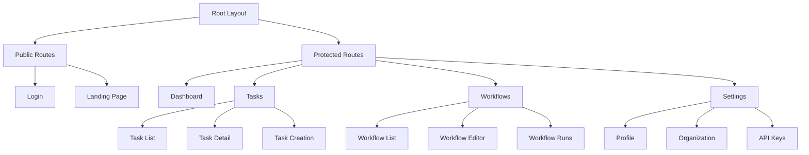
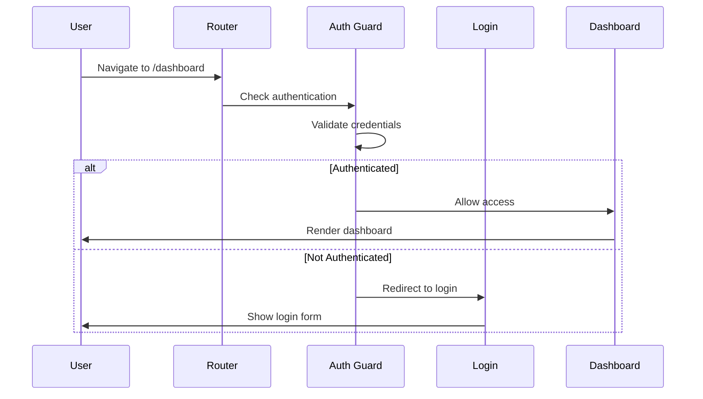
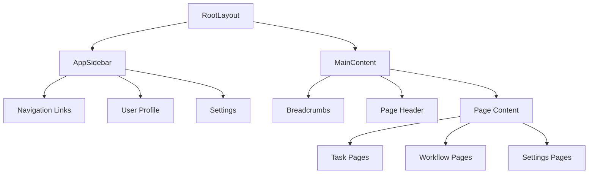
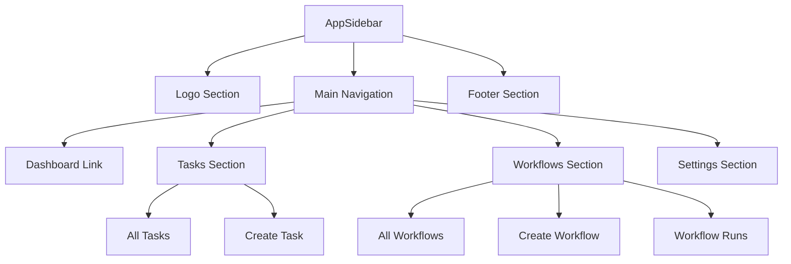
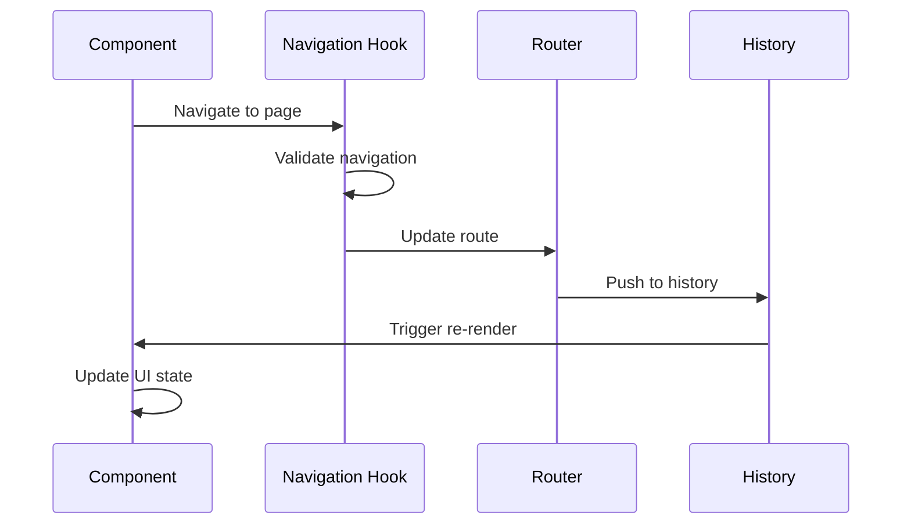
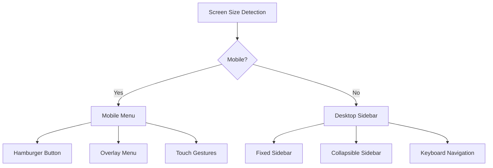
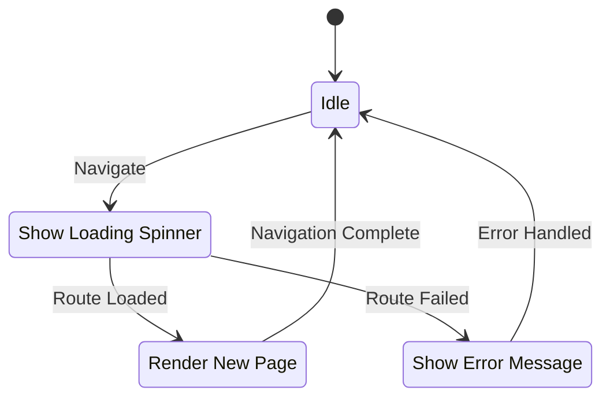

# 🧭 Phase 11.3: Routing & Navigation System

## 🗺️ **Application Routing Overview**

Skyvern uses React Router v6 for client-side routing with a sophisticated nested route structure.

---

## 🏗️ **Route Architecture**

### **Main Route Structure**



### **Nested Route Patterns**

```mermaid
graph LR
    A[/tasks] --> B[/tasks/:taskId]
    B --> C[/tasks/:taskId?step=1]
    B --> D[/tasks/:taskId?artifact=screenshot]
    
    E[/workflows] --> F[/workflows/:workflowId]
    F --> G[/workflows/:workflowId/edit]
    F --> H[/workflows/:workflowId/runs]
    H --> I[/workflows/:workflowId/runs/:runId]
```

---

## 🔐 **Authentication & Route Protection**

### **Route Guard Implementation**



### **Protected Route Component**

```typescript
// Route protection wrapper
function ProtectedRoute({ children }: { children: ReactNode }) {
  const credentialGetter = useCredentialGetter();
  const location = useLocation();
  
  // Check if user has valid credentials
  const isAuthenticated = credentialGetter?.apiKey || 
                         environment === 'local';
  
  if (!isAuthenticated) {
    // Redirect to login with return URL
    return <Navigate to="/login" state={{ from: location }} replace />;
  }
  
  return <>{children}</>;
}

// Usage in router configuration
const router = createBrowserRouter([
  {
    path: "/",
    element: <RootLayout />,
    children: [
      {
        path: "login",
        element: <LoginPage />
      },
      {
        path: "dashboard",
        element: (
          <ProtectedRoute>
            <Dashboard />
          </ProtectedRoute>
        )
      }
    ]
  }
]);
```

---

## 📄 **Page Structure & Layouts**

### **Layout Component Hierarchy**



### **Layout Implementation**

```typescript
// Root layout with sidebar and main content
function RootLayout() {
  const { collapsed } = useSidebarStore();
  
  return (
    <div className="flex h-screen bg-background">
      {/* Sidebar */}
      <aside className={cn(
        "border-r transition-all duration-300",
        collapsed ? "w-16" : "w-64"
      )}>
        <AppSidebar />
      </aside>
      
      {/* Main content area */}
      <main className="flex-1 flex flex-col overflow-hidden">
        <header className="border-b px-6 py-4">
          <Breadcrumbs />
        </header>
        
        <div className="flex-1 overflow-auto p-6">
          <Outlet />
        </div>
      </main>
    </div>
  );
}
```

---

## 🧩 **Dynamic Route Parameters**

### **Parameter Handling Patterns**

```mermaid
graph TB
    A[URL Parameters] --> B[Path Params]
    A --> C[Query Params]
    A --> D[State Params]
    
    B --> E[useParams Hook]
    C --> F[useSearchParams Hook]
    D --> G[useLocation Hook]
    
    E --> H[/tasks/:taskId]
    F --> I[?step=2&artifact=screenshot]
    G --> J[Navigation State]
```

### **Parameter Usage Examples**

```typescript
// Task detail page with multiple parameter types
function TaskDetail() {
  // Path parameters
  const { taskId } = useParams<{ taskId: string }>();
  
  // Query parameters for UI state
  const [searchParams, setSearchParams] = useSearchParams();
  const step = Number(searchParams.get('step')) || 0;
  const artifact = searchParams.get('artifact') || 'info';
  
  // Navigation state (from programmatic navigation)
  const location = useLocation();
  const fromWorkflow = location.state?.fromWorkflow;
  
  // Update URL without page reload
  const handleStepChange = (newStep: number) => {
    setSearchParams(params => {
      params.set('step', String(newStep));
      return params;
    }, { replace: true });
  };
  
  return (
    <div className="flex gap-6">
      <StepNavigation 
        activeStep={step}
        onStepChange={handleStepChange}
      />
      <StepArtifacts 
        stepId={steps?.[step]?.step_id}
        artifact={artifact}
      />
    </div>
  );
}
```

---

## 🔗 **Navigation Components**

### **Sidebar Navigation Structure**



### **Breadcrumb Implementation**

```typescript
// Dynamic breadcrumb generation
function Breadcrumbs() {
  const location = useLocation();
  const { taskId, workflowId } = useParams();
  
  // Generate breadcrumb items based on current route
  const breadcrumbItems = useMemo(() => {
    const items: BreadcrumbItem[] = [
      { label: 'Dashboard', href: '/dashboard' }
    ];
    
    if (location.pathname.startsWith('/tasks')) {
      items.push({ label: 'Tasks', href: '/tasks' });
      
      if (taskId) {
        items.push({ 
          label: `Task ${taskId.slice(0, 8)}...`, 
          href: `/tasks/${taskId}`,
          isCurrentPage: true
        });
      }
    }
    
    if (location.pathname.startsWith('/workflows')) {
      items.push({ label: 'Workflows', href: '/workflows' });
      
      if (workflowId) {
        items.push({ 
          label: 'Workflow Editor', 
          href: `/workflows/${workflowId}/edit`,
          isCurrentPage: true
        });
      }
    }
    
    return items;
  }, [location.pathname, taskId, workflowId]);
  
  return (
    <nav aria-label="Breadcrumb">
      <ol className="flex space-x-2">
        {breadcrumbItems.map((item, index) => (
          <li key={item.href} className="flex items-center">
            {index > 0 && <ChevronRightIcon className="w-4 h-4 mx-2" />}
            {item.isCurrentPage ? (
              <span className="text-foreground font-medium">
                {item.label}
              </span>
            ) : (
              <Link 
                to={item.href}
                className="text-muted-foreground hover:text-foreground"
              >
                {item.label}
              </Link>
            )}
          </li>
        ))}
      </ol>
    </nav>
  );
}
```

---

## 🎯 **Navigation State Management**

### **Navigation Context Pattern**



### **Custom Navigation Hooks**

```typescript
// Enhanced navigation with state management
function useAppNavigation() {
  const navigate = useNavigate();
  const location = useLocation();
  
  const navigateToTask = useCallback((taskId: string, options?: {
    step?: number;
    artifact?: string;
    preserveQuery?: boolean;
  }) => {
    const searchParams = new URLSearchParams();
    
    if (options?.step !== undefined) {
      searchParams.set('step', String(options.step));
    }
    
    if (options?.artifact) {
      searchParams.set('artifact', options.artifact);
    }
    
    // Preserve existing query params if requested
    if (options?.preserveQuery) {
      const currentParams = new URLSearchParams(location.search);
      currentParams.forEach((value, key) => {
        if (!searchParams.has(key)) {
          searchParams.set(key, value);
        }
      });
    }
    
    const query = searchParams.toString();
    navigate(`/tasks/${taskId}${query ? `?${query}` : ''}`);
  }, [navigate, location.search]);
  
  const navigateToWorkflow = useCallback((workflowId: string, action: 'view' | 'edit' | 'run') => {
    const routes = {
      view: `/workflows/${workflowId}`,
      edit: `/workflows/${workflowId}/edit`,
      run: `/workflows/${workflowId}/run`
    };
    
    navigate(routes[action]);
  }, [navigate]);
  
  return {
    navigateToTask,
    navigateToWorkflow,
    goBack: () => navigate(-1),
    goHome: () => navigate('/dashboard')
  };
}
```

---

## 📱 **Mobile Navigation**

### **Responsive Navigation Pattern**



### **Mobile Menu Implementation**

```typescript
// Responsive navigation component
function MobileNavigation() {
  const [isOpen, setIsOpen] = useState(false);
  const { collapsed, setCollapsed } = useSidebarStore();
  
  // Close menu when route changes
  const location = useLocation();
  useEffect(() => {
    setIsOpen(false);
  }, [location.pathname]);
  
  return (
    <>
      {/* Mobile menu button */}
      <Button
        variant="ghost"
        size="sm"
        className="md:hidden"
        onClick={() => setIsOpen(true)}
      >
        <MenuIcon className="w-5 h-5" />
      </Button>
      
      {/* Mobile overlay menu */}
      <AnimatePresence>
        {isOpen && (
          <motion.div
            initial={{ opacity: 0 }}
            animate={{ opacity: 1 }}
            exit={{ opacity: 0 }}
            className="fixed inset-0 z-50 md:hidden"
          >
            {/* Backdrop */}
            <div 
              className="absolute inset-0 bg-black/50"
              onClick={() => setIsOpen(false)}
            />
            
            {/* Menu content */}
            <motion.div
              initial={{ x: '-100%' }}
              animate={{ x: 0 }}
              exit={{ x: '-100%' }}
              className="absolute left-0 top-0 h-full w-64 bg-background border-r"
            >
              <MobileMenuContent onItemClick={() => setIsOpen(false)} />
            </motion.div>
          </motion.div>
        )}
      </AnimatePresence>
    </>
  );
}
```

---

## 🔄 **Route Transition Handling**

### **Loading States During Navigation**



### **Route Transition Component**

```typescript
// Global route transition handler
function RouteTransition() {
  const navigation = useNavigation();
  const location = useLocation();
  
  // Show loading state during navigation
  if (navigation.state === 'loading') {
    return (
      <div className="fixed inset-0 bg-background/80 backdrop-blur-sm z-50 flex items-center justify-center">
        <div className="flex items-center space-x-2">
          <Loader2Icon className="w-6 h-6 animate-spin" />
          <span>Loading...</span>
        </div>
      </div>
    );
  }
  
  return null;
}

// Page-level Suspense boundaries
function AppRouter() {
  return (
    <Router>
      <RouteTransition />
      <Suspense fallback={<PageSkeleton />}>
        <Routes>
          <Route path="/" element={<RootLayout />}>
            <Route index element={<Dashboard />} />
            <Route path="tasks/*" element={<TaskRoutes />} />
            <Route path="workflows/*" element={<WorkflowRoutes />} />
          </Route>
        </Routes>
      </Suspense>
    </Router>
  );
}
```

---

## 🎯 **Advanced Routing Features**

### **Dynamic Route Generation**

```typescript
// Generate routes based on user permissions
function generateRoutes(userPermissions: Permission[]) {
  const routes: RouteObject[] = [
    {
      path: '/',
      element: <RootLayout />,
      children: [
        {
          index: true,
          element: <Dashboard />
        }
      ]
    }
  ];
  
  // Add task routes if user has task permissions
  if (userPermissions.includes('tasks:read')) {
    routes[0].children.push({
      path: 'tasks',
      element: <TaskLayout />,
      children: [
        {
          index: true,
          element: <TaskList />
        },
        {
          path: ':taskId',
          element: <TaskDetail />,
          loader: ({ params }) => loadTaskData(params.taskId)
        }
      ]
    });
  }
  
  // Add workflow routes if user has workflow permissions
  if (userPermissions.includes('workflows:read')) {
    routes[0].children.push({
      path: 'workflows',
      element: <WorkflowLayout />,
      children: [
        {
          index: true,
          element: <WorkflowList />
        },
        {
          path: ':workflowId/edit',
          element: <WorkflowEditor />,
          loader: ({ params }) => loadWorkflowData(params.workflowId)
        }
      ]
    });
  }
  
  return createBrowserRouter(routes);
}
```

### **Route Analytics Integration**

```typescript
// Track navigation for analytics
function useRouteAnalytics() {
  const location = useLocation();
  
  useEffect(() => {
    // Track page views
    posthog.capture('page_view', {
      path: location.pathname,
      search: location.search,
      timestamp: Date.now()
    });
    
    // Track time spent on page
    const startTime = Date.now();
    
    return () => {
      const timeSpent = Date.now() - startTime;
      posthog.capture('page_exit', {
        path: location.pathname,
        time_spent: timeSpent
      });
    };
  }, [location]);
}
```

---

## 🎯 **Key Navigation Benefits**

### **User Experience Features**

1. **Intuitive Navigation** - Clear hierarchy and breadcrumbs
2. **Fast Transitions** - Client-side routing with loading states
3. **Mobile Responsive** - Touch-friendly mobile navigation
4. **Keyboard Accessible** - Full keyboard navigation support
5. **Deep Linking** - Shareable URLs with state preservation
6. **Back Button Support** - Browser history integration

### **Developer Experience**

- **Type Safety** - Full TypeScript route parameters
- **Code Splitting** - Lazy loaded route components
- **Error Boundaries** - Graceful error handling per route
- **Analytics Ready** - Built-in tracking hooks
- **Testing Support** - Mockable navigation utilities

---

*This routing system provides a robust foundation for navigation throughout the Skyvern application, supporting both simple and complex user workflows.*