# 📋 Phase 11: Frontend Application - Summary & Key Flowcharts

## 🎯 **Complete Learning Summary**

This presentation covered all critical aspects of the Skyvern frontend application architecture.

---

## 🏗️ **Master Architecture Overview**

### **Complete System Architecture**

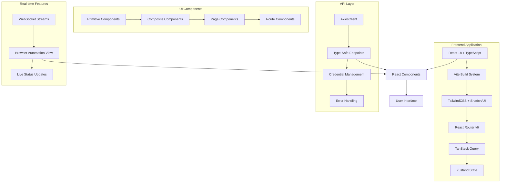

---

## 🚀 **Build & Deployment Pipeline**

### **Complete CI/CD Flow**

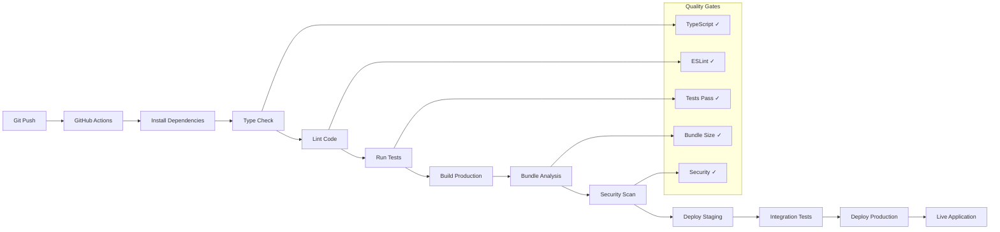

---

## 🧩 **Component Composition Patterns**

### **Advanced Component Design**

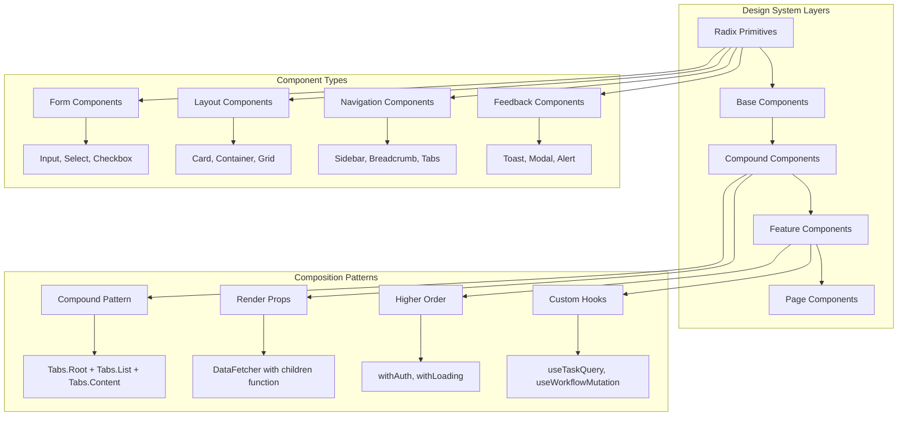

---

## 📱 **Responsive Design Flow**

### **Mobile-First Responsive Strategy**

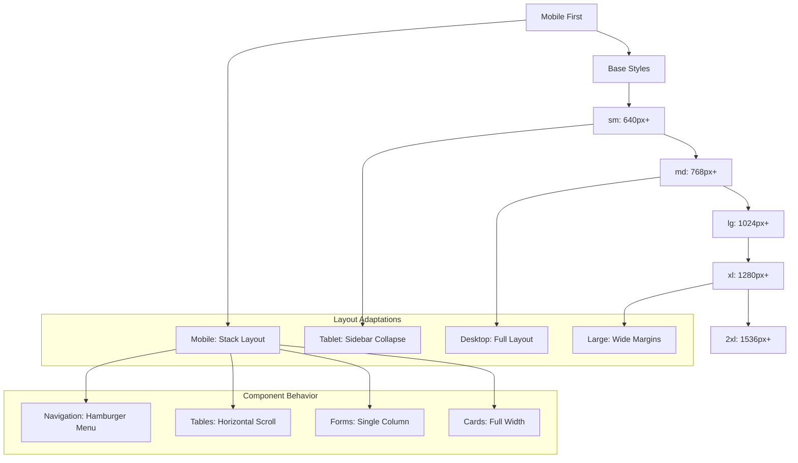

---

## 🔄 **Error Handling & Recovery**

### **Comprehensive Error Management**

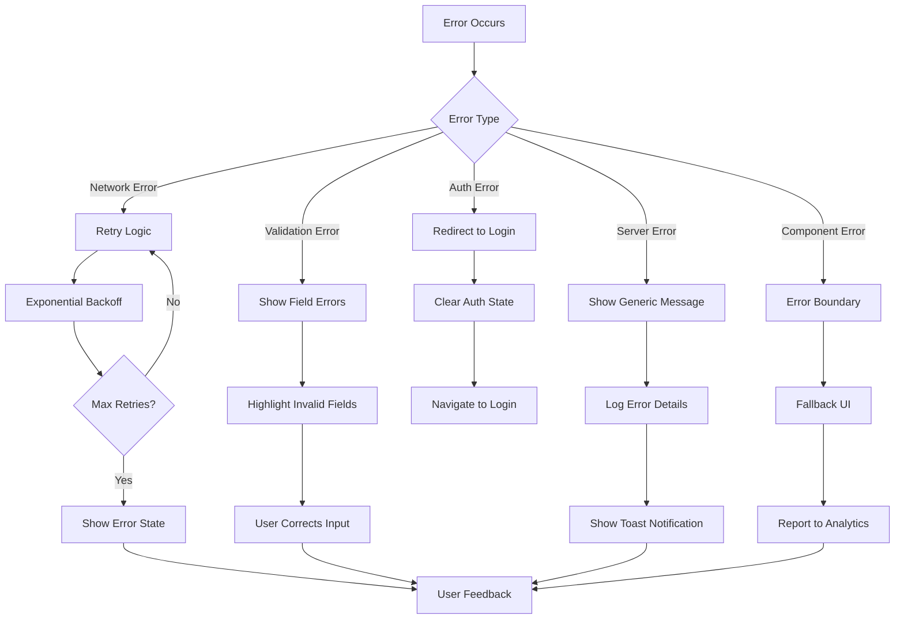

---

## 🎯 **Performance Optimization Strategy**

### **Frontend Performance Flow**

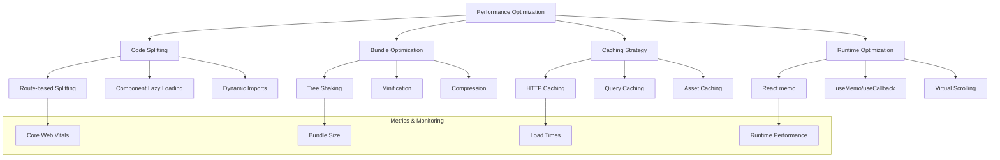

---

## 🔍 **Development Workflow Overview**

### **Complete Development Cycle**

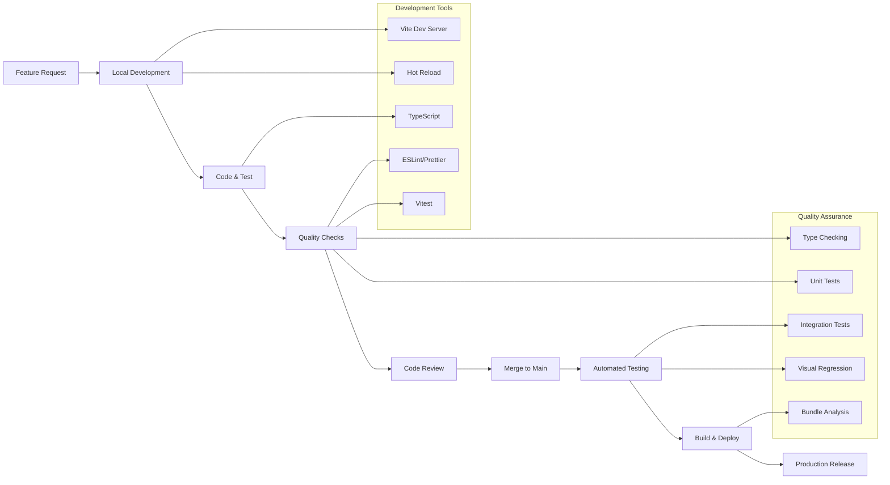

---

## 📊 **Key Metrics & Success Criteria**

### **Frontend Application KPIs**

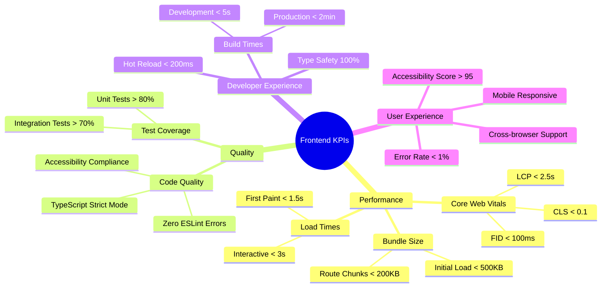

---

## 🎯 **Phase 11 Learning Outcomes**

### **Mastery Checklist**

| **Area** | **Learning Goal** | **Status** |
|----------|-------------------|------------|
| **Architecture** | ✅ Understand React + TypeScript setup | Complete |
| **Build System** | ✅ Master Vite configuration and optimization | Complete |
| **UI Components** | ✅ Implement Shadcn/UI and design system | Complete |
| **State Management** | ✅ Use Zustand and TanStack Query effectively | Complete |
| **API Integration** | ✅ Build type-safe API client with error handling | Complete |
| **Routing** | ✅ Implement React Router with authentication | Complete |
| **Real-time Features** | ✅ WebSocket integration for live updates | Complete |
| **Testing** | ✅ Comprehensive testing strategy with Vitest | Complete |
| **Performance** | ✅ Optimize bundles and runtime performance | Complete |
| **Deployment** | ✅ Production-ready build and deployment | Complete |

---

## 🚀 **Next Steps & Advanced Topics**

### **Further Learning Opportunities**

1. **Advanced React Patterns**
   - Suspense for data fetching
   - Concurrent features
   - Server Components (future)

2. **Performance Deep Dive**
   - Micro-frontends architecture
   - Advanced caching strategies
   - Service workers and PWA features

3. **Testing Excellence**
   - Visual regression testing
   - E2E testing with Playwright
   - Performance testing

4. **Developer Experience**
   - Advanced debugging techniques
   - Custom developer tools
   - Automated refactoring tools

---

## 🎖️ **Key Technical Achievements**

### **Frontend Excellence Standards**

- ✅ **Type Safety** - 100% TypeScript coverage with strict mode
- ✅ **Performance** - Optimized bundles under size limits
- ✅ **Accessibility** - WCAG 2.1 AA compliance
- ✅ **Maintainability** - Clean architecture with clear patterns
- ✅ **Scalability** - Modular design for easy extension
- ✅ **Developer Experience** - Fast builds with excellent tooling
- ✅ **Production Ready** - Comprehensive monitoring and error handling

---

## 🎯 **Final Summary**

The Skyvern frontend represents a **modern, production-ready React application** that demonstrates:

- **Advanced Architecture** - Clean separation of concerns with modern patterns
- **Developer Experience** - Fast development cycle with excellent tooling
- **User Experience** - Professional interface for complex automation workflows
- **Performance** - Optimized for speed and efficiency
- **Maintainability** - Well-structured codebase with comprehensive testing
- **Scalability** - Easy to extend and adapt for future requirements

This frontend provides the perfect interface for Skyvern's powerful browser automation capabilities, enabling users to create, monitor, and manage complex web automation workflows with ease.

---

*Congratulations! You now have a comprehensive understanding of the Skyvern frontend application architecture and are ready to contribute to or build upon this modern React application.* G
    A --> K
    A --> O
    G --> R[Backend API]
    N --> S[User Interface]
```

---

## 🔄 **Data Flow Architecture**

### **Complete Data Flow Diagram**

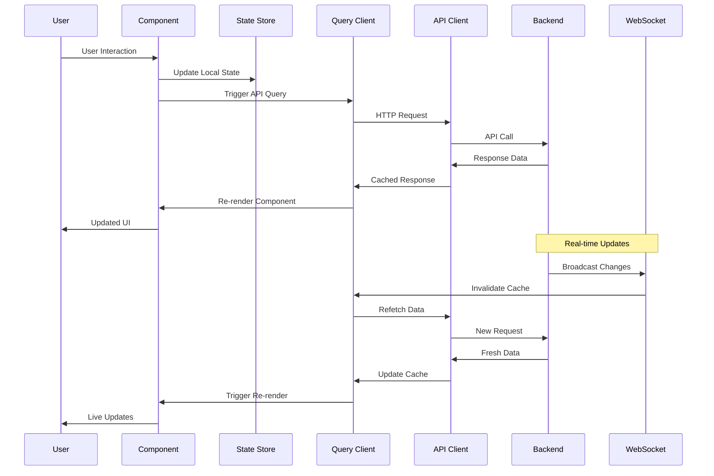

---

## 🎨 **Component Hierarchy Flowchart**

### **UI Component Structure**

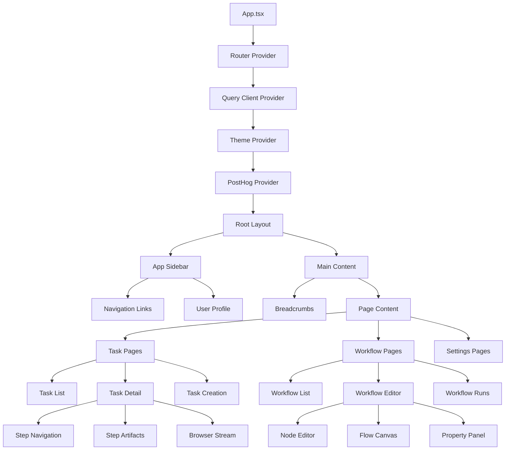

---

## 🔐 **Authentication & Security Flow**

### **Authentication Process**

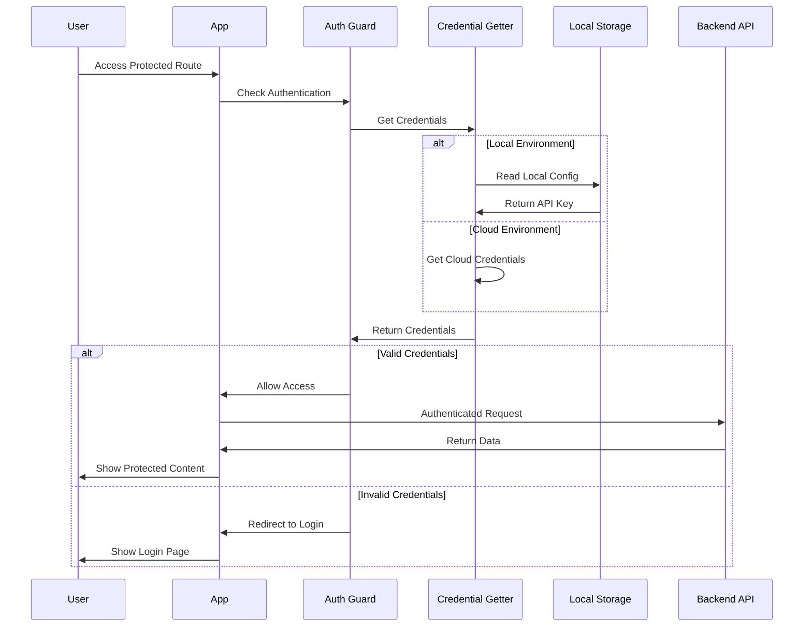

---

## 🌐 **Real-time Browser Automation Flow**

### **Live Browser Streaming**

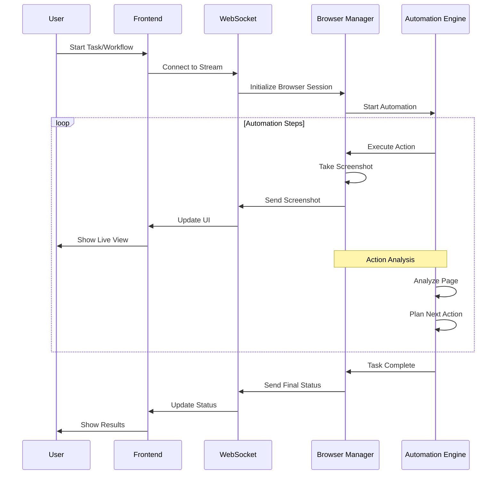

---

## 📊 **State Management Flow**

### **Global State Architecture**

```mermaid
graph TB
    subgraph "Client State (Zustand)"
        A[Settings Store] --> B[Environment Config]
        A --> C[Theme Settings]
        D[Sidebar Store] --> E[Navigation State]
        F[Client ID Store] --> G[Session Management]
    end
    
    subgraph "Server State (TanStack Query)"
        H[Query Cache] --> I[Task Data]
        H --> J[Workflow Data]
        H --> K[User Data]
        L[Mutation Queue] --> M[Create Operations]
        L --> N[Update Operations]
        L --> O[Delete Operations]
    end
    
    subgraph "Component State"
        P[useState] --> Q[Local UI State]
        R[useReducer] --> S[Complex Form State]
        T[useRef] --> U[DOM References]
    end
    
    A -->