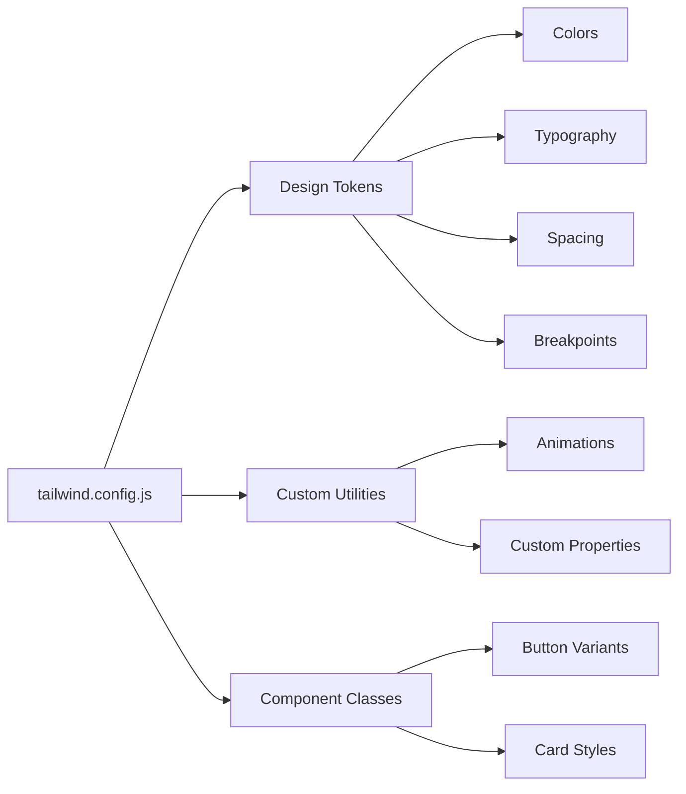

# 🔧 Phase 11.4: Technical Deep Dive & Implementation Details

## 🏗️ **Technical Architecture Overview**

Deep dive into the technical implementation patterns and advanced features of the Skyvern frontend.

---

## ⚡ **Build System & Development Environment**

### **Vite Configuration Architecture**

```mermaid
graph TB
    A[vite.config.ts] --> B[React Plugin]
    A --> C[Path Resolution]
    A --> D[Server Config]
    A --> E[Build Optimization]
    
    B --> F[@vitejs/plugin-react-swc]
    C --> G[@ → src/ alias]
    D --> H[Port 8080]
    D --> I[Hot Reload]
    E --> J[Code Splitting]
    E --> K[Bundle Analysis]
```

### **Build Configuration Details**

```typescript
// vite.config.ts - Optimized for development and production
export default defineConfig({
  plugins: [
    react({
      // Use SWC for faster builds
      jsxRuntime: 'automatic',
      babel: {
        plugins: ['babel-plugin-styled-components']
      }
    })
  ],
  
  // Development server configuration
  server: {
    port: 8080,
    host: true, // Allow external connections
    hmr: {
      overlay: true // Show errors in browser overlay
    }
  },
  
  // Build optimizations
  build: {
    target: 'es2020',
    rollupOptions: {
      output: {
        manualChunks: {
          // Vendor chunk for better caching
          vendor: ['react', 'react-dom', 'react-router-dom'],
          ui: ['@radix-ui/react-dialog', '@radix-ui/react-select'],
          editor: ['monaco-editor', '@monaco-editor/react']
        }
      }
    },
    chunkSizeWarningLimit: 1000
  },
  
  // Path resolution for clean imports
  resolve: {
    alias: {
      '@': path.resolve(__dirname, './src'),
      '@/components': path.resolve(__dirname, './src/components'),
      '@/utils': path.resolve(__dirname, './src/util')
    }
  }
});
```

---

## 🎨 **Styling System Implementation**

### **Tailwind CSS Architecture**



### **Advanced Tailwind Configuration**

```javascript
// tailwind.config.js - Comprehensive design system
module.exports = {
  darkMode: ["class"],
  content: [
    "./pages/**/*.{ts,tsx}",
    "./components/**/*.{ts,tsx}",
    "./app/**/*.{ts,tsx}",
    "./src/**/*.{ts,tsx}",
  ],
  
  theme: {
    extend: {
      // Custom color system with CSS variables
      colors: {
        border: "hsl(var(--border))",
        input: "hsl(var(--input))",
        ring: "hsl(var(--ring))",
        background: "hsl(var(--background))",
        foreground: "hsl(var(--foreground))",
        
        primary: {
          DEFAULT: "hsl(var(--primary))",
          foreground: "hsl(var(--primary-foreground))",
        },
        
        // Semantic color mappings
        destructive: {
          DEFAULT: "hsl(var(--destructive))",
          foreground: "hsl(var(--destructive-foreground))",
        },
        
        // Status colors for automation states
        status: {
          running: "hsl(210, 100%, 50%)",
          completed: "hsl(120, 100%, 35%)",
          failed: "hsl(0, 100%, 50%)",
          pending: "hsl(45, 100%, 50%)"
        }
      },
      
      // Responsive breakpoints
      screens: {
        'xs': '475px',
        'sm': '640px',
        'md': '768px',
        'lg': '1024px',
        'xl': '1280px',
        '2xl': '1536px',
      },
      
      // Custom animations for UI feedback
      keyframes: {
        "accordion-down": {
          from: { height: "0" },
          to: { height: "var(--radix-accordion-content-height)" },
        },
        "accordion-up": {
          from: { height: "var(--radix-accordion-content-height)" },
          to: { height: "0" },
        },
        "slide-in": {
          "0%": { transform: "translateX(-100%)" },
          "100%": { transform: "translateX(0)" },
        },
        "fade-in": {
          "0%": { opacity: "0" },
          "100%": { opacity: "1" },
        }
      },
      
      animation: {
        "accordion-down": "accordion-down 0.2s ease-out",
        "accordion-up": "accordion-up 0.2s ease-out",
        "slide-in": "slide-in 0.3s ease-out",
        "fade-in": "fade-in 0.2s ease-out",
      },
    },
  },
  
  plugins: [
    require("tailwindcss-animate"),
    require("@tailwindcss/typography")
  ],
};
```

---

## 🔄 **State Management Architecture**

### **Zustand Store Implementation**

```mermaid
graph TB
    subgraph "Global State Stores"
        A[SettingsStore] --> B[Environment Config]
        A --> C[Organization Settings]
        
        D[SidebarStore] --> E[Collapse State]
        D --> F[Navigation State]
        