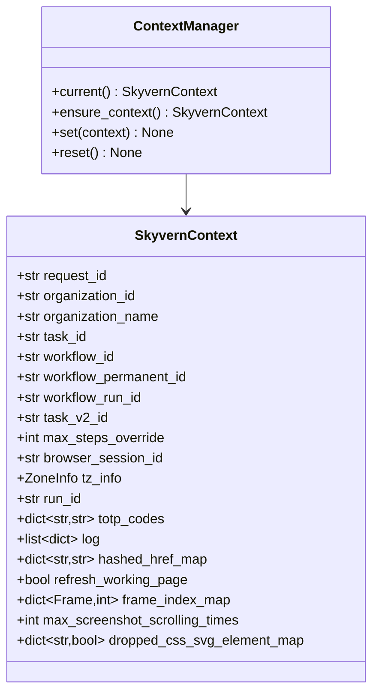
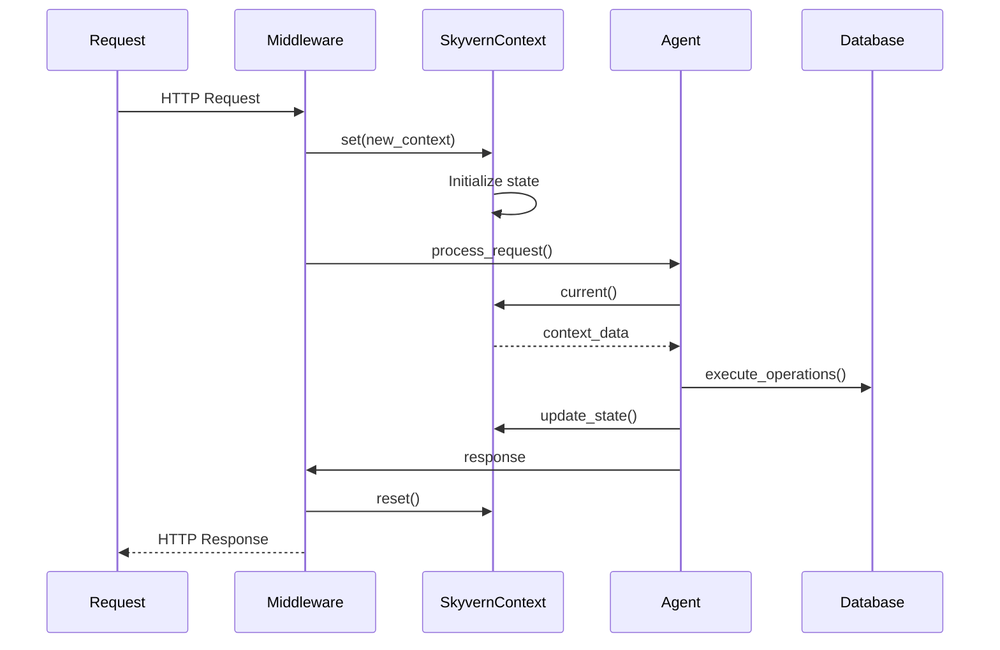
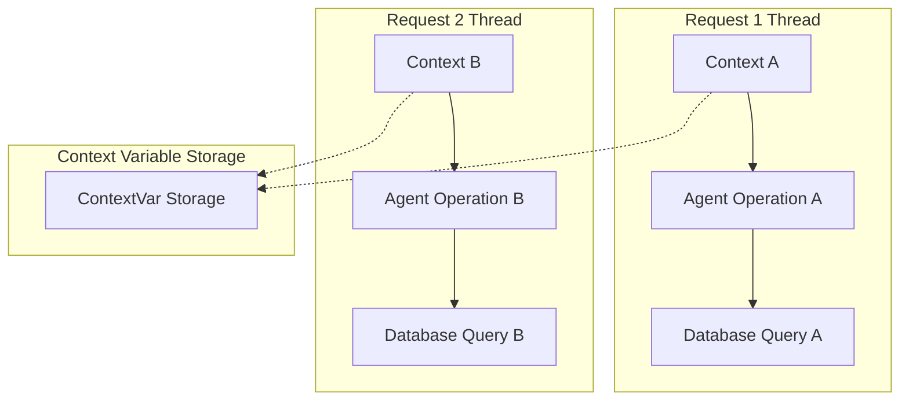
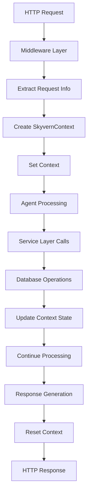

# 4.2 Core Context Management
## `skyvern/forge/sdk/core/skyvern_context.py` 🔥 **CRITICAL**

---

### 🎯 **Purpose & Role**
The **SkyvernContext** provides global state management for request tracking, ensuring consistent context across the entire execution lifecycle.

---

### 🏗️ **Context Architecture**



---

### 🔄 **Context Lifecycle**



---

### 🗂️ **Context Data Structure**

#### **Core Identifiers**
```python
@dataclass
class SkyvernContext:
    # Request Tracking
    request_id: str | None = None
    organization_id: str | None = None
    organization_name: str | None = None
    
    # Task & Workflow Context
    task_id: str | None = None
    workflow_id: str | None = None
    workflow_run_id: str | None = None
    task_v2_id: str | None = None
    run_id: str | None = None
```

#### **Execution Configuration**
```python
    # Execution Parameters
    max_steps_override: int | None = None
    browser_session_id: str | None = None
    tz_info: ZoneInfo | None = None
    max_screenshot_scrolling_times: int | None = None
```

#### **Runtime State**
```python
    # Runtime Data
    totp_codes: dict[str, str | None] = field(default_factory=dict)
    log: list[dict] = field(default_factory=list)
    hashed_href_map: dict[str, str] = field(default_factory=dict)
    refresh_working_page: bool = False
    frame_index_map: dict[Frame, int] = field(default_factory=dict)
    dropped_css_svg_element_map: dict[str, bool] = field(default_factory=dict)
```

---

### 🎛️ **Context Management Functions**

#### **🔍 current()**
```python
def current() -> SkyvernContext | None:
    """Get the current context"""
    return _context.get()
```
- Returns current context or None
- Thread-safe access
- Non-blocking operation

#### **⚡ ensure_context()**
```python
def ensure_context() -> SkyvernContext:
    """Get current context or raise error"""
    context = current()
    if context is None:
        raise RuntimeError("No skyvern context")
    return context
```
- Guarantees context availability
- Throws exception if no context
- Used in critical operations

#### **🔧 set()**
```python
def set(context: SkyvernContext) -> None:
    """Set the current context"""
    _context.set(context)
```
- Thread-local context setting
- Replaces existing context
- Used at request initialization

#### **🔄 reset()**
```python
def reset() -> None:
    """Reset the current context"""
    _context.set(None)
```
- Clears current context
- Used at request completion
- Prevents memory leaks

---

### 🧵 **Thread-Local Context Pattern**



**Benefits:**
- Isolated context per request
- No cross-request contamination
- Automatic cleanup on thread completion

---

### 🔐 **Security & Isolation**

#### **Organization Isolation**
```python
# Context ensures operations are scoped to correct org
context = ensure_context()
if context.organization_id != requested_org_id:
    raise UnauthorizedError("Organization mismatch")
```

#### **Session Management**
```python
# Browser session tracking
context = current()
browser_session = get_session(context.browser_session_id)
page = browser_session.get_page()
```

---

### 📊 **Context Usage Patterns**

#### **Pattern 1: Request Initialization**
```python
async def process_request(request: TaskRequest):
    context = SkyvernContext(
        request_id=generate_id(),
        organization_id=request.org_id,
        task_id=request.task_id,
        max_steps_override=request.max_steps
    )
    set(context)
    try:
        # Process request
        result = await execute_task()
        return result
    finally:
        reset()
```

#### **Pattern 2: Service Layer Access**
```python
async def database_operation():
    context = ensure_context()
    return await db.query(
        organization_id=context.organization_id,
        task_id=context.task_id
    )
```

#### **Pattern 3: State Updates**
```python
async def update_totp_code(identifier: str, code: str):
    context = ensure_context()
    context.totp_codes[identifier] = code
```

---

### 🎯 **Context Integration Flow**



---

### 🚨 **Error Handling**

#### **Missing Context Scenarios**
```python
# Graceful degradation
context = current()
if context:
    org_id = context.organization_id
else:
    org_id = get_default_organization()
```

#### **Context Validation**
```python
def validate_context():
    context = ensure_context()
    if not context.organization_id:
        raise ValueError("Organization ID required")
    if not context.task_id:
        raise ValueError("Task ID required")
```

---

### 🎯 **Next: Settings Management**
Understanding how configuration is managed and validated...