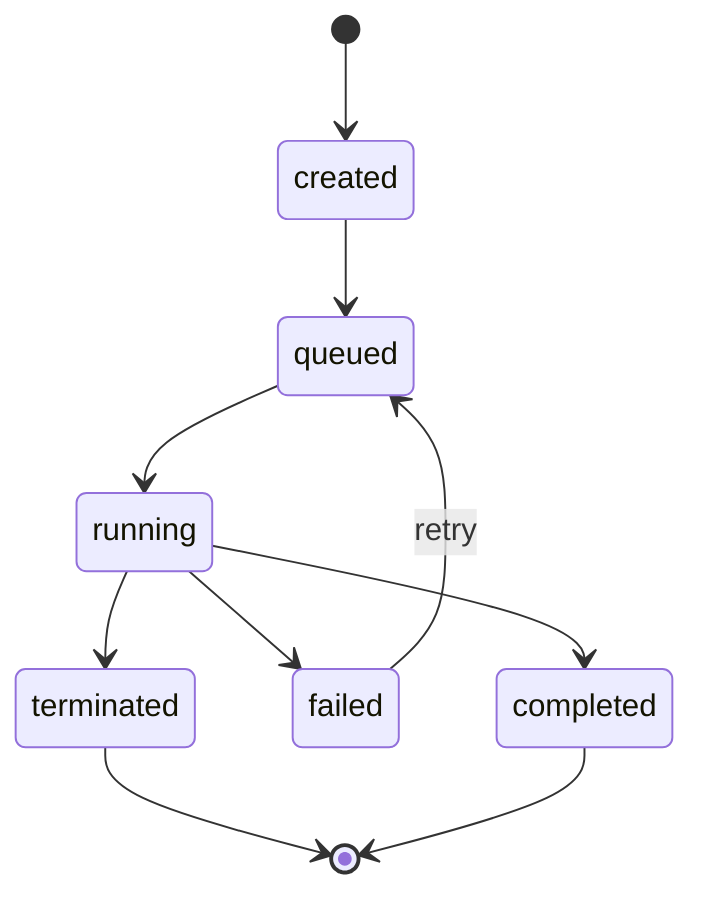
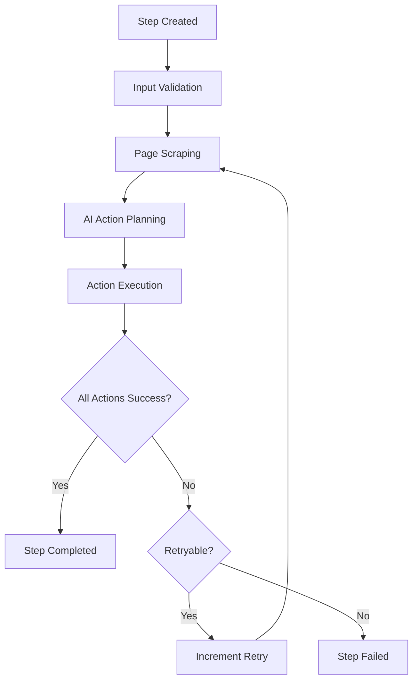
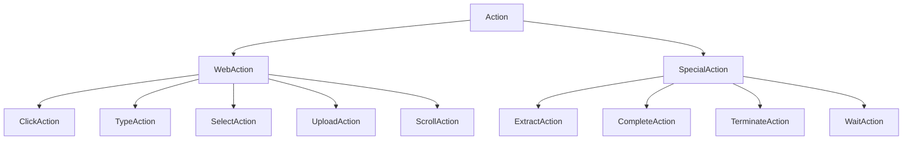
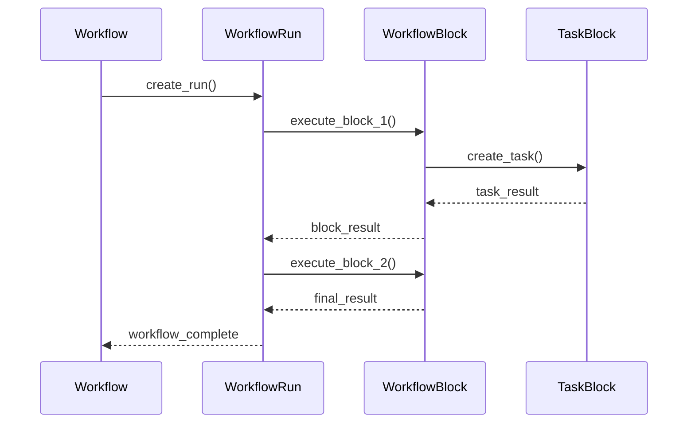
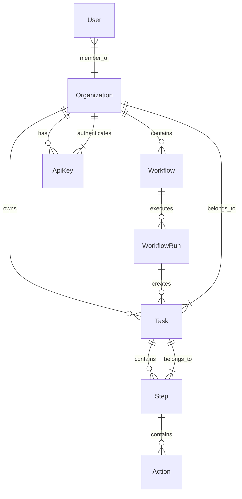

# 4.4 Core Models & Data Structures
## `skyvern/forge/sdk/models.py` 🔥 **CRITICAL**

---

### 🎯 **Purpose & Role**
Core models define the fundamental data structures and business logic that power Skyvern's automation engine, providing type safety and validation.

---

### 🏗️ **Model Architecture Overview**

```mermaid
classDiagram
    class Task {
        +str task_id
        +str organization_id
        +str title
        +str description
        +TaskStatus status
        +dict parameters
        +datetime created_at
        +validate()
    }
    
    class Step {
        +str step_id
        +str task_id
        +int order
        +StepStatus status
        +list~Action~ actions
        +datetime created_at
        +is_complete()
    }
    
    class Action {
        +str action_id
        +ActionType action_type
        +dict parameters
        +ActionStatus status
        +str reasoning
        +execute()
    }
    
    class Organization {
        +str organization_id
        +str name
        +str domain
        +OrganizationSettings settings
    }
    
    Task ||--o{ Step
    Step ||--o{ Action
    Organization ||--o{ Task
```

---

### 📋 **Core Entity Models**

#### **🎯 Task Model**
```python
class Task(BaseModel):
    task_id: str
    organization_id: str
    title: str
    description: str | None = None
    url: str
    status: TaskStatus = TaskStatus.created
    parameters: dict[str, Any] = {}
    max_steps: int = 10
    created_at: datetime
    modified_at: datetime
    
    def is_complete(self) -> bool:
        return self.status in [TaskStatus.completed, TaskStatus.failed]
    
    def can_execute(self) -> bool:
        return self.status in [TaskStatus.created, TaskStatus.queued]
```

**Task Status Lifecycle:**


---

#### **👣 Step Model**
```python
class Step(BaseModel):
    step_id: str
    task_id: str
    order: int
    retry_index: int = 0
    status: StepStatus = StepStatus.created
    input_data: dict[str, Any] = {}
    output_data: dict[str, Any] = {}
    step_cost: float = 0.0
    created_at: datetime
    modified_at: datetime
    
    def is_retryable(self) -> bool:
        return self.retry_index < MAX_RETRIES and self.status == StepStatus.failed
    
    def get_next_order(self) -> int:
        return self.order + 1
```

**Step Execution Flow:**


---

#### **⚡ Action Model**
```python
class Action(BaseModel):
    action_type: ActionType
    reasoning: str
    confidence_score: float = 0.0
    element_id: str | None = None
    text: str | None = None
    coordinates: tuple[int, int] | None = None
    file_path: str | None = None
    
    def validate_parameters(self) -> bool:
        """Validate action parameters based on type"""
        if self.action_type == ActionType.CLICK:
            return self.element_id is not None or self.coordinates is not None
        elif self.action_type == ActionType.TYPE:
            return self.element_id is not None and self.text is not None
        elif self.action_type == ActionType.UPLOAD:
            return self.element_id is not None and self.file_path is not None
        return True
```

**Action Types Hierarchy:**


---

### 🏢 **Organization & User Models**

#### **🏛️ Organization Model**
```python
class Organization(BaseModel):
    organization_id: str
    organization_name: str
    domain: str | None = None
    webhook_callback_url: str | None = None
    max_steps_per_run: int = 50
    max_retries_per_step: int = 3
    created_at: datetime
    modified_at: datetime
    
    def can_execute_task(self, task: Task) -> bool:
        return task.max_steps <= self.max_steps_per_run
```

#### **🔑 Authentication Models**
```python
class OrganizationAuthToken(BaseModel):
    token_id: str
    organization_id: str
    token: str
    token_type: OrganizationAuthTokenType
    valid_until: datetime | None = None
    created_at: datetime
    
    def is_valid(self) -> bool:
        if self.valid_until is None:
            return True
        return datetime.utcnow() < self.valid_until

class ApiKey(BaseModel):
    api_key_id: str
    organization_id: str
    api_key_hash: str
    api_key_name: str | None = None
    is_active: bool = True
    last_used_at: datetime | None = None
```

---

### 🔄 **Workflow Models**

#### **📋 Workflow Structure**
```python
class Workflow(BaseModel):
    workflow_id: str
    workflow_permanent_id: str
    organization_id: str
    title: str
    description: str | None = None
    workflow_definition: dict[str, Any]
    is_saved_task: bool = False
    created_at: datetime
    modified_at: datetime

class WorkflowRun(BaseModel):
    workflow_run_id: str
    workflow_id: str
    status: WorkflowRunStatus = WorkflowRunStatus.created
    proxy_location: str | None = None
    webhook_callback_url: str | None = None
    totp_verification_url: str | None = None
    created_at: datetime
    modified_at: datetime
```

**Workflow Execution Model:**


---

### 🗂️ **Data Validation & Serialization**

#### **Pydantic Integration**
```python
class BaseModelWithValidation(BaseModel):
    model_config = ConfigDict(
        from_attributes=True,
        validate_assignment=True,
        arbitrary_types_allowed=True,
        json_encoders={
            datetime: lambda v: v.isoformat(),
            UUID: lambda v: str(v)
        }
    )
    
    def to_dict(self) -> dict[str, Any]:
        """Convert to dictionary with proper serialization"""
        return self.model_dump(mode='json')
    
    @classmethod
    def from_dict(cls, data: dict[str, Any]) -> Self:
        """Create instance from dictionary"""
        return cls.model_validate(data)
```

#### **Custom Validators**
```python
class Task(BaseModelWithValidation):
    url: str
    
    @field_validator('url')
    @classmethod
    def validate_url(cls, v: str) -> str:
        if not v.startswith(('http://', 'https://')):
            raise ValueError('URL must start with http:// or https://')
        return v
    
    @field_validator('max_steps')
    @classmethod
    def validate_max_steps(cls, v: int) -> int:
        if v <= 0 or v > 100:
            raise ValueError('max_steps must be between 1 and 100')
        return v
```

---

### 📊 **Status Enumerations**

#### **Task Status States**
```python
class TaskStatus(str, Enum):
    CREATED = "created"
    QUEUED = "queued" 
    RUNNING = "running"
    COMPLETED = "completed"
    FAILED = "failed"
    TERMINATED = "terminated"
    CANCELLED = "cancelled"
```

#### **Step Status States**
```python
class StepStatus(str, Enum):
    CREATED = "created"
    RUNNING = "running"
    COMPLETED = "completed"
    FAILED = "failed"
    RETRYING = "retrying"
```

#### **Action Status States**
```python
class ActionStatus(str, Enum):
    PENDING = "pending"
    RUNNING = "running"
    COMPLETED = "completed"
    FAILED = "failed"
    SKIPPED = "skipped"
```

---

### 🎛️ **Model Relationships**



---

### 🔧 **Model Utilities & Helpers**

#### **ID Generation**
```python
def generate_task_id() -> str:
    return f"task_{uuid.uuid4().hex[:12]}"

def generate_step_id() -> str:
    return f"step_{uuid.uuid4().hex[:12]}"

def generate_organization_id() -> str:
    return f"org_{uuid.uuid4().hex[:12]}"
```

#### **Model Conversion**
```python
class ModelConverter:
    @staticmethod
    def task_to_response(task: Task) -> TaskResponse:
        return TaskResponse(
            task_id=task.task_id,
            status=task.status,
            title=task.title,
            created_at=task.created_at,
            # ... other fields
        )
    
    @staticmethod
    def step_to_summary(step: Step) -> StepSummary:
        return StepSummary(
            step_id=step.step_id,
            order=step.order,
            status=step.status,
            retry_count=step.retry_index
        )
```

---

### 🎯 **Model Usage Patterns**

#### **Pattern 1: Entity Creation**
```python
async def create_task(org_id: str, task_request: TaskRequest) -> Task:
    task = Task(
        task_id=generate_task_id(),
        organization_id=org_id,
        title=task_request.title,
        url=task_request.url,
        status=TaskStatus.CREATED,
        created_at=datetime.utcnow(),
        modified_at=datetime.utcnow()
    )
    
    # Validate before saving
    task.validate_parameters()
    
    # Save to database
    return await database.save_task(task)
```

#### **Pattern 2: Status Transitions**
```python
async def update_task_status(task_id: str, new_status: TaskStatus) -> Task:
    task = await database.get_task(task_id)
    
    # Validate status transition
    if not task.can_transition_to(new_status):
        raise ValueError(f"Invalid transition from {task.status} to {new_status}")
    
    task.status = new_status
    task.modified_at = datetime.utcnow()
    
    return await database.update_task(task)
```

#### **Pattern 3: Model Serialization**
```python
async def export_task_data(task_id: str) -> dict:
    task = await database.get_task_with_steps(task_id)
    
    return {
        "task": task.to_dict(),
        "steps": [step.to_dict() for step in task.steps],
        "metadata": {
            "export_date": datetime.utcnow().isoformat(),
            "version": "1.0"
        }
    }
```

---

### 🎯 **Next: Integration Flow**
Understanding how all components work together in the automation engine...