# 4.5 Integration Flow & Architecture
## How All Components Work Together

---

### 🎯 **Complete Integration Overview**

The Core Automation Engine integrates four critical components to create a seamless automation experience:


---

### 🔄 **End-to-End Execution Flow**


---

### 🎛️ **Component Integration Patterns**

#### **Pattern 1: Configuration-Driven Initialization**
```python
async def initialize_automation_engine():
    # Settings-driven component setup
    settings = SettingsManager.get_settings()
    
    # Configure browser based on settings
    browser_manager = BrowserManager(
        browser_type=settings.BROWSER_TYPE,
        pool_size=settings.BROWSER_POOL_SIZE,
        timeout=settings.BROWSER_TIMEOUT
    )
    
    # Configure LLM clients
    llm_client = LLMClientFactory.create(
        primary_key=settings.LLM_KEY,
        secondary_key=settings.SECONDARY_LLM_KEY
    )
    
    # Initialize agent with dependencies
    agent = ForgeAgent(
        browser_manager=browser_manager,
        llm_client=llm_client,
        settings=settings
    )
    
    return agent
```

#### **Pattern 2: Context-Aware Execution**
```python
async def execute_with_context(task_request: TaskRequest):
    # Set up execution context
    context = SkyvernContext(
        request_id=generate_id(),
        organization_id=task_request.org_id,
        task_id=task_request.task_id,
        max_steps_override=task_request.max_steps
    )
    
    # Context provides isolation
    set_context(context)
    
    try:
        # All operations use context automatically
        task = await create_task_with_context(task_request)
        result = await agent.execute_task(task)
        await save_result_with_context(result)
        
        return result
    finally:
        # Always clean up context
        reset_context()
```

#### **Pattern 3: Model-Driven Validation**
```python
async def process_action_request(action_data: dict):
    # Models provide type safety and validation
    try:
        action = Action.from_dict(action_data)
        action.validate_parameters()
    except ValidationError as e:
        raise InvalidActionError(f"Action validation failed: {e}")
    
    # Execute with validated model
    result = await agent.execute_action(action)
    
    # Return typed response
    return ActionResult(
        action_id=action.action_id,
        status=result.status,
        data=result.data
    )
```

---

### 🏗️ **Architectural Layers**

```mermaid
graph TB
    subgraph "🌐 Presentation Layer"
        A[FastAPI Endpoints]
        B[Request Validation]
        C[Response Serialization]
    end
    
    subgraph "🔧 Service Layer"
        D[Task Service]
        E[Workflow Service]
        F[Authentication Service]
    end
    
    subgraph "🤖 Core Engine Layer"
        G[ForgeAgent]
        H[SkyvernContext]
        I[SettingsManager]
        J[Core Models]
    end
    
    subgraph "🗄️ Data Layer"
        K[Database Client]
        L[Model Persistence]
        M[Query Operations]
    end
    
    subgraph "🌍 Infrastructure Layer"
        N[Browser Manager]
        O[LLM Clients]
        P[File System]
    end
    
    A --> D
    D --> G
    G --> K
    G --> N
    
    B --> J
    H --> G
    I --> G
    J --> L
```



---

### 🔄 **Data Flow Architecture**


---

### 🔧 **Error Handling Integration**


#### **Unified Error Handling**
```python
class IntegratedErrorHandler:
    @staticmethod
    async def handle_execution_error(
        error: Exception,
        context: SkyvernContext,
        task: Task,
        step: Step
    ) -> ErrorResolution:
        """Centralized error handling across all components"""
        
        # Context-aware error logging
        LOG.error(
            "Execution error occurred",
            error=str(error),
            task_id=context.task_id,
            step_id=step.step_id,
            organization_id=context.organization_id
        )
        
        # Settings-driven retry logic
        settings = SettingsManager.get_settings()
        max_retries = settings.MAX_RETRIES
        
        if step.retry_index < max_retries:
            return ErrorResolution.RETRY
        
        # Model-based error categorization
        if isinstance(error, ValidationError):
            return ErrorResolution.FAIL_STEP
        elif isinstance(error, BrowserError):
            return ErrorResolution.RETRY_WITH_NEW_BROWSER
        else:
            return ErrorResolution.FAIL_TASK
```

---

### 📊 **Performance & Monitoring Integration**


#### **Integrated Performance Monitoring**
```python
class PerformanceMonitor:
    @staticmethod
    async def track_execution_metrics(
        task: Task,
        execution_time: float,
        step_count: int,
        action_count: int
    ):
        """Track performance across all components"""
        
        context = ensure_context()
        settings = SettingsManager.get_settings()
        
        metrics = ExecutionMetrics(
            task_id=task.task_id,
            organization_id=context.organization_id,
            execution_time=execution_time,
            step_count=step_count,
            action_count=action_count,
            browser_type=settings.BROWSER_TYPE,
            llm_model=settings.LLM_KEY,
            timestamp=datetime.utcnow()
        )
        
        # Send metrics to monitoring system
        await analytics.track_execution(metrics)
        
        # Update context with performance data
        context.log.append({
            "type": "performance",
            "metrics": metrics.to_dict()
        })
```

---

### 🚀 **Scaling & Distribution**


---

### 🎯 **Integration Best Practices**

#### **1. Dependency Injection**
```python
class AgentFactory:
    @staticmethod
    def create_agent(
        settings: Settings,
        context_manager: ContextManager,
        model_registry: ModelRegistry
    ) -> ForgeAgent:
        return ForgeAgent(
            settings=settings,
            context_manager=context_manager,
            model_registry=model_registry
        )
```

#### **2. Interface Segregation**
```python
class AgentInterface(Protocol):
    async def execute_task(self, task: Task) -> TaskResult: ...
    async def execute_step(self, step: Step) -> StepResult: ...
    async def validate_action(self, action: Action) -> bool: ...
```

#### **3. Configuration Management**
```python
class ConfigurationManager:
    def __init__(self):
        self.settings = SettingsManager.get_settings()
        self.context = ContextManager()
        self.models = ModelRegistry()
    
    def configure_component(self, component_type: str) -> Any:
        config = self.settings.get_component_config(component_type)
        return ComponentFactory.create(component_type, config)
```

---

### 🎉 **Summary: Core Automation Engine**

The Core Automation Engine successfully integrates:

| Component | Role | Key Benefits |
|-----------|------|--------------|
| **ForgeAgent** | Orchestration | Unified task execution flow |
| **SkyvernContext** | State Management | Request isolation & tracking |
| **SettingsManager** | Configuration | Environment-driven setup |
| **Core Models** | Data Integrity | Type safety & validation |

**🎯 Result**: A robust, scalable automation engine that processes tasks with reliability, observability, and maintainability.

---

### 📚 **Additional Resources**

- **Next Phase**: Browser Management (Phase 5)
- **Related**: API Framework (Phase 3), Workflow Engine (Phase 8)
- **Dependencies**: Database Layer (Phase 2), Foundation (Phase 1)