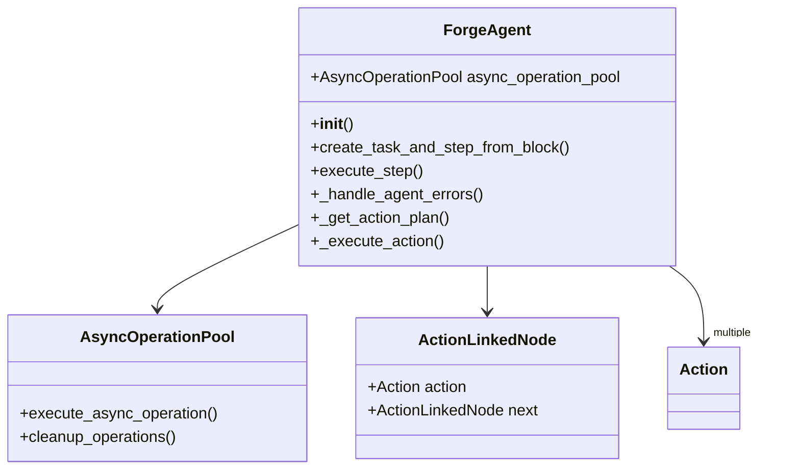
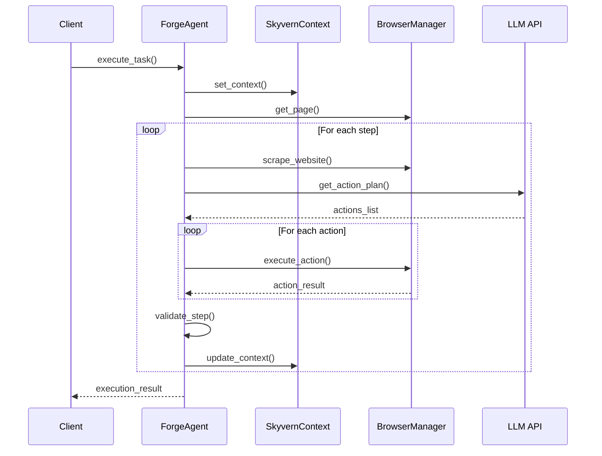
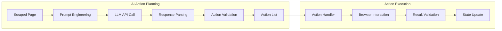
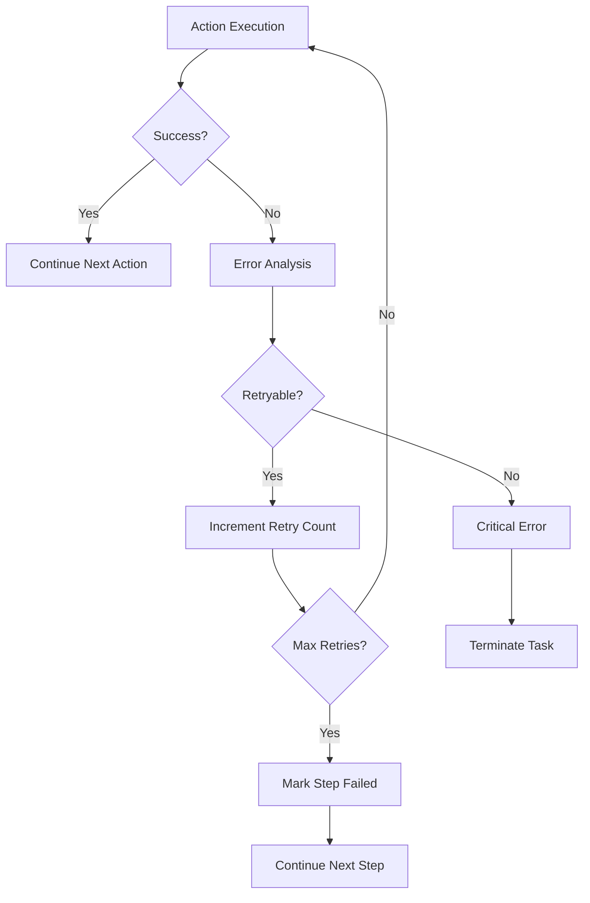

# 4.1 Main Agent Architecture
## `skyvern/forge/sdk/agent.py` 🔥 **CRITICAL**

---

### 🎯 **Purpose & Role**
The **ForgeAgent** is the central orchestrator of Skyvern's automation engine, managing:
- Task execution flow
- Step management  
- Browser action coordination
- AI integration

---

### 🏗️ **Core Architecture**



---

### 🔄 **Task Execution Flow**



---

### ⚙️ **Key Methods Breakdown**

#### **🚀 execute_step()**
```python
async def execute_step(
    self,
    organization: Organization,
    task: Task,
    step: Step,
    api_key: str | None = None,
    engine: RunEngine = RunEngine.skyvern_v1,
) -> tuple[Step, list[ActionResult], ScrapedPage]:
```

**Purpose**: Main step execution orchestrator
- Scrapes the current page
- Gets action plan from AI
- Executes actions sequentially
- Handles errors and retries

---

#### **🎯 _get_action_plan()**
```python
async def _get_action_plan(
    self,
    scraped_page: ScrapedPage,
    task: Task,
    step: Step,
) -> list[Action]:
```

**Purpose**: AI-powered action planning
- Analyzes scraped page content
- Sends context to LLM
- Parses AI response into actions
- Validates action feasibility

---

#### **⚡ _execute_action()**
```python
async def _execute_action(
    self,
    action: Action,
    page: Page,
    scraped_page: ScrapedPage,
    step: Step,
    task: Task,
) -> ActionResult:
```

**Purpose**: Individual action execution
- Handles browser interactions
- Manages action-specific logic
- Returns execution results
- Updates page state

---

### 🧠 **AI Integration Pattern**



---

### 🔧 **Error Handling Strategy**



---

### 🎛️ **Configuration Integration**

The agent integrates with multiple configuration sources:

| Component | Purpose | Example |
|-----------|---------|---------|
| `settings_manager` | Global config | Browser timeouts, AI model selection |
| `skyvern_context` | Request state | Current task, organization, session |
| `task.parameters` | Task-specific | Custom prompts, extraction schemas |

---

### 🔍 **Key Performance Features**

#### **Async Operation Pool**
- Parallel execution of non-blocking operations
- Resource management and cleanup
- Background task handling

#### **Action Caching**
- Reuses previously computed action plans
- Reduces AI API calls
- Improves response times

#### **Smart Retry Logic**
- Differentiates between retryable and fatal errors
- Exponential backoff for network issues
- Context preservation across retries

---

### 🎯 **Next: Context Management**
Understanding how global state is managed across execution...