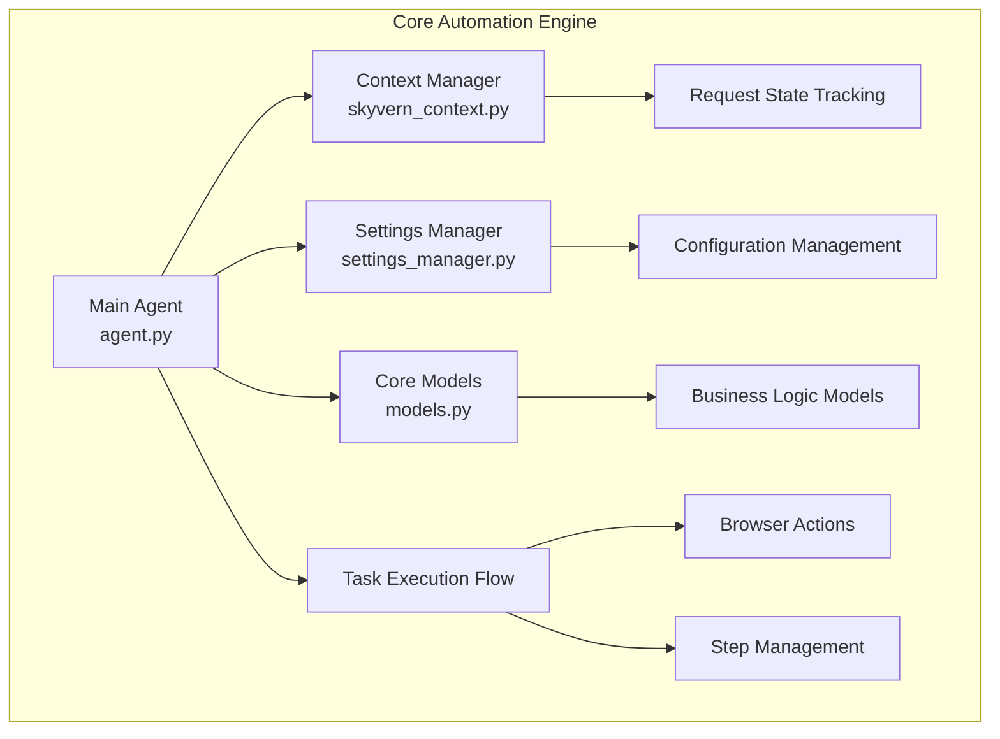

# 🤖 Phase 4: Core Automation Engine
## Overview & Table of Contents

---

### 🎯 **Presentation Objective**
Understanding Skyvern's core automation engine - the heart of browser automation and AI-driven task execution

---

### 📋 **Presentation Structure**

| Section | Focus Area | File |
|---------|------------|------|
| **4.1** | Main Agent Architecture | `01_main_agent.md` |
| **4.2** | Context Management | `02_context_management.md` |
| **4.3** | Settings Management | `03_settings_management.md` |
| **4.4** | Core Models & Data Structures | `04_core_models.md` |
| **4.5** | Integration Flow | `05_integration_flow.md` |

---

### 🎯 **Learning Goals**
- ✅ Understand the main execution flow
- ✅ Know how tasks become browser actions  
- ✅ Understand state management
- ✅ Grasp the agent architecture

---

### 🔑 **Key Components Overview**

---

### 💡 **Key Technologies**
- **Python AsyncIO** - Asynchronous execution
- **Playwright** - Browser automation
- **Pydantic** - Data validation
- **FastAPI** - Web framework integration
- **SQLAlchemy** - Database ORM

---

### 🎬 **Next: Deep Dive into Main Agent**
Let's start with the orchestration engine that powers everything...