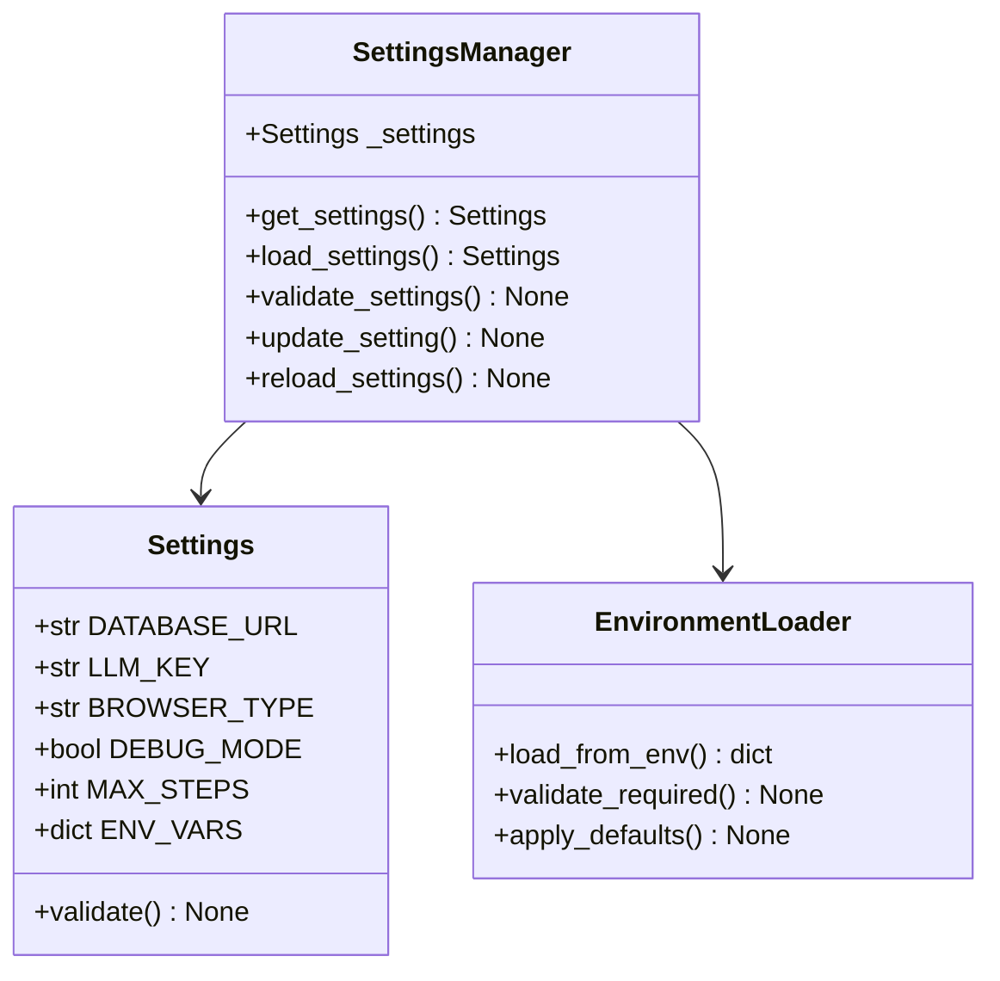
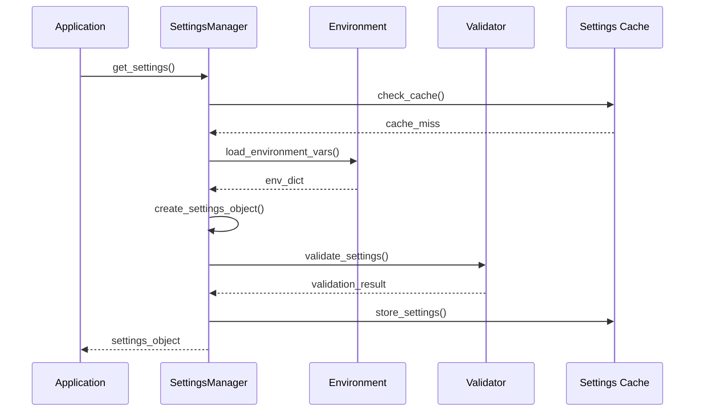
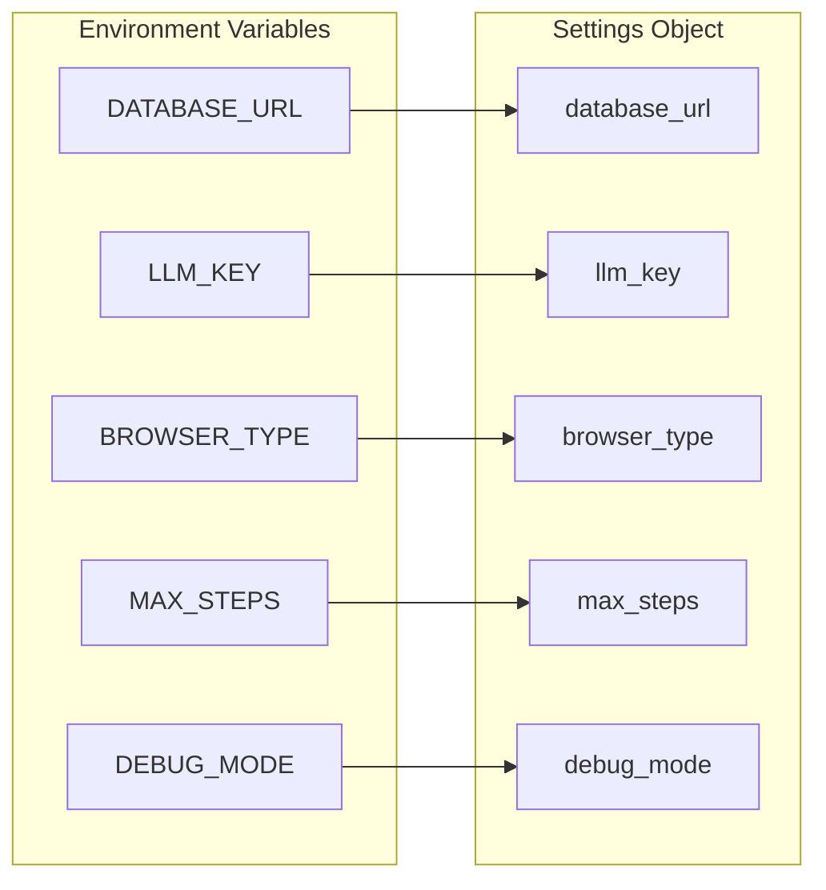
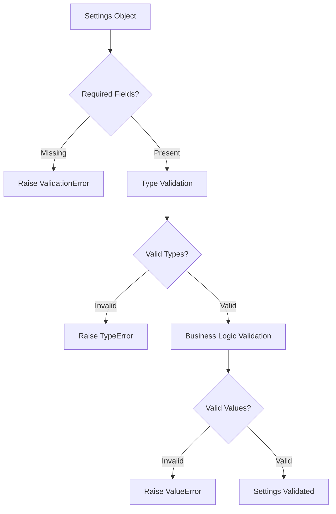
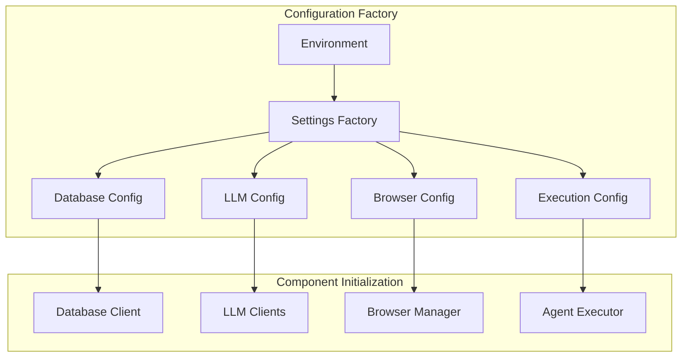

# 4.3 Settings Management
## `skyvern/forge/sdk/settings_manager.py` 🔥 **IMPORTANT**

---

### 🎯 **Purpose & Role**
The **SettingsManager** provides centralized configuration management with validation, environment variable loading, and dynamic settings updates.

---

### 🏗️ **Settings Architecture**



---

### 🔧 **Configuration Categories**

#### **🗄️ Database Configuration**
```python
class DatabaseSettings:
    DATABASE_URL: str = "postgresql://..."
    DATABASE_POOL_SIZE: int = 10
    DATABASE_MAX_OVERFLOW: int = 20
    DATABASE_TIMEOUT: int = 30
    DEBUG_ENABLED: bool = False
```

#### **🤖 AI/LLM Configuration**
```python
class LLMSettings:
    LLM_KEY: str  # Primary LLM provider
    SECONDARY_LLM_KEY: str | None = None
    SELECT_AGENT_LLM_KEY: str | None = None
    SINGLE_CLICK_AGENT_LLM_KEY: str | None = None
    ANTHROPIC_API_KEY: str | None = None
    OPENAI_API_KEY: str | None = None
    ENABLE_VOLCENGINE: bool = False
```

#### **🌐 Browser Configuration**
```python
class BrowserSettings:
    BROWSER_TYPE: str = "chromium"
    BROWSER_POOL_SIZE: int = 5
    BROWSER_TIMEOUT: int = 30000
    HEADLESS_BROWSER: bool = True
    BROWSER_VIEWPORT_WIDTH: int = 1920
    BROWSER_VIEWPORT_HEIGHT: int = 1080
```

#### **⚙️ Execution Configuration**
```python
class ExecutionSettings:
    MAX_STEPS_OVERRIDE: int | None = None
    MAX_RETRIES: int = 3
    ACTION_TIMEOUT: int = 30
    SCREENSHOT_TIMEOUT: int = 10
    ENABLE_CACHING: bool = True
```

---

### 🔄 **Settings Loading Flow**



---

### 🎛️ **Core Settings Manager API**

#### **🔍 get_settings()**
```python
@classmethod
def get_settings(cls) -> Settings:
    """Get current settings instance"""
    if cls._settings is None:
        cls._settings = cls.load_settings()
    return cls._settings
```
**Features:**
- Lazy loading pattern
- Singleton-like behavior
- Thread-safe access

#### **⚡ load_settings()**
```python
@classmethod
def load_settings(cls) -> Settings:
    """Load settings from environment"""
    env_vars = cls._load_environment()
    settings = Settings(**env_vars)
    cls._validate_settings(settings)
    return settings
```
**Process:**
1. Load environment variables
2. Create Settings object
3. Validate configuration
4. Return validated settings

#### **🔧 update_setting()**
```python
@classmethod
def update_setting(cls, key: str, value: Any) -> None:
    """Update a specific setting"""
    settings = cls.get_settings()
    setattr(settings, key, value)
    cls._validate_settings(settings)
```

---

### 🌍 **Environment Variable Mapping**



#### **Environment Loading Pattern**
```python
def _load_environment() -> dict:
    """Load and process environment variables"""
    config = {}
    
    # Required settings
    config['DATABASE_URL'] = os.getenv('DATABASE_URL')
    if not config['DATABASE_URL']:
        raise ValueError("DATABASE_URL is required")
    
    # Optional with defaults
    config['BROWSER_TYPE'] = os.getenv('BROWSER_TYPE', 'chromium')
    config['MAX_STEPS'] = int(os.getenv('MAX_STEPS', '10'))
    config['DEBUG_MODE'] = os.getenv('DEBUG_MODE', 'false').lower() == 'true'
    
    return config
```

---

### ✅ **Settings Validation**



#### **Validation Examples**
```python
def _validate_settings(settings: Settings) -> None:
    """Validate settings configuration"""
    
    # Database validation
    if not settings.DATABASE_URL:
        raise ValueError("DATABASE_URL is required")
    
    # LLM validation
    if not any([settings.LLM_KEY, settings.OPENAI_API_KEY, settings.ANTHROPIC_API_KEY]):
        raise ValueError("At least one LLM API key is required")
    
    # Browser validation
    if settings.BROWSER_TYPE not in ['chromium', 'firefox', 'webkit']:
        raise ValueError(f"Invalid browser type: {settings.BROWSER_TYPE}")
    
    # Numeric validation
    if settings.MAX_STEPS and settings.MAX_STEPS <= 0:
        raise ValueError("MAX_STEPS must be positive")
```

---

### 🔄 **Dynamic Configuration Updates**

#### **Hot Reload Pattern**
```python
async def reload_settings():
    """Reload settings without restart"""
    old_settings = SettingsManager.get_settings()
    
    try:
        # Load new settings
        new_settings = SettingsManager.load_settings()
        SettingsManager._settings = new_settings
        
        # Update dependent components
        await update_browser_pool(new_settings.BROWSER_POOL_SIZE)
        await update_llm_clients(new_settings.LLM_KEY)
        
        LOG.info("Settings reloaded successfully")
        
    except Exception as e:
        # Rollback on error
        SettingsManager._settings = old_settings
        LOG.error(f"Settings reload failed: {e}")
        raise
```

---

### 🎯 **Settings Usage Patterns**

#### **Pattern 1: Component Initialization**
```python
class BrowserManager:
    def __init__(self):
        settings = SettingsManager.get_settings()
        self.browser_type = settings.BROWSER_TYPE
        self.pool_size = settings.BROWSER_POOL_SIZE
        self.timeout = settings.BROWSER_TIMEOUT
```

#### **Pattern 2: Conditional Features**
```python
async def execute_with_caching():
    settings = SettingsManager.get_settings()
    
    if settings.ENABLE_CACHING:
        result = await cache.get("action_plan")
        if result:
            return result
    
    # Execute without cache
    result = await compute_action_plan()
    
    if settings.ENABLE_CACHING:
        await cache.set("action_plan", result)
    
    return result
```

#### **Pattern 3: Environment-Specific Behavior**
```python
def setup_logging():
    settings = SettingsManager.get_settings()
    
    level = logging.DEBUG if settings.DEBUG_MODE else logging.INFO
    logging.basicConfig(level=level)
    
    if settings.DEBUG_MODE:
        # Enable detailed browser logging
        enable_playwright_debug()
```

---

### 🏭 **Configuration Factory Pattern**



```python
class ConfigurationFactory:
    @staticmethod
    def create_database_config() -> DatabaseConfig:
        settings = SettingsManager.get_settings()
        return DatabaseConfig(
            url=settings.DATABASE_URL,
            pool_size=settings.DATABASE_POOL_SIZE,
            timeout=settings.DATABASE_TIMEOUT
        )
    
    @staticmethod
    def create_llm_config() -> LLMConfig:
        settings = SettingsManager.get_settings()
        return LLMConfig(
            primary_key=settings.LLM_KEY,
            secondary_key=settings.SECONDARY_LLM_KEY,
            anthropic_key=settings.ANTHROPIC_API_KEY
        )
```

---

### 🎯 **Next: Core Models & Data Structures**
Understanding the foundational data models that power the system...