# 🎼 Service Orchestration & High-Level Architecture
## Coordination and Integration Patterns

---

## 📋 Presentation Agenda

1. **Orchestration vs Choreography**
2. **High-Level Service Architecture**
3. **Service Coordination Patterns**
4. **Data Flow Management**
5. **Error Handling & Recovery**
6. **Performance & Scalability**
7. **Future Architecture Evolution**

---

## 🎭 Orchestration vs Choreography

### **Orchestration Pattern**

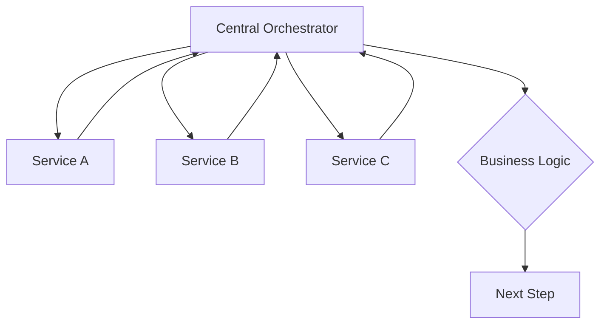

**Characteristics:**
- Central control point
- Explicit business logic
- Clear service dependencies
- Easier debugging and monitoring

### **Choreography Pattern**

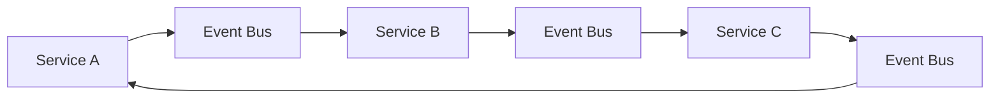

**Characteristics:**
- Distributed control
- Event-driven communication
- Loose coupling
- Self-organizing behavior

### **Skyvern's Hybrid Approach**

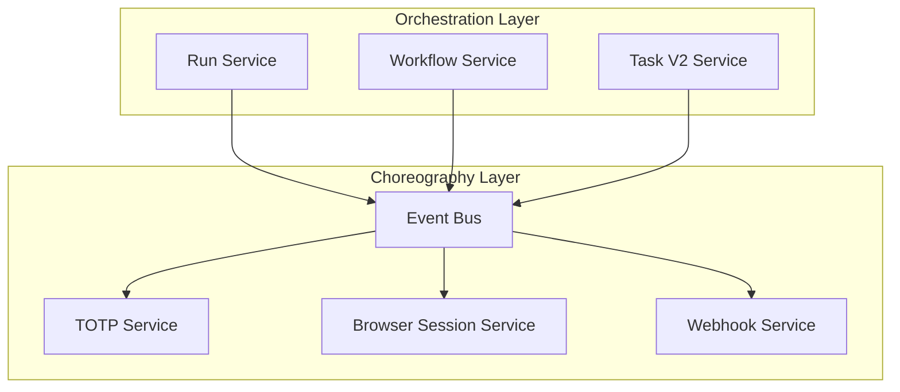

---

## 🏗️ High-Level Service Architecture

### **Service Layer Hierarchy**

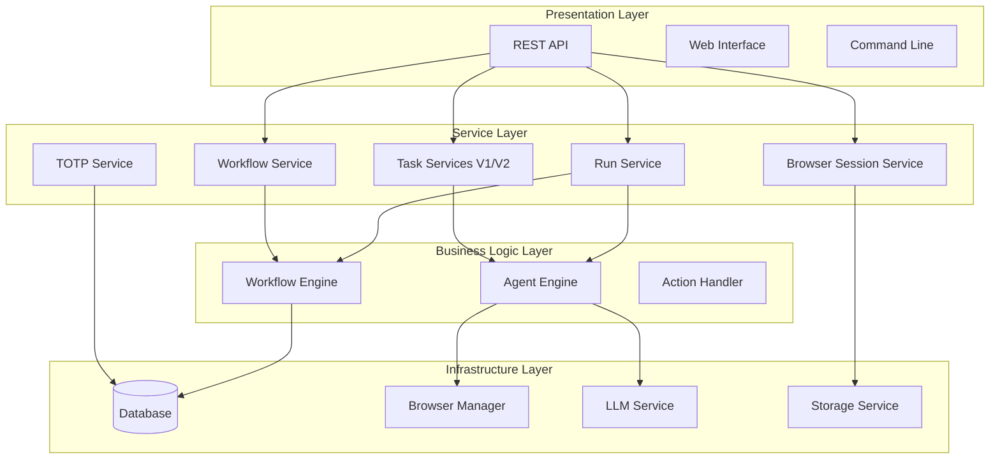

### **Service Interaction Matrix**

| Service | Run Service | Workflow Service | Task V1/V2 | Browser Session | TOTP | Database |
|---------|-------------|------------------|------------|------------------|------|----------|
| **Run Service** | - | ✅ Creates | ✅ Creates | ✅ Manages | ✅ Coordinates | ✅ Reads/Writes |
| **Workflow Service** | ✅ Reports to | - | ✅ Creates V2 | ✅ Uses | ✅ Uses | ✅ Reads/Writes |
| **Task V1/V2** | ✅ Reports to | ✅ Reports to | - | ✅ Uses | ✅ Uses | ✅ Reads/Writes |
| **Browser Session** | ✅ Provides to | ✅ Provides to | ✅ Provides to | - | ❌ No direct | ✅ Reads/Writes |
| **TOTP** | ✅ Provides to | ✅ Provides to | ✅ Provides to | ❌ No direct | - | ✅ Reads/Writes |
| **Database** | ✅ Serves | ✅ Serves | ✅ Serves | ✅ Serves | ✅ Serves | - |

---

## 🔄 Service Coordination Patterns

### **1. Request-Response Pattern**

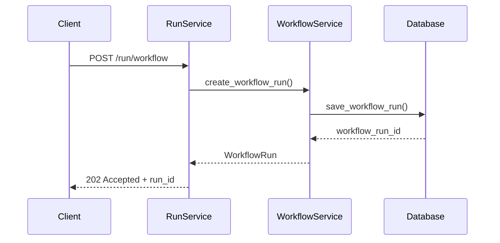

### **2. Event-Driven Pattern**

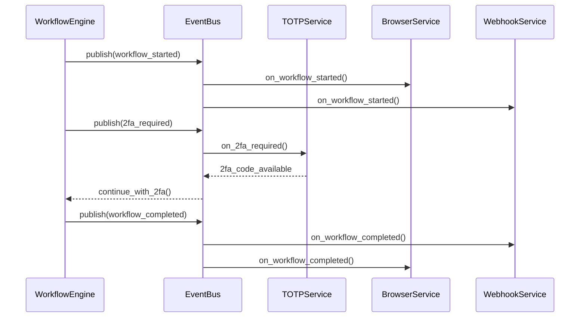

### **3. Saga Pattern for Distributed Transactions**

```python
class WorkflowExecutionSaga:
    def __init__(self):
        self.steps = [
            SagaStep("create_workflow_run", self.create_workflow_run, self.rollback_workflow_run),
            SagaStep("acquire_browser_session", self.acquire_browser_session, self.release_browser_session),
            SagaStep("execute_workflow", self.execute_workflow, self.cancel_workflow),
            SagaStep("send_webhooks", self.send_webhooks, self.cancel_webhooks)
        ]
    
    async def execute(self, context: WorkflowContext) -> WorkflowResult:
        executed_steps = []
        
        try:
            for step in self.steps:
                result = await step.execute(context)
                executed_steps.append((step, result))
                context.update(result)
            
            return WorkflowResult.success(context)
        
        except Exception as e:
            # Rollback executed steps in reverse order
            for step, result in reversed(executed_steps):
                try:
                    await step.rollback(context, result)
                except Exception as rollback_error:
                    LOG.error(f"Rollback failed for step {step.name}: {rollback_error}")
            
            return WorkflowResult.failure(str(e))

class SagaStep:
    def __init__(self, name: str, execute_func: Callable, rollback_func: Callable):
        self.name = name
        self.execute_func = execute_func
        self.rollback_func = rollback_func
    
    async def execute(self, context: WorkflowContext) -> dict:
        return await self.execute_func(context)
    
    async def rollback(self, context: WorkflowContext, result: dict) -> None:
        await self.rollback_func(context, result)
```

### **4. Circuit Breaker with Bulkhead Pattern**

```python
class ServiceBulkhead:
    def __init__(self):
        self.service_pools = {
            'totp': ResourcePool(max_concurrent=10, queue_size=50),
            'browser_session': ResourcePool(max_concurrent=20, queue_size=100),
            'workflow_engine': ResourcePool(max_concurrent=50, queue_size=200),
            'database': ResourcePool(max_concurrent=100, queue_size=500)
        }
        self.circuit_breakers = {
            service: CircuitBreaker(failure_threshold=5, timeout_seconds=60)
            for service in self.service_pools.keys()
        }
    
    async def execute_with_bulkhead(
        self,
        service_name: str,
        operation: Callable,
        *args,
        **kwargs
    ) -> Any:
        """Execute operation with resource isolation"""
        pool = self.service_pools.get(service_name)
        circuit_breaker = self.circuit_breakers.get(service_name)
        
        if not pool or not circuit_breaker:
            raise UnknownServiceError(service_name)
        
        # Acquire resource from pool
        async with pool.acquire() as resource:
            # Execute with circuit breaker protection
            return await circuit_breaker.call_service(operation, *args, **kwargs)

class ResourcePool:
    def __init__(self, max_concurrent: int, queue_size: int):
        self.semaphore = asyncio.Semaphore(max_concurrent)
        self.queue = asyncio.Queue(maxsize=queue_size)
        self.active_requests = 0
    
    async def acquire(self):
        """Acquire resource with timeout"""
        try:
            await asyncio.wait_for(self.semaphore.acquire(), timeout=30.0)
            self.active_requests += 1
            return ResourceContext(self)
        except asyncio.TimeoutError:
            raise ResourcePoolExhaustedError(f"Could not acquire resource within timeout")
    
    def release(self):
        """Release resource back to pool"""
        self.active_requests -= 1
        self.semaphore.release()

class ResourceContext:
    def __init__(self, pool: ResourcePool):
        self.pool = pool
    
    async def __aenter__(self):
        return self
    
    async def __aexit__(self, exc_type, exc_val, exc_tb):
        self.pool.release()
```

---

## 🌊 Data Flow Management

### **Data Flow Architecture**

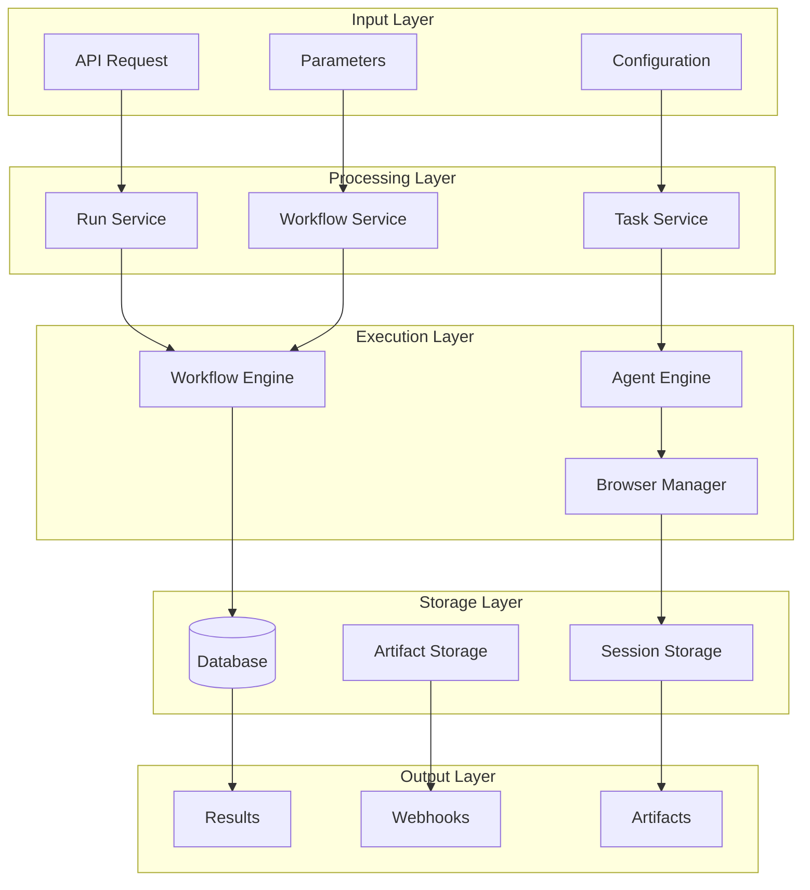

### **Context Propagation**

```python
class ContextPropagationManager:
    def __init__(self):
        self.context_extractors = {}
        self.context_injectors = {}
    
    def register_extractor(self, service_name: str, extractor: Callable):
        """Register context extractor for a service"""
        self.context_extractors[service_name] = extractor
    
    def register_injector(self, service_name: str, injector: Callable):
        """Register context injector for a service"""
        self.context_injectors[service_name] = injector
    
    async def propagate_context(
        self,
        from_service: str,
        to_service: str,
        context_data: dict
    ) -> dict:
        """Propagate context between services"""
        # Extract context from source service
        if from_service in self.context_extractors:
            extracted_context = await self.context_extractors[from_service](context_data)
        else:
            extracted_context = context_data
        
        # Inject context into target service
        if to_service in self.context_injectors:
            injected_context = await self.context_injectors[to_service](extracted_context)
        else:
            injected_context = extracted_context
        
        return injected_context

# Global context propagation
context_manager = ContextPropagationManager()

# Register extractors
context_manager.register_extractor('run_service', extract_run_context)
context_manager.register_extractor('workflow_service', extract_workflow_context)
context_manager.register_extractor('task_service', extract_task_context)

# Register injectors
context_manager.register_injector('workflow_engine', inject_workflow_context)
context_manager.register_injector('agent_engine', inject_agent_context)
context_manager.register_injector('browser_manager', inject_browser_context)
```

### **State Management Across Services**

```python
class DistributedStateManager:
    def __init__(self):
        self.state_store = RedisStateStore()
        self.state_subscribers = defaultdict(list)
        self.state_history = StateHistory()
    
    async def set_state(
        self,
        key: str,
        value: Any,
        ttl_seconds: int | None = None,
        notify_subscribers: bool = True
    ) -> None:
        """Set distributed state"""
        # Store state
        await self.state_store.set(key, value, ttl_seconds)
        
        # Record in history
        await self.state_history.record(key, value, datetime.utcnow())
        
        # Notify subscribers
        if notify_subscribers:
            await self._notify_subscribers(key, value)
    
    async def get_state(self, key: str) -> Any:
        """Get distributed state"""
        return await self.state_store.get(key)
    
    async def subscribe_to_state_changes(
        self,
        pattern: str,
        callback: Callable[[str, Any], None]
    ) -> None:
        """Subscribe to state changes"""
        self.state_subscribers[pattern].append(callback)
    
    async def _notify_subscribers(self, key: str, value: Any) -> None:
        """Notify all matching subscribers"""
        for pattern, callbacks in self.state_subscribers.items():
            if fnmatch.fnmatch(key, pattern):
                for callback in callbacks:
                    try:
                        await callback(key, value)
                    except Exception as e:
                        LOG.error(f"State change callback failed: {e}")

# Usage example
state_manager = DistributedStateManager()

# Services can subscribe to state changes
await state_manager.subscribe_to_state_changes(
    'workflow:*:status',
    workflow_service.on_workflow_status_change
)

await state_manager.subscribe_to_state_changes(
    'task:*:progress',
    monitoring_service.on_task_progress_update
)
```

---

## 🚨 Error Handling & Recovery

### **Error Propagation Strategy**

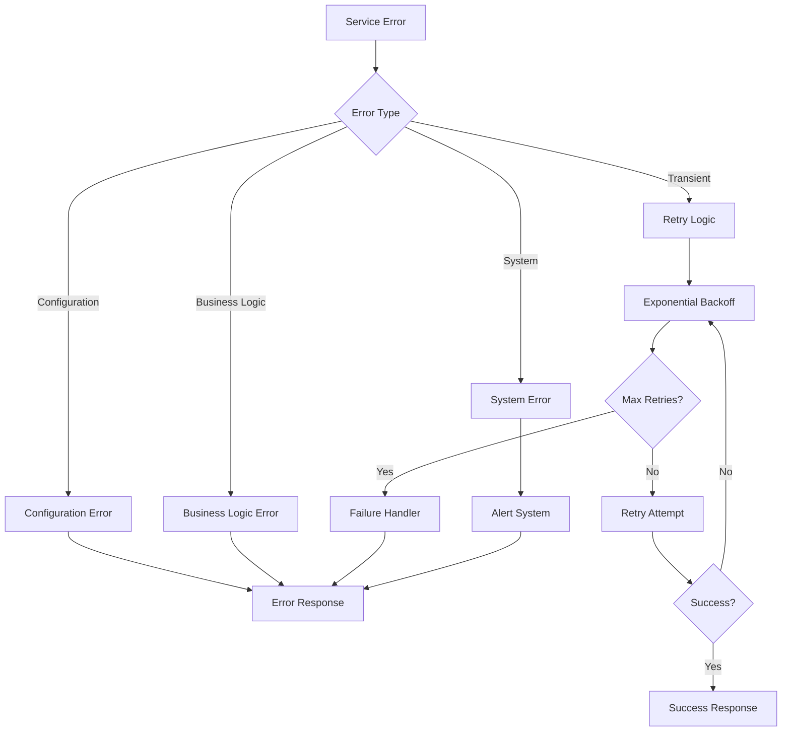

### **Comprehensive Error Handling**

```python
class ServiceErrorHandler:
    def __init__(self):
        self.error_classifiers = [
            TransientErrorClassifier(),
            ConfigurationErrorClassifier(),
            BusinessLogicErrorClassifier(),
            SystemErrorClassifier()
        ]
        self.retry_strategies = {
            'transient': ExponentialBackoffRetry(max_retries=3),
            'rate_limit': LinearBackoffRetry(max_retries=5),
            'network': ExponentialBackoffRetry(max_retries=2)
        }
        self.alert_manager = AlertManager()
    
    async def handle_error(
        self,
        error: Exception,
        context: ServiceContext
    ) -> ErrorHandlingResult:
        """Handle service error with appropriate strategy"""
        # Classify the error
        error_type = await self._classify_error(error, context)
        
        # Log the error with context
        await self._log_error(error, error_type, context)
        
        # Handle based on error type
        if error_type.is_retryable:
            return await self._handle_retryable_error(error, error_type, context)
        else:
            return await self._handle_non_retryable_error(error, error_type, context)
    
    async def _classify_error(
        self,
        error: Exception,
        context: ServiceContext
    ) -> ErrorClassification:
        """Classify error using registered classifiers"""
        for classifier in self.error_classifiers:
            classification = await classifier.classify(error, context)
            if classification:
                return classification
        
        # Default classification
        return ErrorClassification(
            type='unknown',
            severity='medium',
            is_retryable=False,
            requires_alert=True
        )
    
    async def _handle_retryable_error(
        self,
        error: Exception,
        error_type: ErrorClassification,
        context: ServiceContext
    ) -> ErrorHandlingResult:
        """Handle errors that can be retried"""
        retry_strategy = self.retry_strategies.get(error_type.retry_strategy)
        
        if not retry_strategy:
            return ErrorHandlingResult.failure("No retry strategy available")
        
        # Attempt retry
        retry_result = await retry_strategy.execute(
            context.operation,
            context.args,
            context.kwargs
        )
        
        if retry_result.success:
            return ErrorHandlingResult.success(retry_result.result)
        else:
            # All retries exhausted
            await self.alert_manager.send_alert(
                AlertLevel.HIGH,
                f"Service operation failed after all retries: {error}",
                context
            )
            return ErrorHandlingResult.failure(f"Retries exhausted: {error}")
    
    async def _handle_non_retryable_error(
        self,
        error: Exception,
        error_type: ErrorClassification,
        context: ServiceContext
    ) -> ErrorHandlingResult:
        """Handle errors that should not be retried"""
        if error_type.requires_alert:
            await self.alert_manager.send_alert(
                AlertLevel.from_severity(error_type.severity),
                f"Non-retryable service error: {error}",
                context
            )
        
        return ErrorHandlingResult.failure(str(error))

class ExponentialBackoffRetry:
    def __init__(self, max_retries: int = 3, base_delay: float = 1.0, max_delay: float = 60.0):
        self.max_retries = max_retries
        self.base_delay = base_delay
        self.max_delay = max_delay
    
    async def execute(self, operation: Callable, *args, **kwargs) -> RetryResult:
        """Execute operation with exponential backoff"""
        last_exception = None
        
        for attempt in range(self.max_retries + 1):
            try:
                result = await operation(*args, **kwargs)
                return RetryResult.success(result)
            except Exception as e:
                last_exception = e
                
                if attempt < self.max_retries:
                    delay = min(self.base_delay * (2 ** attempt), self.max_delay)
                    await asyncio.sleep(delay)
                    
                    LOG.info(
                        "Retrying operation",
                        attempt=attempt + 1,
                        max_retries=self.max_retries,
                        delay_seconds=delay,
                        error=str(e)
                    )
        
        return RetryResult.failure(str(last_exception))
```

### **Service Recovery Patterns**

```python
class ServiceRecoveryManager:
    def __init__(self):
        self.recovery_strategies = {
            'database_connection_lost': DatabaseRecoveryStrategy(),
            'browser_session_expired': BrowserSessionRecoveryStrategy(),
            'workflow_engine_crashed': WorkflowEngineRecoveryStrategy(),
            'memory_exhaustion': MemoryRecoveryStrategy()
        }
        self.health_monitor = ServiceHealthMonitor()
    
    async def attempt_recovery(
        self,
        service_name: str,
        failure_type: str,
        context: RecoveryContext
    ) -> RecoveryResult:
        """Attempt to recover from service failure"""
        strategy = self.recovery_strategies.get(failure_type)
        
        if not strategy:
            return RecoveryResult.failure(f"No recovery strategy for {failure_type}")
        
        try:
            # Execute recovery strategy
            recovery_steps = await strategy.get_recovery_steps(context)
            
            for step in recovery_steps:
                step_result = await step.execute(context)
                if not step_result.success:
                    return RecoveryResult.failure(f"Recovery step failed: {step.name}")
            
            # Verify recovery
            if await self.health_monitor.verify_service_health(service_name):
                return RecoveryResult.success("Service recovered successfully")
            else:
                return RecoveryResult.failure("Service health check failed after recovery")
        
        except Exception as e:
            return RecoveryResult.failure(f"Recovery attempt failed: {e}")

class DatabaseRecoveryStrategy:
    async def get_recovery_steps(self, context: RecoveryContext) -> List[RecoveryStep]:
        return [
            RecoveryStep("close_existing_connections", self.close_connections),
            RecoveryStep("wait_for_database", self.wait_for_database),
            RecoveryStep("recreate_connection_pool", self.recreate_pool),
            RecoveryStep("verify_connectivity", self.verify_connectivity)
        ]
    
    async def close_connections(self, context: RecoveryContext) -> StepResult:
        """Close all existing database connections"""
        try:
            await context.database_pool.close_all_connections()
            return StepResult.success()
        except Exception as e:
            return StepResult.failure(str(e))
    
    async def wait_for_database(self, context: RecoveryContext) -> StepResult:
        """Wait for database to become available"""
        max_wait_seconds = 60
        check_interval = 5
        
        for attempt in range(max_wait_seconds // check_interval):
            try:
                await context.database_pool.check_connectivity()
                return StepResult.success()
            except Exception:
                await asyncio.sleep(check_interval)
        
        return StepResult.failure("Database did not become available within timeout")
```

---

## 🚀 Performance & Scalability

### **Performance Optimization Strategies**

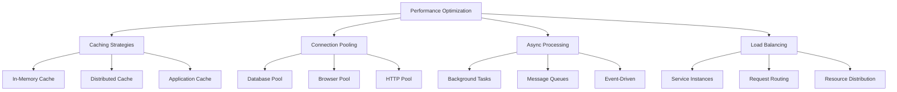

### **Scalability Architecture**

```python
class ScalabilityManager:
    def __init__(self):
        self.load_monitor = LoadMonitor()
        self.auto_scaler = AutoScaler()
        self.load_balancer = LoadBalancer()
        self.performance_metrics = PerformanceMetrics()
    
    async def monitor_and_scale(self) -> None:
        """Continuously monitor load and scale services"""
        while True:
            try:
                # Collect current metrics
                metrics = await self.performance_metrics.collect_all()
                
                # Analyze load patterns
                load_analysis = await self.load_monitor.analyze_load(metrics)
                
                # Make scaling decisions
                scaling_decisions = await self.auto_scaler.make_scaling_decisions(load_analysis)
                
                # Execute scaling actions
                for decision in scaling_decisions:
                    await self.execute_scaling_action(decision)
                
                # Update load balancer configuration
                await self.load_balancer.update_configuration(scaling_decisions)
                
                await asyncio.sleep(30)  # Check every 30 seconds
            
            except Exception as e:
                LOG.error(f"Scaling monitor error: {e}")
                await asyncio.sleep(60)  # Longer delay on error
    
    async def execute_scaling_action(self, decision: ScalingDecision) -> None:
        """Execute a scaling action"""
        if decision.action == ScalingAction.SCALE_UP:
            await self.scale_up_service(decision.service_name, decision.target_instances)
        elif decision.action == ScalingAction.SCALE_DOWN:
            await self.scale_down_service(decision.service_name, decision.target_instances)
        elif decision.action == ScalingAction.REDISTRIBUTE:
            await self.redistribute_load(decision.service_name, decision.load_distribution)

class PerformanceOptimizer:
    def __init__(self):
        self.optimization_strategies = [
            CacheOptimizationStrategy(),
            ConnectionPoolOptimizationStrategy(),
            QueryOptimizationStrategy(),
            ResourceOptimizationStrategy()
        ]
    
    async def optimize_performance(self, service_name: str) -> List[OptimizationResult]:
        """Apply performance optimizations to a service"""
        results = []
        
        for strategy in self.optimization_strategies:
            if await strategy.is_applicable(service_name):
                try:
                    result = await strategy.apply_optimization(service_name)
                    results.append(result)
                except Exception as e:
                    results.append(OptimizationResult.failure(
                        strategy.name,
                        f"Optimization failed: {e}"
                    ))
        
        return results

class CacheOptimizationStrategy:
    def __init__(self):
        self.name = "cache_optimization"
    
    async def is_applicable(self, service_name: str) -> bool:
        """Check if cache optimization is applicable"""
        cache_metrics = await get_cache_metrics(service_name)
        return cache_metrics.hit_rate < 0.7  # Less than 70% hit rate
    
    async def apply_optimization(self, service_name: str) -> OptimizationResult:
        """Apply cache optimizations"""
        optimizations = []
        
        # Increase cache size if memory allows
        if await self.can_increase_cache_size(service_name):
            await self.increase_cache_size(service_name)
            optimizations.append("increased_cache_size")
        
        # Optimize cache eviction policy
        await self.optimize_eviction_policy(service_name)
        optimizations.append("optimized_eviction_policy")
        
        # Add cache warming
        await self.add_cache_warming(service_name)
        optimizations.append("added_cache_warming")
        
        return OptimizationResult.success(self.name, optimizations)
```

---

## 🔮 Future Architecture Evolution

### **Microservices Evolution Path**

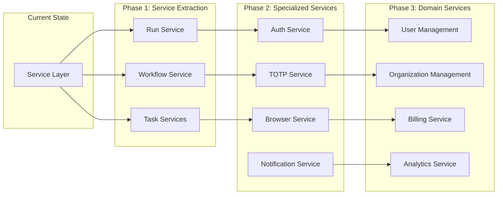

### **Technology Evolution**

```python
class ArchitectureEvolutionPlanner:
    def __init__(self):
        self.evolution_phases = [
            EvolutionPhase(
                name="service_mesh_adoption",
                description="Adopt service mesh for inter-service communication",
                technologies=["Istio", "Envoy", "gRPC"],
                timeline_months=6
            ),
            EvolutionPhase(
                name="event_sourcing",
                description="Implement event sourcing for audit and replay",
                technologies=["Apache Kafka", "EventStore", "CQRS"],
                timeline_months=9
            ),
            EvolutionPhase(
                name="container_orchestration",
                description="Move to container orchestration",
                technologies=["Kubernetes", "Docker", "Helm"],
                timeline_months=12
            ),
            EvolutionPhase(
                name="serverless_adoption",
                description="Adopt serverless for stateless functions",
                technologies=["AWS Lambda", "Azure Functions", "Knative"],
                timeline_months=15
            )
        ]
    
    async def plan_evolution(self, current_state: ArchitectureState) -> EvolutionPlan:
        """Create evolution plan based on current state"""
        applicable_phases = []
        
        for phase in self.evolution_phases:
            readiness = await self.assess_readiness(phase, current_state)
            if readiness.is_ready:
                applicable_phases.append(phase)
        
        return EvolutionPlan(
            phases=applicable_phases,
            total_timeline_months=sum(p.timeline_months for p in applicable_phases),
            required_skills=self.extract_required_skills(applicable_phases),
            estimated_cost=self.estimate_cost(applicable_phases)
        )

class ServiceMeshIntegration:
    """Future service mesh integration"""
    
    async def implement_service_mesh(self) -> None:
        """Implement service mesh for inter-service communication"""
        # Configure service mesh sidecar proxies
        await self.configure_sidecar_proxies()
        
        # Implement service discovery
        await self.implement_service_discovery()
        
        # Add traffic management
        await self.add_traffic_management()
        
        # Implement security policies
        await self.implement_security_policies()
        
        # Add observability
        await self.add_observability()
    
    async def configure_sidecar_proxies(self) -> None:
        """Configure Envoy sidecar proxies for each service"""
        services = ['run_service', 'workflow_service', 'task_service', 'totp_service']
        
        for service in services:
            proxy_config = EnvoyProxyConfig(
                service_name=service,
                upstream_clusters=self.get_upstream_services(service),
                load_balancing_policy='round_robin',
                health_check_config=self.get_health_check_config(service)
            )
            
            await self.deploy_sidecar_proxy(service, proxy_config)
```

### **Cloud-Native Evolution**

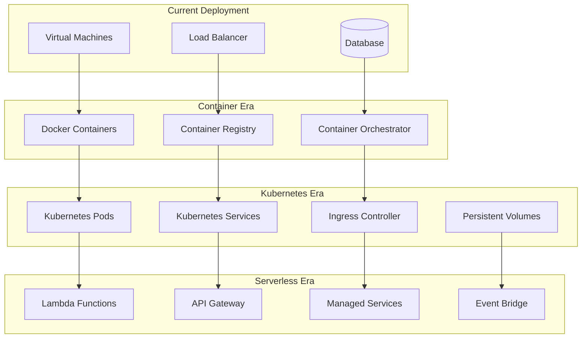

---

## 🎯 Learning Objectives Summary

### ✅ **Service Orchestration Patterns**
- Orchestration vs. choreography trade-offs
- Hybrid coordination approaches
- Service interaction patterns

### ✅ **High-Level Architecture**
- Service layer hierarchy
- Interaction matrices
- Integration strategies

### ✅ **Data Flow Management**
- Context propagation
- State management
- Data consistency patterns

### ✅ **Error Handling & Recovery**
- Error classification and handling
- Retry strategies and circuit breakers
- Service recovery patterns

### ✅ **Performance & Scalability**
- Optimization strategies
- Auto-scaling mechanisms
- Load balancing approaches

### ✅ **Future Evolution**
- Microservices evolution path
- Technology adoption strategy
- Cloud-native transformation

---

## 📚 Architecture Best Practices

### **Design Principles**
1. **Loose Coupling** - Services interact through well-defined interfaces
2. **High Cohesion** - Related functionality grouped within services
3. **Single Responsibility** - Each service has one clear purpose
4. **Autonomous Teams** - Teams can develop and deploy independently

### **Operational Excellence**
1. **Observability** - Comprehensive monitoring and logging
2. **Resilience** - Fault tolerance and graceful degradation
3. **Scalability** - Horizontal and vertical scaling capabilities
4. **Security** - Defense in depth and principle of least privilege

### **Evolution Strategy**
1. **Incremental Changes** - Small, reversible improvements
2. **Data-Driven Decisions** - Metrics-based architecture choices
3. **Technology Evaluation** - Careful assessment of new technologies
4. **Risk Management** - Balanced approach to architectural changes

---

## 🔄 Integration Summary

### **Key Integration Points**
- **API Gateway** - Unified entry point for all services
- **Service Registry** - Dynamic service discovery
- **Configuration Management** - Centralized configuration
- **Event Bus** - Asynchronous communication backbone

### **Cross-Cutting Concerns**
- **Authentication & Authorization** - Consistent security model
- **Logging & Monitoring** - Unified observability
- **Error Handling** - Consistent error propagation
- **Performance Optimization** - Service-wide optimization

This completes the comprehensive presentation on Phase 9: Services & Business Logic. The presentations cover the service layer architecture, individual service deep dives, orchestration patterns, and future evolution strategies, providing a complete understanding of how Skyvern's services work together to deliver the automation platform.