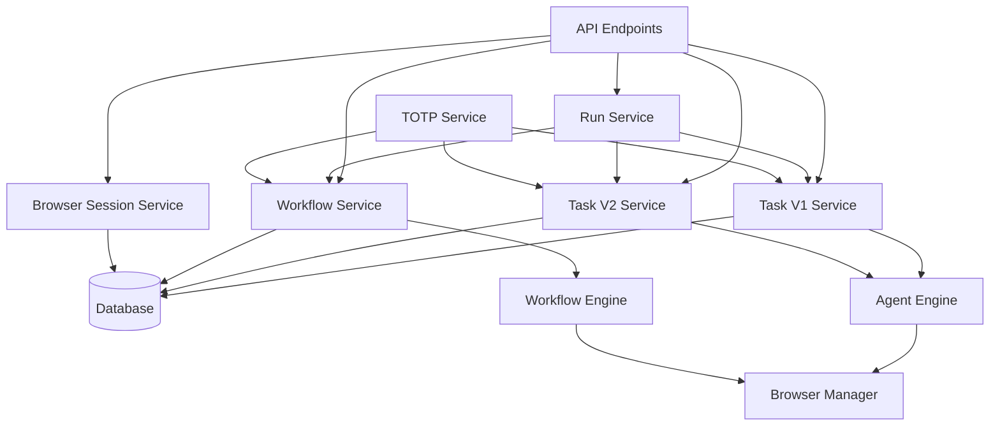
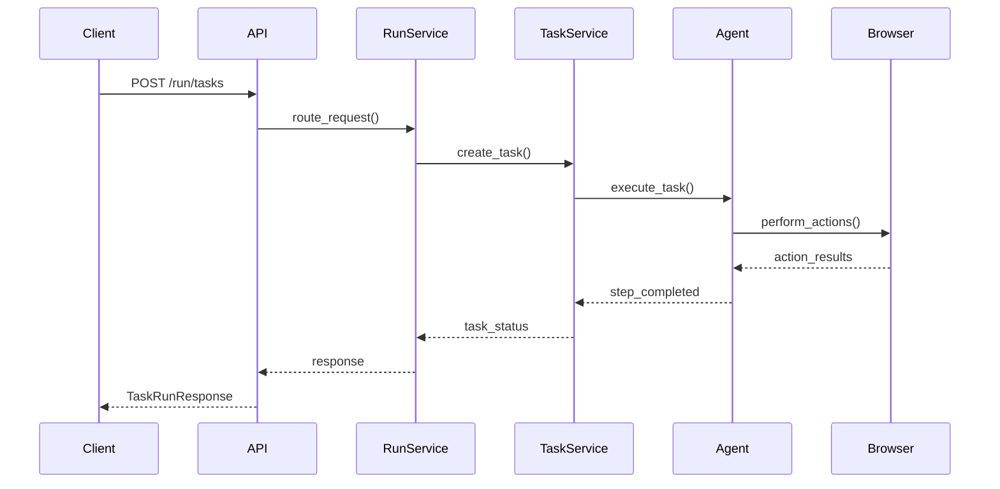
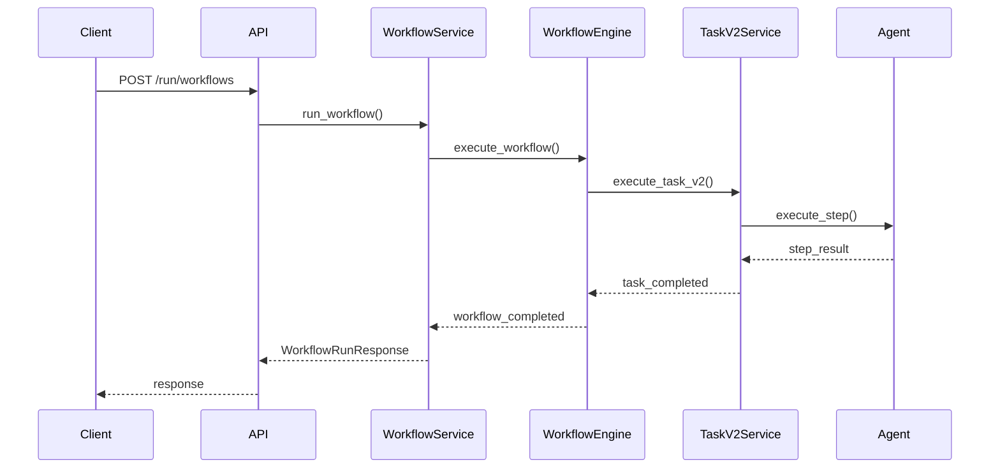
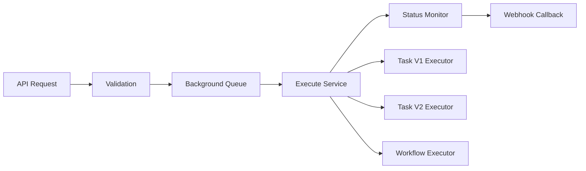

# 🏢 Phase 9: Services & Business Logic
## Comprehensive Overview

---

## 📋 Presentation Agenda

1. **Service Layer Architecture**
2. **Core Service Components**
3. **Business Logic Patterns**
4. **Service Interaction Flow**
5. **High-Level Orchestration**
6. **Key Learning Objectives**

---

## 🏗️ Service Layer Architecture

### **Layered Architecture Pattern**

```
┌─────────────────────────────────────┐
│            API Layer                │
│     (FastAPI Endpoints)             │
├─────────────────────────────────────┤
│          Service Layer              │
│    (Business Logic Services)       │
├─────────────────────────────────────┤
│         Repository Layer            │
│      (Database Access)              │
├─────────────────────────────────────┤
│         Infrastructure Layer        │
│   (Browser, External APIs, etc.)   │
└─────────────────────────────────────┘
```

### **Service Layer Responsibilities**
- **Business Logic Orchestration**
- **Cross-cutting Concerns**
- **State Management**
- **External Service Integration**

---

## 🔧 Core Service Components

### **9.1 Task Services**
- **`task_v1_service.py`** - Legacy task management
- **`task_v2_service.py`** - Enhanced task management

### **9.2 Workflow Services**
- **`workflow_service.py`** - Workflow orchestration

### **9.3 Browser & Session Services**
- **`browser_session_service.py`** - Session management

### **9.4 Specialized Services**
- **`totp_service.py`** - 2FA authentication
- **`run_service.py`** - Execution management

### **9.5 Supporting Services**
- **`run_code_service.py`** - Code execution

---

## 📊 Service Architecture Diagram



---

## 🔄 Business Logic Patterns

### **1. Service Facade Pattern**
- Unified interface for complex subsystems
- Simplifies client interactions
- Encapsulates business rules

### **2. Orchestrator Pattern**
- Coordinates multiple services
- Manages complex workflows
- Handles state transitions

### **3. Strategy Pattern**
- Different execution engines
- Task version handling
- Run type processing

### **4. Factory Pattern**
- Service instantiation
- Configuration-based creation
- Dependency injection

---

## 🌊 Service Interaction Flow

### **Task Execution Flow**



### **Workflow Execution Flow**



---

## 🎯 Key Service Responsibilities

### **Run Service**
- **Route Management** - Determines execution path
- **Engine Selection** - Chooses appropriate execution engine
- **Webhook Handling** - Manages callback notifications

### **Task Services (V1 & V2)**
- **Task Lifecycle** - Creation, execution, completion
- **State Management** - Status tracking and updates
- **Result Processing** - Data extraction and validation

### **Workflow Service**
- **Workflow Orchestration** - Block-based execution
- **Parameter Management** - Input/output handling
- **Template Processing** - Reusable workflow patterns

### **Browser Session Service**
- **Session Lifecycle** - Creation, persistence, cleanup
- **State Preservation** - Maintaining browser context
- **Resource Management** - Memory and connection pooling

---

## 🔐 Specialized Services Deep Dive

### **TOTP Service**
```python
# Two-Factor Authentication Integration
class TOTPService:
    async def get_totp_code(url: str) -> str
    async def validate_totp(code: str) -> bool
    async def push_totp_code(identifier: str, code: str)
```

### **Run Service Engine Selection**
```python
# Engine Selection Logic
if run_request.engine in CUA_ENGINES:
    # Use Conversational UI Assistant
    return await task_v1_service.execute_cua_task()
elif run_request.engine == RunEngine.skyvern_v1:
    # Use legacy Skyvern engine
    return await task_v1_service.execute_v1_task()
elif run_request.engine == RunEngine.skyvern_v2:
    # Use enhanced Skyvern engine
    return await task_v2_service.execute_v2_task()
```

---

## 🚀 High-Level Orchestration

### **Background Task Execution**



### **Execution Context Management**
- **SkyvernContext** - Global state management
- **Organization Scope** - Multi-tenancy support
- **Request Tracking** - Correlation IDs
- **Resource Cleanup** - Automatic cleanup

---

## 📈 Service Metrics & Monitoring

### **Key Performance Indicators**
- **Task Success Rate** - Percentage of successful completions
- **Execution Time** - Average task/workflow duration
- **Resource Utilization** - Browser session usage
- **Error Rates** - Failure classification and tracking

### **Service Health Checks**
- **Database Connectivity** - Connection pool status
- **Browser Availability** - Session pool health
- **External API Status** - TOTP, webhook endpoints
- **Memory Usage** - Resource consumption monitoring

---

## 🎯 Learning Objectives Summary

### ✅ **Understanding Service Layer Architecture**
- Service separation of concerns
- Dependency injection patterns
- Interface design principles

### ✅ **Business Logic Patterns**
- Orchestration vs. choreography
- State management strategies
- Error handling approaches

### ✅ **Service Interactions**
- Inter-service communication
- Event-driven architecture
- Asynchronous processing

### ✅ **High-Level Orchestration**
- Workflow coordination
- Resource management
- Scalability considerations

---

## 🎓 Phase 9 Completion Checklist

- [ ] **Service Architecture** - Understand layered design
- [ ] **Business Logic** - Grasp orchestration patterns
- [ ] **Service Interactions** - Know communication flows
- [ ] **Specialized Services** - Understand TOTP, sessions
- [ ] **Orchestration** - Grasp high-level coordination
- [ ] **Performance** - Know monitoring approaches

---

## 📚 Next Steps

### **Phase 10: Web Scraping Engine**
- Element detection and interaction
- DOM manipulation strategies
- Data extraction techniques

### **Recommended Deep Dive Areas**
1. **Async/Await Patterns** in service layer
2. **Error Propagation** across service boundaries
3. **Performance Optimization** techniques
4. **Testing Strategies** for service layer