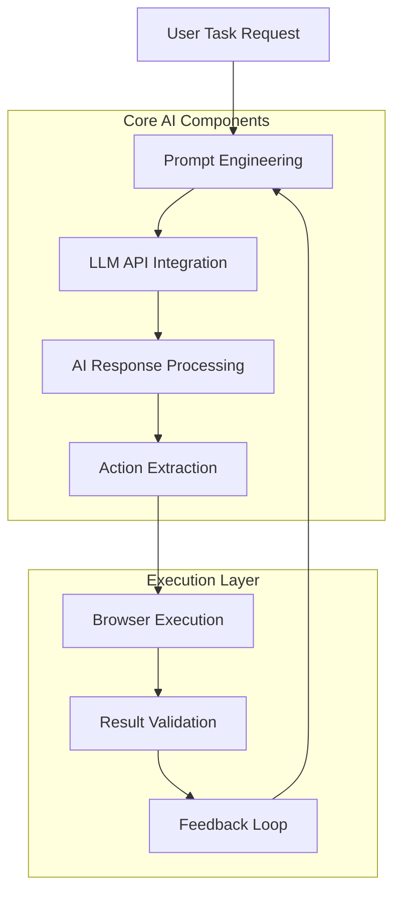
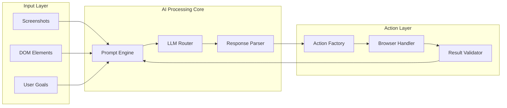
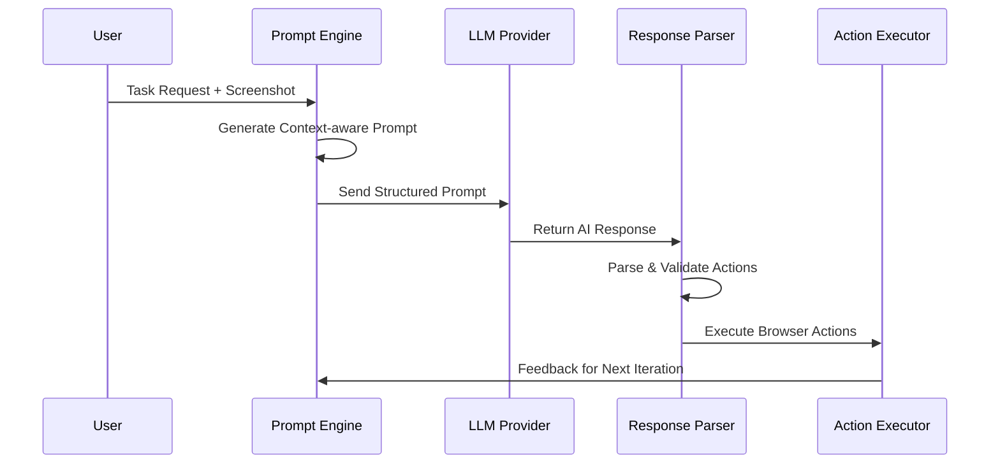

# 🎯 Introduction & Overview
## Skyvern's AI Integration Architecture

---

## 🤖 What is Skyvern's AI Integration?

Skyvern leverages **Large Language Models (LLMs)** to automate web interactions by:

- **Understanding** web page content through visual analysis
- **Planning** sequences of actions to achieve user goals
- **Executing** browser interactions based on AI decisions
- **Adapting** to dynamic web interfaces without pre-defined selectors

---

## 🏗️ Key Components Overview



---

## 🎯 Core AI Components

### 1. **LLM API Integration** 🔥 CRITICAL
- Multi-provider support (OpenAI, Anthropic, etc.)
- Dynamic routing and fallback mechanisms
- Token management and cost optimization

### 2. **Prompt Engineering** 🔥 CRITICAL  
- Template-based prompt generation
- Context-aware prompting
- Dynamic parameter injection

### 3. **Response Processing** 🔥 CRITICAL
- JSON parsing with error recovery
- Action validation and sanitization
- Multi-format response handling

---

## 🏛️ Architecture High-Level View



---

## 📊 AI Integration Benefits

| **Traditional Automation** | **AI-Powered Automation** |
|---------------------------|---------------------------|
| ❌ Brittle CSS selectors | ✅ Visual understanding |
| ❌ Fixed action sequences | ✅ Dynamic planning |
| ❌ Manual maintenance | ✅ Self-adapting |
| ❌ Limited error handling | ✅ Intelligent recovery |

---

## 🔄 AI Decision Making Process



---

## 🎛️ Key Configuration Points

### LLM Provider Selection
```python
# Default configuration
LLM_KEY = "gpt-4o"
SECONDARY_LLM_KEY = "gpt-4o-mini"

# Router configuration for load balancing
LLM_ROUTER_CONFIG = {
    "model_list": [
        {"model_name": "gpt-4o", "tpm": 30000},
        {"model_name": "claude-3-opus", "tpm": 25000}
    ]
}
```

### Prompt Strategy
```python
# Template-based prompting
prompt = prompt_engine.load_prompt(
    "action-extraction",
    screenshots=screenshots,
    elements=dom_elements,
    goal=user_goal
)
```

---

## 🚀 Performance Characteristics

- **Response Time**: 2-5 seconds per AI decision
- **Accuracy**: 85-95% action success rate
- **Scalability**: Handles 100+ concurrent sessions
- **Cost Optimization**: Smart token usage and caching

---

## 🎓 What You'll Learn Next

1. **LLM API Integration** - How multiple AI providers are managed
2. **Prompt Engineering** - Template system and dynamic generation
3. **Response Processing** - Parsing AI outputs into executable actions
4. **Decision Flow** - Complete AI workflow and optimization

---

**Next:** [LLM API Integration →](./02-llm-api-integration.md)  
**Previous:** [Main Presentation ←](./skyvern_ai_llm_presentation_main.md)