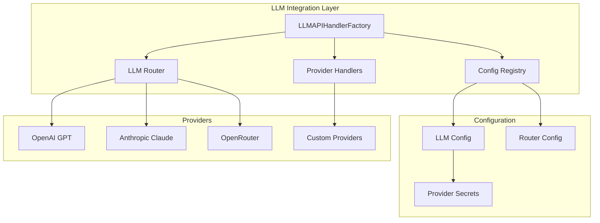
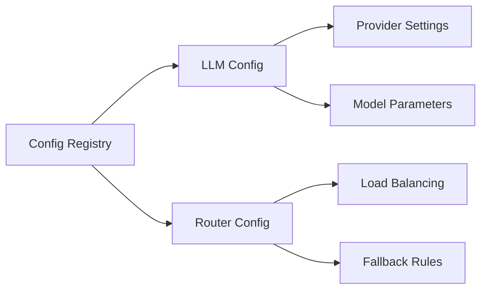
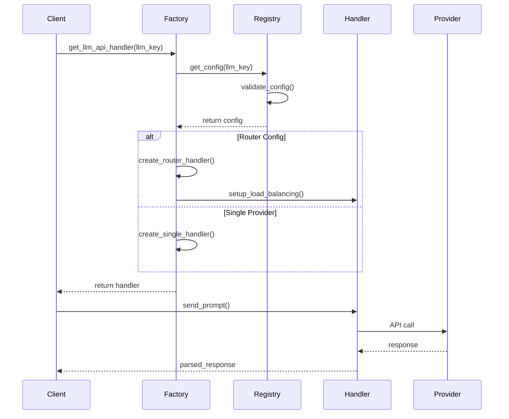
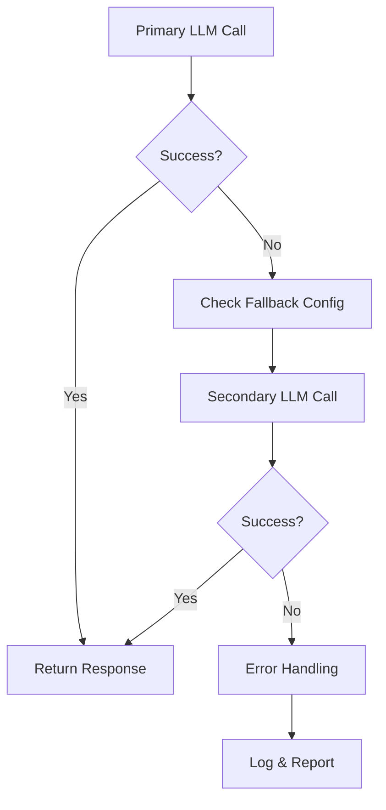
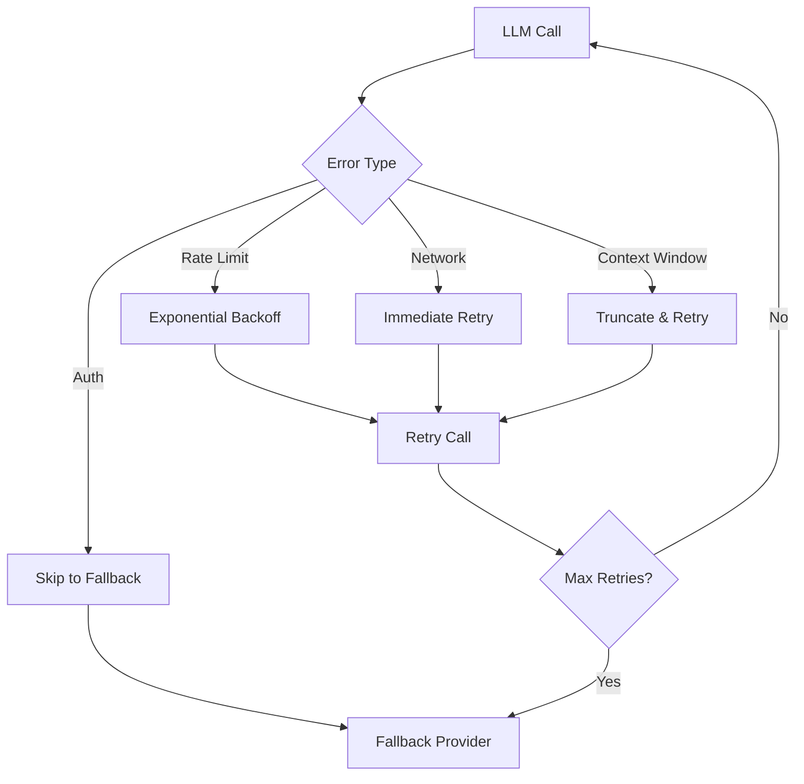

# 🔌 LLM API Integration
## Multi-Provider AI System Architecture

---

## 🎯 Overview

Skyvern's LLM integration supports **multiple AI providers** with:
- **Dynamic routing** and load balancing
- **Fallback mechanisms** for reliability
- **Cost optimization** through provider selection
- **Configuration-driven** provider management

---

## 🏗️ Core Architecture



---

## 🔧 Key Components

### 1. **LLMAPIHandlerFactory** 🔥 CRITICAL

```python
class LLMAPIHandlerFactory:
    _custom_handlers: dict[str, LLMAPIHandler] = {}
    
    @staticmethod
    def get_llm_api_handler(llm_key: str) -> LLMAPIHandler:
        """Get appropriate LLM handler based on configuration"""
        llm_config = LLMConfigRegistry.get_config(llm_key)
        
        if LLMConfigRegistry.is_router_config(llm_key):
            return LLMAPIHandlerFactory.get_llm_api_handler_with_router(llm_key)
        
        return create_single_provider_handler(llm_config)
```

---

### 2. **Configuration Registry** 🔥 IMPORTANT



#### LLM Configuration Structure
```python
@dataclass(frozen=True)
class LLMConfig:
    model_name: str
    required_env_vars: list[str]
    supports_vision: bool
    add_assistant_prefix: bool
    litellm_params: Optional[LiteLLMParams]
    max_tokens: int | None
    temperature: float | None
```

---

### 3. **Router Configuration** 🔥 IMPORTANT

```python
@dataclass(frozen=True)
class LLMRouterConfig:
    model_list: list[LLMRouterModelConfig]
    redis_host: str
    redis_port: int
    redis_password: str
    enable_caching: bool = True
    enable_retry: bool = True
    routing_strategy: Literal["simple-shuffle", "least-busy"] = "simple-shuffle"
```

---

## 🔄 Provider Selection Flow



---

## ⚙️ Provider Types & Support

### **Supported Providers**

| Provider | Models | Vision Support | Special Features |
|----------|--------|----------------|------------------|
| **OpenAI** | GPT-4o, GPT-4-turbo | ✅ | Function calling, JSON mode |
| **Anthropic** | Claude-3.5-sonnet | ✅ | Large context, safety features |
| **OpenRouter** | Multiple models | ✅ | Cost optimization, model variety |
| **Custom** | User-defined | 📋 Configurable | Custom endpoints |

---

### **Provider Configuration Examples**

#### OpenAI Configuration
```python
OPENAI_CONFIG = LLMConfig(
    "gpt-4o",
    ["OPENAI_API_KEY"],
    supports_vision=True,
    add_assistant_prefix=False,
    max_tokens=4000,
    temperature=0.1,
    litellm_params=LiteLLMParams(
        api_key=settings.OPENAI_API_KEY,
        api_base="https://api.openai.com/v1"
    )
)
```

#### Router Configuration
```python
ROUTER_CONFIG = LLMRouterConfig(
    model_list=[
        LLMRouterModelConfig(
            model_name="gpt-4o",
            tpm=30000,  # tokens per minute
            rpm=500,    # requests per minute
            litellm_params={
                "api_key": settings.OPENAI_API_KEY
            }
        ),
        LLMRouterModelConfig(
            model_name="claude-3-opus-20240229",
            tpm=25000,
            rpm=400,
            litellm_params={
                "api_key": settings.ANTHROPIC_API_KEY
            }
        )
    ],
    redis_host="localhost",
    redis_port=6379,
    routing_strategy="least-busy"
)
```

---

## 🎛️ Advanced Features

### **1. Dynamic Fallback System**



### **2. Cost Optimization**

```python
async def get_optimal_provider(prompt_complexity: str) -> str:
    """Select provider based on task complexity and cost"""
    if prompt_complexity == "simple":
        return "gpt-4o-mini"  # Cost-effective
    elif prompt_complexity == "vision":
        return "gpt-4o"       # Vision capabilities
    elif prompt_complexity == "reasoning":
        return "claude-3-opus" # Advanced reasoning
    else:
        return "gpt-4o"       # Default
```

### **3. Token Management**

```python
class LLMCallStats(BaseModel):
    input_tokens: int | None = None
    output_tokens: int | None = None
    reasoning_tokens: int | None = None
    cached_tokens: int | None = None
    llm_cost: float | None = None
```

---

## 🚨 Error Handling & Reliability

### **Exception Types**
```python
class LLMProviderError(Exception):
    """Base LLM provider error"""
    
class LLMProviderErrorRetryableTask(LLMProviderError):
    """Retryable LLM errors"""
    
class SkyvernContextWindowExceededError(Exception):
    """Context window size exceeded"""
    
class InvalidLLMConfigError(Exception):
    """Invalid LLM configuration"""
```

### **Retry Strategy**


---

## 📊 Performance Monitoring

### **Metrics Tracked**
- **Response Time**: Per provider latency
- **Success Rate**: Call success percentage
- **Token Usage**: Input/output token consumption
- **Cost Analysis**: Per-provider cost breakdown
- **Error Rates**: Provider-specific error patterns

### **Monitoring Dashboard Concept**
```
┌─ LLM Performance Dashboard ─────────────────────┐
│ Provider    │ Latency │ Success │ Tokens │ Cost │
├─────────────┼─────────┼─────────┼────────┼──────┤
│ GPT-4o      │ 2.3s    │ 98.5%   │ 150K   │ $12  │
│ Claude-3    │ 3.1s    │ 97.2%   │ 120K   │ $15  │
│ GPT-4-mini  │ 1.8s    │ 96.8%   │ 200K   │ $3   │
└─────────────┴─────────┴─────────┴────────┴──────┘
```

---

## 🔐 Security & Configuration

### **Environment Variables**
```bash
# Provider API Keys
OPENAI_API_KEY=sk-...
ANTHROPIC_API_KEY=sk-ant-...
OPENROUTER_API_KEY=sk-or-...

# LLM Configuration
LLM_KEY=gpt-4o
SECONDARY_LLM_KEY=gpt-4o-mini
LLM_CONFIG_MAX_TOKENS=4000
LLM_CONFIG_TEMPERATURE=0.1
```

### **Security Best Practices**
- ✅ API keys stored in environment variables
- ✅ Rate limiting and quota management
- ✅ Request/response logging (without sensitive data)
- ✅ Provider-specific security configurations

---

## 🎓 Key Takeaways

1. **Multi-Provider Architecture** enables reliability and cost optimization
2. **Configuration Registry** provides centralized provider management
3. **Dynamic Routing** balances load and handles failures gracefully
4. **Comprehensive Monitoring** ensures optimal performance
5. **Security First** approach protects sensitive API credentials

---

**Next:** [Prompt Engineering System →](./03-prompt-engineering.md)  
**Previous:** [Introduction & Overview ←](./01-introduction.md)