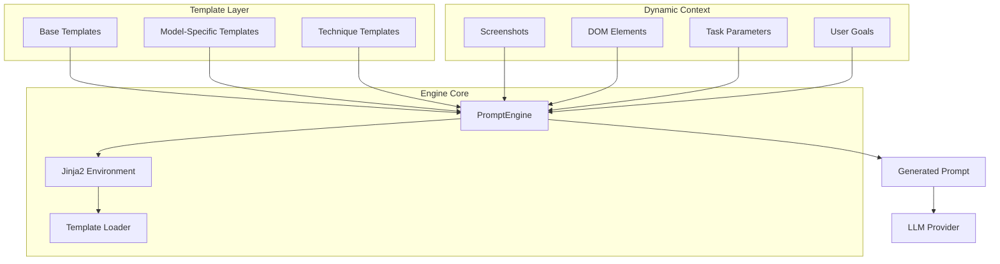
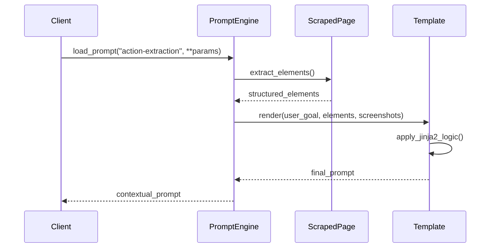
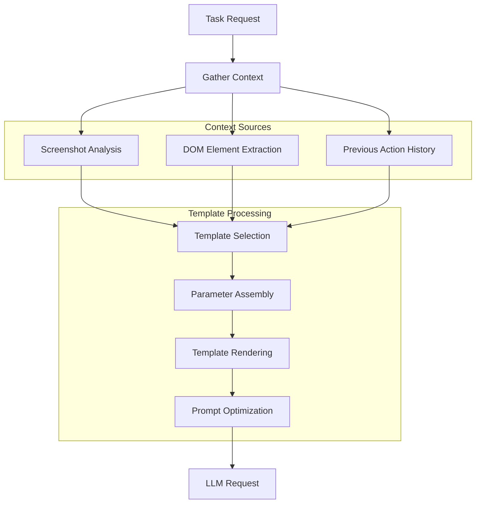

# 📝 Prompt Engineering System
## Template Management & Dynamic Generation

---

## 🎯 Overview

Skyvern's prompt engineering system provides:
- **Template-based** prompt management using Jinja2
- **Dynamic parameter injection** for context-aware prompting
- **Multi-model** prompt optimization strategies
- **Hierarchical** template organization with inheritance

---

## 🏗️ Prompt Engine Architecture



---

## 🔧 Core Components

### 1. **PromptEngine Class** 🔥 CRITICAL

```python
class PromptEngine:
    """Template-based prompt generation system"""
    
    def __init__(self, model: str, prompts_dir: Path):
        self.model = model
        self.env = Environment(loader=FileSystemLoader(prompts_dir))
    
    def load_prompt(self, template: str, **kwargs: Any) -> str:
        """Load and populate template with parameters"""
        template_path = f"{self.model}/{template}.j2"
        jinja_template = self.env.get_template(template_path)
        return jinja_template.render(**kwargs)
```

---

### 2. **Template Organization** 📁

```
forge/prompts/
├── gpt-4o/                    # Model-specific templates
│   ├── action-extraction.j2   # Core action prompts
│   ├── data-extraction.j2     # Data extraction prompts
│   ├── navigation.j2          # Navigation prompts
│   └── validation.j2          # Validation prompts
├── claude-3/                  # Claude-specific optimizations
│   ├── action-extraction.j2
│   └── reasoning.j2
├── techniques/                # Reusable prompt techniques
│   ├── few-shot-examples.j2   # Example-based learning
│   ├── chain-of-thought.j2    # Reasoning strategies
│   └── error-recovery.j2      # Error handling
└── shared/                    # Common templates
    ├── system-prompts.j2
    └── formatting-rules.j2
```

---

## 📋 Template Structure & Patterns

### **Base Template Pattern**
```jinja2
{# action-extraction.j2 #}



You are a web automation assistant that analyzes screenshots and generates precise browser actions.



**Current Goal:** {{ user_goal }}
**Page URL:** {{ current_url }}
**Step:** {{ step_number }} of {{ total_steps }}




**Visual Analysis Required:**

- Screenshot {{ loop.index }}: {{ screenshot.description }}






**Available Elements:**

- ID: {{ element.id }} | Type: {{ element.tag }} | Text: "{{ element.text }}"







```

---

### **Dynamic Parameter Injection**



---

## 🎨 Advanced Template Techniques

### 1. **Few-Shot Learning Templates**

```jinja2
{# few-shot-examples.j2 #}

**Examples of correct actions:**

Example 1:
Screenshot: Login form with email and password fields
Goal: Log into the application
Action: {"action_type": "INPUT_TEXT", "element_id": "email", "text": "user@example.com"}

Example 2:
Screenshot: Button with text "Submit Order"
Goal: Complete the purchase
Action: {"action_type": "CLICK", "element_id": "submit-btn"}

Example 3:
Screenshot: Dropdown menu for country selection
Goal: Select United States
Action: {"action_type": "SELECT_OPTION", "element_id": "country", "option": "United States"}

```

### 2. **Chain-of-Thought Reasoning**

```jinja2
{# chain-of-thought.j2 #}

**Think step by step:**

1. **Analyze the screenshot**: What elements are visible? What is their purpose?
2. **Understand the goal**: What specific action needs to be taken?
3. **Identify the target**: Which element should be interacted with?
4. **Choose the action**: What type of interaction is most appropriate?
5. **Validate the choice**: Does this action move us toward the goal?

**Your reasoning:**

```

### 3. **Error Recovery Patterns**

```jinja2
{# error-recovery.j2 #}


**Previous Action Failed:**
Error: {{ previous_error.message }}
Failed Action: {{ previous_error.action_type }}
Element: {{ previous_error.element_id }}

**Recovery Strategy:**
- Look for alternative elements
- Try different interaction methods
- Consider if the page state has changed


```

---

## 🔄 Context-Aware Prompting Flow



---

## 📊 Template Categories & Use Cases

### **Action Extraction Templates**
```python
# Primary action generation
action_prompt = prompt_engine.load_prompt(
    "action-extraction",
    user_goal="Fill out contact form",
    screenshots=screenshots,
    elements=dom_elements,
    step_history=previous_steps
)
```

### **Data Extraction Templates**
```python
# Extract structured data
extraction_prompt = prompt_engine.load_prompt(
    "data-extraction", 
    data_schema=schema,
    target_fields=["name", "email", "phone"],
    page_content=scraped_content
)
```

### **Validation Templates**
```python
# Validate action success
validation_prompt = prompt_engine.load_prompt(
    "action-validation",
    expected_outcome="Form submitted successfully",
    actual_state=current_page_state,
    action_taken=last_action
)
```

---

## 🎛️ Model-Specific Optimizations

### **GPT-4 Optimizations**
- Structured JSON output format
- Token-efficient element descriptions
- Clear action type specifications

### **Claude-3 Optimizations**
- Detailed reasoning chains
- Visual description emphasis
- Safety-focused error handling

### **Multi-Model Strategy**
```python
def get_optimal_template(model_name: str, task_complexity: str) -> str:
    """Select best template based on model capabilities"""
    if "gpt-4" in model_name:
        if task_complexity == "vision":
            return "gpt-4o/vision-action-extraction"
        else:
            return "gpt-4o/standard-action-extraction"
    elif "claude" in model_name:
        return "claude-3/reasoning-action-extraction"
    else:
        return "shared/generic-action-extraction"
```

---

## 🔧 Template Development Best Practices

### **1. Modular Design**
```jinja2
{# Reusable components #}



```

### **2. Parameter Validation**
```python
def validate_template_params(template_name: str, **kwargs) -> None:
    """Ensure required parameters are provided"""
    required_params = TEMPLATE_REQUIREMENTS.get(template_name, [])
    missing = [p for p in required_params if p not in kwargs]
    if missing:
        raise TemplateParameterError(f"Missing: {missing}")
```

### **3. Template Testing**
```python
def test_template_rendering():
    """Test template with sample data"""
    test_params = {
        "user_goal": "Test login",
        "elements": [{"id": "username", "type": "input"}],
        "screenshots": ["base64_image_data"]
    }
    
    prompt = prompt_engine.load_prompt("action-extraction", **test_params)
    assert "Test login" in prompt
    assert "username" in prompt
```

---

## 📈 Performance Optimization

### **Template Caching**
```python
from functools import lru_cache

class PromptEngine:
    @lru_cache(maxsize=100)
    def _get_compiled_template(self, template_name: str):
        """Cache compiled templates for performance"""
        return self.env.get_template(f"{self.model}/{template_name}.j2")
```

### **Prompt Size Optimization**
```python
def optimize_prompt_length(prompt: str, max_tokens: int = 3000) -> str:
    """Trim prompt to fit model context window"""
    if len(prompt.split()) > max_tokens:
        # Prioritize: system prompt > examples > context > details
        return trim_prompt_intelligently(prompt, max_tokens)
    return prompt
```

---

## 🎯 Real-World Examples

### **E-commerce Form Filling**
```jinja2
**Task**: Fill out shipping information on checkout page
**Context**: User wants to complete purchase with address "123 Main St"
**Elements