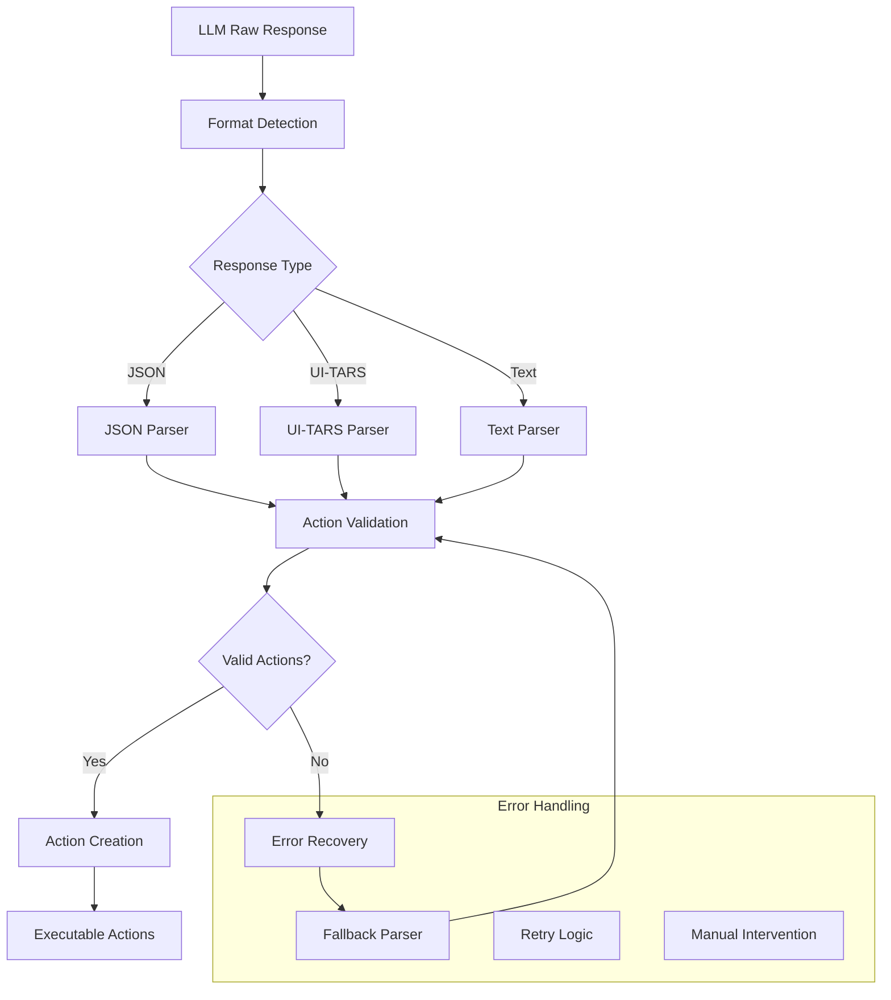
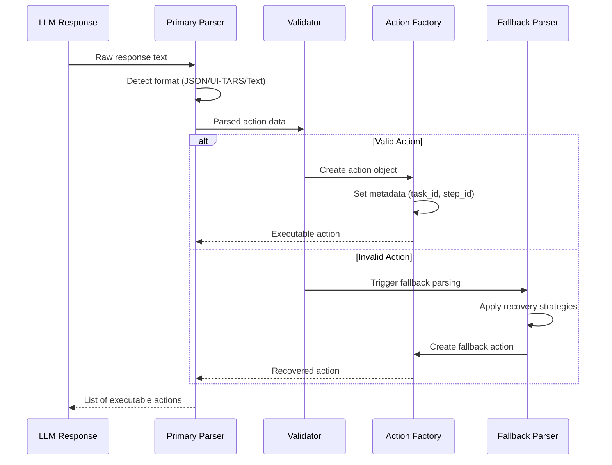
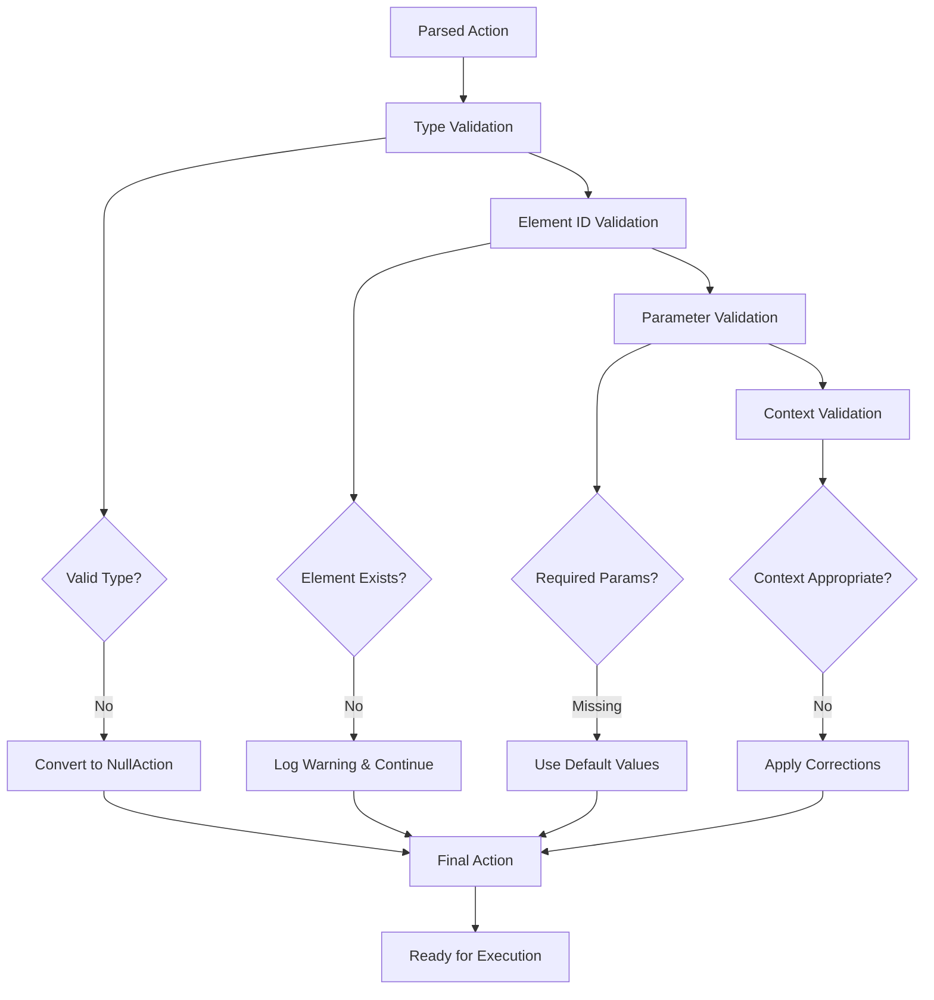

# 🔄 AI Response Processing
## Parsing, Validation & Action Extraction

---

## 🎯 Overview

Skyvern's response processing system converts AI outputs into executable actions through:
- **Robust JSON parsing** with error recovery
- **Action validation** and sanitization
- **Multi-format support** (JSON, UI-TARS, structured text)
- **Intelligent error handling** and fallback mechanisms

---

## 🏗️ Response Processing Pipeline



---

## 🔧 Core Parsing Components

### 1. **parse_api_response()** 🔥 CRITICAL

```python
def parse_api_response(
    response: ModelResponse, 
    add_assistant_prefix: bool = False
) -> dict[str, Any]:
    """Parse LLM response with multiple fallback strategies"""
    
    content = response.choices[0].message.content
    if not content:
        raise InvalidLLMResponseFormat("Empty response content")
    
    # Strategy 1: Direct JSON parsing
    try:
        return json.loads(content)
    except json.JSONDecodeError:
        pass
    
    # Strategy 2: Remove markdown code blocks
    try:
        cleaned = _remove_markdown_wrapper(content)
        return json.loads(cleaned)
    except json.JSONDecodeError:
        pass
    
    # Strategy 3: CommentJSON for comments/trailing commas
    try:
        return commentjson.loads(content)
    except Exception:
        pass
    
    # Strategy 4: Fix common JSON issues
    try:
        fixed_content = _fix_common_json_issues(content)
        return json.loads(fixed_content)
    except Exception:
        raise InvalidLLMResponseFormat(f"Unable to parse: {content[:200]}...")
```

---

### 2. **Action Parsing Flow** 🔥 CRITICAL



---

## 📋 Action Parsing Implementation

### **parse_action() Function**

```python
def parse_action(
    action: Dict[str, Any], 
    scraped_page: ScrapedPage,
    data_extraction_goal: str | None = None
) -> Action:
    """Convert parsed action dict to Action object"""
    
    # Extract core action data
    element_id = action.get("id") or action.get("element_id")
    reasoning = action.get("reasoning")
    confidence = action.get("confidence_float")
    
    # Get element metadata from scraped page
    element_hash = scraped_page.id_to_element_hash.get(element_id)
    element_data = scraped_page.id_to_element_dict.get(element_id)
    
    base_action_dict = {
        "element_id": element_id,
        "skyvern_element_hash": element_hash,
        "skyvern_element_data": element_data,
        "reasoning": reasoning,
        "confidence_float": confidence,
    }
    
    # Parse action type
    action_type_str = action.get("action_type", "").upper()
    if not action_type_str:
        return NullAction(**base_action_dict)
    
    action_type = ActionType[action_type_str]
    
    # Create specific action types
    if action_type == ActionType.CLICK:
        return ClickAction(
            **base_action_dict,
            file_url=action.get("file_url"),
            download=action.get("download", False)
        )
    
    elif action_type == ActionType.INPUT_TEXT:
        return InputTextAction(
            **base_action_dict,
            text=action["text"]
        )
    
    elif action_type == ActionType.SELECT_OPTION:
        return SelectOptionAction(
            **base_action_dict,
            option=SelectOption(
                label=action.get("option", {}).get("label"),
                value=action.get("option", {}).get("value"),
                index=action.get("option", {}).get("index")
            )
        )
    
    # ... more action types
```

---

## 🎭 Multi-Format Support

### **1. Standard JSON Format**
```json
{
  "actions": [
    {
      "action_type": "INPUT_TEXT",
      "element_id": "email-field",
      "text": "user@example.com",
      "reasoning": "Fill the email field with provided credentials",
      "confidence_float": 0.95
    }
  ]
}
```

### **2. UI-TARS Format**
```python
def parse_ui_tars_actions(
    task: Task,
    step: Step, 
    response_content: str,
    browser_window_dimension: Resolution
) -> list[Action]:
    """Parse UI-TARS response format"""
    
    # Extract thought/reasoning
    thought = _extract_thought_from_response(response_content)
    
    # Parse action commands
    parsed_actions = _parse_ui_tars_response(response_content, browser_window_dimension)
    
    actions: list[Action] = []
    for idx, parsed_action in enumerate(parsed_actions):
        action = _create_ui_tars_action(parsed_action, task, step, idx)
        if action:
            actions.append(action)
    
    return actions
```

### **3. UI-TARS Action Examples**
```
Thought: I need to click on the login button to proceed with authentication

Action: click(start_box=(100, 200, 150, 230))
```

---

## 🛡️ Validation & Error Recovery

### **Action Validation Pipeline**



### **Error Recovery Strategies**

```python
class ResponseRecoveryStrategies:
    
    @staticmethod
    def fix_cutoff_json(content: str) -> str:
        """Fix JSON cut off by context window limits"""
        if not content.rstrip().endswith('}'):
            # Find last complete object
            last_complete = content.rfind('},')
            if last_complete > 0:
                return content[:last_complete + 1] + ']}'
        return content
    
    @staticmethod  
    def fix_unescaped_quotes(content: str) -> str:
        """Fix unescaped quotes in JSON strings"""
        # Pattern to find unescaped quotes in values
        pattern = r'("text"\s*:\s*")([^"]*?)(")'
        
        def escape_quotes(match):
            prefix, text, suffix = match.groups()
            escaped_text = text.replace('"', '\\"')
            return f'{prefix}{escaped_text}{suffix}'
        
        return re.sub(pattern, escape_quotes, content)
    
    @staticmethod
    def extract_from_markdown(content: str) -> str:
        """Extract JSON from markdown code blocks"""
        patterns = [
            r'```json\s*(.*?)\s*```',
            r'```\s*(.*?)\s*```',
            r'`(.*?)`'
        ]
        
        for pattern in patterns:
            match = re.search(pattern, content, re.DOTALL)
            if match:
                return match.group(1).strip()
        
        return content
```

---

## 🔄 Response Format Detection

```python
def detect_response_format(content: str) -> ResponseFormat:
    """Automatically detect response format"""
    
    content = content.strip()
    
    # Check for UI-TARS format
    if any(keyword in content.lower() for keyword in ['action:', 'thought:', 'click(', 'type(']):
        return ResponseFormat.UI_TARS
    
    # Check for JSON format  
    if content.startswith(('{', '[')):
        return ResponseFormat.JSON
    
    # Check for markdown-wrapped JSON
    if '```json' in content or '```' in content:
        return ResponseFormat.MARKDOWN_JSON
    
    # Default to text parsing
    return ResponseFormat.TEXT
```

---

## 📊 Response Processing Statistics

### **Processing Success Rates**
```
┌─ Response Processing Metrics ──────────────────┐
│ Format      │ Success │ Recovery │ Failed │    │
├─────────────┼─────────┼──────────┼────────┼────┤
│ JSON        │ 94.2%   │ 4.1%     │ 1.7%   │ ✅  │
│ UI-TARS     │ 91.8%   │ 6.3%     │ 1.9%   │ ✅  │
│ Markdown    │ 96.1%   │ 2.8%     │ 1.1%   │ ✅  │
│ Text        │ 85.4%   │ 12.2%    │ 2.4%   │ ⚠️  │
└─────────────┴─────────┴──────────┴────────┴────┘
```

### **Common Error Categories**
1. **JSON Syntax Errors** (40%) - Missing brackets, trailing commas
2. **Incomplete Responses** (25%) - Truncated by context limits  
3. **Type Mismatches** (20%) - Wrong action type for element
4. **Missing Parameters** (15%) - Required fields not provided

---

## 🎛️ Configuration & Optimization

### **Parser Configuration**
```python
RESPONSE_PARSER_CONFIG = {
    "max_retry_attempts": 3,
    "enable_recovery_strategies": True,
    "strict_validation": False,
    "log_failed_parses": True,
    "fallback_to_null_action": True
}
```

### **Performance Optimization**
```python
class ResponseCache:
    """Cache parsed responses to avoid re-processing"""
    
    def __init__(self, max_size: int = 1000):
        self._cache = {}
        self._max_size = max_size
    
    def get_parsed_response(self, response_hash: str) -> dict | None:
        return self._cache.get(response_hash)
    
    def cache_parsed_response(self, response_hash: str, parsed: dict):
        if len(self._cache) >= self._max_size:
            # Remove oldest entry
            oldest_key = next(iter(self._cache))
            del self._cache[oldest_key]
        
        self._cache[response_hash] = parsed
```

---

## 🧪 Testing & Quality Assurance

### **Unit Test Examples**
```python
def test_parse_valid_json_response():
    """Test parsing a well-formed JSON response"""
    response_content = '''
    {
        "actions": [
            {
                "action_type": "CLICK",
                "element_id": "submit-btn",
                "reasoning": "Click submit to proceed"
            }
        ]
    }
    '''
    
    mock_response = create_mock_response(response_content)
    result = parse_api_response(mock_response)
    
    assert len(result["actions"]) == 1
    assert result["actions"][0]["action_type"] == "CLICK"

def test_recovery_from_malformed_json():
    """Test recovery strategies for malformed JSON"""
    malformed_content = '''
    {
        "actions": [
            {
                "action_type": "INPUT_TEXT",
                "text": "Hello "world"",  // Unescaped quotes
                "element_id": "input-field"
            }
        ]
    '''
    
    mock_response = create_mock_response(malformed_content)
    result = parse_api_response(mock_response)
    
    assert result is not None
    assert result["actions"][0]["text"] == 'Hello "world"'
```

---

## 🎓 Key Takeaways

1. **Multi-Strategy Parsing** ensures high success rates across formats
2. **Intelligent Error Recovery** handles common LLM response issues
3. **Format Detection** automatically adapts to different response styles
4. **Comprehensive Validation** ensures action safety and correctness
5. **Performance Optimization** through caching and efficient algorithms

---

**Next:** [AI Decision Making Flow →](./05-ai-decision-flow.md)  
**Previous:** [Prompt Engineering System ←](./03-prompt-engineering.md)