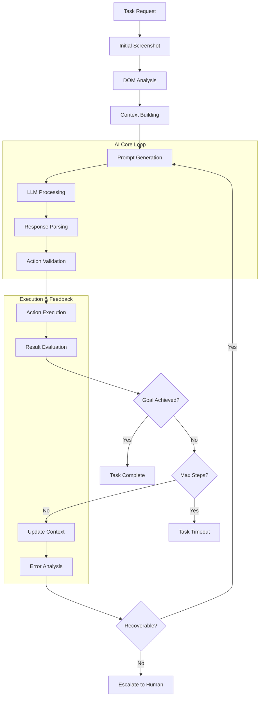
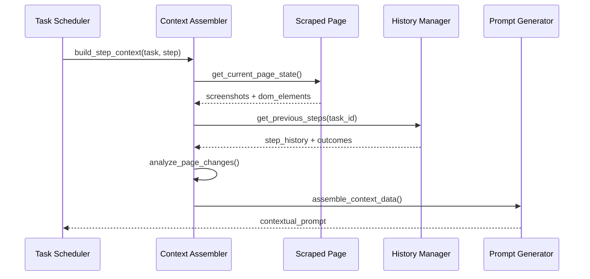
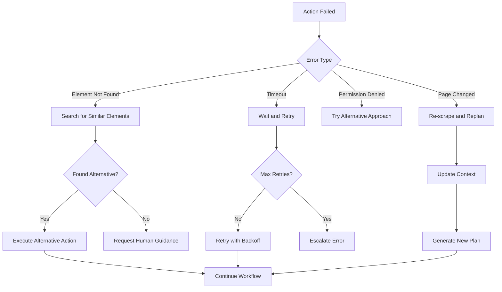
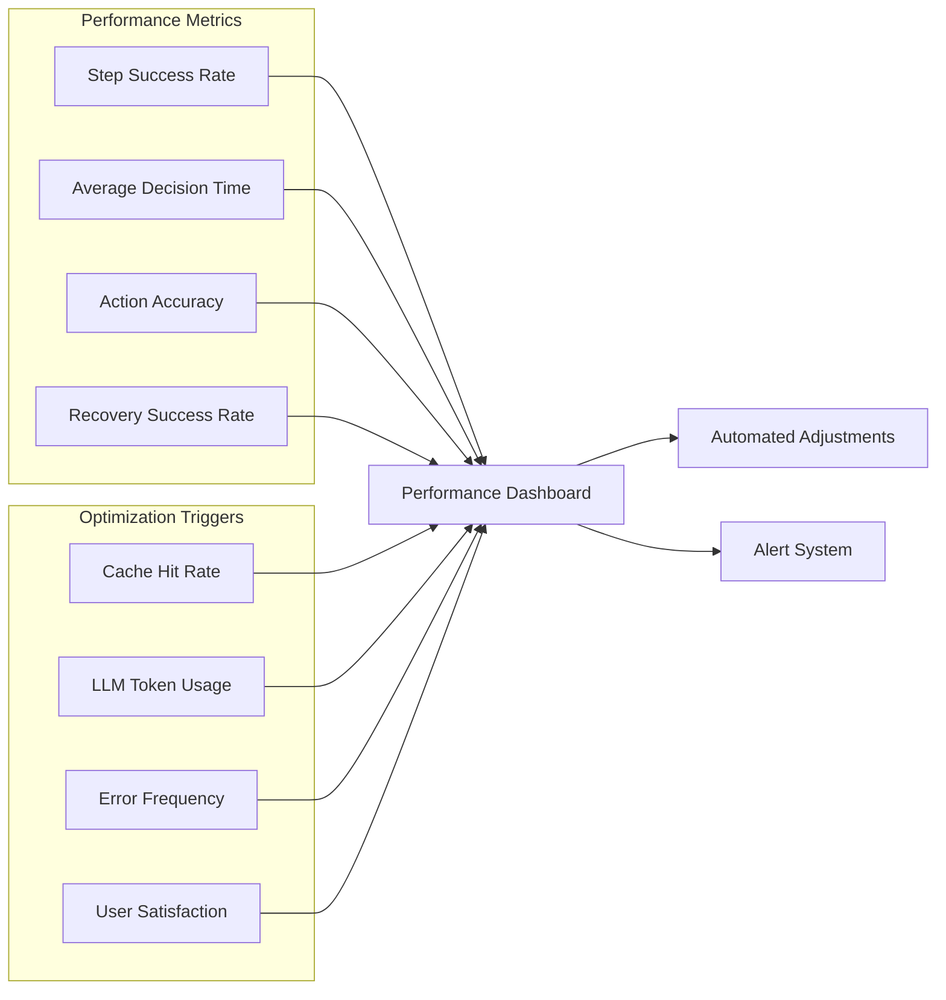
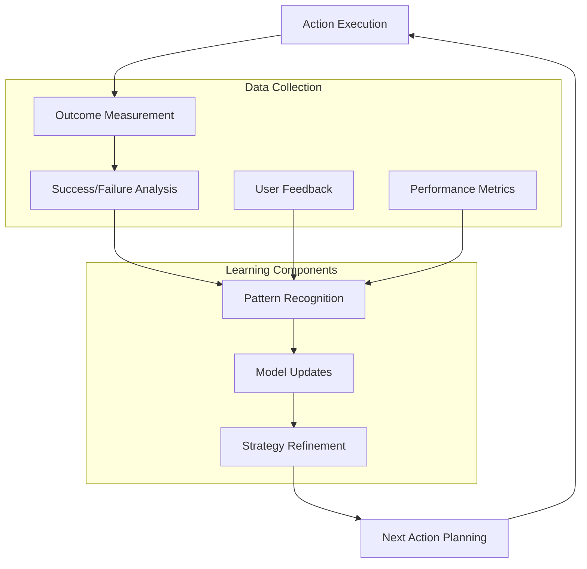

# 🧠 AI Decision Making Flow
## Complete Workflow & Optimization Strategies

---

## 🎯 Overview

Skyvern's AI decision-making process orchestrates multiple components into a cohesive automation workflow:
- **Multi-step planning** with adaptive strategies
- **Feedback loops** for continuous improvement
- **Error recovery** and replanning mechanisms  
- **Performance optimization** through intelligent caching

---

## 🔄 Complete AI Workflow



---

## 🎛️ Decision Making Components

### 1. **Agent Step Processing** 🔥 CRITICAL

```python
async def execute_step(
    task: Task,
    step: Step,
    browser_state: BrowserState,
    step_info: dict[str, Any]
) -> DetailedAgentStepOutput:
    """Execute a single AI-driven automation step"""
    
    organization = await app.DATABASE.get_organization(task.organization_id)
    
    try:
        # 1. Capture current page state
        scraped_page = await scrape_web_page(
            browser_state=browser_state,
            url=step_info["url"],
            organization=organization
        )
        
        # 2. Generate context-aware prompt  
        prompt = await _build_step_prompt(
            task=task,
            step=step,
            scraped_page=scraped_page,
            step_info=step_info
        )
        
        # 3. Get AI response
        llm_response = await app.LLM_API_HANDLER(
            prompt=prompt,
            step=step,
            screenshots=scraped_page.screenshots
        )
        
        # 4. Parse actions from response
        actions = await _parse_actions_from_response(
            llm_response=llm_response,
            task=task,
            step=step,
            scraped_page=scraped_page
        )
        
        # 5. Execute actions and collect results
        action_results = await _execute_actions(
            actions=actions,
            browser_state=browser_state,
            scraped_page=scraped_page
        )
        
        # 6. Evaluate step success
        step_success = _evaluate_step_success(actions, action_results)
        
        return DetailedAgentStepOutput(
            scraped_page=scraped_page,
            extract_action_prompt=prompt,
            llm_response=llm_response,
            actions=actions,
            action_results=action_results,
            actions_and_results=list(zip(actions, action_results))
        )
        
    except Exception as e:
        LOG.exception("Step execution failed", step_id=step.step_id)
        return DetailedAgentStepOutput(
            step_exception=str(e),
            scraped_page=None,
            actions=[],
            action_results=[]
        )
```

---

### 2. **Context Building Strategy**



---

## 🎯 Decision Points & Strategies

### **1. Action Selection Strategy**

```python
class ActionSelectionStrategy:
    """Intelligent action selection based on context"""
    
    @staticmethod
    async def select_optimal_action(
        candidate_actions: list[Action],
        page_context: ScrapedPage,
        goal_context: str
    ) -> Action:
        """Select best action based on multiple criteria"""
        
        scored_actions = []
        
        for action in candidate_actions:
            score = 0.0
            
            # Element visibility score
            if action.element_id:
                element = page_context.id_to_element_dict.get(action.element_id)
                if element and element.get("is_visible"):
                    score += 0.3
            
            # Confidence score from LLM
            if action.confidence_float:
                score += action.confidence_float * 0.4
            
            # Goal alignment score
            goal_alignment = _calculate_goal_alignment(action, goal_context)
            score += goal_alignment * 0.3
            
            scored_actions.append((action, score))
        
        # Return highest scoring action
        best_action = max(scored_actions, key=lambda x: x[1])[0]
        return best_action
```

### **2. Error Recovery Decision Tree**



---

## ⚙️ Optimization Strategies

### **1. Intelligent Caching**

```python
class ActionPlanCache:
    """Cache successful action sequences for similar contexts"""
    
    def __init__(self):
        self._cache = {}
        self._similarity_threshold = 0.85
    
    async def get_cached_plan(
        self, 
        page_signature: str,
        goal_description: str
    ) -> list[Action] | None:
        """Retrieve cached action plan for similar contexts"""
        
        cache_key = self._generate_cache_key(page_signature, goal_description)
        
        # Check for exact match
        if cache_key in self._cache:
            return self._cache[cache_key]["actions"]
        
        # Check for similar contexts
        for cached_key, cached_data in self._cache.items():
            similarity = self._calculate_similarity(cache_key, cached_key)
            if similarity > self._similarity_threshold:
                LOG.info(f"Using cached plan with {similarity:.2f} similarity")
                return cached_data["actions"]
        
        return None
    
    def cache_successful_plan(
        self,
        page_signature: str,
        goal_description: str, 
        actions: list[Action],
        success_rate: float
    ):
        """Cache successful action sequence"""
        if success_rate > 0.8:  # Only cache high-success plans
            cache_key = self._generate_cache_key(page_signature, goal_description)
            self._cache[cache_key] = {
                "actions": actions,
                "success_rate": success_rate,
                "timestamp": datetime.utcnow()
            }
```

### **2. Adaptive Step Planning**

```python
class AdaptiveStepPlanner:
    """Dynamically adjust step complexity based on success rates"""
    
    def __init__(self):
        self.success_history = {}
        self.complexity_adjustment = 1.0
    
    async def plan_next_step(
        self,
        task: Task,
        current_step: Step,
        recent_outcomes: list[bool]
    ) -> dict[str, Any]:
        """Plan next step with adaptive complexity"""
        
        # Analyze recent success rate
        success_rate = sum(recent_outcomes[-5:]) / min(5, len(recent_outcomes))
        
        # Adjust complexity based on performance
        if success_rate < 0.6:
            # Simplify actions for better reliability
            self.complexity_adjustment = max(0.5, self.complexity_adjustment - 0.1)
            step_strategy = "conservative"
        elif success_rate > 0.9:
            # Increase complexity for efficiency
            self.complexity_adjustment = min(2.0, self.complexity_adjustment + 0.1)
            step_strategy = "aggressive"
        else:
            step_strategy = "balanced"
        
        return {
            "complexity_multiplier": self.complexity_adjustment,
            "strategy": step_strategy,
            "max_actions_per_step": int(3 * self.complexity_adjustment),
            "confidence_threshold": 0.7 / self.complexity_adjustment
        }
```

---

## 📊 Performance Monitoring

### **Real-time Decision Metrics**



### **Decision Quality Metrics**

```python
class DecisionQualityMonitor:
    """Monitor and improve AI decision quality"""
    
    def __init__(self):
        self.metrics = {
            "action_success_rate": RollingAverage(window=100),
            "decision_latency": RollingAverage(window=50),
            "recovery_effectiveness": RollingAverage(window=20),
            "goal_achievement_rate": RollingAverage(window=30)
        }
    
    def record_decision_outcome(
        self,
        step_id: str,
        actions_taken: list[Action],
        success: bool,
        decision_time: float,
        recovery_attempted: bool = False
    ):
        """Record decision outcome for analysis"""
        
        self.metrics["action_success_rate"].add(1.0 if success else 0.0)
        self.metrics["decision_latency"].add(decision_time)
        
        if recovery_attempted:
            self.metrics["recovery_effectiveness"].add(1.0 if success else 0.0)
        
        # Analyze patterns for improvement
        if not success:
            self._analyze_failure_patterns(step_id, actions_taken)
    
    def get_current_performance(self) -> dict[str, float]:
        """Get current performance metrics"""
        return {
            metric_name: metric.average()
            for metric_name, metric in self.metrics.items()
        }
```

---

## 🎛️ Advanced Decision Features

### **1. Multi-Agent Coordination**

```python
async def coordinate_parallel_tasks(
    tasks: list[Task],
    shared_context: dict[str, Any]
) -> list[TaskResult]:
    """Coordinate multiple AI agents working in parallel"""
    
    # Create coordination context
    coordination_manager = MultiAgentCoordinator()
    
    async def execute_coordinated_task(task: Task) -> TaskResult:
        # Get agent-specific context
        agent_context = await coordination_manager.get_agent_context(
            task.task_id, 
            shared_context
        )
        
        # Execute with coordination
        result = await execute_task_with_context(task, agent_context)
        
        # Update shared context
        await coordination_manager.update_shared_context(
            task.task_id,
            result,
            shared_context
        )
        
        return result
    
    # Execute tasks concurrently with coordination
    results = await asyncio.gather(*[
        execute_coordinated_task(task) for task in tasks
    ])
    
    return results
```

### **2. Predictive Decision Making**

```python
class PredictiveDecisionEngine:
    """Predict optimal actions based on historical patterns"""
    
    def __init__(self):
        self.pattern_database = PatternDatabase()
        self.ml_predictor = ActionPredictor()
    
    async def predict_next_actions(
        self,
        current_context: PageContext,
        goal: str,
        step_history: list[Step]
    ) -> list[PredictedAction]:
        """Predict most likely successful actions"""
        
        # Extract features from current context
        features = self._extract_context_features(current_context, goal)
        
        # Get historical patterns
        similar_patterns = await self.pattern_database.find_similar_contexts(
            features, 
            threshold=0.7
        )
        
        # Generate predictions
        predictions = []
        
        for pattern in similar_patterns:
            predicted_action = self.ml_predictor.predict(
                context_features=features,
                historical_pattern=pattern,
                success_probability=pattern.success_rate
            )
            predictions.append(predicted_action)
        
        # Rank predictions by confidence
        return sorted(predictions, key=lambda x: x.confidence, reverse=True)
    
    def _extract_context_features(
        self, 
        context: PageContext, 
        goal: str
    ) -> ContextFeatures:
        """Extract ML-ready features from page context"""
        return ContextFeatures(
            page_type=context.page_type,
            element_count=len(context.elements),
            form_fields=context.form_field_count,
            buttons=context.button_count,
            goal_embedding=self._embed_goal(goal),
            visual_complexity=context.visual_complexity_score
        )
```

---

## 🔄 Feedback Loop Implementation

### **Continuous Learning System**



### **Feedback Integration**

```python
class FeedbackLearningSystem:
    """Learn from execution outcomes to improve future decisions"""
    
    def __init__(self):
        self.outcome_database = OutcomeDatabase()
        self.learning_algorithm = ReinforcementLearner()
        self.strategy_optimizer = StrategyOptimizer()
    
    async def process_execution_feedback(
        self,
        step_id: str,
        planned_actions: list[Action],
        actual_outcomes: list[ActionResult],
        user_feedback: UserFeedback | None = None
    ):
        """Process feedback to improve future decisions"""
        
        # Calculate reward signal
        reward = self._calculate_reward(
            planned_actions=planned_actions,
            outcomes=actual_outcomes,
            user_feedback=user_feedback
        )
        
        # Update learning model
        await self.learning_algorithm.update(
            state=step_id,
            actions=planned_actions,
            reward=reward,
            next_state=self._get_resulting_state(outcomes)
        )
        
        # Store outcome pattern
        await self.outcome_database.store_pattern(
            context_signature=self._generate_context_signature(planned_actions),
            actions=planned_actions,
            outcomes=actual_outcomes,
            success_score=reward
        )
        
        # Update strategy if needed
        if abs(reward) > 0.5:  # Significant outcome
            await self.strategy_optimizer.adjust_strategy(
                outcome_type="success" if reward > 0 else "failure",
                context=planned_actions[0].get_context() if planned_actions else None
            )
    
    def _calculate_reward(
        self,
        planned_actions: list[Action],
        outcomes: list[ActionResult],
        user_feedback: UserFeedback | None
    ) -> float:
        """Calculate reward signal for reinforcement learning"""
        base_reward = 0.0
        
        # Action success rate
        successful_actions = sum(1 for outcome in outcomes if outcome.success)
        action_success_rate = successful_actions / len(outcomes) if outcomes else 0
        base_reward += action_success_rate * 0.6
        
        # Goal progress
        if outcomes and hasattr(outcomes[-1], 'goal_progress'):
            base_reward += outcomes[-1].goal_progress * 0.3
        
        # User feedback
        if user_feedback:
            base_reward += user_feedback.satisfaction_score * 0.1
        
        return base_reward
```

---

## 🎯 Decision Optimization Techniques

### **1. Dynamic Strategy Selection**

```python
class DynamicStrategySelector:
    """Select optimal decision strategy based on context"""
    
    STRATEGIES = {
        "conservative": {
            "confidence_threshold": 0.8,
            "max_actions_per_step": 1,
            "error_tolerance": 0.1
        },
        "balanced": {
            "confidence_threshold": 0.6,
            "max_actions_per_step": 2,
            "error_tolerance": 0.2
        },
        "aggressive": {
            "confidence_threshold": 0.4,
            "max_actions_per_step": 3,
            "error_tolerance": 0.3
        }
    }
    
    async def select_strategy(
        self,
        task_complexity: float,
        time_pressure: float,
        error_tolerance: float,
        success_history: list[bool]
    ) -> str:
        """Select optimal strategy based on multiple factors"""
        
        # Calculate recent success rate
        recent_success = sum(success_history[-10:]) / min(10, len(success_history))
        
        # Decision matrix
        if recent_success < 0.6 or error_tolerance < 0.2:
            return "conservative"
        elif time_pressure > 0.8 and recent_success > 0.8:
            return "aggressive"
        else:
            return "balanced"
```

### **2. Resource Optimization**

```python
class ResourceOptimizer:
    """Optimize computational resources for decision making"""
    
    def __init__(self):
        self.resource_monitor = ResourceMonitor()
        self.load_balancer = LoadBalancer()
    
    async def optimize_decision_resources(
        self,
        pending_decisions: list[DecisionRequest],
        available_resources: ResourceStatus
    ) -> list[OptimizedDecision]:
        """Optimize resource allocation for pending decisions"""
        
        optimized_decisions = []
        
        # Sort decisions by priority and complexity
        sorted_decisions = sorted(
            pending_decisions,
            key=lambda d: (d.priority, -d.complexity_score)
        )
        
        for decision in sorted_decisions:
            # Determine optimal resource allocation
            optimal_config = await self._calculate_optimal_config(
                decision=decision,
                available_resources=available_resources
            )
            
            optimized_decisions.append(OptimizedDecision(
                decision_id=decision.id,
                llm_provider=optimal_config.llm_provider,
                max_tokens=optimal_config.max_tokens,
                timeout=optimal_config.timeout,
                retry_count=optimal_config.retry_count
            ))
            
            # Update available resources
            available_resources = self._update_resource_allocation(
                available_resources,
                optimal_config
            )
        
        return optimized_decisions
```

---

## 📈 Performance Analytics

### **Decision Performance Dashboard**

```python
class DecisionAnalyticsDashboard:
    """Comprehensive analytics for AI decision performance"""
    
    def __init__(self):
        self.metrics_collector = MetricsCollector()
        self.trend_analyzer = TrendAnalyzer()
        self.anomaly_detector = AnomalyDetector()
    
    async def generate_performance_report(
        self,
        time_range: TimeRange,
        organization_id: str
    ) -> PerformanceReport:
        """Generate comprehensive performance report"""
        
        # Collect metrics
        raw_metrics = await self.metrics_collector.collect_metrics(
            time_range=time_range,
            organization_id=organization_id
        )
        
        # Analyze trends
        trends = await self.trend_analyzer.analyze_trends(raw_metrics)
        
        # Detect anomalies
        anomalies = await self.anomaly_detector.detect_anomalies(raw_metrics)
        
        # Generate insights
        insights = self._generate_insights(raw_metrics, trends, anomalies)
        
        return PerformanceReport(
            summary=self._create_summary(raw_metrics),
            trends=trends,
            anomalies=anomalies,
            insights=insights,
            recommendations=self._generate_recommendations(insights)
        )
    
    def _generate_insights(
        self,
        metrics: RawMetrics,
        trends: TrendAnalysis,
        anomalies: list[Anomaly]
    ) -> list[Insight]:
        """Generate actionable insights from analytics"""
        insights = []
        
        # Success rate insights
        if trends.success_rate_trend < -0.05:  # Declining by 5%
            insights.append(Insight(
                type="performance_decline",
                severity="high",
                message="Action success rate declining over time",
                recommendation="Review recent prompt changes and error patterns"
            ))
        
        # Latency insights  
        if metrics.avg_decision_latency > 5.0:  # >5 seconds
            insights.append(Insight(
                type="latency_issue",
                severity="medium", 
                message="Decision latency exceeding optimal range",
                recommendation="Consider model optimization or caching strategies"
            ))
        
        # Error pattern insights
        error_patterns = self._analyze_error_patterns(metrics.error_distribution)
        for pattern in error_patterns:
            insights.append(Insight(
                type="error_pattern",
                severity=pattern.severity,
                message=f"Recurring error pattern: {pattern.description}",
                recommendation=pattern.suggested_fix
            ))
        
        return insights
```

---

## 🎛️ Advanced Configuration

### **Decision Engine Configuration**

```python
DECISION_ENGINE_CONFIG = {
    # Core decision parameters
    "max_steps_per_task": 50,
    "decision_timeout": 30.0,
    "confidence_threshold": 0.7,
    
    # Optimization settings
    "enable_caching": True,
    "cache_ttl": 3600,  # 1 hour
    "enable_prediction": True,
    "prediction_lookahead": 3,
    
    # Learning parameters
    "learning_rate": 0.01,
    "feedback_weight": 0.3,
    "pattern_matching_threshold": 0.8,
    
    # Resource limits
    "max_concurrent_decisions": 10,
    "memory_limit_mb": 512,
    "cpu_limit_percent": 80,
    
    # Fallback strategies
    "enable_human_escalation": True,
    "escalation_threshold": 3,  # failures before escalation
    "fallback_strategy": "conservative"
}
```

### **Monitoring & Alerting**

```python
class DecisionMonitoringSystem:
    """Monitor decision quality and trigger alerts"""
    
    def __init__(self):
        self.alert_manager = AlertManager()
        self.threshold_monitor = ThresholdMonitor()
    
    async def monitor_decision_quality(self):
        """Continuously monitor decision quality metrics"""
        
        while True:
            try:
                # Collect current metrics
                current_metrics = await self._collect_current_metrics()
                
                # Check thresholds
                alerts = await self.threshold_monitor.check_thresholds(
                    current_metrics,
                    MONITORING_THRESHOLDS
                )
                
                # Send alerts if needed
                for alert in alerts:
                    await self.alert_manager.send_alert(alert)
                
                # Log metrics
                LOG.info("Decision quality check", metrics=current_metrics)
                
                # Wait before next check
                await asyncio.sleep(60)  # Check every minute
                
            except Exception as e:
                LOG.error("Error in decision monitoring", error=str(e))
                await asyncio.sleep(300)  # Back off on error

MONITORING_THRESHOLDS = {
    "success_rate_min": 0.8,
    "latency_max": 10.0,
    "error_rate_max": 0.1,
    "cache_hit_rate_min": 0.6,
    "resource_usage_max": 0.9
}
```

---

## 🎓 Key Takeaways

1. **Complete Workflow Integration** orchestrates all AI components seamlessly
2. **Adaptive Decision Making** adjusts strategies based on performance feedback  
3. **Intelligent Optimization** improves efficiency through caching and prediction
4. **Comprehensive Monitoring** ensures consistent decision quality
5. **Continuous Learning** enables progressive improvement over time

---

## 🔬 Debugging & Troubleshooting

### **Common Decision Flow Issues**

| Issue | Symptoms | Solution |
|-------|----------|----------|
| **Slow Decisions** | >10s per step | Optimize prompts, enable caching |
| **Low Success Rate** | <70% actions succeed | Review error patterns, adjust confidence |
| **Resource Exhaustion** | High CPU/memory usage | Implement resource limits, load balancing |
| **Feedback Loop Failures** | No learning improvement | Check reward calculation, data quality |

### **Debug Tools**

```python
class DecisionFlowDebugger:
    """Debug and analyze decision flow issues"""
    
    async def trace_decision_flow(
        self,
        task_id: str,
        step_id: str,
        detailed: bool = True
    ) -> DecisionTrace:
        """Trace complete decision flow for debugging"""
        
        trace = DecisionTrace(task_id=task_id, step_id=step_id)
        
        # Capture each stage
        trace.context_building = await self._trace_context_building(step_id)
        trace.prompt_generation = await self._trace_prompt_generation(step_id)
        trace.llm_processing = await self._trace_llm_processing(step_id)
        trace.response_parsing = await self._trace_response_parsing(step_id)
        trace.action_execution = await self._trace_action_execution(step_id)
        
        if detailed:
            trace.performance_metrics = await self._collect_performance_metrics(step_id)
            trace.resource_usage = await self._collect_resource_usage(step_id)
        
        return trace
```

---

**Next:** [Implementation Examples →](./06-implementation-examples.md)  
**Previous:** [AI Response Processing ←](./04-ai-response-processing.md)