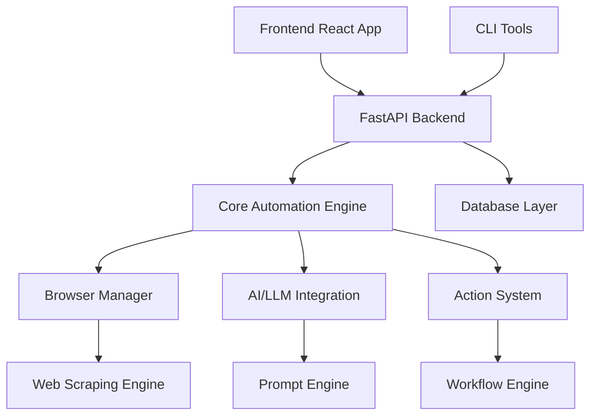
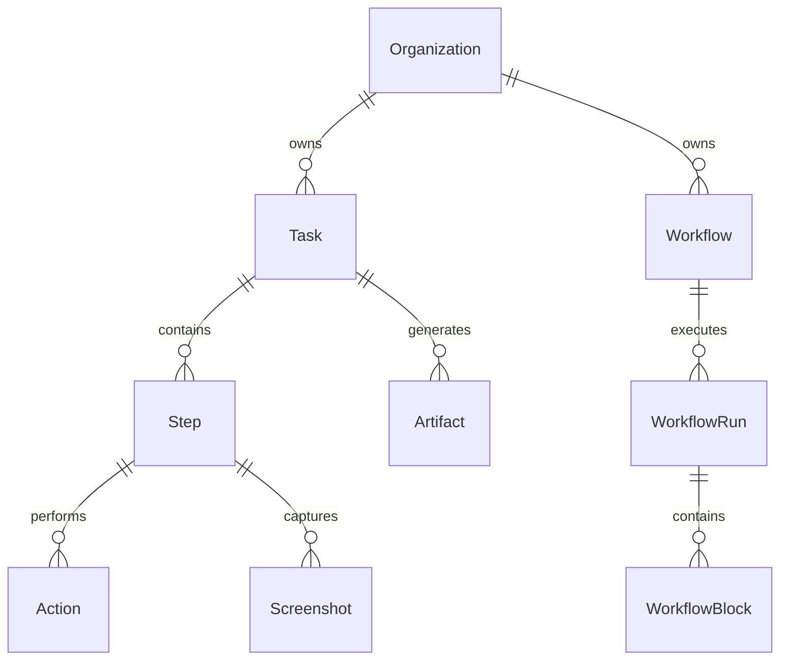
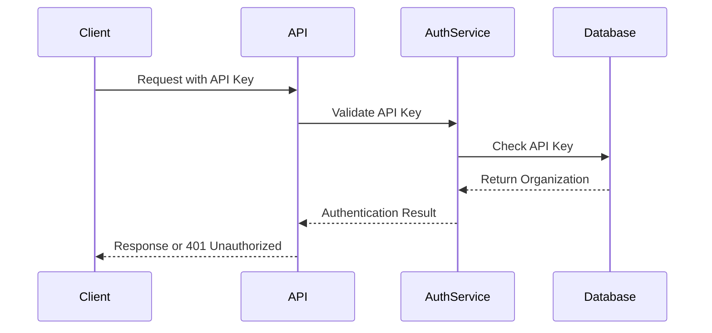
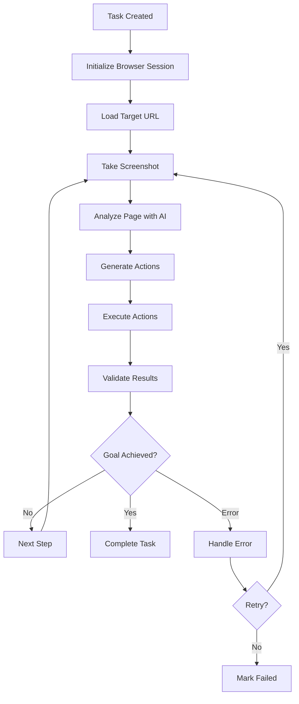
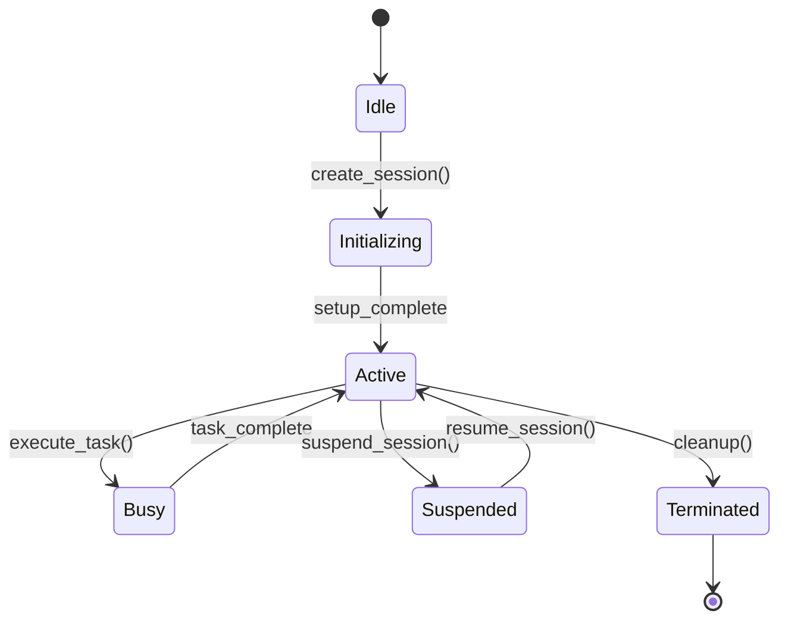
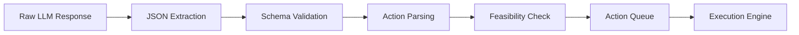

# Skyvern Deep Dive - Comprehensive Study Presentation

---

## Table of Contents

1. [Executive Summary & Overview](#executive-summary--overview)
2. [Repository Architecture](#repository-architecture)
3. [Phase 1: Foundation & Configuration](#phase-1-foundation--configuration)
4. [Phase 2: Database Layer](#phase-2-database-layer)
5. [Phase 3: API & Web Framework](#phase-3-api--web-framework)
6. [Phase 4: Core Automation Engine](#phase-4-core-automation-engine)
7. [Phase 5: Browser Management](#phase-5-browser-management)
8. [Phase 6: AI & LLM Integration](#phase-6-ai--llm-integration)
9. [Phase 7: Action System](#phase-7-action-system)
10. [Phase 8: Workflow Engine](#phase-8-workflow-engine)
11. [Phase 9: Services & Business Logic](#phase-9-services--business-logic)
12. [Phase 10: Web Scraping Engine](#phase-10-web-scraping-engine)
13. [Phase 11: Frontend Application](#phase-11-frontend-application)
14. [Phase 12: CLI & Developer Tools](#phase-12-cli--developer-tools)
15. [Complete Data Flow Analysis](#complete-data-flow-analysis)
16. [Implementation Timeline](#implementation-timeline)
17. [Study Resources & Best Practices](#study-resources--best-practices)

---

## Executive Summary & Overview

### What is Skyvern?

**Skyvern** is an intelligent web automation platform that combines AI-powered decision making with browser automation to perform complex web tasks. It uses Large Language Models (LLMs) to understand web pages and make intelligent decisions about how to interact with them.

### Key Capabilities

- **AI-Driven Web Automation**: Uses LLMs to understand and interact with web pages
- **Dynamic Element Detection**: Identifies elements without predefined selectors
- **Complex Workflow Orchestration**: Manages multi-step automation processes
- **Cross-Browser Support**: Works with Chrome, Firefox, and other browsers
- **Visual-First Approach**: Uses screenshots and visual analysis for decision making
- **Scalable Architecture**: Handles multiple concurrent automation tasks

### Core Value Proposition

| Traditional Automation | Skyvern Approach |
|------------------------|------------------|
| Brittle selectors | AI-powered element detection |
| Manual script updates | Self-adapting workflows |
| Single-page focus | End-to-end process automation |
| Developer-only | Business user accessible |

---

## Repository Architecture

### High-Level Structure

```
Skyvern Repository
├── skyvern/                    # Main Python Application
│   ├── config.py              # Configuration Management
│   ├── forge/                 # Core Automation Engine
│   ├── webeye/               # Browser & Web Interaction
│   ├── services/             # Business Logic Services
│   └── utils/                # Utility Functions
├── skyvern-frontend/          # React TypeScript UI
│   ├── src/components/       # UI Components
│   ├── src/api/             # API Integration
│   └── src/routes/          # Page Routing
└── cli/                      # Command Line Tools
    ├── commands.py          # CLI Commands
    └── utils/               # CLI Utilities
```

### Component Interaction Flow



### Technology Stack

| Layer | Technologies |
|-------|-------------|
| **Frontend** | React 18, TypeScript, Tailwind CSS, Vite |
| **Backend** | FastAPI, Python 3.11+, Pydantic |
| **Database** | PostgreSQL, SQLAlchemy, Alembic |
| **Browser** | Playwright, Chrome DevTools Protocol |
| **AI/ML** | OpenAI GPT, Anthropic Claude, Custom Prompts |
| **Infrastructure** | Docker, Docker Compose, Nginx |

---

## Phase 1: Foundation & Configuration

### Overview
Understanding the core setup and configuration layer that powers the entire Skyvern application.

### Critical Files Analysis

#### 1.1 Core Configuration (`skyvern/config.py`)

**Purpose**: Central configuration management using Pydantic settings

**Key Configuration Categories**:

| Category | Settings | Purpose |
|----------|----------|---------|
| **Browser** | `BROWSER_TYPE`, `CHROME_EXECUTABLE_PATH` | Browser automation setup |
| **Database** | `DATABASE_STRING`, `DATABASE_STATEMENT_TIMEOUT_MS` | Database connectivity |
| **Timeouts** | `BROWSER_ACTION_TIMEOUT_MS`, `BROWSER_LOADING_TIMEOUT_MS` | Performance tuning |
| **Limits** | `MAX_STEPS_PER_RUN`, `MAX_RETRIES_PER_STEP` | Resource management |
| **Security** | `ALLOWED_ORIGINS`, `BLOCKED_HOSTS` | Security controls |

**Configuration Flow**:
```
Environment Variables (.env) 
    ↓
Pydantic Settings Validation
    ↓
Application Configuration Object
    ↓
Component Initialization
```

#### 1.2 Constants & Enums (`skyvern/constants.py`)

**Key Constants Categories**:

```python
# Browser Configuration
BROWSER_TYPES = ["chromium-headful", "chromium-headless", "firefox"]

# Timeout Values
DEFAULT_TIMEOUT_MS = 5000
LONG_TIMEOUT_MS = 30000

# File Paths
DEFAULT_VIDEO_PATH = "./video"
DEFAULT_HAR_PATH = "./har"
DEFAULT_LOG_PATH = "./log"

# Status Types
TASK_STATUS = ["created", "running", "completed", "failed"]
STEP_STATUS = ["created", "running", "completed", "failed", "retrying"]
```

#### 1.3 Exception Hierarchy (`skyvern/exceptions.py`)

**Exception Classification**:

```
SkyvernException (Base)
├── ConfigurationError
├── DatabaseError
├── BrowserError
│   ├── PageLoadError
│   ├── ElementNotFoundError
│   └── ActionTimeoutError
├── AIError
│   ├── LLMResponseError
│   └── PromptValidationError
└── WorkflowError
    ├── StepExecutionError
    └── WorkflowValidationError
```

### Configuration Best Practices

1. **Environment-Specific Settings**: Use `.env`, `.env.staging`, `.env.prod`
2. **Validation**: Leverage Pydantic for type checking and validation
3. **Secrets Management**: Never commit sensitive data to version control
4. **Feature Flags**: Use boolean settings for experimental features

### Key Learning Outcomes

- ✅ **Configuration Loading**: Understand how Pydantic loads and validates settings
- ✅ **Environment Variables**: Know all required and optional environment variables
- ✅ **Error Handling**: Grasp the exception hierarchy and error propagation
- ✅ **Startup Sequence**: Understand application initialization order

---

## Phase 2: Database Layer

### Overview
Comprehensive database architecture supporting tasks, workflows, organizations, and automation metadata.

### Database Schema Overview

#### 2.1 Core Entity Relationships



#### 2.2 Primary Database Models

| Model | Purpose | Key Fields |
|-------|---------|------------|
| **Organization** | Multi-tenancy support | `id`, `name`, `api_key`, `settings` |
| **Task** | Individual automation jobs | `id`, `status`, `url`, `navigation_goal`, `org_id` |
| **Step** | Individual task execution steps | `id`, `task_id`, `status`, `action_type`, `input_data` |
| **Workflow** | Template for complex automations | `id`, `title`, `description`, `blocks`, `org_id` |
| **WorkflowRun** | Workflow execution instance | `id`, `workflow_id`, `status`, `parameters`, `created_at` |
| **Artifact** | Generated files/screenshots | `id`, `task_id`, `artifact_type`, `uri`, `created_at` |

#### 2.3 Database Operations (`skyvern/forge/sdk/db/client.py`)

**CRUD Operations Matrix**:

| Entity | Create | Read | Update | Delete | Bulk Operations |
|--------|--------|------|--------|---------|-----------------|
| Task | ✅ | ✅ | ✅ | ✅ | ✅ |
| Step | ✅ | ✅ | ✅ | ❌ | ✅ |
| Workflow | ✅ | ✅ | ✅ | ✅ | ❌ |
| WorkflowRun | ✅ | ✅ | ✅ | ❌ | ✅ |
| Organization | ✅ | ✅ | ✅ | ❌ | ❌ |

**Query Patterns**:
```python
# Complex Queries Examples
get_tasks_by_status_and_organization()
get_workflow_runs_with_pagination()
get_task_steps_with_artifacts()
get_organization_usage_metrics()
```

#### 2.4 Data Schemas (`skyvern/forge/sdk/schemas/`)

**Schema Categories**:

1. **Request Schemas**: Validate incoming API requests
2. **Response Schemas**: Structure API responses
3. **Internal Schemas**: Data transfer between components

**Example Schema Structure**:
```python
class TaskRequest(BaseModel):
    url: str
    navigation_goal: str
    data_extraction_goal: Optional[str] = None
    navigation_payload: Optional[Dict[str, Any]] = None
    
class TaskResponse(BaseModel):
    task_id: str
    status: TaskStatus
    created_at: datetime
    updated_at: datetime
    organization_id: str
```

### Database Performance Considerations

| Optimization | Implementation | Impact |
|--------------|----------------|---------|
| **Indexing** | Status, timestamp, organization_id | Query speed improvement |
| **Connection Pooling** | SQLAlchemy pool management | Resource efficiency |
| **Query Optimization** | Eager loading, join optimization | Reduced N+1 queries |
| **Partitioning** | Date-based partitioning for large tables | Scalability |

### Key Learning Outcomes

- ✅ **Data Model Understanding**: Know all entities and relationships
- ✅ **Query Patterns**: Understand common database operations
- ✅ **Schema Validation**: Grasp Pydantic schema usage
- ✅ **Performance Optimization**: Know indexing and query strategies

---

## Phase 3: API & Web Framework

### Overview
FastAPI-based REST API providing endpoints for task management, workflow execution, and system administration.

### API Architecture

#### 3.1 FastAPI Application Structure (`skyvern/forge/app.py`)

**Application Initialization Flow**:
```
FastAPI App Creation
    ↓
Middleware Registration
    ↓
Route Registration
    ↓
Database Connection Setup
    ↓
Background Tasks Setup
    ↓
Error Handlers Registration
```

**Middleware Stack**:
| Middleware | Purpose | Order |
|------------|---------|-------|
| **CORS** | Cross-origin resource sharing | 1 |
| **Authentication** | API key validation | 2 |
| **Logging** | Request/response logging | 3 |
| **Error Handling** | Exception processing | 4 |

#### 3.2 Core API Endpoints

##### Tasks API (`skyvern/forge/api/endpoints/tasks.py`)

| Endpoint | Method | Purpose | Parameters |
|----------|--------|---------|------------|
| `/api/v1/tasks` | POST | Create new task | `url`, `navigation_goal`, `data_extraction_goal` |
| `/api/v1/tasks/{task_id}` | GET | Get task details | `task_id`, `include_steps` |
| `/api/v1/tasks/{task_id}/steps` | GET | Get task steps | `task_id`, `page`, `limit` |
| `/api/v1/tasks/{task_id}/artifacts` | GET | Get task artifacts | `task_id`, `artifact_type` |
| `/api/v1/tasks/{task_id}/cancel` | POST | Cancel running task | `task_id` |

##### Workflows API (`skyvern/forge/api/endpoints/workflows.py`)

| Endpoint | Method | Purpose | Parameters |
|----------|--------|---------|------------|
| `/api/v1/workflows` | POST | Create workflow | `title`, `description`, `blocks` |
| `/api/v1/workflows` | GET | List workflows | `page`, `limit`, `organization_id` |
| `/api/v1/workflows/{workflow_id}` | GET | Get workflow | `workflow_id` |
| `/api/v1/workflows/{workflow_id}/runs` | POST | Execute workflow | `workflow_id`, `parameters` |
| `/api/v1/workflows/{workflow_id}/runs/{run_id}` | GET | Get workflow run | `workflow_id`, `run_id` |

#### 3.3 Authentication & Security

**API Key Authentication Flow**:


**Security Features**:
- **API Key Authentication**: Organization-based access control
- **Rate Limiting**: Request throttling per organization
- **Input Validation**: Pydantic schema validation
- **CORS Configuration**: Configurable cross-origin policies
- **Request Logging**: Comprehensive audit trails

#### 3.4 Request/Response Patterns

**Standard Response Format**:
```json
{
    "success": true,
    "data": {
        // Response payload
    },
    "error": null,
    "metadata": {
        "timestamp": "2024-01-15T10:30:00Z",
        "request_id": "req_123456789"
    }
}
```

**Error Response Format**:
```json
{
    "success": false,
    "data": null,
    "error": {
        "code": "TASK_NOT_FOUND",
        "message": "Task with ID 'task_123' not found",
        "details": {}
    },
    "metadata": {
        "timestamp": "2024-01-15T10:30:00Z",
        "request_id": "req_123456789"
    }
}
```

### API Usage Examples

#### Creating a Simple Task
```python
import requests

response = requests.post(
    "http://localhost:8000/api/v1/tasks",
    headers={"x-api-key": "your-api-key"},
    json={
        "url": "https://example.com",
        "navigation_goal": "Fill out the contact form with test data",
        "data_extraction_goal": "Extract the confirmation message"
    }
)
```

#### Monitoring Task Progress
```python
task_id = response.json()["data"]["task_id"]

# Poll for completion
while True:
    status_response = requests.get(
        f"http://localhost:8000/api/v1/tasks/{task_id}",
        headers={"x-api-key": "your-api-key"}
    )
    
    status = status_response.json()["data"]["status"]
    if status in ["completed", "failed"]:
        break
    
    time.sleep(5)
```

### Key Learning Outcomes

- ✅ **API Design**: Understand RESTful endpoint design patterns
- ✅ **Authentication**: Know how API key authentication works
- ✅ **Request Handling**: Grasp FastAPI request processing
- ✅ **Error Management**: Understand error handling and response patterns

---

## Phase 4: Core Automation Engine

### Overview
The heart of Skyvern - orchestrates browser automation, AI decision making, and task execution.

### Core Components Architecture

#### 4.1 Main Agent (`skyvern/forge/sdk/agent.py`)

**Agent Responsibilities**:
- Task orchestration and execution
- Step management and sequencing
- Browser state coordination
- AI integration and decision making
- Error handling and recovery

**Agent Execution Flow**:


**Key Agent Methods**:
| Method | Purpose | Parameters |
|--------|---------|------------|
| `execute_task()` | Main task execution entry point | `task`, `browser_state` |
| `execute_step()` | Individual step execution | `step`, `page`, `context` |
| `analyze_page()` | AI-powered page analysis | `page`, `objective`, `screenshot` |
| `generate_actions()` | Convert AI analysis to actions | `analysis_result`, `context` |
| `handle_error()` | Error recovery and retry logic | `error`, `step`, `context` |

#### 4.2 Context Management (`skyvern/forge/sdk/core/skyvern_context.py`)

**Context Responsibilities**:
- Global state management
- Request tracking and correlation
- Resource lifecycle management
- Thread-safe state access

**Context Structure**:
```python
class SkyvernContext:
    request_id: str
    organization_id: str
    task_id: Optional[str]
    workflow_run_id: Optional[str]
    browser_state: BrowserState
    ai_client: LLMClient
    settings: Settings
    metrics: MetricsCollector
```

#### 4.3 Settings Management (`skyvern/forge/sdk/settings_manager.py`)

**Settings Categories**:
| Category | Settings | Purpose |
|----------|----------|---------|
| **AI/LLM** | Model selection, API keys, timeouts | AI integration |
| **Browser** | Browser type, viewport, user agent | Browser control |
| **Execution** | Max steps, retries, timeouts | Performance tuning |
| **Logging** | Log levels, output formats | Debugging |

#### 4.4 Core Models (`skyvern/forge/sdk/models.py`)

**Primary Model Classes**:

```python
class Task(BaseModel):
    task_id: str
    organization_id: str
    status: TaskStatus
    url: str
    navigation_goal: str
    data_extraction_goal: Optional[str]
    created_at: datetime
    updated_at: datetime

class Step(BaseModel):
    step_id: str
    task_id: str
    status: StepStatus
    action_type: ActionType
    input_data: Dict[str, Any]
    output_data: Optional[Dict[str, Any]]
    error_message: Optional[str]

class BrowserState(BaseModel):
    session_id: str
    page_url: str
    viewport_size: Tuple[int, int]
    cookies: List[Dict[str, Any]]
    local_storage: Dict[str, Any]
```

### Task Execution Lifecycle

#### Detailed Step Breakdown

1. **Task Initialization**
   - Validate task parameters
   - Create browser session
   - Initialize context

2. **Page Navigation**
   - Navigate to target URL
   - Wait for page load
   - Handle redirects and popups

3. **Page Analysis**
   - Capture screenshot
   - Extract DOM structure
   - Identify interactive elements

4. **AI Processing**
   - Send page data to LLM
   - Receive action recommendations
   - Validate action feasibility

5. **Action Execution**
   - Execute browser actions
   - Monitor for changes
   - Capture results

6. **Validation & Iteration**
   - Check goal completion
   - Handle errors and retries
   - Plan next steps

### Performance Optimization Strategies

| Strategy | Implementation | Benefit |
|----------|----------------|---------|
| **Parallel Processing** | Async/await throughout | Improved throughput |
| **Caching** | Screenshot and DOM caching | Reduced redundancy |
| **Resource Pooling** | Browser instance pooling | Resource efficiency |
| **Smart Retries** | Exponential backoff | Better reliability |

### Key Learning Outcomes

- ✅ **Agent Architecture**: Understand the main orchestration logic
- ✅ **State Management**: Know how context and state are managed
- ✅ **Execution Flow**: Grasp the complete task execution lifecycle
- ✅ **Error Handling**: Understand error recovery patterns

---

## Phase 5: Browser Management

### Overview
Sophisticated browser automation system managing multiple browser sessions, page interactions, and resource lifecycle.

### Browser Architecture

#### 5.1 Browser Manager (`skyvern/webeye/browser_manager.py`)

**Browser Manager Responsibilities**:
- Browser instance lifecycle management
- Session pooling and optimization
- Resource allocation and cleanup
- Cross-session state management

**Browser Session Lifecycle**:


**Key Manager Methods**:
| Method | Purpose | Parameters |
|--------|---------|------------|
| `create_browser_session()` | Create new browser instance | `session_config`, `proxy_config` |
| `get_session()` | Retrieve existing session | `session_id` |
| `cleanup_session()` | Clean up browser resources | `session_id`, `force` |
| `manage_pool()` | Handle session pool optimization | `pool_size`, `max_idle_time` |

#### 5.2 Browser Factory (`skyvern/webeye/browser_factory.py`)

**Browser Configuration Options**:
```python
class BrowserConfig:
    browser_type: BrowserType  # chromium, firefox, webkit
    headless: bool = False
    viewport_size: Tuple[int, int] = (1920, 1080)
    user_agent: Optional[str] = None
    proxy_config: Optional[ProxyConfig] = None
    downloads_path: Optional[str] = None
    extensions: List[str] = []
    additional_args: List[str] = []
```

**Browser Creation Flow**:
```
Browser Type Selection
    ↓
Configuration Validation
    ↓
Playwright Browser Launch
    ↓
Context Creation
    ↓
Page Initialization
    ↓
Extension Loading
    ↓
Ready for Automation
```

#### 5.3 Page Utilities (`skyvern/webeye/utils/page.py`)

**Page Interaction Categories**:

| Category | Methods | Purpose |
|----------|---------|---------|
| **Navigation** | `navigate_to()`, `wait_for_load()` | Page navigation |
| **Element Interaction** | `click_element()`, `type_text()` | User actions |
| **Data Extraction** | `extract_text()`, `get_attributes()` | Information gathering |
| **Screenshots** | `take_screenshot()`, `take_element_screenshot()` | Visual capture |
| **State Management** | `save_state()`, `restore_state()` | Session persistence |

**Advanced Page Features**:
```python
# Smart waiting strategies
await page.wait_for_element_visible(selector, timeout=30000)
await page.wait_for_network_idle(timeout=10000)
await page.wait_for_function("() => document.readyState === 'complete'")

# Dynamic content handling
await page.handle_dynamic_content(max_wait_time=60000)
await page.scroll_to_load_content(scroll_pause_time=2000)

# Frame management
await page.switch_to_frame(frame_selector)
await page.handle_nested_frames(max_depth=3)
```

#### 5.4 DOM Utilities (`skyvern/webeye/utils/dom.py`)

**DOM Analysis Features**:
- Element visibility detection
- Interactive element identification
- Form field analysis
- Table data extraction
- Link and button discovery

**DOM Interaction Patterns**:
```python
class DOMInteractionPattern:
    def identify_form_fields(self, page) -> List[FormField]:
        """Identify all interactive form fields"""
        
    def extract_table_data(self, table_element) -> TableData:
        """Extract structured data from tables"""
        
    def find_clickable_elements(self, page) -> List[ClickableElement]:
        """Find all clickable elements (buttons, links, etc.)"""
        
    def analyze_page_structure(self, page) -> PageStructure:
        """Analyze overall page layout and structure"""
```

### Browser Performance Optimization

#### Session Pool Management
```python
class BrowserSessionPool:
    def __init__(self, max_size: int = 10, max_idle_time: int = 300):
        self.max_size = max_size
        self.max_idle_time = max_idle_time
        self.active_sessions: Dict[str, BrowserSession] = {}
        self.idle_sessions: Queue[BrowserSession] = Queue()
    
    async def get_session(self, requirements: SessionRequirements) -> BrowserSession:
        # Try to reuse idle session
        # Create new if needed
        # Manage pool size
```

#### Resource Management
| Resource | Management Strategy | Cleanup Policy |
|----------|-------------------|----------------|
| **Memory** | Session pooling, selective cleanup | Idle timeout-based |
| **CPU** | Process throttling, priority queuing | Load-based scaling |
| **Network** | Connection reuse, request batching | Connection pooling |
| **Storage** | Temporary file cleanup, cache management | Size and age limits |

### Key Learning Outcomes

- ✅ **Browser Lifecycle**: Understand session creation and management
- ✅ **Page Interactions**: Know how to interact with web elements
- ✅ **Resource Management**: Grasp optimization and cleanup strategies
- ✅ **DOM Manipulation**: Understand page analysis and interaction patterns

---

## Phase 6: AI & LLM Integration

### Overview
Sophisticated AI integration system that powers intelligent decision making, action planning, and adaptive web automation.

### AI Architecture

#### 6.1 LLM API Integration (`skyvern/forge/sdk/api/llm/`)

**Supported LLM Providers**:
| Provider | Models | Capabilities | Use Cases |
|----------|--------|-------------|-----------|
| **OpenAI** | GPT-4, GPT-3.5-turbo | General reasoning, code generation | Action planning, content analysis |
| **Anthropic** | Claude-3, Claude-2 | Long context, safety | Complex workflows, content review |
| **Custom Models** | Local/self-hosted | Domain-specific | Specialized automation tasks |

**LLM Client Architecture**:
```python
class LLMClient:
    def __init__(self, provider: str, model: str, api_key: str):
        self.provider = provider
        self.model = model
        self.client = self._initialize_client()
    
    async def generate_response(self, prompt: str, context: Dict) -> LLMResponse:
        # Handle provider-specific API calls
        # Manage rate limiting and retries
        # Parse and validate responses
```

#### 6.2 Prompt Engineering (`skyvern/utils/prompt_engine.py`)

**Prompt Template Categories**:

| Category | Templates | Purpose |
|----------|-----------|---------|
| **Page Analysis** | `analyze_page.md`, `identify_elements.md` | Understanding web pages |
| **Action Planning** | `plan_actions.md`, `navigate_form.md` | Determining next steps |
| **Data Extraction** | `extract_data.md`, `parse_content.md` | Information gathering |
| **Error Handling** | `handle_error.md`, `retry_strategy.md` | Problem resolution |

**Dynamic Prompt Generation**:
```python
class PromptEngine:
    def generate_page_analysis_prompt(self, 
                                    screenshot_data: bytes,
                                    url: str,
                                    objective: str,
                                    previous_actions: List[Action]) -> str:
        
        template = self.load_template("page_analysis")
        context = {
            "url": url,
            "objective": objective,
            "previous_actions": self.format_actions(previous_actions),
            "screenshot": self.encode_screenshot(screenshot_data)
        }
        return template.render(context)
```

#### 6.3 AI Response Processing (`skyvern/webeye/actions/parse_actions.py`)

**Response Parsing Pipeline**:


**Action Extraction Logic**:
```python
class ActionParser:
    def parse_llm_response(self, response: str) -> List[Action]:
        """Parse LLM response into executable actions"""
        
        # Extract JSON from response
        action_data = self.extract_json(response)
        
        # Validate against action schemas
        validated_actions = self.validate_actions(action_data)
        
        # Convert to Action objects
        return [self.create_action(action) for action in validated_actions]
    
    def validate_action_feasibility(self, action: Action, page_state: PageState) -> bool:
        """Check if action can be executed on current page"""
```

### AI Decision Making Process

#### Multi-Step Reasoning Chain
```python
class AIDecisionMaker:
    async def analyze_and_plan(self, context: AutomationContext) -> ExecutionPlan:
        
        # Step 1: Understand current state
        page_analysis = await self.analyze_page(context.screenshot, context.url)
        
        # Step 2: Assess progress toward goal
        progress_assessment = await self.assess_progress(
            context.objective, 
            context.action_history,
            page_analysis
        )
        
        # Step 3: Plan next actions
        action_plan = await self.plan_next_actions(
            page_analysis,
            progress_assessment,
            context.constraints
        )
        
        # Step 4: Validate and optimize plan
        optimized_plan = await self.optimize_plan(action_plan, context)
        
        return optimized_plan
```

#### Context-Aware Prompting
```python
class ContextualPromptBuilder:
    def build_context_aware_prompt(self, base_prompt: str, context: Dict) -> str:
        
        # Add task-specific context
        if context.get("task_type") == "form_filling":
            base_prompt += self.loa