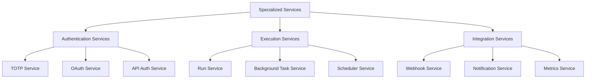
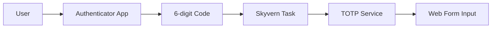
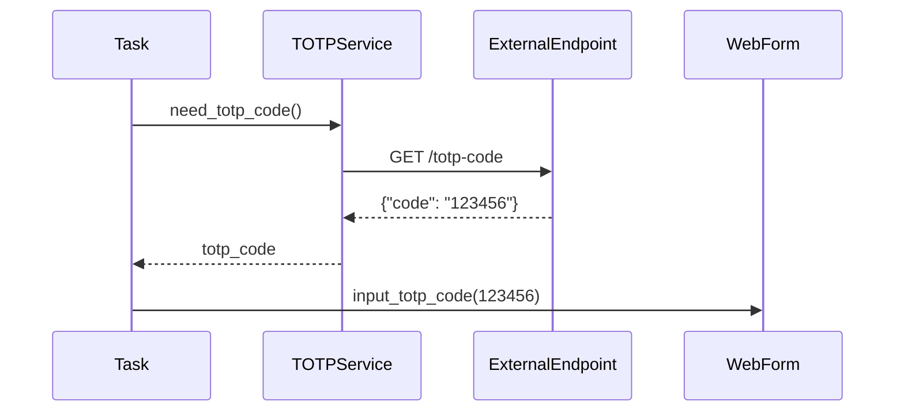
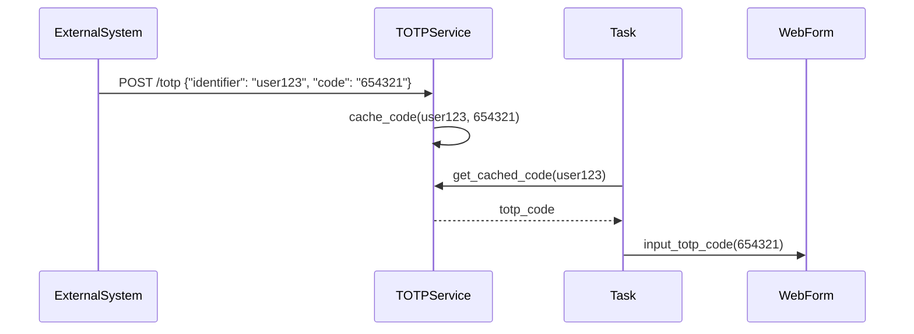
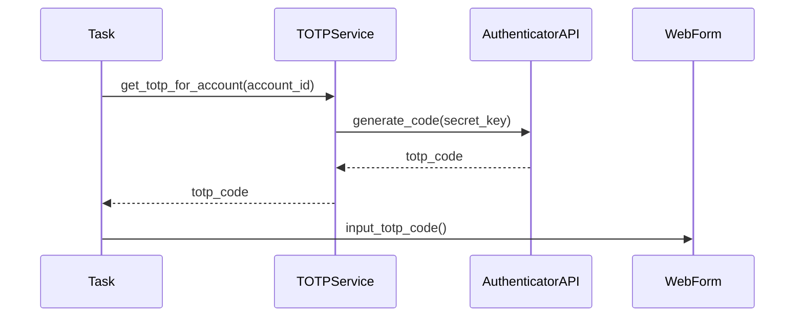
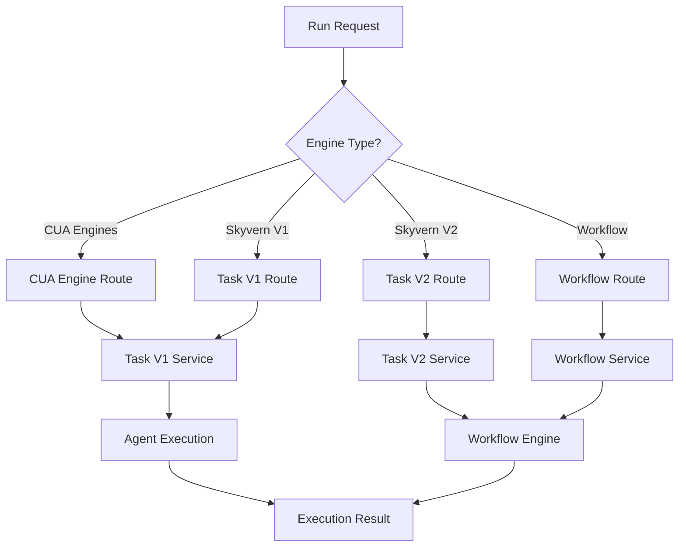
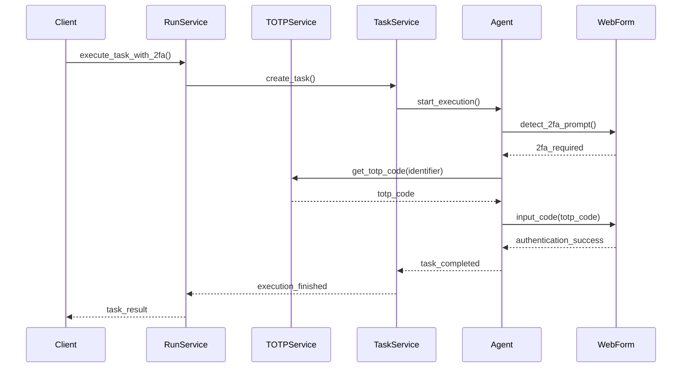
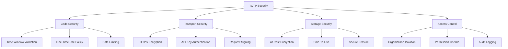

# 🔐 Specialized Services Deep Dive
## TOTP Service & Run Management

---

## 📋 Presentation Agenda

1. **Specialized Services Overview**
2. **TOTP Service Architecture**
3. **Two-Factor Authentication Patterns**
4. **Run Service Management**
5. **Service Orchestration**
6. **Integration Strategies**
7. **Security & Monitoring**

---

## 🔧 Specialized Services Overview

### **Service Categories**



### **Why Specialized Services?**

#### **1. Single Responsibility Principle**
- **Focused Functionality** - Each service has one clear purpose
- **Easier Maintenance** - Isolated changes and updates
- **Better Testing** - Focused unit and integration tests

#### **2. Scalability**
- **Independent Scaling** - Scale services based on demand
- **Resource Optimization** - Different resource requirements
- **Performance Tuning** - Service-specific optimizations

#### **3. Security**
- **Isolation** - Security breaches contained
- **Access Control** - Granular permission management
- **Audit Trails** - Service-specific logging

---

## 🔐 TOTP Service Architecture

### **What is TOTP?**



**TOTP (Time-based One-Time Password)** enables Skyvern to handle 2FA/MFA authentication automatically during task execution.

### **TOTP Service Architecture**

```python
class TOTPService:
    """
    Service for handling Time-based One-Time Password (TOTP) authentication
    """
    
    def __init__(self):
        self.code_cache = LRUCache(maxsize=1000)
        self.rate_limiter = RateLimiter()
        self.validator = TOTPValidator()
    
    async def get_totp_code(
        self,
        totp_url: str,
        identifier: str | None = None
    ) -> str:
        """Get TOTP code from external endpoint"""
        pass
    
    async def push_totp_code(
        self,
        identifier: str,
        code: str,
        expiry_seconds: int = 30
    ) -> None:
        """Push TOTP code to Skyvern for use"""
        pass
    
    async def validate_totp_code(
        self,
        code: str,
        secret: str | None = None
    ) -> bool:
        """Validate TOTP code format and timing"""
        pass
    
    async def get_cached_code(
        self,
        identifier: str
    ) -> str | None:
        """Retrieve cached TOTP code"""
        pass
```

### **TOTP Integration Patterns**

#### **Pattern 1: Pull from Endpoint**


#### **Pattern 2: Push to Skyvern**


#### **Pattern 3: Direct Integration**


---

## 🔢 TOTP Implementation Deep Dive

### **Code Generation & Validation**

```python
class TOTPValidator:
    def __init__(self):
        self.time_window_seconds = 30
        self.code_length = 6
        self.valid_time_skew = 1  # Allow 1 time window skew
    
    def generate_totp_code(self, secret: str, timestamp: int | None = None) -> str:
        """Generate TOTP code using RFC 6238 algorithm"""
        import hmac
        import hashlib
        import struct
        import time
        
        if timestamp is None:
            timestamp = int(time.time())
        
        # Calculate time counter
        time_counter = timestamp // self.time_window_seconds
        
        # Convert to bytes
        time_bytes = struct.pack('>Q', time_counter)
        
        # HMAC-SHA1
        hmac_digest = hmac.new(
            base64.b32decode(secret.upper()),
            time_bytes,
            hashlib.sha1
        ).digest()
        
        # Dynamic truncation
        offset = hmac_digest[-1] & 0x0f
        truncated = struct.unpack('>I', hmac_digest[offset:offset + 4])[0]
        truncated &= 0x7fffffff
        
        # Generate code
        code = truncated % (10 ** self.code_length)
        
        return f"{code:0{self.code_length}d}"
    
    def validate_totp_code(
        self,
        code: str,
        secret: str,
        timestamp: int | None = None
    ) -> bool:
        """Validate TOTP code with time window tolerance"""
        if timestamp is None:
            timestamp = int(time.time())
        
        # Check current time window and adjacent windows
        for skew in range(-self.valid_time_skew, self.valid_time_skew + 1):
            test_timestamp = timestamp + (skew * self.time_window_seconds)
            expected_code = self.generate_totp_code(secret, test_timestamp)
            
            if code == expected_code:
                return True
        
        return False
```

### **TOTP Cache Management**

```python
class TOTPCache:
    def __init__(self):
        self.codes = {}  # identifier -> {code, expiry, used}
        self.cleanup_interval = 60  # seconds
        self.default_ttl = 30  # seconds
    
    async def store_code(
        self,
        identifier: str,
        code: str,
        ttl_seconds: int | None = None
    ) -> None:
        """Store TOTP code with expiry"""
        ttl = ttl_seconds or self.default_ttl
        expiry = datetime.utcnow() + timedelta(seconds=ttl)
        
        self.codes[identifier] = {
            'code': code,
            'expiry': expiry,
            'used': False,
            'created_at': datetime.utcnow()
        }
        
        LOG.info(
            "TOTP code stored",
            identifier=identifier,
            expiry=expiry.isoformat(),
            ttl_seconds=ttl
        )
    
    async def get_code(self, identifier: str, mark_used: bool = True) -> str | None:
        """Retrieve and optionally mark TOTP code as used"""
        if identifier not in self.codes:
            return None
        
        code_data = self.codes[identifier]
        
        # Check if expired
        if datetime.utcnow() > code_data['expiry']:
            del self.codes[identifier]
            return None
        
        # Check if already used (optional, based on use case)
        if code_data['used'] and mark_used:
            LOG.warning(
                "TOTP code already used",
                identifier=identifier
            )
            return None
        
        # Mark as used if requested
        if mark_used:
            code_data['used'] = True
        
        LOG.info(
            "TOTP code retrieved",
            identifier=identifier,
            marked_used=mark_used
        )
        
        return code_data['code']
    
    async def cleanup_expired_codes(self) -> int:
        """Remove expired codes from cache"""
        now = datetime.utcnow()
        expired_identifiers = [
            identifier for identifier, code_data in self.codes.items()
            if now > code_data['expiry']
        ]
        
        for identifier in expired_identifiers:
            del self.codes[identifier]
        
        LOG.info(
            "TOTP cache cleanup completed",
            expired_codes_removed=len(expired_identifiers)
        )
        
        return len(expired_identifiers)
```

---

## 🎛️ Run Service Management

### **Run Service Architecture**

```python
class RunService:
    """
    Central service for managing task and workflow execution runs
    """
    
    def __init__(self):
        self.executor_factory = AsyncExecutorFactory()
        self.run_registry = RunRegistry()
        self.webhook_service = WebhookService()
    
    async def route_run_request(
        self,
        run_request: Union[TaskRunRequest, WorkflowRunRequest],
        organization: Organization,
        background_tasks: BackgroundTasks
    ) -> Union[TaskRunResponse, WorkflowRunResponse]:
        """Route execution request to appropriate service"""
        pass
    
    async def get_run_status(
        self,
        run_id: str,
        organization_id: str
    ) -> RunResponse:
        """Get current status of any run type"""
        pass
    
    async def retry_run_webhook(
        self,
        run_id: str,
        organization_id: str,
        api_key: str | None
    ) -> None:
        """Retry webhook delivery for completed run"""
        pass
    
    async def cancel_run(
        self,
        run_id: str,
        organization_id: str
    ) -> None:
        """Cancel running task or workflow"""
        pass
```

### **Engine Selection Logic**



### **Run Type Management**

```python
class RunTypeManager:
    def __init__(self):
        self.run_type_handlers = {
            RunType.task_v1: self.handle_task_v1,
            RunType.task_v2: self.handle_task_v2,
            RunType.workflow_run: self.handle_workflow_run,
            RunType.openai_cua: self.handle_openai_cua,
            RunType.anthropic_cua: self.handle_anthropic_cua,
            RunType.ui_tars: self.handle_ui_tars
        }
    
    async def route_by_run_type(
        self,
        run_type: RunType,
        run_request: BaseRunRequest,
        context: ExecutionContext
    ) -> BaseRunResponse:
        """Route execution based on run type"""
        if run_type not in self.run_type_handlers:
            raise UnsupportedRunTypeError(run_type)
        
        handler = self.run_type_handlers[run_type]
        return await handler(run_request, context)
    
    async def handle_task_v1(
        self,
        run_request: TaskRunRequest,
        context: ExecutionContext
    ) -> TaskRunResponse:
        """Handle Task V1 execution"""
        # Task generation if needed
        if not run_request.url:
            task_generation = await task_v1_service.generate_task(
                user_prompt=run_request.prompt,
                organization=context.organization
            )
            run_request.url = task_generation.url
            run_request.navigation_goal = task_generation.navigation_goal
        
        # Create and execute task
        task = await task_v1_service.create_task(
            organization=context.organization,
            task_request=run_request
        )
        
        # Execute in background
        await self.execute_in_background(
            executor_type="task_v1",
            task_id=task.task_id,
            context=context
        )
        
        return TaskRunResponse.from_task(task)
    
    async def handle_workflow_run(
        self,
        run_request: WorkflowRunRequest,
        context: ExecutionContext
    ) -> WorkflowRunResponse:
        """Handle Workflow execution"""
        workflow_run = await workflow_service.run_workflow(
            workflow_id=run_request.workflow_id,
            organization=context.organization,
            workflow_request=WorkflowRequestBody.from_run_request(run_request)
        )
        
        # Execute in background
        await self.execute_in_background(
            executor_type="workflow",
            workflow_run_id=workflow_run.workflow_run_id,
            context=context
        )
        
        return WorkflowRunResponse.from_workflow_run(workflow_run)
```

---

## 🔗 Service Orchestration

### **Cross-Service Communication**



### **Service Integration Patterns**

#### **1. Service Registry Pattern**
```python
class ServiceRegistry:
    def __init__(self):
        self._services = {}
        self._health_checkers = {}
    
    def register_service(self, name: str, service: Any, health_checker: Callable = None):
        """Register a service with optional health checker"""
        self._services[name] = service
        if health_checker:
            self._health_checkers[name] = health_checker
        
        LOG.info(f"Service registered: {name}")
    
    def get_service(self, name: str) -> Any:
        """Get service by name"""
        if name not in self._services:
            raise ServiceNotFoundError(name)
        return self._services[name]
    
    async def check_service_health(self, name: str) -> bool:
        """Check if service is healthy"""
        if name not in self._health_checkers:
            return True  # No health checker means assume healthy
        
        try:
            return await self._health_checkers[name]()
        except Exception:
            return False

# Global service registry
service_registry = ServiceRegistry()
service_registry.register_service("totp", TOTPService())
service_registry.register_service("run_management", RunService())
service_registry.register_service("browser_session", BrowserSessionService())
```

#### **2. Event-Driven Communication**
```python
class ServiceEventBus:
    def __init__(self):
        self._subscribers = defaultdict(list)
        self._event_history = []
    
    def subscribe(self, event_type: str, handler: Callable):
        """Subscribe to events of a specific type"""
        self._subscribers[event_type].append(handler)
    
    async def publish(self, event_type: str, event_data: dict):
        """Publish event to all subscribers"""
        event = ServiceEvent(
            type=event_type,
            data=event_data,
            timestamp=datetime.utcnow(),
            event_id=str(uuid.uuid4())
        )
        
        self._event_history.append(event)
        
        # Notify all subscribers
        for handler in self._subscribers[event_type]:
            try:
                await handler(event)
            except Exception as e:
                LOG.error(
                    "Event handler failed",
                    event_type=event_type,
                    handler=handler.__name__,
                    error=str(e)
                )

# Service event integration
event_bus = ServiceEventBus()

# TOTP Service subscribes to authentication events
event_bus.subscribe("task_needs_2fa", totp_service.handle_2fa_request)
event_bus.subscribe("workflow_needs_2fa", totp_service.handle_2fa_request)

# Run Service subscribes to completion events
event_bus.subscribe("task_completed", run_service.handle_task_completion)
event_bus.subscribe("workflow_completed", run_service.handle_workflow_completion)
```

#### **3. Circuit Breaker Pattern**
```python
class ServiceCircuitBreaker:
    def __init__(self, failure_threshold: int = 5, timeout_seconds: int = 60):
        self.failure_threshold = failure_threshold
        self.timeout_seconds = timeout_seconds
        self.failure_count = 0
        self.last_failure_time = None
        self.state = "closed"  # closed, open, half-open
    
    async def call_service(self, service_call: Callable, *args, **kwargs):
        """Call service with circuit breaker protection"""
        if self.state == "open":
            if self._should_attempt_reset():
                self.state = "half-open"
            else:
                raise ServiceUnavailableError("Circuit breaker is open")
        
        try:
            result = await service_call(*args, **kwargs)
            await self._on_success()
            return result
        except Exception as e:
            await self._on_failure()
            raise e
    
    def _should_attempt_reset(self) -> bool:
        """Check if enough time has passed to attempt reset"""
        if self.last_failure_time is None:
            return True
        
        return (datetime.utcnow() - self.last_failure_time).total_seconds() > self.timeout_seconds
    
    async def _on_success(self):
        """Handle successful service call"""
        self.failure_count = 0
        self.state = "closed"
    
    async def _on_failure(self):
        """Handle failed service call"""
        self.failure_count += 1
        self.last_failure_time = datetime.utcnow()
        
        if self.failure_count >= self.failure_threshold:
            self.state = "open"
            LOG.warning(
                "Circuit breaker opened",
                failure_count=self.failure_count,
                threshold=self.failure_threshold
            )
```

---

## 🔒 Security & Authentication

### **TOTP Security Model**



### **Security Implementation**

```python
class TOTPSecurityManager:
    def __init__(self):
        self.encryption_key = settings.TOTP_ENCRYPTION_KEY
        self.rate_limiter = RateLimiter(max_requests=10, window_seconds=60)
        self.audit_logger = AuditLogger()
    
    async def secure_store_code(
        self,
        identifier: str,
        code: str,
        organization_id: str,
        ttl_seconds: int = 30
    ) -> None:
        """Securely store TOTP code with encryption"""
        # Rate limiting
        if not await self.rate_limiter.allow_request(f"totp_store:{organization_id}"):
            raise RateLimitExceededError("TOTP code storage rate limit exceeded")
        
        # Encrypt the code
        encrypted_code = await self.encrypt_code(code)
        
        # Store with metadata
        secure_data = {
            'encrypted_code': encrypted_code,
            'organization_id': organization_id,
            'created_at': datetime.utcnow().isoformat(),
            'expires_at': (datetime.utcnow() + timedelta(seconds=ttl_seconds)).isoformat(),
            'access_count': 0
        }
        
        await self.secure_storage.store(identifier, secure_data)
        
        # Audit log
        await self.audit_logger.log_event(
            event_type="totp_code_stored",
            organization_id=organization_id,
            identifier=identifier,
            ttl_seconds=ttl_seconds
        )
    
    async def secure_retrieve_code(
        self,
        identifier: str,
        organization_id: str
    ) -> str | None:
        """Securely retrieve and decrypt TOTP code"""
        # Rate limiting
        if not await self.rate_limiter.allow_request(f"totp_retrieve:{organization_id}"):
            raise RateLimitExceededError("TOTP code retrieval rate limit exceeded")
        
        # Retrieve encrypted data
        secure_data = await self.secure_storage.retrieve(identifier)
        if not secure_data:
            return None
        
        # Verify organization access
        if secure_data['organization_id'] != organization_id:
            await self.audit_logger.log_security_violation(
                event_type="unauthorized_totp_access",
                organization_id=organization_id,
                identifier=identifier
            )
            raise UnauthorizedAccessError("Organization mismatch for TOTP code")
        
        # Check expiry
        expires_at = datetime.fromisoformat(secure_data['expires_at'])
        if datetime.utcnow() > expires_at:
            await self.secure_storage.delete(identifier)
            return None
        
        # Decrypt code
        decrypted_code = await self.decrypt_code(secure_data['encrypted_code'])
        
        # Update access count and delete after use
        secure_data['access_count'] += 1
        if secure_data['access_count'] >= 1:  # One-time use
            await self.secure_storage.delete(identifier)
        else:
            await self.secure_storage.store(identifier, secure_data)
        
        # Audit log
        await self.audit_logger.log_event(
            event_type="totp_code_retrieved",
            organization_id=organization_id,
            identifier=identifier,
            access_count=secure_data['access_count']
        )
        
        return decrypted_code
    
    async def encrypt_code(self, code: str) -> str:
        """Encrypt TOTP code using AES encryption"""
        from cryptography.fernet import Fernet
        
        cipher = Fernet(self.encryption_key)
        encrypted_bytes = cipher.encrypt(code.encode())
        return base64.b64encode(encrypted_bytes).decode()
    
    async def decrypt_code(self, encrypted_code: str) -> str:
        """Decrypt TOTP code"""
        from cryptography.fernet import Fernet
        
        cipher = Fernet(self.encryption_key)
        encrypted_bytes = base64.b64decode(encrypted_code.encode())
        decrypted_bytes = cipher.decrypt(encrypted_bytes)
        return decrypted_bytes.decode()
```

---

## 📊 Monitoring & Observability

### **Service Metrics**

```python
class SpecializedServiceMetrics:
    def __init__(self):
        self.metrics_collector = MetricsCollector()
        self.totp_metrics = TOTPMetrics()
        self.run_service_metrics = RunServiceMetrics()
    
    async def collect_totp_metrics(self) -> dict:
        """Collect TOTP service metrics"""
        return {
            'codes_generated_per_minute': self.totp_metrics.codes_generated_rate,
            'codes_consumed_per_minute': self.totp_metrics.codes_consumed_rate,
            'average_code_lifetime': self.totp_metrics.average_code_lifetime,
            'cache_hit_rate': self.totp_metrics.cache_hit_rate,
            'validation_success_rate': self.totp_metrics.validation_success_rate,
            'rate_limit_violations': self.totp_metrics.rate_limit_violations,
            'security_violations': self.totp_metrics.security_violations
        }
    
    async def collect_run_service_metrics(self) -> dict:
        """Collect Run service metrics"""
        return {
            'total_runs_per_minute': self.run_service_metrics.runs_per_minute,
            'runs_by_type': self.run_service_metrics.runs_by_type,
            'average_routing_time': self.run_service_metrics.average_routing_time,
            'execution_success_rate': self.run_service_metrics.execution_success_rate,
            'webhook_delivery_rate': self.run_service_metrics.webhook_delivery_rate,
            'active_runs': self.run_service_metrics.active_runs_count,
            'queued_runs': self.run_service_metrics.queued_runs_count
        }

class TOTPMetrics:
    def __init__(self):
        self.codes_generated = Counter()
        self.codes_consumed = Counter()
        self.code_lifetimes = []
        self.cache_hits = 0
        self.cache_misses = 0
        self.validation_attempts = 0
        self.validation_successes = 0
        self.rate_limit_violations = Counter()
        self.security_violations = Counter()
    
    def record_code_generated(self, identifier: str):
        self.codes_generated[identifier] += 1
    
    def record_code_consumed(self, identifier: str, lifetime_seconds: float):
        self.codes_consumed[identifier] += 1
        self.code_lifetimes.append(lifetime_seconds)
    
    def record_cache_hit(self):
        self.cache_hits += 1
    
    def record_cache_miss(self):
        self.cache_misses += 1
    
    @property
    def cache_hit_rate(self) -> float:
        total = self.cache_hits + self.cache_misses
        return self.cache_hits / total if total > 0 else 0
    
    @property
    def validation_success_rate(self) -> float:
        return self.validation_successes / self.validation_attempts if self.validation_attempts > 0 else 0
    
    @property
    def average_code_lifetime(self) -> float:
        return sum(self.code_lifetimes) / len(self.code_lifetimes) if self.code_lifetimes else 0
```

### **Health Monitoring**

```python
class SpecializedServicesHealthMonitor:
    def __init__(self):
        self.health_checks = [
            self.check_totp_service_health,
            self.check_run_service_health,
            self.check_service_integrations,
            self.check_external_dependencies
        ]
    
    async def check_totp_service_health(self) -> HealthStatus:
        """Check TOTP service health"""
        try:
            # Test code generation
            test_secret = "JBSWY3DPEHPK3PXP"  # Test secret
            test_code = totp_service.generate_totp_code(test_secret)
            
            # Test code validation
            is_valid = totp_service.validate_totp_code(test_code, test_secret)
            
            if not is_valid:
                return HealthStatus.unhealthy("TOTP validation failed")
            
            # Check cache performance
            cache_hit_rate = totp_service.metrics.cache_hit_rate
            if cache_hit_rate < 0.5:  # Less than 50% hit rate
                return HealthStatus.degraded(f"Low cache hit rate: {cache_hit_rate}")
            
            return HealthStatus.healthy("TOTP service operational")
        
        except Exception as e:
            return HealthStatus.unhealthy(f"TOTP service error: {str(e)}")
    
    async def check_run_service_health(self) -> HealthStatus:
        """Check Run service health"""
        try:
            # Check service registry
            required_services = ["totp", "browser_session", "workflow", "task_v1", "task_v2"]
            for service_name in required_services:
                if not await service_registry.check_service_health(service_name):
                    return HealthStatus.degraded(f"Dependent service unhealthy: {service_name}")
            
            # Check active runs
            active_runs = run_service.get_active_runs_count()
            if active_runs > 1000:  # High load threshold
                return HealthStatus.degraded(f"High active runs: {active_runs}")
            
            # Check webhook delivery rate
            webhook_success_rate = run_service.metrics.webhook_delivery_rate
            if webhook_success_rate < 0.9:  # Less than 90% delivery rate
                return HealthStatus.degraded(f"Low webhook delivery rate: {webhook_success_rate}")
            
            return HealthStatus.healthy("Run service operational")
        
        except Exception as e:
            return HealthStatus.unhealthy(f"Run service error: {str(e)}")
```

---

## 🔄 Service Lifecycle Management

### **Service Startup & Shutdown**

```python
class ServiceLifecycleManager:
    def __init__(self):
        self.services = []
        self.startup_order = []
        self.shutdown_order = []
    
    def register_service(
        self,
        service: Any,
        startup_priority: int = 0,
        dependencies: List[str] = None
    ):
        """Register service with lifecycle management"""
        service_info = ServiceInfo(
            service=service,
            name=service.__class__.__name__,
            startup_priority=startup_priority,
            dependencies=dependencies or []
        )
        
        self.services.append(service_info)
        self._calculate_startup_order()
    
    async def startup_all_services(self):
        """Start all services in dependency order"""
        for service_info in self.startup_order:
            try:
                if hasattr(service_info.service, 'startup'):
                    await service_info.service.startup()
                
                LOG.info(f"Service started: {service_info.name}")
            except Exception as e:
                LOG.error(f"Failed to start service {service_info.name}: {e}")
                raise ServiceStartupError(service_info.name, str(e))
    
    async def shutdown_all_services(self):
        """Shutdown all services in reverse order"""
        for service_info in reversed(self.shutdown_order):
            try:
                if hasattr(service_info.service, 'shutdown'):
                    await service_info.service.shutdown()
                
                LOG.info(f"Service stopped: {service_info.name}")
            except Exception as e:
                LOG.error(f"Failed to stop service {service_info.name}: {e}")

# Service lifecycle integration
lifecycle_manager = ServiceLifecycleManager()

# Register services with dependencies
lifecycle_manager.register_service(
    database_service,
    startup_priority=1,
    dependencies=[]
)

lifecycle_manager.register_service(
    totp_service,
    startup_priority=2,
    dependencies=["database_service"]
)

lifecycle_manager.register_service(
    run_service,
    startup_priority=3,
    dependencies=["database_service", "totp_service"]
)
```

### **Service Configuration Management**

```python
class ServiceConfigManager:
    def __init__(self):
        self.config_store = ConfigStore()
        self.config_watchers = {}
    
    async def load_service_config(self, service_name: str) -> dict:
        """Load configuration for a specific service"""
        base_config = await self.config_store.get(f"services.{service_name}")
        env_overrides = self._get_env_overrides(service_name)
        
        # Merge configurations
        config = {**base_config, **env_overrides}
        
        # Validate configuration
        await self._validate_config(service_name, config)
        
        return config
    
    async def watch_config_changes(
        self,
        service_name: str,
        callback: Callable[[dict], None]
    ):
        """Watch for configuration changes"""
        self.config_watchers[service_name] = callback
        
        # Start watching for changes
        await self.config_store.watch(
            f"services.{service_name}",
            self._on_config_change
        )
    
    async def _on_config_change(self, service_name: str, new_config: dict):
        """Handle configuration changes"""
        if service_name in self.config_watchers:
            try:
                await self.config_watchers[service_name](new_config)
                LOG.info(f"Configuration updated for service: {service_name}")
            except Exception as e:
                LOG.error(f"Failed to apply config change for {service_name}: {e}")
```

---

## 🎯 Learning Objectives Summary

### ✅ **Specialized Services Architecture**
- Single-responsibility service design
- Service isolation and independence
- Cross-service communication patterns

### ✅ **TOTP Service Implementation**
- Time-based one-time password handling
- Security best practices
- Integration with task execution

### ✅ **Run Service Management**
- Execution routing and orchestration
- Engine selection logic
- Webhook and monitoring integration

### ✅ **Service Integration Patterns**
- Service registry and discovery
- Event-driven communication
- Circuit breaker and resilience

---

## 📚 Best Practices

### **Service Design Principles**
1. **Single Responsibility** - Each service has one clear purpose
2. **Loose Coupling** - Services interact through well-defined interfaces
3. **High Cohesion** - Related functionality grouped together
4. **Fail-Safe Defaults** - Safe behavior when dependencies fail

### **Security Practices**
1. **Principle of Least Privilege** - Minimal required permissions
2. **Defense in Depth** - Multiple security layers
3. **Audit Everything** - Comprehensive logging
4. **Encrypt Sensitive Data** - Both in transit and at rest

### **Operational Excellence**
1. **Health Monitoring** - Continuous health checks
2. **Graceful Degradation** - Partial functionality when services fail
3. **Configuration Management** - Centralized and version-controlled
4. **Observability** - Metrics, logs, and traces

---

## 🔄 Integration Points

### **Upstream Dependencies**
- **API Layer** - Request routing and validation
- **Authentication** - Organization and permission validation
- **Configuration** - Service settings and feature flags

### **Downstream Dependencies**
- **Database** - Persistent storage
- **External APIs** - TOTP endpoints, webhooks
- **Browser Services** - Session management
- **Workflow Engine** - Execution coordination

---

## 📈 Advanced Topics

### **Service Mesh Integration**
- Inter-service communication
- Load balancing and routing
- Security policies and encryption

### **Distributed Tracing**
- Request correlation across services
- Performance bottleneck identification
- Error propagation tracking

### **Auto-scaling and Load Management**
- Dynamic service scaling
- Load-based routing
- Resource optimization