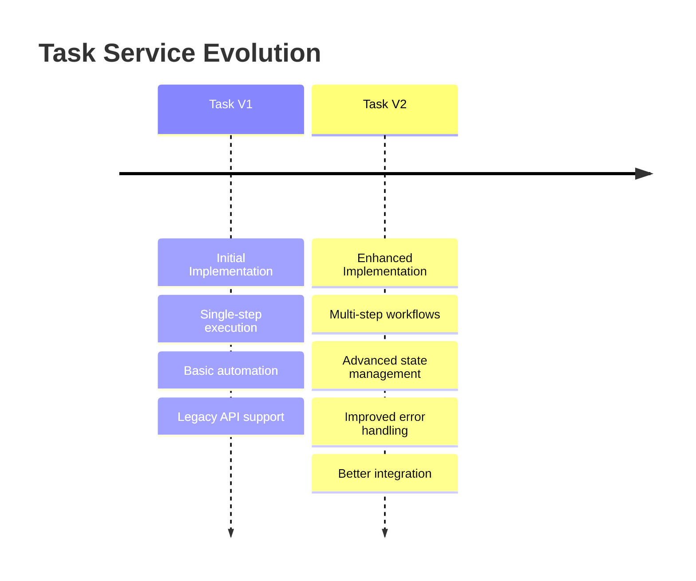
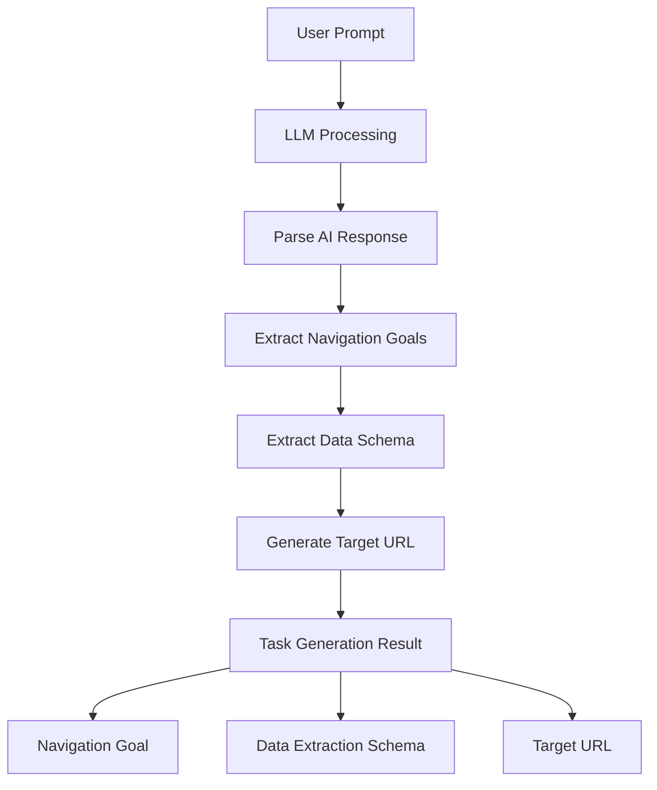
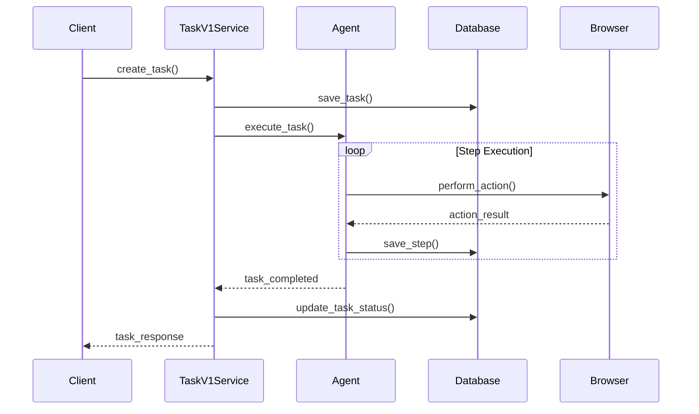
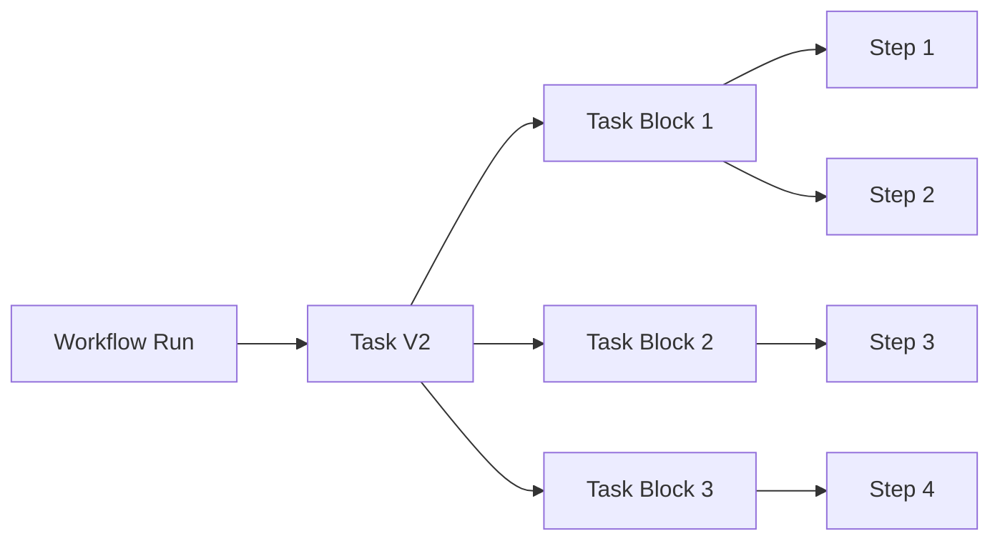
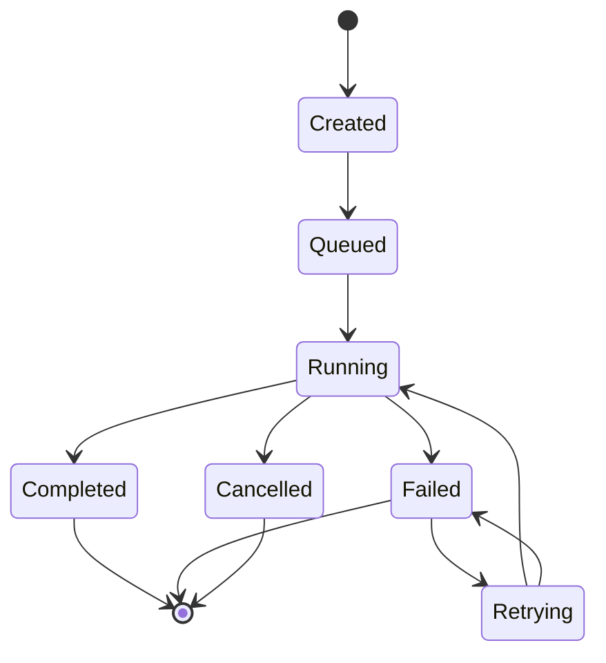
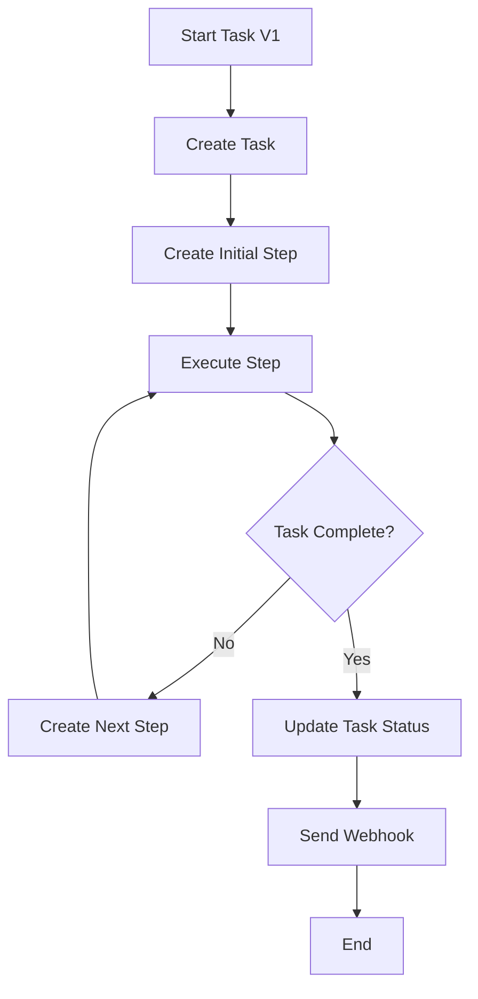
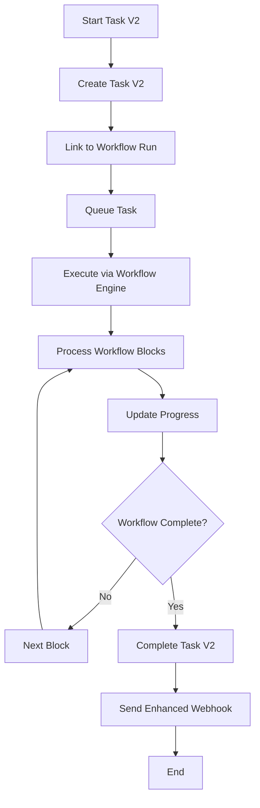
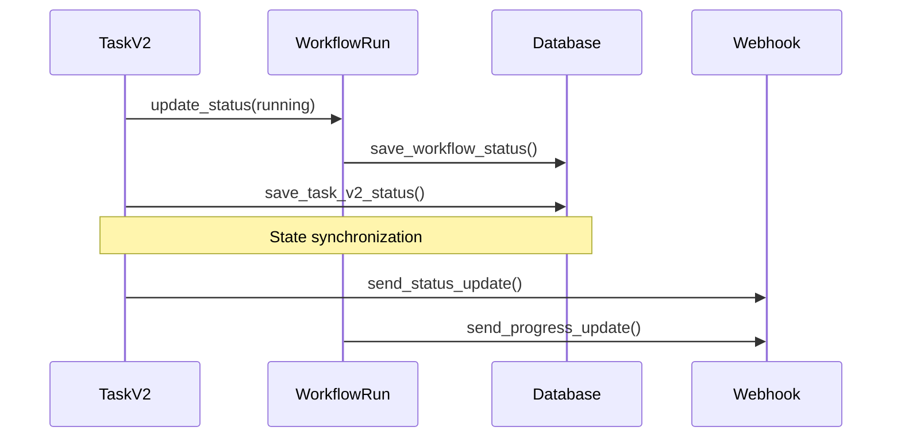
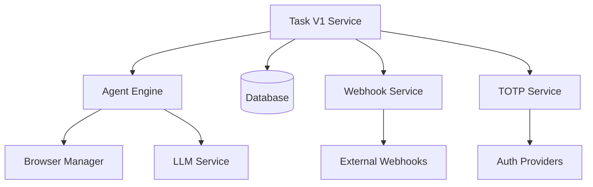
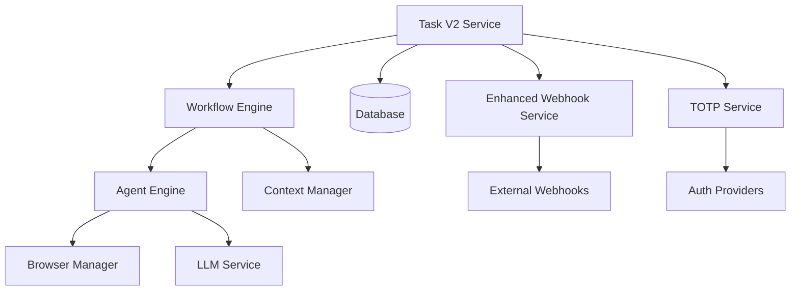

# 🔧 Task Services Deep Dive
## V1 & V2 Architecture and Implementation

---

## 📋 Presentation Agenda

1. **Task Service Evolution**
2. **Task V1 Service Architecture**
3. **Task V2 Service Enhancements**
4. **Business Logic Patterns**
5. **Execution Flow Comparison**
6. **State Management**
7. **Integration Points**

---

## 🔄 Task Service Evolution

### **Why Two Versions?**



### **Migration Strategy**
- **Backward Compatibility** - V1 still supported
- **Feature Parity** - V2 includes all V1 features
- **Gradual Migration** - Clients can migrate incrementally
- **Runtime Selection** - Engine choice determines version

---

## 🏗️ Task V1 Service Architecture

### **Core Responsibilities**

```python
class TaskV1Service:
    async def generate_task(user_prompt: str, organization: Organization)
    async def create_task(organization: Organization, task_request: TaskRequest)
    async def execute_task(task_id: str, organization_id: str)
    async def get_task_status(task_id: str, organization_id: str)
    async def send_task_webhook(task: Task, step: Step)
```

### **Task Generation Flow**



### **Task V1 Execution Model**



---

## ⚡ Task V2 Service Enhancements

### **Enhanced Architecture**

```python
class TaskV2Service:
    async def create_task_v2(organization: Organization, workflow_run_id: str)
    async def execute_task_v2(task_v2_id: str, organization_id: str)
    async def update_task_v2_status(task_v2_id: str, status: TaskV2Status)
    async def send_task_v2_webhook(task_v2: TaskV2)
    async def handle_task_v2_completion(task_v2: TaskV2)
```

### **Key Improvements**

#### **1. Workflow Integration**


#### **2. Enhanced State Management**
- **Cruise ID Tracking** - Observer pattern implementation
- **Workflow Context** - Integration with workflow runs
- **Better Error Handling** - Granular error states
- **Retry Logic** - Automatic retry mechanisms

#### **3. Improved Monitoring**
- **Detailed Logging** - Structured logging with context
- **Metrics Collection** - Performance and success metrics
- **Status Tracking** - Granular status progression
- **Webhook Enhancements** - Rich webhook payloads

---

## 🔄 Business Logic Patterns

### **1. Task Lifecycle Management**



### **2. Engine Selection Pattern**

```python
async def route_task_execution(run_request: TaskRunRequest):
    if run_request.engine in CUA_ENGINES:
        # Conversational UI Assistant
        return await execute_cua_task(run_request)
    elif run_request.engine == RunEngine.skyvern_v1:
        # Legacy Skyvern
        return await task_v1_service.execute_task(run_request)
    elif run_request.engine == RunEngine.skyvern_v2:
        # Enhanced Skyvern
        return await task_v2_service.execute_task_v2(run_request)
    else:
        raise UnsupportedEngineError(run_request.engine)
```

### **3. Context Management Pattern**

```python
# Task V1 Context
skyvern_context.set(
    SkyvernContext(
        organization_id=organization.organization_id,
        task_id=task.task_id,
        run_id=task.task_id,
        max_steps_override=max_steps
    )
)

# Task V2 Context (Workflow-aware)
skyvern_context.set(
    SkyvernContext(
        organization_id=organization.organization_id,
        task_id=task_v2.observer_cruise_id,
        workflow_run_id=task_v2.workflow_run_id,
        run_id=workflow_run_id
    )
)
```

---

## 🔍 Execution Flow Comparison

### **Task V1 Execution**



### **Task V2 Execution**



---

## 📊 State Management Deep Dive

### **Task V1 State Model**

```python
class TaskStatus(str, Enum):
    created = "created"
    queued = "queued"
    running = "running"
    completed = "completed"
    failed = "failed"
    cancelled = "cancelled"
    
# Simple state transitions
task.status = TaskStatus.running
await database.update_task(task_id, status=TaskStatus.completed)
```

### **Task V2 Enhanced State Model**

```python
class TaskV2Status(str, Enum):
    created = "created"
    queued = "queued"
    running = "running"
    completed = "completed"
    failed = "failed"
    cancelled = "cancelled"
    retrying = "retrying"
    
# Workflow-aware state management
task_v2.status = TaskV2Status.running
await database.update_task_v2(
    task_v2_id=task_v2.observer_cruise_id,
    status=TaskV2Status.completed,
    workflow_run_id=task_v2.workflow_run_id
)
```

### **State Synchronization**



---

## 🔗 Integration Points

### **Task V1 Integrations**



### **Task V2 Integrations**



---

## 🎯 Key Differences Summary

| Aspect | Task V1 | Task V2 |
|--------|---------|---------|
| **Execution Model** | Direct agent execution | Workflow-based execution |
| **State Management** | Simple status tracking | Workflow-aware states |
| **Context** | Task-scoped context | Workflow-scoped context |
| **Error Handling** | Basic retry logic | Advanced retry strategies |
| **Monitoring** | Basic logging | Enhanced metrics |
| **Integration** | Direct integrations | Workflow-mediated |
| **Scalability** | Limited parallelism | Block-level parallelism |

---

## 🚀 Performance Considerations

### **Task V1 Performance**
- **Single-threaded execution**
- **Memory-efficient for simple tasks**
- **Direct database access**
- **Minimal overhead**

### **Task V2 Performance**
- **Workflow overhead**
- **Better resource management**
- **Parallel block execution**
- **Enhanced caching**

### **Optimization Strategies**

```python
# V1 Optimization
async def optimize_v1_execution():
    # Direct agent execution
    # Minimal context switching
    # Simple state management
    
# V2 Optimization  
async def optimize_v2_execution():
    # Workflow-level caching
    # Block-level parallelism
    # Enhanced resource pooling
    # Smart retry strategies
```

---

## 🎓 Learning Objectives Summary

### ✅ **Task Service Evolution**
- Understand migration from V1 to V2
- Know backward compatibility strategies
- Grasp feature enhancement approach

### ✅ **Architecture Differences**
- Direct vs. workflow-mediated execution
- Simple vs. enhanced state management
- Basic vs. advanced error handling

### ✅ **Integration Patterns**
- Service layer interactions
- Context management strategies
- Webhook and monitoring integration

### ✅ **Performance Trade-offs**
- Simplicity vs. flexibility
- Performance vs. features
- Scalability considerations

---

## 📚 Next Deep Dive

### **Workflow Service Integration**
- How Task V2 integrates with workflows
- Block-based execution model
- Advanced orchestration patterns