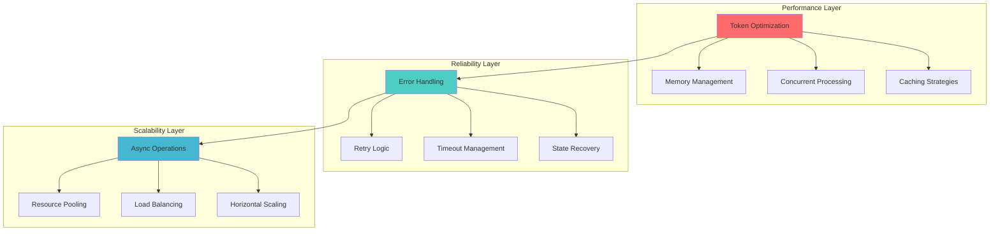
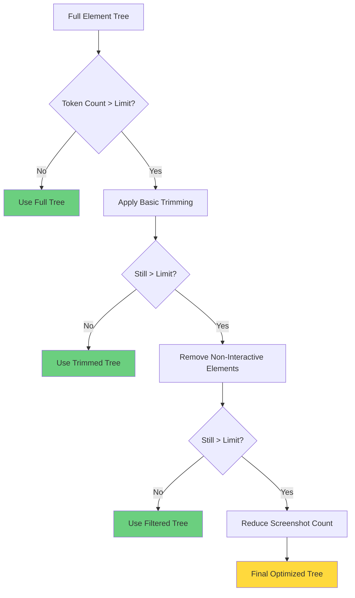
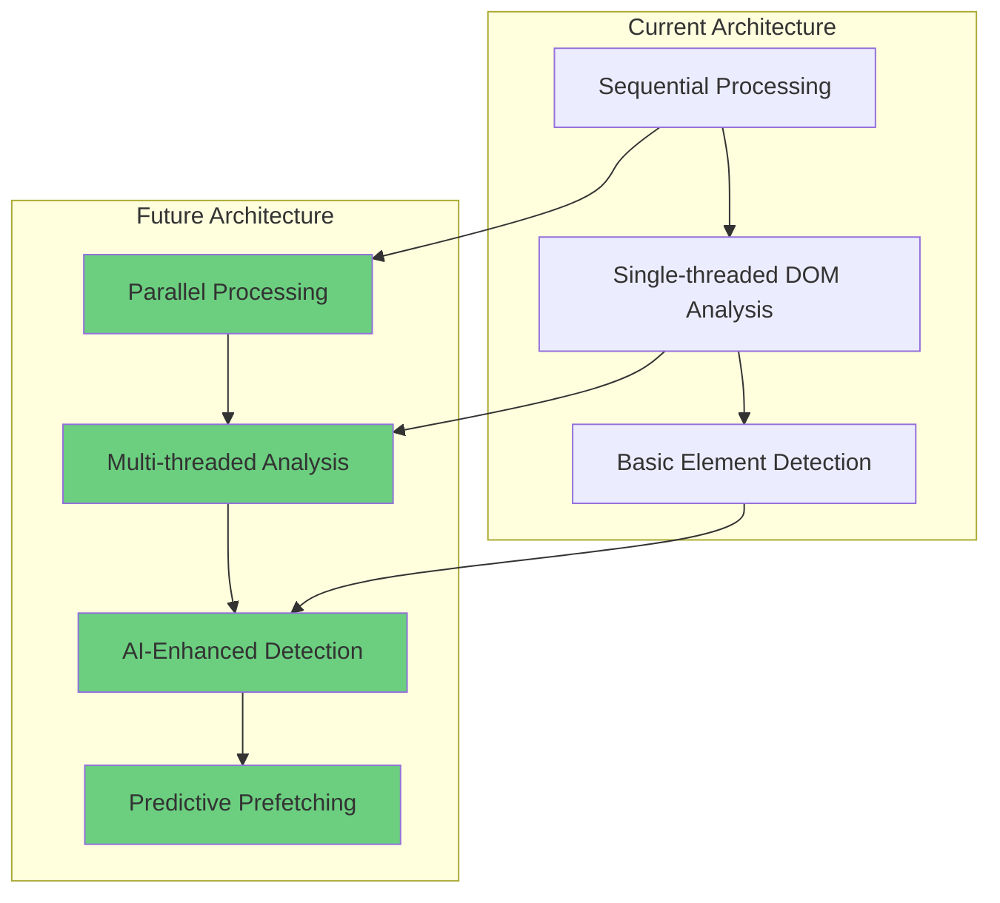

# 🔬 Technical Deep Dive
## Advanced Concepts & Architecture Patterns

---

## 🎯 Advanced Architecture Overview

This section explores the **sophisticated engineering patterns** and **performance optimizations** that make Skyvern's web scraping engine highly scalable and reliable.



---

## ⚡ Performance Optimization Strategies

### 1. Token Usage Optimization

#### Dynamic Token Management
```python
def optimize_element_tree_for_llm(element_tree: list[dict], max_tokens: int) -> list[dict]:
    """
    Dynamically reduces element tree size to fit within token limits
    """
    element_tree_html = "".join(
        json_to_html(element, need_skyvern_attrs=False) 
        for element in element_tree
    )
    
    token_count = count_tokens(element_tree_html)
    
    if token_count > max_tokens:
        # Progressive trimming strategy
        trimmed_tree = trim_element_tree(element_tree)
        
        # If still too large, reduce screenshot count
        if count_tokens(trimmed_tree) > max_tokens:
            return apply_aggressive_trimming(trimmed_tree, max_tokens)
    
    return element_tree
```

#### Element Trimming Algorithm


---

### 2. Memory Management Patterns

#### Streaming Element Processing
```python
class ElementStreamProcessor:
    def __init__(self, page: Page):
        self.page = page
        self.processed_count = 0
        self.memory_threshold = 1000  # elements
    
    async def process_elements_streaming(self) -> AsyncIterator[dict]:
        """
        Stream process elements to prevent memory overflow
        """
        element_chunks = await self.get_element_chunks()
        
        for chunk in element_chunks:
            for element in chunk:
                yield await self.process_single_element(element)
                self.processed_count += 1
                
                # Trigger garbage collection periodically
                if self.processed_count % self.memory_threshold == 0:
                    await self.cleanup_memory()
    
    async def cleanup_memory(self):
        """Clean up memory and release resources"""
        import gc
        gc.collect()
        LOG.info(f"Memory cleanup after {self.processed_count} elements")
```

---

### 3. Concurrent Processing Architecture

#### Parallel Screenshot Capture
```python
async def capture_parallel_screenshots(
    page: Page, 
    scroll_positions: list[int]
) -> list[bytes]:
    """
    Capture multiple screenshots concurrently
    """
    async def capture_at_position(position: int) -> bytes:
        await page.evaluate(f"window.scrollTo(0, {position})")
        await asyncio.sleep(0.5)  # Allow scroll to complete
        return await page.screenshot(full_page=False)
    
    # Create concurrent tasks
    tasks = [
        capture_at_position(position) 
        for position in scroll_positions
    ]
    
    # Execute with semaphore to limit concurrency
    semaphore = asyncio.Semaphore(3)  # Max 3 concurrent screenshots
    
    async def bounded_capture(position: int) -> bytes:
        async with semaphore:
            return await capture_at_position(position)
    
    bounded_tasks = [bounded_capture(pos) for pos in scroll_positions]
    return await asyncio.gather(*bounded_tasks)
```

---

## 🛡️ Reliability & Error Handling

### 1. Robust Element Detection

#### Multi-Strategy Element Location
```python
class RobustElementLocator:
    def __init__(self, scraped_page: ScrapedPage):
        self.scraped_page = scraped_page
        self.fallback_strategies = [
            self.locate_by_css,
            self.locate_by_xpath, 
            self.locate_by_text_content,
            self.locate_by_attributes
        ]
    
    async def locate_element(self, element_id: str) -> Locator:
        """
        Try multiple strategies to locate element reliably
        """
        for strategy in self.fallback_strategies:
            try:
                locator = await strategy(element_id)
                if await locator.count() == 1:
                    return locator
            except Exception as e:
                LOG.warning(f"Strategy {strategy.__name__} failed: {e}")
                continue
        
        raise MissingElement(element_id=element_id)
    
    async def locate_by_css(self, element_id: str) -> Locator:
        css = self.scraped_page.id_to_css_dict.get(element_id)
        if not css:
            raise MissingElementInCSSMap(element_id=element_id)
        return self.page.locator(css)
    
    async def locate_by_xpath(self, element_id: str) -> Locator:
        element = self.scraped_page.id_to_element_dict.get(element_id)
        if not element:
            raise MissingElementDict(element_id=element_id)
        
        xpath = self.generate_xpath_from_element(element)
        return self.page.locator(f"xpath={xpath}")
```

---

### 2. Network & Timeout Resilience

#### Adaptive Timeout Management
```python
class AdaptiveTimeoutManager:
    def __init__(self):
        self.base_timeout = 5000  # 5 seconds
        self.max_timeout = 30000  # 30 seconds
        self.failure_count = 0
    
    def get_timeout(self, operation_type: str) -> int:
        """
        Calculate timeout based on operation type and failure history
        """
        timeouts = {
            "element_detection": self.base_timeout,
            "screenshot": self.base_timeout * 2,
            "page_load": self.base_timeout * 4,
            "form_submission": self.base_timeout * 3
        }
        
        base = timeouts.get(operation_type, self.base_timeout)
        
        # Increase timeout based on recent failures
        multiplier = 1 + (self.failure_count * 0.5)
        adaptive_timeout = min(base * multiplier, self.max_timeout)
        
        return int(adaptive_timeout)
    
    def record_failure(self):
        self.failure_count += 1
        LOG.warning(f"Operation failed, failure count: {self.failure_count}")
    
    def record_success(self):
        if self.failure_count > 0:
            self.failure_count = max(0, self.failure_count - 1)
```

---

### 3. State Recovery Mechanisms

#### Page State Validation
```python
async def validate_page_state(page: Page, expected_state: dict) -> bool:
    """
    Validate that page is in expected state before proceeding
    """
    try:
        # Check URL
        if expected_state.get("url"):
            current_url = page.url
            if not url_matches_pattern(current_url, expected_state["url"]):
                return False
        
        # Check key elements present
        if expected_state.get("required_elements"):
            for element_selector in expected_state["required_elements"]:
                element = page.locator(element_selector)
                if await element.count() == 0:
                    return False
        
        # Check page title
        if expected_state.get("title_pattern"):
            title = await page.title()
            if not re.search(expected_state["title_pattern"], title):
                return False
        
        return True
        
    except Exception as e:
        LOG.error(f"Page state validation failed: {e}")
        return False

async def recover_to_known_state(page: Page, recovery_url: str):
    """
    Recover page to a known good state
    """
    try:
        await page.goto(recovery_url, wait_until="networkidle")
        await page.wait_for_load_state("domcontentloaded")
        LOG.info(f"Recovered to state: {recovery_url}")
    except Exception as e:
        LOG.error(f"State recovery failed: {e}")
        raise
```

---

## 🔄 Advanced Data Processing

### 1. Incremental Element Updates

#### Smart Element Diffing
```python
class IncrementalElementProcessor:
    def __init__(self):
        self.previous_elements = {}
        self.element_hashes = {}
    
    async def process_incremental_update(
        self, 
        new_elements: list[dict]
    ) -> tuple[list[dict], list[dict], list[dict]]:
        """
        Compare new elements with previous state
        Returns: (added, modified, removed)
        """
        new_element_map = {elem["id"]: elem for elem in new_elements}
        new_hashes = {
            elem["id"]: self.calculate_element_hash(elem) 
            for elem in new_elements
        }
        
        added = []
        modified = []
        removed = []
        
        # Find added and modified elements
        for elem_id, element in new_element_map.items():
            if elem_id not in self.previous_elements:
                added.append(element)
            elif new_hashes[elem_id] != self.element_hashes.get(elem_id):
                modified.append(element)
        
        # Find removed elements
        for elem_id in self.previous_elements:
            if elem_id not in new_element_map:
                removed.append(self.previous_elements[elem_id])
        
        # Update state
        self.previous_elements = new_element_map
        self.element_hashes = new_hashes
        
        return added, modified, removed
    
    def calculate_element_hash(self, element: dict) -> str:
        """Calculate hash of element for change detection"""
        relevant_data = {
            "tagName": element.get("tagName"),
            "text": element.get("text"),
            "attributes": element.get("attributes", {}),
            "interactable": element.get("interactable")
        }
        return calculate_sha256(json.dumps(relevant_data, sort_keys=True))
```

---

### 2. Advanced Element Classification

#### ML-Enhanced Element Detection
```python
class MLElementClassifier:
    def __init__(self):
        self.confidence_threshold = 0.85
        self.feature_extractors = [
            self.extract_visual_features,
            self.extract_textual_features, 
            self.extract_structural_features
        ]
    
    async def classify_element_interactivity(
        self, 
        element: dict, 
        screenshot: bytes
    ) -> tuple[bool, float]:
        """
        Use ML to determine if element is interactive
        Returns: (is_interactive, confidence)
        """
        features = await self.extract_features(element, screenshot)
        
        # Combine multiple classification approaches
        visual_score = await self.classify_visual_features(features["visual"])
        textual_score = await self.classify_textual_features(features["textual"])
        structural_score = await self.classify_structural_features(features["structural"])
        
        # Weighted ensemble
        weights = {"visual": 0.4, "textual": 0.3, "structural": 0.3}
        final_score = (
            weights["visual"] * visual_score +
            weights["textual"] * textual_score + 
            weights["structural"] * structural_score
        )
        
        is_interactive = final_score > self.confidence_threshold
        return is_interactive, final_score
    
    async def extract_features(
        self, 
        element: dict, 
        screenshot: bytes
    ) -> dict:
        """Extract comprehensive features for classification"""
        features = {}
        
        for extractor in self.feature_extractors:
            feature_type = extractor.__name__.replace("extract_", "").replace("_features", "")
            features[feature_type] = await extractor(element, screenshot)
        
        return features
```

---

## 🌐 Browser Integration Patterns

### 1. Multi-Frame Coordination

#### Frame-Aware Element Processing
```python
class MultiFrameElementProcessor:
    def __init__(self, page: Page):
        self.page = page
        self.frame_cache = {}
    
    async def process_all_frames(self) -> dict[str, list[dict]]:
        """
        Process elements across all frames in the page
        """
        frame_elements = {}
        
        # Process main frame
        main_elements = await self.process_frame(self.page, "main.frame")
        frame_elements["main.frame"] = main_elements
        
        # Process all iframes
        frames = await self.page.frames
        for frame in frames:
            if frame != self.page.main_frame:
                frame_id = f"iframe_{await self.get_frame_id(frame)}"
                try:
                    iframe_elements = await self.process_frame(frame, frame_id)
                    frame_elements[frame_id] = iframe_elements
                except Exception as e:
                    LOG.warning(f"Failed to process frame {frame_id}: {e}")
        
        return frame_elements
    
    async def resolve_cross_frame_locator(
        self, 
        element_id: str,
        frame_path: list[str]
    ) -> Locator:
        """
        Build locator that can traverse frame boundaries
        """
        current_locator = self.page
        
        # Traverse frame hierarchy
        for frame_selector in frame_path:
            current_locator = current_locator.frame_locator(frame_selector)
        
        # Get final element selector
        css_selector = self.get_css_for_element(element_id)
        return current_locator.locator(css_selector)
```

---

### 2. Dynamic Content Handling

#### Lazy Loading Detection
```python
async def handle_lazy_loading(page: Page) -> bool:
    """
    Detect and handle lazy-loaded content
    """
    initial_element_count = await page.evaluate(
        "document.querySelectorAll('*').length"
    )
    
    # Scroll to trigger lazy loading
    previous_height = 0
    current_height = await page.evaluate("document.body.scrollHeight")
    
    attempts = 0
    max_attempts = 5
    
    while current_height > previous_height and attempts < max_attempts:
        # Scroll to bottom
        await page.evaluate("window.scrollTo(0, document.body.scrollHeight)")
        await page.wait_for_timeout(2000)  # Wait for loading
        
        previous_height = current_height
        current_height = await page.evaluate("document.body.scrollHeight")
        attempts += 1
    
    # Check if new elements appeared
    final_element_count = await page.evaluate(
        "document.querySelectorAll('*').length"
    )
    
    new_elements_loaded = final_element_count > initial_element_count
    
    if new_elements_loaded:
        LOG.info(f"Lazy loading detected: {final_element_count - initial_element_count} new elements")
    
    # Scroll back to top
    await page.evaluate("window.scrollTo(0, 0)")
    await page.wait_for_timeout(1000)
    
    return new_elements_loaded

#### Infinite Scroll Handler
```python
async def handle_infinite_scroll(page: Page, max_scrolls: int = 10) -> int:
    """
    Handle infinite scroll pages to load all content
    """
    total_scrolls = 0
    previous_height = 0
    
    while total_scrolls < max_scrolls:
        current_height = await page.evaluate("document.body.scrollHeight")
        
        if current_height <= previous_height:
            # No new content loaded, break
            break
        
        # Scroll to bottom
        await page.evaluate("window.scrollTo(0, document.body.scrollHeight)")
        
        # Wait for potential new content
        await page.wait_for_timeout(2000)
        
        # Check for loading indicators
        loading_indicators = await page.locator("[class*='loading'], [class*='spinner']").count()
        if loading_indicators > 0:
            # Wait for loading to complete
            await page.wait_for_function(
                "document.querySelectorAll('[class*=\"loading\"], [class*=\"spinner\"]').length === 0",
                timeout=10000
            )
        
        previous_height = current_height
        total_scrolls += 1
        
        LOG.info(f"Infinite scroll: {total_scrolls} scrolls completed")
    
    return total_scrolls
```

---

## 🧠 AI Integration Patterns

### 1. Context-Aware Element Analysis

#### Semantic Element Grouping
```python
class SemanticElementGrouper:
    def __init__(self):
        self.grouping_strategies = [
            self.group_by_semantic_proximity,
            self.group_by_visual_proximity,
            self.group_by_functional_similarity
        ]
    
    async def group_elements(self, elements: list[dict]) -> dict[str, list[dict]]:
        """
        Group related elements for better AI context
        """
        groups = {
            "navigation": [],
            "forms": [],
            "content": [],
            "actions": [],
            "media": []
        }
        
        for element in elements:
            element_type = await self.classify_element_semantically(element)
            groups[element_type].append(element)
        
        return groups
    
    async def classify_element_semantically(self, element: dict) -> str:
        """
        Classify element based on semantic context
        """
        tag_name = element.get("tagName", "").lower()
        attributes = element.get("attributes", {})
        text = element.get("text", "").lower()
        
        # Navigation elements
        if (tag_name == "nav" or 
            "nav" in attributes.get("class", "") or
            any(nav_word in text for nav_word in ["menu", "navigation", "nav"])):
            return "navigation"
        
        # Form elements
        if tag_name in ["form", "input", "select", "textarea", "button"]:
            return "forms"
        
        # Action elements
        if (tag_name == "button" or 
            attributes.get("type") == "submit" or
            any(action_word in text for action_word in ["click", "submit", "send", "save"])):
            return "actions"
        
        # Media elements
        if tag_name in ["img", "video", "audio", "canvas"]:
            return "media"
        
        return "content"
```

---

### 2. Progressive Enhancement Detection

#### Adaptive Complexity Analysis
```python
class ComplexityAnalyzer:
    def __init__(self):
        self.complexity_metrics = {
            "element_count": 0,
            "interaction_depth": 0,
            "dynamic_content": False,
            "multimedia_present": False,
            "form_complexity": 0
        }
    
    async def analyze_page_complexity(self, page: Page, elements: list[dict]) -> dict:
        """
        Analyze page complexity to adapt scraping strategy
        """
        complexity = self.complexity_metrics.copy()
        
        # Element count analysis
        complexity["element_count"] = len(elements)
        
        # Interaction depth (nested interactive elements)
        complexity["interaction_depth"] = await self.calculate_interaction_depth(elements)
        
        # Dynamic content detection
        complexity["dynamic_content"] = await self.detect_dynamic_content(page)
        
        # Multimedia analysis
        complexity["multimedia_present"] = await self.detect_multimedia(elements)
        
        # Form complexity
        complexity["form_complexity"] = await self.analyze_form_complexity(elements)
        
        # Calculate overall complexity score
        complexity["overall_score"] = self.calculate_complexity_score(complexity)
        
        return complexity
    
    def calculate_complexity_score(self, metrics: dict) -> float:
        """
        Calculate weighted complexity score
        """
        weights = {
            "element_count": 0.3,
            "interaction_depth": 0.25,
            "dynamic_content": 0.2,
            "multimedia_present": 0.1,
            "form_complexity": 0.15
        }
        
        score = 0
        score += min(metrics["element_count"] / 100, 1.0) * weights["element_count"]
        score += min(metrics["interaction_depth"] / 5, 1.0) * weights["interaction_depth"]
        score += (1.0 if metrics["dynamic_content"] else 0.0) * weights["dynamic_content"]
        score += (1.0 if metrics["multimedia_present"] else 0.0) * weights["multimedia_present"]
        score += min(metrics["form_complexity"] / 10, 1.0) * weights["form_complexity"]
        
        return score
```

---

## 🔧 Advanced Configuration Patterns

### 1. Dynamic Strategy Selection

#### Adaptive Scraping Configuration
```python
class AdaptiveScrapingConfig:
    def __init__(self):
        self.configs = {
            "minimal": {
                "max_screenshots": 1,
                "element_trimming": "aggressive",
                "timeout_multiplier": 0.5,
                "enable_lazy_loading": False
            },
            "standard": {
                "max_screenshots": 3,
                "element_trimming": "moderate", 
                "timeout_multiplier": 1.0,
                "enable_lazy_loading": True
            },
            "comprehensive": {
                "max_screenshots": 5,
                "element_trimming": "minimal",
                "timeout_multiplier": 2.0,
                "enable_lazy_loading": True,
                "enable_infinite_scroll": True
            }
        }
    
    def select_config(self, complexity_score: float, constraints: dict) -> dict:
        """
        Select optimal configuration based on complexity and constraints
        """
        # Resource constraints
        token_limit = constraints.get("max_tokens", DEFAULT_MAX_TOKENS)
        time_limit = constraints.get("max_time_seconds", 60)
        
        # Select base configuration
        if complexity_score < 0.3 or token_limit < 4000:
            config_name = "minimal"
        elif complexity_score < 0.7 or time_limit < 30:
            config_name = "standard" 
        else:
            config_name = "comprehensive"
        
        config = self.configs[config_name].copy()
        
        # Apply dynamic adjustments
        config = self.apply_dynamic_adjustments(config, complexity_score, constraints)
        
        return config
    
    def apply_dynamic_adjustments(
        self, 
        config: dict, 
        complexity_score: float, 
        constraints: dict
    ) -> dict:
        """
        Fine-tune configuration based on specific conditions
        """
        # Adjust screenshot count based on token limits
        if constraints.get("max_tokens", float("inf")) < 8000:
            config["max_screenshots"] = min(config["max_screenshots"], 2)
        
        # Increase timeouts for complex pages
        if complexity_score > 0.8:
            config["timeout_multiplier"] *= 1.5
        
        # Disable resource-intensive features under constraints
        if constraints.get("max_time_seconds", float("inf")) < 20:
            config["enable_infinite_scroll"] = False
            config["enable_lazy_loading"] = False
        
        return config
```

---

### 2. Performance Monitoring & Adaptation

#### Real-time Performance Tracking
```python
class PerformanceMonitor:
    def __init__(self):
        self.metrics = {
            "scrape_times": [],
            "element_counts": [],
            "screenshot_times": [],
            "memory_usage": [],
            "error_rates": defaultdict(int)
        }
        self.adaptive_thresholds = {
            "max_scrape_time": 30.0,
            "max_memory_mb": 512,
            "max_error_rate": 0.1
        }
    
    async def monitor_scraping_operation(
        self, 
        operation_func: Callable,
        *args, **kwargs
    ) -> tuple[Any, dict]:
        """
        Monitor scraping operation and collect performance metrics
        """
        start_time = time.time()
        start_memory = self.get_memory_usage()
        
        try:
            result = await operation_func(*args, **kwargs)
            
            # Record success metrics
            end_time = time.time()
            end_memory = self.get_memory_usage()
            
            operation_time = end_time - start_time
            memory_delta = end_memory - start_memory
            
            self.metrics["scrape_times"].append(operation_time)
            self.metrics["memory_usage"].append(memory_delta)
            
            # Check for performance degradation
            performance_metrics = self.analyze_performance_trends()
            
            return result, performance_metrics
            
        except Exception as e:
            # Record error metrics
            error_type = type(e).__name__
            self.metrics["error_rates"][error_type] += 1
            
            LOG.error(f"Scraping operation failed: {e}")
            raise
    
    def analyze_performance_trends(self) -> dict:
        """
        Analyze recent performance trends and suggest adaptations
        """
        recent_times = self.metrics["scrape_times"][-10:]  # Last 10 operations
        recent_memory = self.metrics["memory_usage"][-10:]
        
        trends = {
            "avg_scrape_time": statistics.mean(recent_times) if recent_times else 0,
            "avg_memory_usage": statistics.mean(recent_memory) if recent_memory else 0,
            "performance_degradation": False,
            "recommended_adjustments": []
        }
        
        # Check for performance degradation
        if trends["avg_scrape_time"] > self.adaptive_thresholds["max_scrape_time"]:
            trends["performance_degradation"] = True
            trends["recommended_adjustments"].append("reduce_screenshot_count")
            trends["recommended_adjustments"].append("increase_element_trimming")
        
        if trends["avg_memory_usage"] > self.adaptive_thresholds["max_memory_mb"]:
            trends["performance_degradation"] = True
            trends["recommended_adjustments"].append("enable_streaming_processing")
            trends["recommended_adjustments"].append("reduce_element_tree_depth")
        
        return trends
    
    def get_memory_usage(self) -> float:
        """Get current memory usage in MB"""
        import psutil
        process = psutil.Process()
        return process.memory_info().rss / 1024 / 1024
```

---

## 🎨 Visual Processing Enhancements

### 1. Advanced Bounding Box Algorithms

#### Intelligent Box Placement
```python
class IntelligentBoundingBoxRenderer:
    def __init__(self):
        self.box_styles = {
            "interactive": {"border": "2px solid #00ff00", "background": "rgba(0,255,0,0.1)"},
            "form": {"border": "2px solid #ff0000", "background": "rgba(255,0,0,0.1)"},
            "navigation": {"border": "2px solid #0000ff", "background": "rgba(0,0,255,0.1)"},
            "content": {"border": "2px solid #ffff00", "background": "rgba(255,255,0,0.1)"}
        }
    
    async def render_smart_bounding_boxes(
        self, 
        page: Page, 
        elements: list[dict]
    ) -> None:
        """
        Render color-coded bounding boxes based on element classification
        """
        # Group elements by type
        grouped_elements = await self.group_elements_by_type(elements)
        
        for element_type, element_list in grouped_elements.items():
            style = self.box_styles.get(element_type, self.box_styles["content"])
            
            for element in element_list:
                await self.draw_enhanced_bounding_box(page, element, style)
    
    async def draw_enhanced_bounding_box(
        self, 
        page: Page, 
        element: dict, 
        style: dict
    ) -> None:
        """
        Draw enhanced bounding box with additional information
        """
        rect = element.get("rect", {})
        element_id = element.get("id")
        
        js_code = f"""
        (() => {{
            const box = document.createElement('div');
            box.className = 'skyvern-enhanced-box';
            box.style.cssText = `
                position: fixed;
                left: {rect.get('x', 0)}px;
                top: {rect.get('y', 0)}px;
                width: {rect.get('width', 0)}px;
                height: {rect.get('height', 0)}px;
                border: {style['border']};
                background: {style['background']};
                pointer-events: none;
                z-index: 10000;
                box-sizing: border-box;
            `;
            
            // Add element ID label
            const label = document.createElement('div');
            label.textContent = '{element_id}';
            label.style.cssText = `
                position: absolute;
                top: -20px;
                left: 0;
                background: black;
                color: white;
                padding: 2px 4px;
                font-size: 10px;
                font-family: monospace;
            `;
            box.appendChild(label);
            
            document.body.appendChild(box);
        }})();
        """
        
        await page.evaluate(js_code)
```

---

### 2. Screenshot Quality Optimization

#### Dynamic Quality Adjustment
```python
class ScreenshotQualityOptimizer:
    def __init__(self):
        self.quality_settings = {
            "high": {"scale": 2.0, "quality": 90},
            "medium": {"scale": 1.5, "quality": 80},
            "low": {"scale": 1.0, "quality": 70}
        }
    
    async def capture_optimized_screenshot(
        self, 
        page: Page,
        complexity_score: float,
        token_constraints: dict
    ) -> bytes:
        """
        Capture screenshot with optimized quality settings
        """
        # Select quality based on complexity and constraints
        quality_level = self.select_quality_level(complexity_score, token_constraints)
        settings = self.quality_settings[quality_level]
        
        # Configure viewport for optimal capture
        await self.configure_viewport_for_capture(page, settings)
        
        # Capture with optimized settings
        screenshot = await page.screenshot(
            full_page=False,
            clip=await self.calculate_optimal_clip_region(page),
            scale=settings["scale"],
            quality=settings["quality"]
        )
        
        return screenshot
    
    def select_quality_level(
        self, 
        complexity_score: float, 
        constraints: dict
    ) -> str:
        """
        Select appropriate quality level based on constraints
        """
        max_tokens = constraints.get("max_tokens", float("inf"))
        
        # High complexity pages need higher quality for AI accuracy
        if complexity_score > 0.7 and max_tokens > 10000:
            return "high"
        elif complexity_score > 0.4 and max_tokens > 6000:
            return "medium"
        else:
            return "low"
    
    async def calculate_optimal_clip_region(self, page: Page) -> dict:
        """
        Calculate optimal clipping region to focus on content
        """
        viewport_size = page.viewport_size
        content_bounds = await page.evaluate("""
            () => {
                const content = document.querySelector('main') || 
                               document.querySelector('[role="main"]') ||
                               document.body;
                const rect = content.getBoundingClientRect();
                return {
                    x: Math.max(0, rect.left),
                    y: Math.max(0, rect.top),
                    width: Math.min(rect.width, window.innerWidth),
                    height: Math.min(rect.height, window.innerHeight)
                };
            }
        """)
        
        # Ensure minimum viable dimensions
        return {
            "x": content_bounds["x"],
            "y": content_bounds["y"], 
            "width": max(content_bounds["width"], 400),
            "height": max(content_bounds["height"], 300)
        }
```

---

## 🔗 System Integration Patterns

### 1. Event-Driven Architecture

#### Scraping Event System
```python
class ScrapingEventEmitter:
    def __init__(self):
        self.listeners = defaultdict(list)
    
    def on(self, event_type: str, callback: Callable):
        """Register event listener"""
        self.listeners[event_type].append(callback)
    
    async def emit(self, event_type: str, data: dict):
        """Emit event to all listeners"""
        for callback in self.listeners[event_type]:
            try:
                if asyncio.iscoroutinefunction(callback):
                    await callback(data)
                else:
                    callback(data)
            except Exception as e:
                LOG.error(f"Event listener error: {e}")

# Usage example
event_emitter = ScrapingEventEmitter()

@event_emitter.on("page_scraped")
async def handle_page_scraped(data):
    """Handle page scraping completion"""
    element_count = len(data["elements"])
    LOG.info(f"Page scraped: {element_count} elements found")
    
    # Trigger downstream processing
    await process_scraped_data(data)

@event_emitter.on("element_detected")
async def handle_element_detected(data):
    """Handle individual element detection"""
    element = data["element"]
    if element.get("interactable"):
        await cache_interactive_element(element)
```

---

### 2. Plugin Architecture

#### Extensible Processing Pipeline
```python
class ScrapingPlugin(ABC):
    @abstractmethod
    async def process(self, context: dict) -> dict:
        """Process scraping context and return modified context"""
        pass

class ScrapingPipeline:
    def __init__(self):
        self.plugins = []
    
    def add_plugin(self, plugin: ScrapingPlugin):
        """Add plugin to processing pipeline"""
        self.plugins.append(plugin)
    
    async def execute(self, initial_context: dict) -> dict:
        """Execute all plugins in sequence"""
        context = initial_context.copy()
        
        for plugin in self.plugins:
            try:
                context = await plugin.process(context)
                LOG.debug(f"Plugin {plugin.__class__.__name__} completed")
            except Exception as e:
                LOG.error(f"Plugin {plugin.__class__.__name__} failed: {e}")
                # Continue with other plugins
        
        return context

# Example plugins
class ElementFilterPlugin(ScrapingPlugin):
    async def process(self, context: dict) -> dict:
        elements = context.get("elements", [])
        # Filter out non-interactive elements
        filtered = [e for e in elements if e.get("interactable")]
        context["elements"] = filtered
        return context

class PerformanceMetricsPlugin(ScrapingPlugin):
    async def process(self, context: dict) -> dict:
        # Add performance metrics to context
        context["metrics"] = {
            "processing_time": time.time() - context.get("start_time", 0),
            "element_count": len(context.get("elements", [])),
            "memory_usage": self.get_memory_usage()
        }
        return context
```

---

## 📊 Metrics & Analytics

### 1. Comprehensive Metrics Collection

#### Scraping Analytics Dashboard
```python
class ScrapingAnalytics:
    def __init__(self):
        self.metrics_store = defaultdict(list)
        self.aggregated_metrics = {}
    
    def record_scraping_session(self, session_data: dict):
        """Record complete scraping session metrics"""
        session_metrics = {
            "timestamp": datetime.utcnow(),
            "url": session_data.get("url"),
            "element_count": len(session_data.get("elements", [])),
            "screenshot_count": len(session_data.get("screenshots", [])),
            "processing_time": session_data.get("processing_time"),
            "success": session_data.get("success", False),
            "error_type": session_data.get("error_type"),
            "complexity_score": session_data.get("complexity_score", 0)
        }
        
        self.metrics_store["sessions"].append(session_metrics)
        self.update_aggregated_metrics(session_metrics)
    
    def get_performance_summary(self, time_window_hours: int = 24) -> dict:
        """Get performance summary for specified time window"""
        cutoff_time = datetime.utcnow() - timedelta(hours=time_window_hours)
        
        recent_sessions = [
            session for session in self.metrics_store["sessions"]
            if session["timestamp"] > cutoff_time
        ]
        
        if not recent_sessions:
            return {"message": "No recent sessions"}
        
        return {
            "total_sessions": len(recent_sessions),
            "success_rate": sum(s["success"] for s in recent_sessions) / len(recent_sessions),
            "avg_processing_time": statistics.mean([s["processing_time"] for s in recent_sessions if s["processing_time"]]),
            "avg_element_count": statistics.mean([s["element_count"] for s in recent_sessions]),
            "most_common_errors": self.get_common_errors(recent_sessions),
            "performance_trend": self.calculate_performance_trend(recent_sessions)
        }
```

---

## 🚀 Future Enhancements

### Planned Architectural Improvements



### Roadmap Items
1. **GPU-Accelerated Processing** - Leverage GPU for image analysis
2. **Distributed Scraping** - Multi-node scraping coordination
3. **Advanced ML Models** - Custom-trained element detection
4. **Real-time Adaptation** - Dynamic strategy adjustment
5. **Edge Computing** - Browser-side processing optimization

---

## 📋 Key Takeaways

### Architecture Strengths
✅ **Modular Design** - Clear separation of concerns  
✅ **Performance Optimized** - Token and memory management  
✅ **Highly Reliable** - Multi-layer error handling  
✅ **Scalable Foundation** - Event-driven and plugin-based  

### Best Practices Implemented
✅ **Adaptive Configuration** - Context-aware parameter tuning  
✅ **Progressive Enhancement** - Graceful degradation under constraints  
✅ **Comprehensive Monitoring** - Real-time performance tracking  
✅ **Extensible Pipeline** - Plugin architecture for customization  

---

## 🔗 Next: Integration Guide

Continue to **[Integration Guide](06-integration-guide.md)** to learn how to integrate and extend the Skyvern Web Scraping Engine in your own applications.