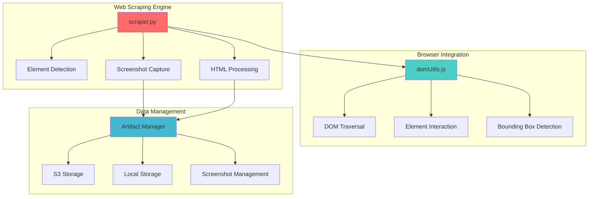
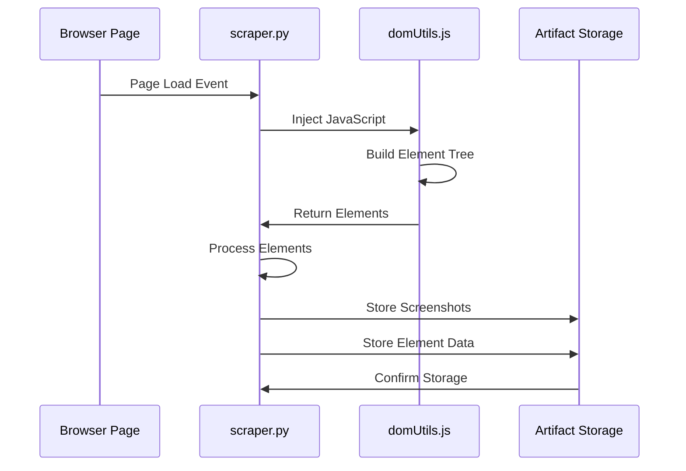

# 🕷️ Skyvern Web Scraping Engine
## Phase 10: Complete Technical Deep Dive

---

## 📋 Presentation Overview

This comprehensive presentation covers the Skyvern Web Scraping Engine architecture, providing deep technical insights into:

1. **Main Scraper Engine** - Core scraping functionality
2. **DOM Utilities** - JavaScript browser-side processing  
3. **Artifact Management** - Data storage and screenshots
4. **Technical Architecture** - System design and data flows
5. **Integration Patterns** - How components work together

---

## 🎯 Learning Objectives

By the end of this presentation, you will understand:

✅ **Page Scraping Techniques** - How Skyvern extracts web content  
✅ **Element Detection Algorithms** - AI-powered element identification  
✅ **Artifact Storage Patterns** - File and screenshot management  
✅ **Data Extraction Methods** - From raw HTML to structured data  

---

## 🏗️ High-Level Architecture

---

## 📊 System Components

| Component | Purpose | Technology |
|-----------|---------|------------|
| **Main Scraper** | Core scraping engine | Python + Playwright |
| **DOM Utils** | Browser-side processing | JavaScript |
| **Artifact Storage** | Data persistence | S3/Local + Python |
| **Element Detection** | AI-powered recognition | ML + Computer Vision |

---

## 🔄 Data Flow Overview

---

## 📁 File Structure Deep Dive

### Core Files Analyzed:
- `skyvern/webeye/scraper/scraper.py` 🔥 **CRITICAL**
- `skyvern/webeye/scraper/domUtils.js` 🔥 **IMPORTANT**  
- `skyvern/forge/sdk/artifact/` 🔥 **IMPORTANT**

### Supporting Files:
- `skyvern/webeye/utils/dom.py` - DOM manipulation helpers
- `skyvern/webeye/utils/page.py` - Page interaction utilities
- `skyvern/forge/sdk/artifact/storage/` - Storage backends

---

## 🚀 Next Steps

Continue to detailed component analysis:

1. **[Main Scraper Engine](02-main-scraper-engine.md)** - Core scraping functionality
2. **[DOM Utilities](03-dom-utilities.md)** - JavaScript processing
3. **[Artifact Management](04-artifact-management.md)** - Data storage systems
4. **[Technical Deep Dive](05-technical-deep-dive.md)** - Advanced concepts
5. **[Integration Guide](06-integration-guide.md)** - Putting it all together