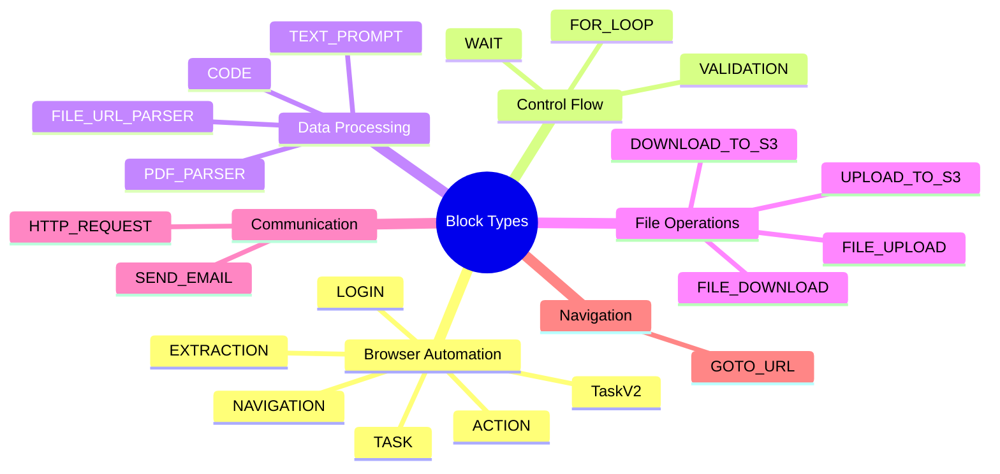
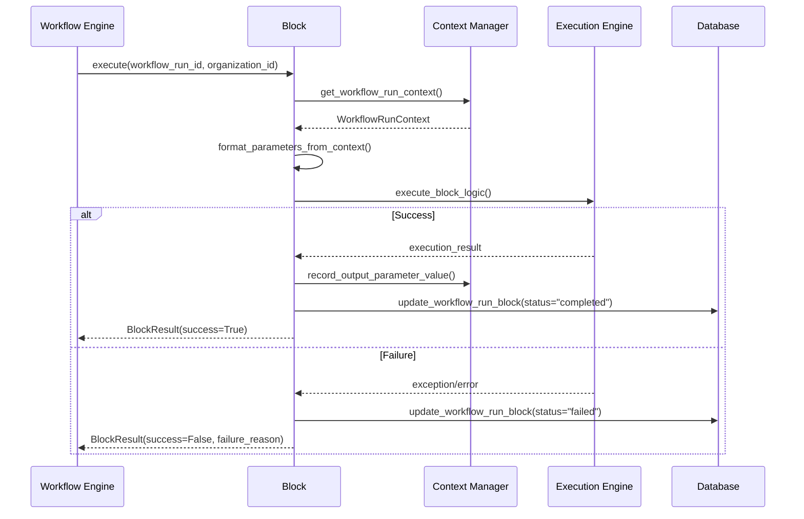
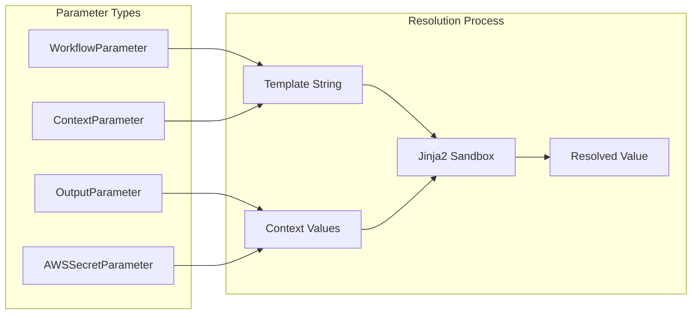
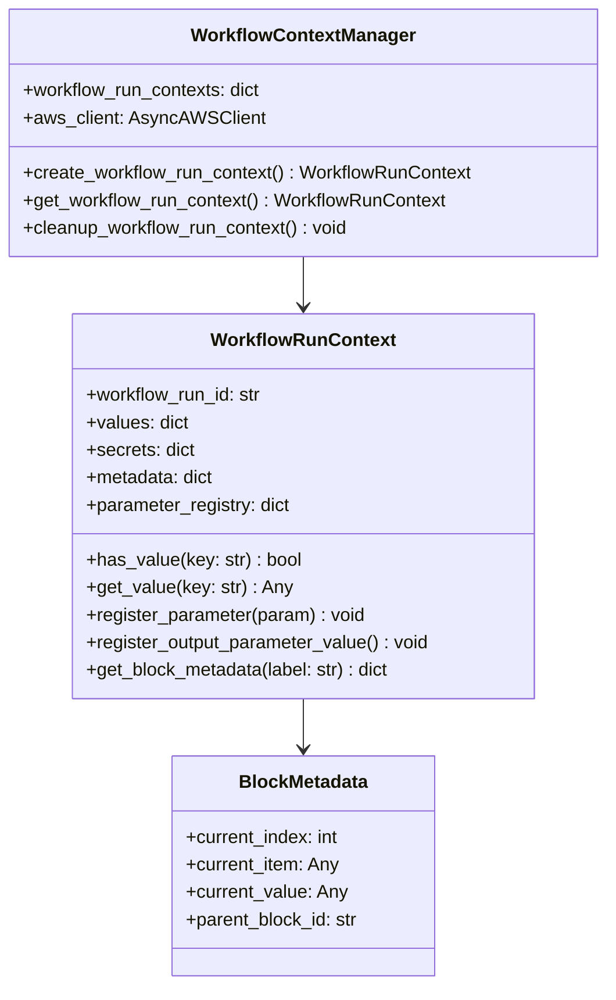
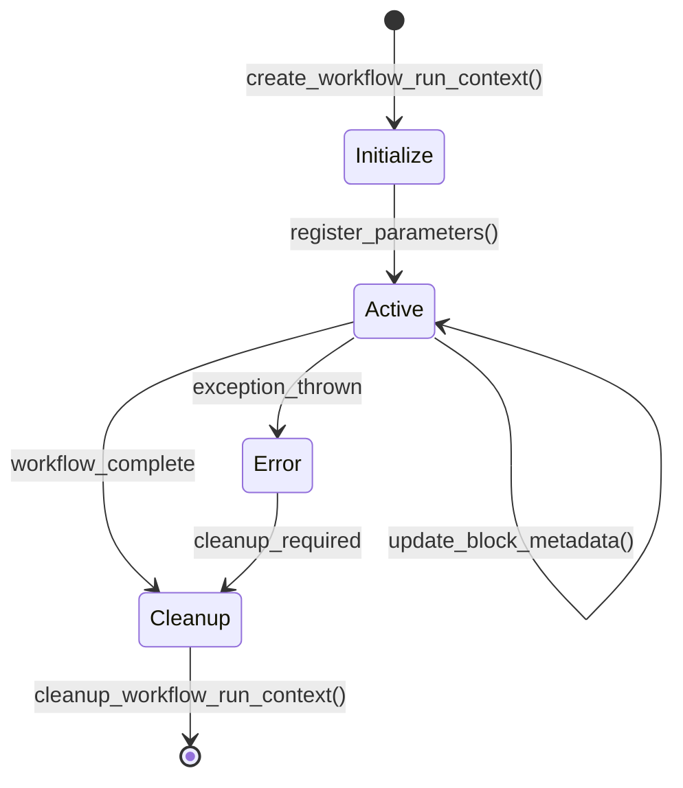
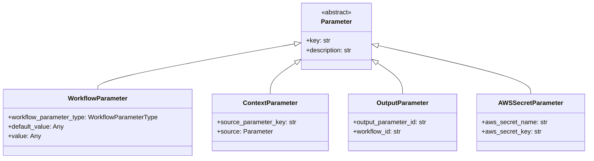
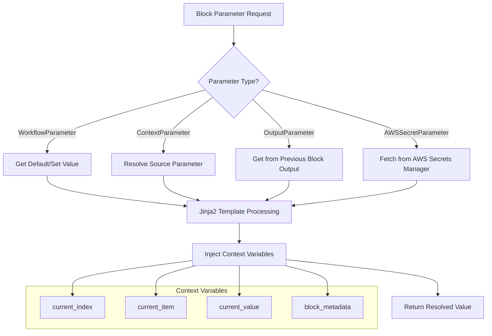

# 🧩 Block Models Deep Dive
## Workflow Engine - Block System Analysis

---

## Slide 4: Block Type Definitions {#slide-4}

### Complete Block Type Enumeration

```python
class BlockType(StrEnum):
    TASK = "task"                    # Browser automation tasks
    TaskV2 = "task_v2"              # Enhanced task execution
    FOR_LOOP = "for_loop"           # Iteration control
    CODE = "code"                   # Custom Python execution
    TEXT_PROMPT = "text_prompt"     # LLM text generation
    DOWNLOAD_TO_S3 = "download_to_s3"     # File downloads
    UPLOAD_TO_S3 = "upload_to_s3"         # File uploads
    FILE_UPLOAD = "file_upload"           # Local file handling
    SEND_EMAIL = "send_email"             # Email notifications
    FILE_URL_PARSER = "file_url_parser"   # URL content parsing
    VALIDATION = "validation"             # Data validation
    ACTION = "action"                     # Single browser actions
    NAVIGATION = "navigation"             # Page navigation
    EXTRACTION = "extraction"             # Data extraction
    LOGIN = "login"                       # Authentication
    WAIT = "wait"                         # Timing control
    FILE_DOWNLOAD = "file_download"       # File retrieval
    GOTO_URL = "goto_url"                # URL navigation
    PDF_PARSER = "pdf_parser"            # PDF processing
    HTTP_REQUEST = "http_request"        # API calls
```

### Block Categories:



---

## Slide 5: Block Execution Patterns {#slide-5}

### Block Execution Flow



### Parameter Resolution System:



---

## Slide 6: Context Management System {#slide-6}

### WorkflowRunContext Architecture



### Context Lifecycle:



---

## Slide 7: Parameter System Deep Dive {#slide-7}

### Parameter Type Hierarchy



### Parameter Resolution Flow:



---

## Continue to [Execution Engine →](workflow_engine_execution.md)

---

*This section details the block models and parameter system that form the foundation of Skyvern's workflow engine.*