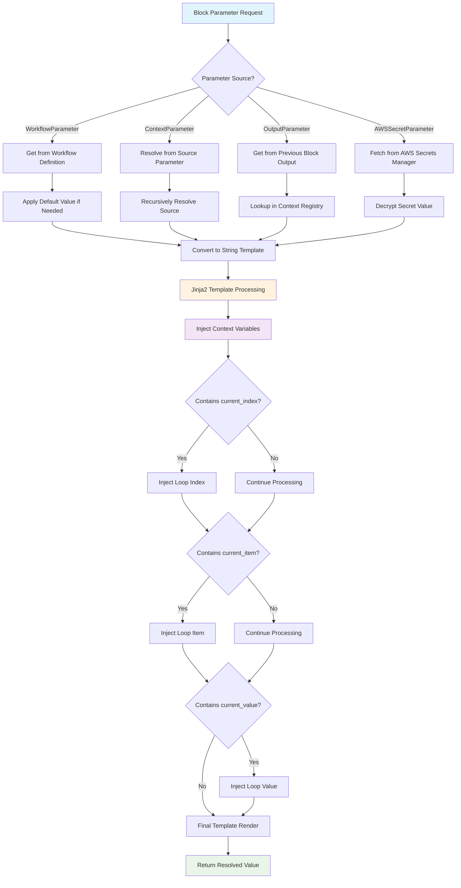
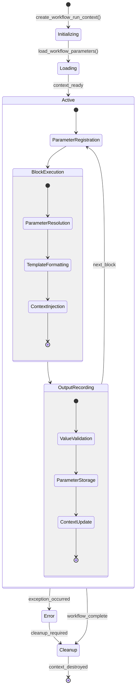
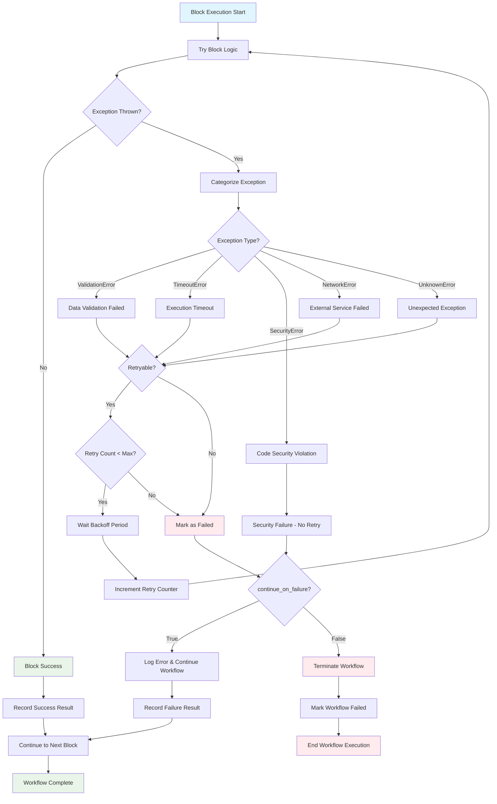
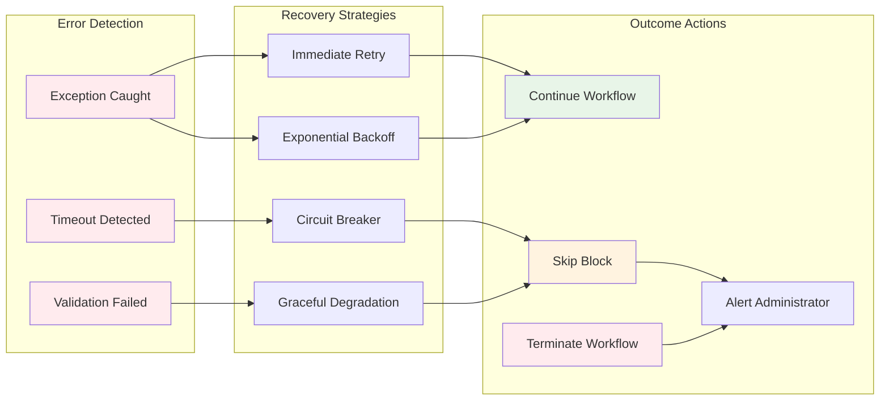
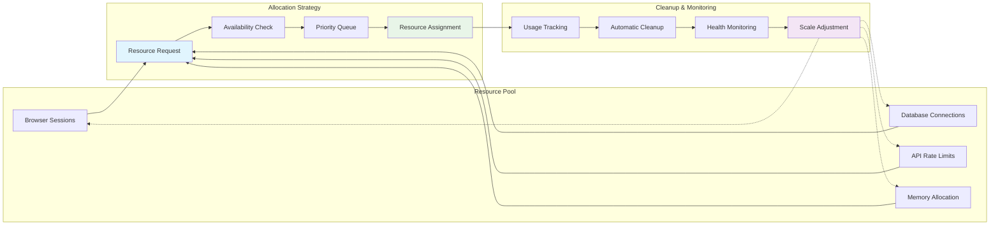

# 📊 Sequence Diagrams & Flowcharts
## Workflow Engine - Visual Process Flow Analysis

---

## Complete Workflow Execution Sequence

### End-to-End Workflow Execution Flow

```mermaid
sequenceDiagram
    participant Client as API Client
    participant API as FastAPI Router
    participant WS as WorkflowService
    participant DB as Database
    participant WCM as WorkflowContextManager
    participant EF as ExecutorFactory
    participant WE as WorkflowExecutor
    participant BE as BlockExecutor
    participant Agent as SkyvernAgent
    participant Browser as BrowserManager
    
    Note over Client, Browser: 1. Workflow Initiation Phase
    Client->>API: POST /workflows/{id}/run
    API->>WS: execute_workflow_request()
    WS->>DB: create_workflow_run()
    DB-->>WS: workflow_run_id
    
    Note over Client, Browser: 2. Context Setup Phase
    WS->>WCM: create_workflow_run_context()
    WCM->>WCM: initialize_parameter_registry()
    WCM->>DB: load_workflow_parameters()
    DB-->>WCM: parameters_data
    WCM-->>WS: context_created
    
    Note over Client, Browser: 3. Execution Orchestration Phase
    WS->>EF: AsyncExecutorFactory.execute_workflow()
    EF->>WE: create_workflow_executor()
    WE->>DB: get_workflow_definition()
    DB-->>WE: workflow_blocks[]
    
    Note over Client, Browser: 4. Block Execution Loop
    loop For Each Block in Workflow
        WE->>BE: execute_block()
        BE->>WCM: get_workflow_run_context()
        WCM-->>BE: current_context
        
        BE->>BE: format_parameters_from_context()
        
        alt Task Block
            BE->>Agent: create_and_execute_task()
            Agent->>Browser: get_browser_session()
            Browser-->>Agent: browser_instance
            Agent->>Agent: execute_browser_automation()
            Agent-->>BE: task_result
        else Code Block
            BE->>BE: execute_code_in_sandbox()
        else Email Block
            BE->>BE: send_email_notification()
        else Loop Block
            BE->>BE: execute_nested_blocks()
        end
        
        BE->>WCM: register_output_parameter()
        BE->>DB: update_workflow_run_block_status()
        BE-->>WE: block_result
        
        alt Block Failed and !continue_on_failure
            WE->>WS: mark_workflow_as_failed()
            break
        end
    end
    
    Note over Client, Browser: 5. Completion Phase
    WE->>WS: workflow_execution_complete()
    WS->>DB: update_workflow_run_status(completed)
    WS->>WCM: cleanup_workflow_context()
    WS-->>API: workflow_run_response
    API-->>Client: HTTP 200 + WorkflowRunResponse
```

---

## Block Type Execution Patterns

### Task Block Execution Detail

```mermaid
sequenceDiagram
    participant TB as TaskBlock
    participant WRC as WorkflowRunContext
    participant AF as AgentFunction
    participant BM as BrowserManager
    participant AI as LLMService
    participant DB as Database
    
    TB->>WRC: get_workflow_run_context()
    WRC-->>TB: context_data
    
    TB->>TB: format_url_from_template()
    TB->>TB: format_navigation_goal()
    TB->>TB: format_extraction_schema()
    
    TB->>AF: create_task(task_request)
    AF->>DB: insert_task_record()
    DB-->>AF: task_id
    
    TB->>DB: update_workflow_run_block(task_id)
    
    TB->>AF: execute_task(task_id)
    
    loop Task Execution Steps
        AF->>BM: get_browser_page()
        BM-->>AF: page_instance
        
        AF->>AF: take_screenshot()
        AF->>AI: generate_next_actions(screenshot, goal)
        AI-->>AF: action_list[]
        
        loop For Each Action
            AF->>BM: execute_action(action)
            BM-->>AF: action_result
            AF->>DB: store_action_record()
        end
        
        AF->>AI: evaluate_completion_criteria()
        AI-->>AF: completion_status
        
        alt Task Completed
            break
        else Max Steps Reached
            AF->>AF: mark_task_terminated()
            break
        end
    end
    
    AF-->>TB: final_task_result
    
    alt Task Successful
        TB->>WRC: record_output_parameter(extracted_data)
        TB->>DB: update_block_status(completed)
        TB-->>TB: return success_result
    else Task Failed
        TB->>DB: update_block_status(failed)
        TB-->>TB: return failure_result
    end
```

### For Loop Block Execution Pattern

```mermaid
sequenceDiagram
    participant FLB as ForLoopBlock
    participant WRC as WorkflowRunContext
    participant DB as Database
    participant CBE as ChildBlockExecutor
    
    FLB->>WRC: get_workflow_run_context()
    WRC-->>FLB: context_data
    
    FLB->>FLB: resolve_loop_values_from_context()
    
    loop For Each Item in Loop Values
        Note over FLB, CBE: Set Loop Context
        FLB->>WRC: set_block_metadata(current_index, current_item)
        
        loop For Each Child Block
            FLB->>DB: create_child_workflow_run_block()
            DB-->>FLB: child_block_id
            
            FLB->>CBE: execute_child_block(child_block_id)
            
            alt Child Block Type = Task
                CBE->>CBE: execute_task_block()
            else Child Block Type = Code
                CBE->>CBE: execute_code_block()
            else Child Block Type = Validation
                CBE->>CBE: execute_validation_block()
            end
            
            CBE-->>FLB: child_block_result
            
            alt Child Failed and !continue_on_failure
                FLB->>FLB: break_child_loop()
                break
            end
        end
        
        FLB->>FLB: collect_iteration_results()
    end
    
    FLB->>WRC: record_output_parameter(loop_results)
    FLB->>DB: update_block_status(completed)
    FLB-->>FLB: return aggregated_results
```

---

## Context Management Flow

### Parameter Resolution Process



### Workflow Context Lifecycle



---

## Error Handling & Recovery Flow

### Comprehensive Error Flow



### Error Recovery Strategies



---

## Performance & Scalability Patterns

### Parallel Block Execution

```mermaid
gantt
    title Workflow Execution Timeline
    dateFormat X
    axisFormat %s
    
    section Sequential Execution
    Block 1 :done, b1, 0, 2
    Block 2 :done, b2, after b1, 3
    Block 3 :done, b3, after b2, 2
    Block 4 :done, b4, after b3, 4
    
    section Parallel Execution
    Block 1 :done, p1, 0, 2
    Block 2 :done, p2, 0, 3
    Block 3 :done, p3, 0, 2
    Block 4 :done, p4, after p1 p2 p3, 4
```



### Resource Management Flow



---

*These diagrams provide comprehensive visual documentation of the Skyvern Workflow Engine's execution patterns, data flows, and architectural decisions.*