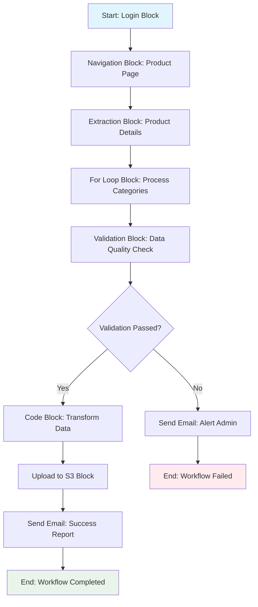
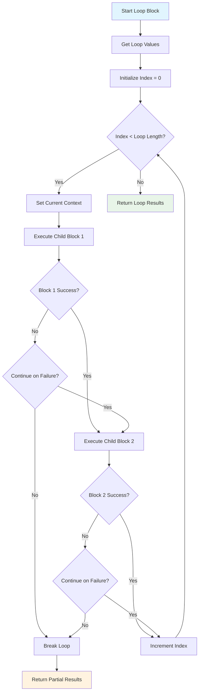
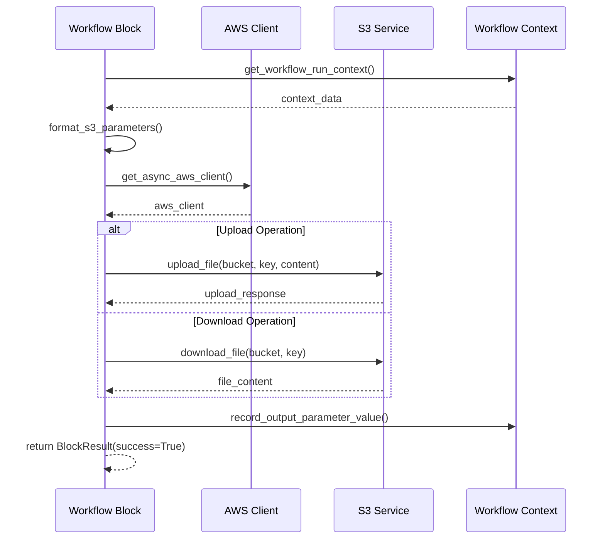
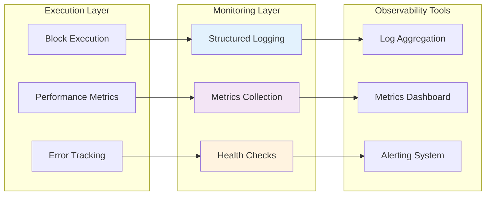
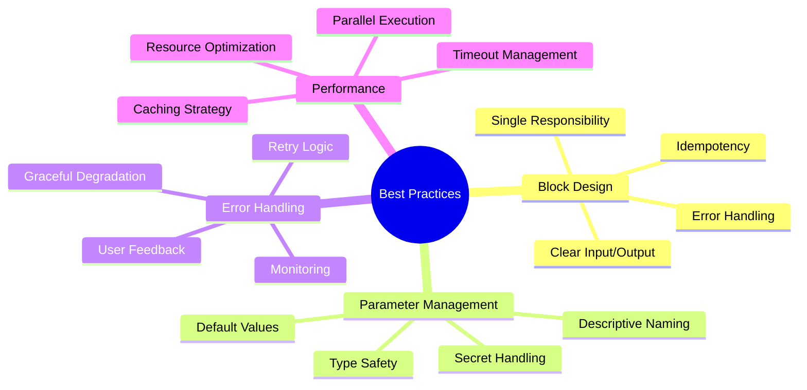
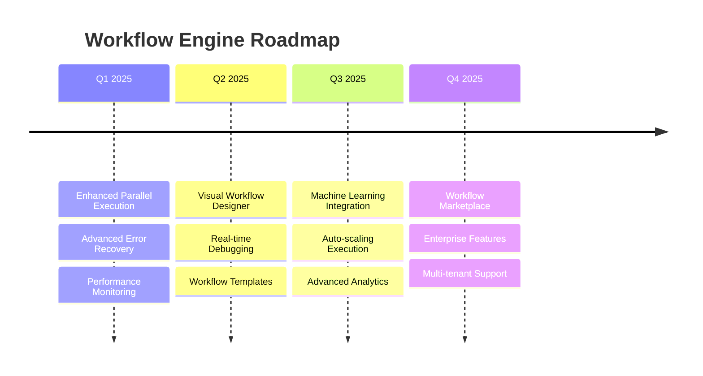
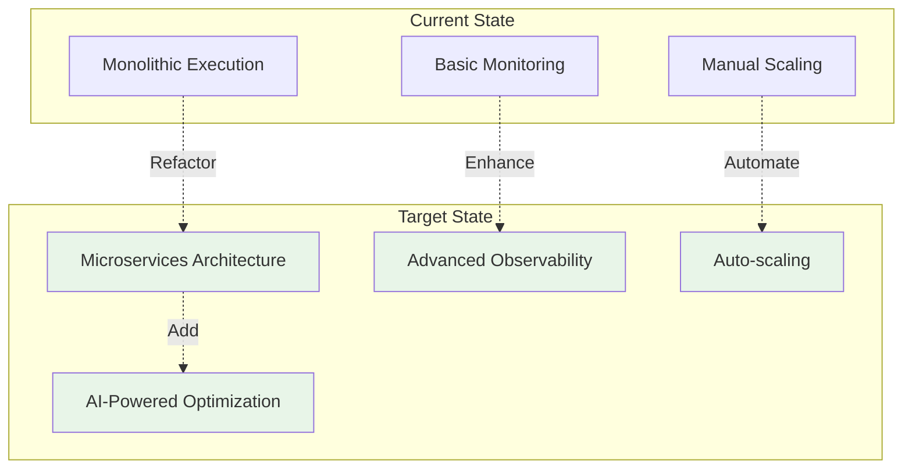

# 💡 Implementation Examples & Patterns
## Workflow Engine - Practical Usage Scenarios

---

## Slide 13: Real-World Workflow Example {#slide-13}

### E-commerce Data Extraction Workflow



### Workflow Definition Example:

```yaml
workflow_definition:
  parameters:
    - key: "target_url"
      type: "workflow"
      default_value: "https://example-ecommerce.com"
    - key: "login_credentials"
      type: "aws_secret"
      aws_secret_name: "ecommerce_creds"
    - key: "categories_list"
      type: "workflow"
      default_value: ["electronics", "clothing", "books"]
  
  blocks:
    - label: "login_step"
      block_type: "login"
      url: "{{ target_url }}/login"
      parameters:
        - key: "username"
          value: "{{ login_credentials.username }}"
        - key: "password"
          value: "{{ login_credentials.password }}"
    
    - label: "extract_products"
      block_type: "for_loop"
      loop_values: "{{ categories_list }}"
      blocks:
        - label: "navigate_category"
          block_type: "navigation"
          url: "{{ target_url }}/category/{{ current_item }}"
          navigation_goal: "Navigate to category page"
        
        - label: "extract_data"
          block_type: "extraction"
          data_extraction_goal: "Extract product information"
          data_schema:
            type: "object"
            properties:
              products:
                type: "array"
                items:
                  type: "object"
                  properties:
                    name: { type: "string" }
                    price: { type: "number" }
                    rating: { type: "number" }
```

---

## Slide 14: Block Implementation Patterns {#slide-14}

### Task Block Implementation

```python
class TaskBlock(BaseTaskBlock):
    block_type: BlockType = BlockType.TASK
    
    async def execute(
        self,
        workflow_run_id: str,
        workflow_run_block_id: str,
        organization_id: str,
        workflow_id: str,
    ) -> BlockResult:
        workflow_run_context = self.get_workflow_run_context(workflow_run_id)
        
        # Format parameters using context
        formatted_url = self.format_block_parameter_template_from_workflow_run_context(
            self.url, workflow_run_context
        )
        formatted_navigation_goal = self.format_block_parameter_template_from_workflow_run_context(
            self.navigation_goal, workflow_run_context
        )
        
        # Create task request
        task_request = TaskRequest(
            url=formatted_url,
            navigation_goal=formatted_navigation_goal,
            data_extraction_goal=self.data_extraction_goal,
            extraction_schema=self.data_schema,
            complete_criterion=self.complete_criterion,
            terminate_criterion=self.terminate_criterion,
        )
        
        # Execute task through agent
        task = await app.AGENT_FUNCTION.create_task(task_request, organization_id)
        
        # Store task ID for tracking
        await app.DATABASE.update_workflow_run_block(
            workflow_run_block_id=workflow_run_block_id,
            task_id=task.task_id,
        )
        
        # Execute task and wait for completion
        await app.AGENT_FUNCTION.execute_task(task.task_id, organization_id)
        
        # Get final task result
        final_task = await app.DATABASE.get_task(task.task_id, organization_id)
        
        if final_task.status == TaskStatus.completed:
            # Record output parameter
            await self.record_output_parameter_value(
                workflow_run_context, 
                workflow_run_id, 
                final_task.extracted_information
            )
            
            return await self.build_block_result(
                success=True,
                output_parameter_value=final_task.extracted_information,
                status=BlockStatus.completed,
                workflow_run_block_id=workflow_run_block_id,
            )
        else:
            return await self.build_block_result(
                success=False,
                failure_reason=final_task.failure_reason,
                status=BlockStatus.failed,
                workflow_run_block_id=workflow_run_block_id,
            )
```

---

## Slide 15: Advanced Control Flow Patterns {#slide-15}

### For Loop Block with Nested Execution

```python
class ForLoopBlock(Block):
    block_type: BlockType = BlockType.FOR_LOOP
    loop_values: list[Any] = []
    loop_blocks: list[Block] = []
    
    async def execute(
        self,
        workflow_run_id: str,
        workflow_run_block_id: str,
        organization_id: str,
        workflow_id: str,
    ) -> BlockResult:
        workflow_run_context = self.get_workflow_run_context(workflow_run_id)
        
        # Resolve loop values from context
        formatted_loop_values = self.format_block_parameter_template_from_workflow_run_context(
            str(self.loop_values), workflow_run_context
        )
        
        loop_results = []
        
        for index, item in enumerate(formatted_loop_values):
            # Set loop context
            workflow_run_context.set_block_metadata(
                self.label,
                BlockMetadata(
                    current_index=index,
                    current_item=item,
                    current_value=item,
                )
            )
            
            # Execute nested blocks
            block_results = []
            for block in self.loop_blocks:
                # Create child workflow run block
                child_block = await app.DATABASE.create_workflow_run_block(
                    workflow_run_id=workflow_run_id,
                    parent_workflow_run_block_id=workflow_run_block_id,
                    block_type=block.block_type,
                    label=f"{block.label}_{index}",
                    organization_id=organization_id,
                )
                
                # Execute child block
                result = await block.execute(
                    workflow_run_id,
                    child_block.workflow_run_block_id,
                    organization_id,
                    workflow_id,
                )
                
                block_results.append(result)
                
                # Break on failure if continue_on_failure is False
                if not result.success and not block.continue_on_failure:
                    break
            
            loop_results.append({
                "iteration": index,
                "item": item,
                "results": block_results
            })
        
        # Record loop results as output
        await self.record_output_parameter_value(
            workflow_run_context,
            workflow_run_id,
            loop_results
        )
        
        return await self.build_block_result(
            success=True,
            output_parameter_value=loop_results,
            status=BlockStatus.completed,
            workflow_run_block_id=workflow_run_block_id,
        )
```

### Conditional Execution Flow



---

## Slide 16: Code Block Security & Execution {#slide-16}

### Secure Code Execution Pattern

```python
class CodeBlock(Block):
    block_type: BlockType = BlockType.CODE
    code: str
    
    async def execute(
        self,
        workflow_run_id: str,
        workflow_run_block_id: str,
        organization_id: str,
        workflow_id: str,
    ) -> BlockResult:
        workflow_run_context = self.get_workflow_run_context(workflow_run_id)
        
        # Security validation
        if self._contains_insecure_patterns(self.code):
            raise InsecureCodeDetected(
                detected_patterns=self._get_insecure_patterns(self.code)
            )
        
        # Format code with context variables
        formatted_code = self.format_block_parameter_template_from_workflow_run_context(
            self.code, workflow_run_context
        )
        
        # Prepare execution environment
        execution_globals = {
            '__builtins__': self._get_safe_builtins(),
            'workflow_context': workflow_run_context.values.copy(),
            'current_block': self.label,
        }
        
        execution_locals = {}
        
        try:
            # Execute code in sandbox
            exec(formatted_code, execution_globals, execution_locals)
            
            # Extract result
            result_value = execution_locals.get('result', None)
            
            # Record output
            await self.record_output_parameter_value(
                workflow_run_context,
                workflow_run_id,
                result_value
            )
            
            return await self.build_block_result(
                success=True,
                output_parameter_value=result_value,
                status=BlockStatus.completed,
                workflow_run_block_id=workflow_run_block_id,
            )
            
        except Exception as e:
            return await self.build_block_result(
                success=False,
                failure_reason=f"Code execution failed: {str(e)}",
                status=BlockStatus.failed,
                workflow_run_block_id=workflow_run_block_id,
            )
    
    def _contains_insecure_patterns(self, code: str) -> bool:
        """Check for potentially dangerous code patterns"""
        dangerous_patterns = [
            'import os', '__import__', 'eval(', 'exec(',
            'open(', 'file(', 'subprocess', 'system(',
        ]
        return any(pattern in code for pattern in dangerous_patterns)
    
    def _get_safe_builtins(self) -> dict:
        """Return a restricted set of built-in functions"""
        safe_builtins = {
            'len', 'str', 'int', 'float', 'bool', 'list', 'dict',
            'set', 'tuple', 'range', 'enumerate', 'zip', 'map',
            'filter', 'sorted', 'sum', 'min', 'max', 'abs',
        }
        return {name: getattr(__builtins__, name) for name in safe_builtins}
```

---

## Slide 17: Integration Patterns {#slide-17}

### Email Integration Block

```python
class SendEmailBlock(Block):
    block_type: BlockType = BlockType.SEND_EMAIL
    recipients: list[str] = []
    subject: str = ""
    body: str = ""
    attachments: list[str] = []
    
    async def execute(
        self,
        workflow_run_id: str,
        workflow_run_block_id: str,
        organization_id: str,
        workflow_id: str,
    ) -> BlockResult:
        workflow_run_context = self.get_workflow_run_context(workflow_run_id)
        
        # Format email content
        formatted_recipients = [
            self.format_block_parameter_template_from_workflow_run_context(
                recipient, workflow_run_context
            ) for recipient in self.recipients
        ]
        
        formatted_subject = self.format_block_parameter_template_from_workflow_run_context(
            self.subject, workflow_run_context
        )
        
        formatted_body = self.format_block_parameter_template_from_workflow_run_context(
            self.body, workflow_run_context
        )
        
        # Validate recipients
        valid_recipients = [r for r in formatted_recipients if '@' in r]
        if not valid_recipients:
            raise NoValidEmailRecipient(recipients=formatted_recipients)
        
        # Send email
        email_client = await self._get_email_client(organization_id)
        
        try:
            message_id = await email_client.send_email(
                recipients=valid_recipients,
                subject=formatted_subject,
                body=formatted_body,
                attachments=self.attachments,
            )
            
            # Record result
            result = {
                "message_id": message_id,
                "recipients": valid_recipients,
                "sent_at": datetime.utcnow().isoformat(),
            }
            
            await self.record_output_parameter_value(
                workflow_run_context,
                workflow_run_id,
                result
            )
            
            return await self.build_block_result(
                success=True,
                output_parameter_value=result,
                status=BlockStatus.completed,
                workflow_run_block_id=workflow_run_block_id,
            )
            
        except Exception as e:
            return await self.build_block_result(
                success=False,
                failure_reason=f"Email sending failed: {str(e)}",
                status=BlockStatus.failed,
                workflow_run_block_id=workflow_run_block_id,
            )
```

### S3 Integration Pattern



---

## Slide 18: Monitoring & Observability {#slide-18}

### Workflow Execution Monitoring



### Logging Pattern Implementation

```python
import structlog

LOG = structlog.get_logger()

class Block(BaseModel, abc.ABC):
    async def execute(self, workflow_run_id: str, workflow_run_block_id: str, 
                     organization_id: str, workflow_id: str) -> BlockResult:
        
        LOG.info(
            "Starting block execution",
            block_type=self.block_type,
            block_label=self.label,
            workflow_run_id=workflow_run_id,
            workflow_run_block_id=workflow_run_block_id,
            organization_id=organization_id,
        )
        
        start_time = time.time()
        
        try:
            # Execute block logic
            result = await self._execute_block_logic(
                workflow_run_id, workflow_run_block_id, organization_id, workflow_id
            )
            
            execution_time = time.time() - start_time
            
            LOG.info(
                "Block execution completed",
                block_type=self.block_type,
                block_label=self.label,
                success=result.success,
                execution_time_seconds=execution_time,
                workflow_run_id=workflow_run_id,
                output_size=len(str(result.output_parameter_value)) if result.output_parameter_value else 0,
            )
            
            return result
            
        except Exception as e:
            execution_time = time.time() - start_time
            
            LOG.error(
                "Block execution failed",
                block_type=self.block_type,
                block_label=self.label,
                error=str(e),
                execution_time_seconds=execution_time,
                workflow_run_id=workflow_run_id,
                exc_info=True,
            )
            
            raise
```

---

## Slide 19: Best Practices & Guidelines {#slide-19}

### Workflow Design Best Practices



### Code Quality Guidelines

```python
# ✅ Good Block Implementation
class ProductExtractionBlock(BaseTaskBlock):
    """Extract product information from e-commerce pages."""
    
    # Clear type hints and defaults
    product_selector: str = ".product-item"
    max_products: int = 100
    include_reviews: bool = True
    
    # Comprehensive data schema
    data_schema: dict = {
        "type": "object",
        "properties": {
            "products": {
                "type": "array",
                "items": {
                    "type": "object",
                    "required": ["name", "price"],
                    "properties": {
                        "name": {"type": "string"},
                        "price": {"type": "number", "minimum": 0},
                        "rating": {"type": "number", "minimum": 0, "maximum": 5},
                        "reviews_count": {"type": "integer", "minimum": 0}
                    }
                }
            }
        }
    }
    
    async def execute(self, workflow_run_id: str, workflow_run_block_id: str,
                     organization_id: str, workflow_id: str) -> BlockResult:
        """Execute product extraction with comprehensive error handling."""
        
        try:
            # Validate inputs
            await self._validate_inputs()
            
            # Execute with timeout
            result = await asyncio.wait_for(
                self._execute_extraction(),
                timeout=self.max_execution_time
            )
            
            # Validate output
            await self._validate_output(result)
            
            return await self.build_success_result(result, workflow_run_block_id)
            
        except asyncio.TimeoutError:
            return await self.build_failure_result(
                "Extraction timed out", workflow_run_block_id
            )
        except ValidationError as e:
            return await self.build_failure_result(
                f"Data validation failed: {e}", workflow_run_block_id
            )
        except Exception as e:
            LOG.exception("Unexpected error in product extraction")
            return await self.build_failure_result(
                f"Unexpected error: {e}", workflow_run_block_id
            )
```

---

## Slide 20: Future Enhancements & Roadmap {#slide-20}

### Planned Enhancements



### Architecture Evolution



---

## Summary & Key Takeaways

### Core Concepts Mastered ✅

1. **Block-Based Architecture** - Modular, reusable workflow components
2. **Parameter System** - Dynamic data flow and template rendering
3. **Context Management** - Shared state and metadata across execution
4. **Execution Orchestration** - Coordinated block execution with error handling
5. **Integration Patterns** - External service and API integration strategies

### Implementation Highlights

- **Type Safety** - Comprehensive type hints and validation
- **Error Resilience** - Robust exception handling and recovery
- **Performance** - Optimization strategies and monitoring
- **Security** - Code execution sandboxing and validation
- **Observability** - Structured logging and metrics collection

---

*This completes the comprehensive deep dive into Skyvern's Workflow Engine, covering all aspects from architecture to implementation patterns and best practices.*