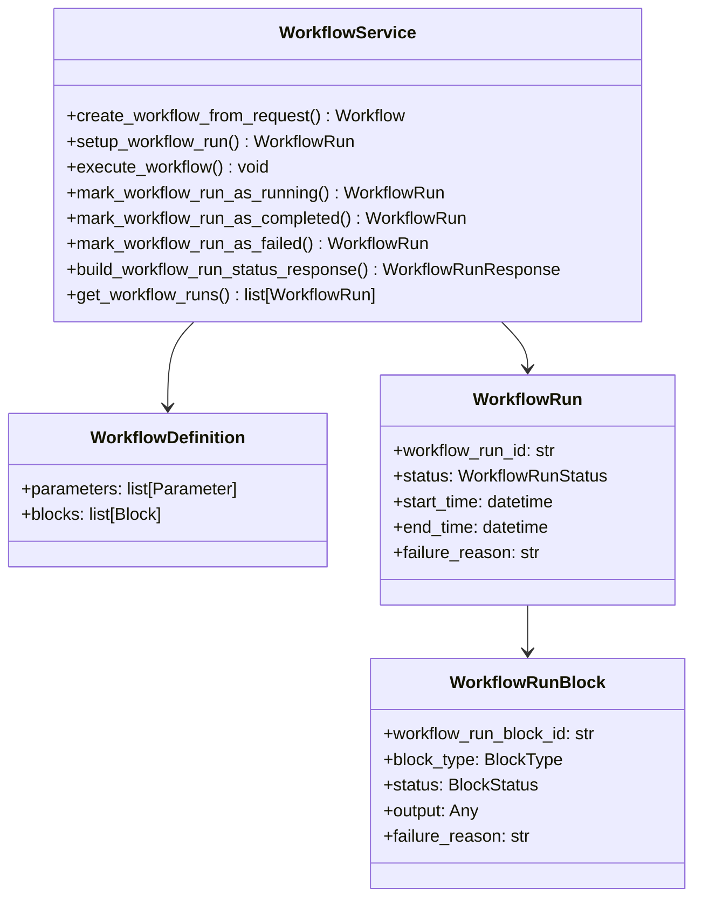
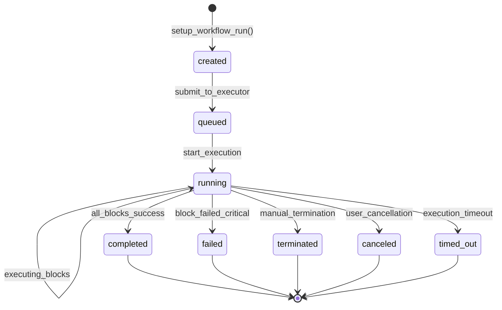
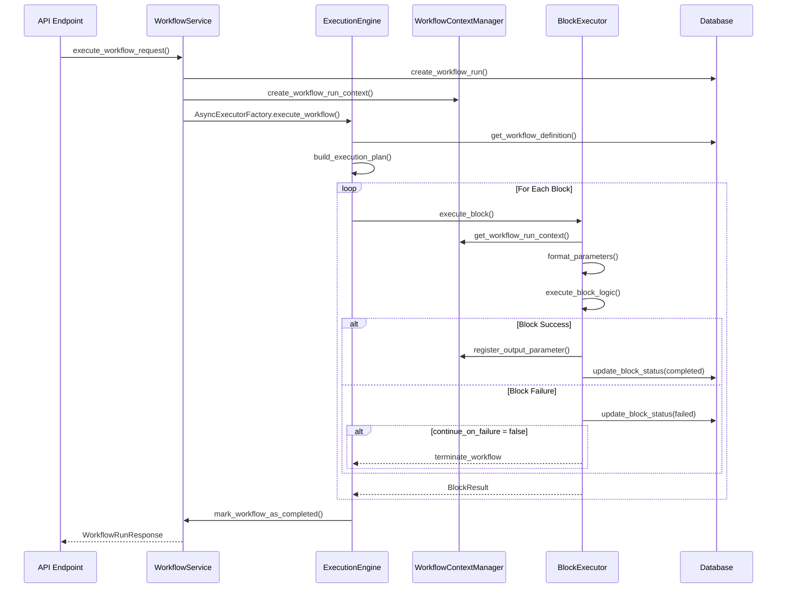
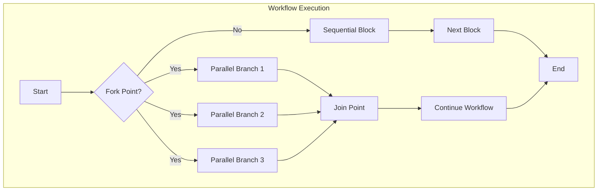
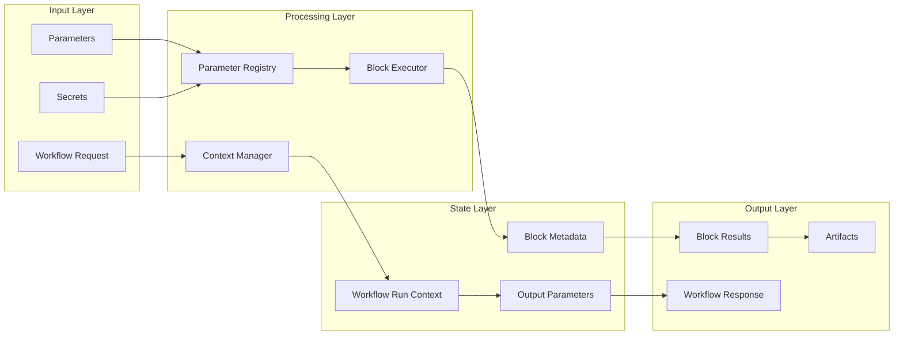
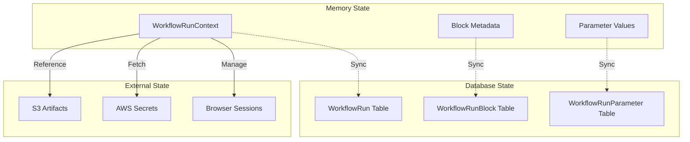
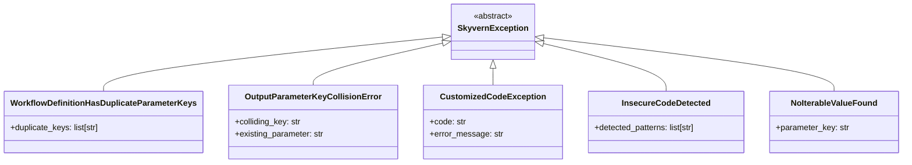
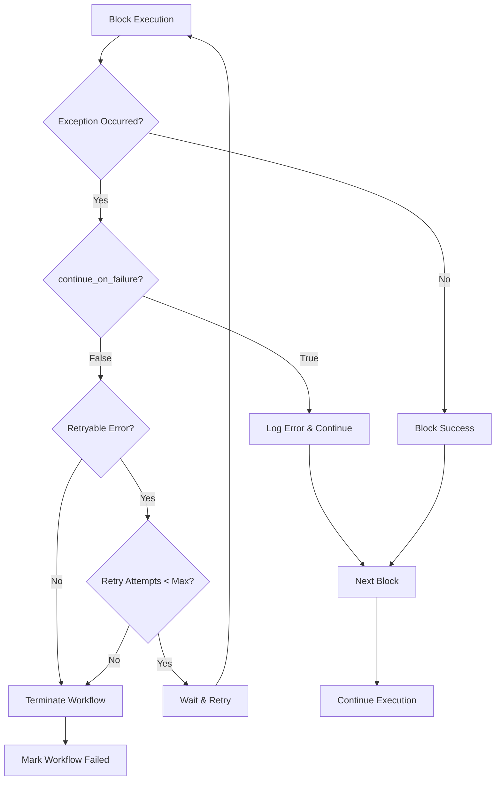
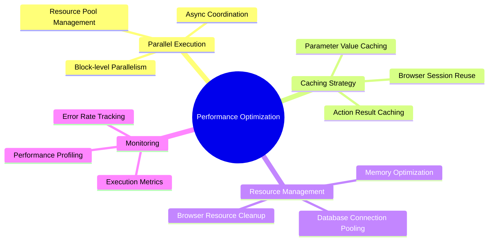
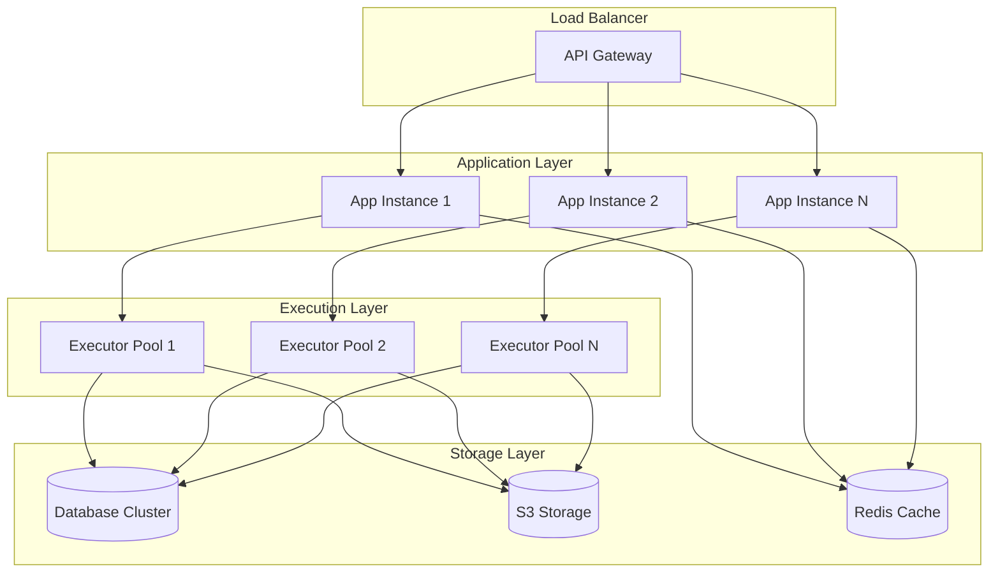

# ⚙️ Execution Engine & Orchestration
## Workflow Engine - Service Layer Analysis

---

## Slide 8: Workflow Service Architecture {#slide-8}

### WorkflowService Core Components

### Workflow Execution States:

---

## Slide 9: Block Execution Orchestration {#slide-9}

### Block Execution Sequence

### Parallel Block Execution:

---

## Slide 10: Data Flow & State Management {#slide-10}

### Data Flow Architecture

### State Persistence Strategy:

---

## Slide 11: Error Handling & Recovery {#slide-11}

### Exception Hierarchy

### Error Recovery Patterns:

---

## Slide 12: Performance & Optimization {#slide-12}

### Execution Optimization Strategies

### Scalability Architecture:

---

## Continue to [Implementation Examples →](workflow_engine_examples.md)

---

*This section covers the execution engine, orchestration patterns, and performance optimization strategies of the Skyvern workflow system.*